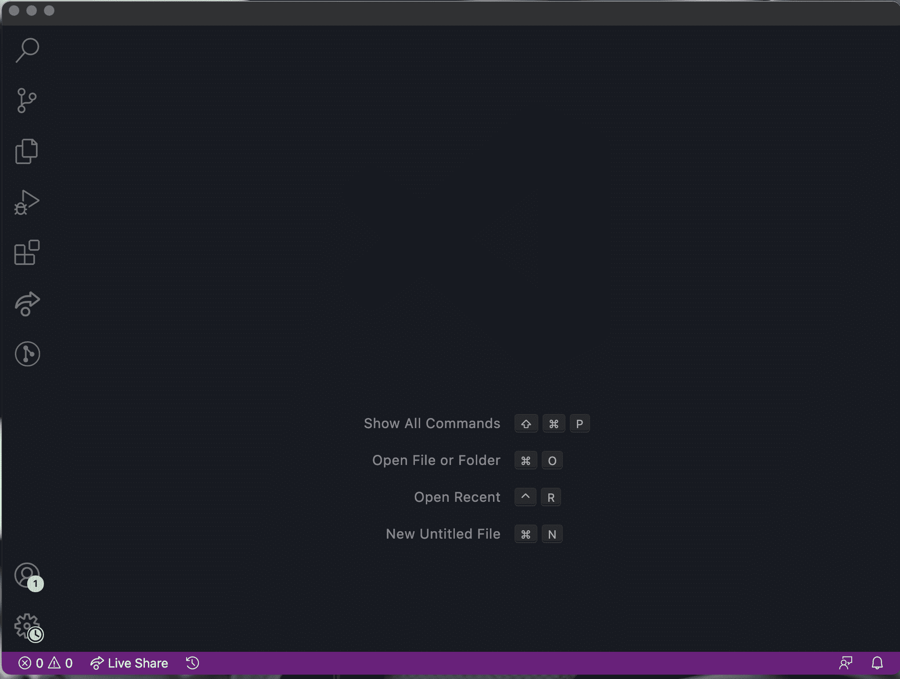
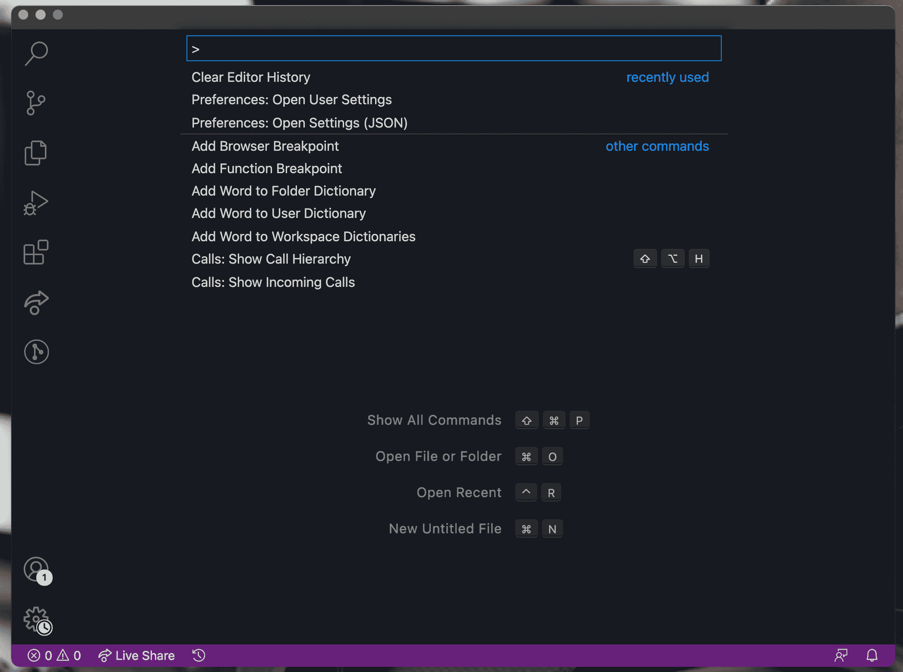
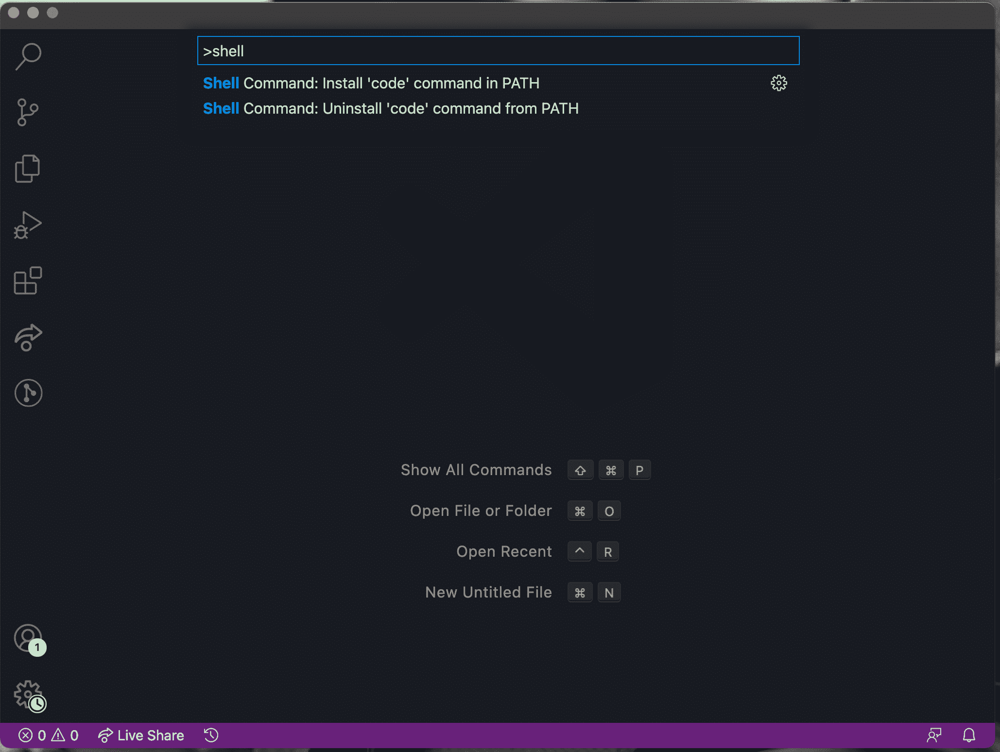
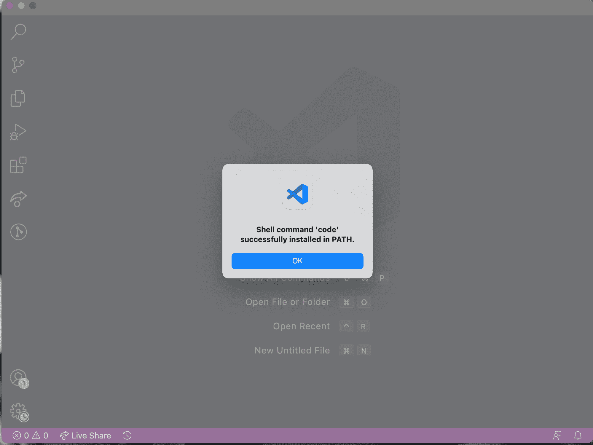
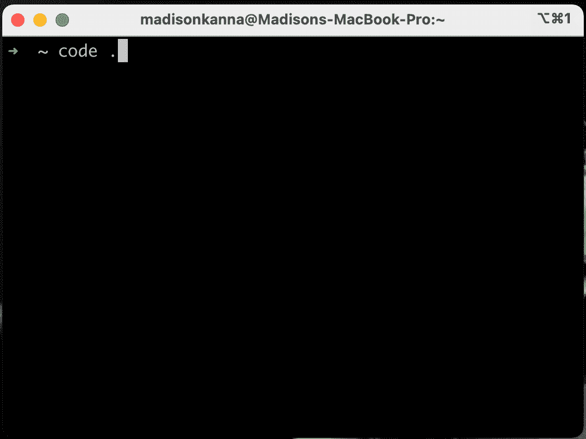

# 如何从终端打开 Visual Studio 代码

> 原文：<https://www.freecodecamp.org/news/how-to-open-visual-studio-code-from-your-terminal/>

在本教程中，我们将介绍如何从 Mac 终端打开 VS 代码文本编辑器(Visual Studio 代码)。

从终端打开文本编辑器是打开新项目和更快开始编码的一种快速、简单的方法。

## 如何下载并打开 VS 代码

你需要做的第一件事是打开 VS 代码。如果你还没有 VS 代码，可以在这里下载[。VS Code 是微软创建的一个流行的文本编辑器。](https://code.visualstudio.com/)

打开 VS 代码后，它应该是这样的:

接下来，运行`Command + Shift + P`。

现在你应该看到这个:

我们在这里做的是打开 VS 代码命令面板。这将允许你定制你的 VS 代码设置。

接下来，在命令面板中输入`shell`并点击`enter`。当你输入`shell`时，你的编辑器应该是这样的:

一旦你按下回车键，瞧！你们都完了。您现在应该会看到一条成功消息:

现在，您可以从终端打开 VS 代码。我们现在就开始吧。

## 如何从终端打开 VS 代码

首先，打开你的终端。你可以用几种方法打开你的终端。打开终端的一种方法是同时按下`command`按钮和`spacebar`。这将打开 spotlight 搜索。从这里，您可以键入“终端”。

一旦你的终端打开，你可以通过输入`$ code .`然后点击`enter`来打开 VS 代码。

这应该是这样的:

一旦你点击`enter`，VS 代码将会打开。

现在你知道了！快乐编码。:)