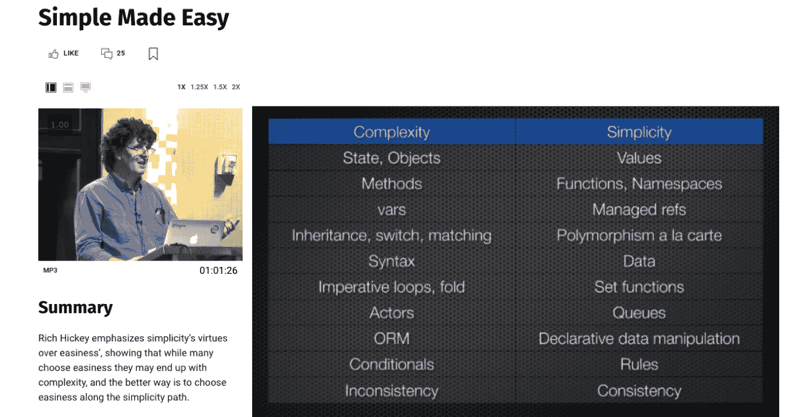
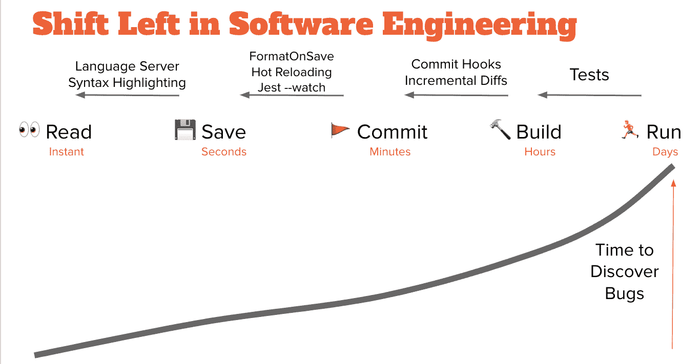

# 如何针对软件开发中的变化进行优化

> 原文：<https://www.freecodecamp.org/news/how-to-optimize-for-change-software-development/>

假设您在 Magic Money Corp .工作，该公司仅运行三行 JavaScript 代码:

```
let input = { step1: 'collect underpants' }
doStuff(input) 
profit(input) // $$!!! 
```

现在想象一下`doStuff`出了问题，你需要把它拆下来维修。如果临时注释掉第二行会怎么样？

哦不！到处都是错误。你弄坏了你的神奇赚钱机器！

为了解决这个问题，你现在必须通读`doStuff`的整个源代码，以理解它做什么，并替换关键代码以使`profit`运行。听起来工作量很大...也许我们应该离开它，写一个变通办法？

当我们害怕改变代码时，它就开始僵化和膨胀。

现在让我们想象一下，如果你在不可变的数据结构上建立了 Magic Money Corp(或者使用了一种函数式语言):

```
let input = ImmutableMap({ step1: 'collect underpants' })
doStuff(input)
profit(input) // $$!!! 
```

它*看起来*一样，但是现在你可以移除`doStuff`，并且不用担心打破神奇金钱公司

自从丹·阿布拉莫夫两年前写下他的“为改变而优化”的概念以来，我一直对他着迷。它清楚地表达了 React 的一个核心设计原则(其余的是这里的[和这里的](https://reactjs.org/docs/design-principles.html))。对我来说，这是我现在试图在其他地方应用的 7 个教训之一。

然而，它没有回答的主要问题是*你到底如何*为改变而优化？

## 如何针对变化进行优化–TL；速度三角形定位法(dead reckoning)

*   共同变化计划
*   使用简单的值
*   最小化编辑距离
*   尽早发现错误

## 为什么要为改变而优化

首先，这个想法的强制性解释:

*   **难以删除的代码随着时间的推移会淘汰掉容易删除的代码**
*   难以删除的代码上的许多层创可贴会导致技术木乃伊化
*   因此，我们必须从最早的设计开始就努力为变化进行优化

这个想法的灵感来自于“易于替换的系统往往会被难以替换的系统所替换”( [Malte Ubl](https://twitter.com/cramforce/status/1139925981051801600) )和“编写易于删除而不易于扩展的代码”( [tef](https://programmingisterrible.com/post/139222674273/how-to-write-disposable-code-in-large-systems) )。

经济学迷会认为这是[格雷欣法则](https://en.wikipedia.org/wiki/Gresham%27s_law)的应用。这个想法是一样的——一种反熵的形式，在这种形式中,*不灵活性*增加，而不是无序。

当我们的系统很难替换时，我们并不是不知道。那就是最有利的反应通常是找到一个变通办法，然后继续下去。

在一个太多的创可贴之后，我们的代码库变得干瘪。这是在我们的原始设计中不允许*改变*的结果——一个与“技术债务”相关(但不同)的想法(它有其[自己的](https://redmonk.com/rstephens/2017/08/08/technical-debt/) [问题](https://twitter.com/jessitron/status/1123310331957145601))。

我们必须允许变化的原因是[需求易变性是软件工程](https://stackoverflow.blog/2020/02/20/requirements-volatility-is-the-core-problem-of-software-engineering/)的核心问题。

我们开发人员经常幻想，如果产品规格是预先完全*指定的*,我们的生活会容易得多。但那是编程的[球形无摩擦牛](https://en.wikipedia.org/wiki/Spherical_cow)。

事实上，唯一不变的是变化。我们应该仔细设计我们的抽象和 API，承认这个事实。

## 如何计划常见的变化

一旦你接受了为改变而优化的需求，就很容易走极端并被分析麻痹所克服。当一切都可能改变时，你如何为*的一切*做设计？！

你可能会做过头，例如，在每个界面上放置抽象的外观，或者使每个功能都是异步的。很明显，以增加代码库的规模来换取特性集的不变也是不可取的。

划清界限的合理方法是为小的、常见的调整进行设计，而不要担心大的、不频繁的迁移。Hillel Wayne 称这些[需求扰动](https://twitter.com/hillelogram/status/1189024161127190528)——小的、典型的功能需求不应该使你的整个设计混乱。

对于概率倾向，我们能做的最好的事情就是确保我们的设计能很好地适应 1-3 个“标准偏差”的变化。比这更大的变化是罕见的(根据定义)，当它们发生时，证明更具侵入性的重写是合理的。

这样，我们也避免了为可能永远不会到来的变化进行优化，这可能是软件膨胀和复杂性的一个重要来源。

常见的变化可以通过经验积累——幽默的例子是[扎温斯基定律](http://www.catb.org/jargon/html/Z/Zawinskis-Law.html),但还有许多远不那么极端的变化完全是常规的，可以预见的，无论是通过[先发制人的多元化](https://www.swyx.io/preemptive-pluralization/)还是[商业战略](https://www.swyx.io/dev-guide-to-tech-strategy/)。

## 使用简单的值

一旦我们限制了我们的野心，我喜欢直接考虑 API 设计。最终目标很明确。为了使代码易于更改:

*   首先，删除必须很容易
*   这使得**剪切和粘贴**变得更加容易
*   这使得创建和分解抽象变得更加容易
*   以此类推，直到您涵盖了所有的日常维护任务，包括日志记录、调试、测试和性能优化。

里奇·希基因宣扬价值观的价值和简单的 T2 而闻名。深入理解这种方法对 API 设计的影响是值得的。

当您传递带有动态引用的类实例或对象时，您可以传递简单的、不可变的值。这消除了一整类潜在的错误(并解除了日志记录、序列化和其他好处)。



the key slide for Simple vs Complex from "Simple Made Easy"

出于对简单非复杂值的这些需求，您可以从基本原则中获得数量惊人的“最佳”实践— [不可变编程](https://www.youtube.com/watch?v=bFuRvcAEiHg)，用[功能核心约束状态，命令式外壳](https://www.destroyallsoftware.com/screencasts/catalog/functional-core-imperative-shell)，[解析不验证](https://lexi-lambda.github.io/blog/2019/11/05/parse-don-t-validate/)，以及[管理函数颜色](https://journal.stuffwithstuff.com/2015/02/01/what-color-is-your-function/)。

追求简单并不是一个没有成本的提议，但是从[结构共享](https://twitter.com/jordwalke/status/959018527091904512)到静态分析的各种技术可以有所帮助。

更好的方法是理解这些都是同一个一般规则的实例，而不是记住一个好/坏例子的表格。

## 最小化编辑距离

每当我想到复杂性，我脑海中就会浮现出从*简单变得容易*的辫子。


当你旁边有多根绳子的时候，你可以把它们编起来，打个结。这就是复杂性——复杂性很难解开。只有当你只有一根线时，编织才变得不可能。

更重要的是，我们应该尽可能减少对*订单*的依赖:

*   执行顺序——如果我删除了第 2 行中的一些内容，开发人员能有多容易知道第 3 行中的内容是否会爆炸？我需要做多少改变来修复它？
*   解决顺序——如果并发进程不按顺序解决，我能多容易地纠正或保证避免竞争情况？
*   文件系统顺序——如果我将一些代码从一个地方移到另一个地方，需要编辑多少其他文件来反映这一点？
*   参数顺序——如果我交换了一些参数的位置，无论是在函数调用中，还是在类构造函数或 YAML 配置文件中，程序会崩溃吗？
*   这是一个临时列表；这里可能有我遗漏的一些大的，请让我知道。

你甚至可以用“[编辑距离](https://en.wikipedia.org/wiki/Edit_distance)”的概念来量化这种复杂性:

*   如果我使用多元函数，那么如果不更新*所有的*调用点，或者添加我实际上不需要的默认参数，我就不能轻易地添加、删除或重新排列参数。带有命名参数的单一 arity 函数/语言只需要基本的更新，仅此而已。(这当然不是没有权衡——更多讨论[这里](https://twitter.com/swyx/status/1198632709834326021)。)
*   使用 React(预挂钩)将无状态组件转换为有状态组件过去需要编辑/添加 7 行代码。有了 React 钩子，只需要 1。
*   异步和数据依赖倾向于在代码库中传播。如果一个需求改变了，底层的一些东西需要异步(例如，它需要一次数据获取)，我过去必须在至少 3 个文件和文件夹之间切换，并添加 Redux 的 reducers、actions 和选择器来协调这一点。更好地分解父子关系——这是一个突出的设计目标，体现在[React suspension](https://twitter.com/acdlite/status/969747179731533824)、[中继编译器](https://twitter.com/swyx/status/1193112002413117440)和 [GraphQL 的数据加载器](https://sophiebits.com/2020/01/01/fast-maintainable-db-patterns.html)中。

你甚至可以想象一个类似于 CSS 特异性公式的复杂性度量——`C(1,0,0,0)`的复杂性比`C(0,2,3,4)`更难改变。因此，针对变化进行优化意味着减少常见操作的“编辑距离”复杂性。

我还没有确切地算出公式是什么，但是当代码库很难改变时，我们可以感觉到它。因此，开发进度较慢。

但这只是看得见的效果——因为在代码库中进行实验并不有趣,**新奇的想法永远不会被发现。错失创新的无形成本与尝试新事物或改变想法的难易程度直接相关。**

要使代码易于更改，就不能“编织”代码。

## 尽早发现错误

尽管我们可以试图通过 API 设计和代码风格来控制代码的意外复杂性，但除了最琐碎的程序之外，我们永远无法完全消除这种复杂性。

对于剩下的基本复杂性，我们必须尽可能缩短反馈循环。



IBM 在发现[越早发现错误，修复](https://www.researchgate.net/publication/255965523_Integrating_Software_Assurance_into_the_Software_Development_Life_Cycle_SDLC)的成本就越低之后，创造了术语“[左移](https://devops.com/shift-left-can-you-be-left-out/)”。

如果您从左(设计)到右(生产)安排软件开发生命周期，那么如果您将错误“向左”转移，那么您可以通过更早地发现错误来节省实际的资金。

(关于这方面的更多信息，请参见我在[语言服务器是新框架](https://dev.to/dx/language-servers-are-the-new-frameworks-1lbm)中的讨论和资料)。

具体来说，这可能意味着:

*   单元测试指出了当你重构时代码中的问题
*   对数据和功能之间的契约进行编码的类型
*   不到 15 分钟的连续部署[(你可能在](https://stackoverflow.blog/2021/01/19/fulfilling-the-promise-of-ci-cd/)[前端](https://twitter.com/housecor/status/1213093680501993472?s=20)或[后端](https://charity.wtf/2020/12/31/why-are-my-tests-so-slow-a-list-of-likely-suspects-anti-patterns-and-unresolved-personal-trauma/)轻松取胜)
*   [模拟云环境的本地开发服务器](https://twitter.com/swyx/status/1115632067885375491)
*   由[语言服务器](https://dev.to/dx/language-servers-are-the-new-frameworks-1lbm)或[编辑器插件](https://quokkajs.com/)或[重放记录](https://replay.io/)提供的“实时”值

因果关系可能是**双向**。如果你让改变事情变得更容易，你就能更频繁地做出改变。

但是它也可以以另一种方式工作——因为你期望做出频繁的改变，你更有动力让事情变得容易。

一个极端的例子不仅涉及代码，还涉及社区。一个库(或语言)在版本 1 上停留的时间越长，就越难切换到版本 2。而定期发布突破性版本(以换取明显的改善)的生态系统似乎通过纯粹的暴露来避免停滞。

## 谨防*太多*变化

任何好主意在走极端时都会变坏。如果你对事情*改变太多*，你可能更喜欢*速度而不是稳定性*——稳定性是你的用户和代码消费者非常依赖的一个特性。

[Hyrum 定律](https://www.hyrumslaw.com/)保证在用户和时间充足的情况下，即使你的*bug*也会被依赖，如果你修复它们，人们会感到不安。

总的来说，我发现为改变而优化在我的编程、产品和系统设计决策中是一个净收益，我很高兴我把它归结为四个原则:

*   **共同变更计划**
*   **使用简单值**
*   **最小化编辑距离**，以及
*   **及早发现错误**。

感谢阅读！