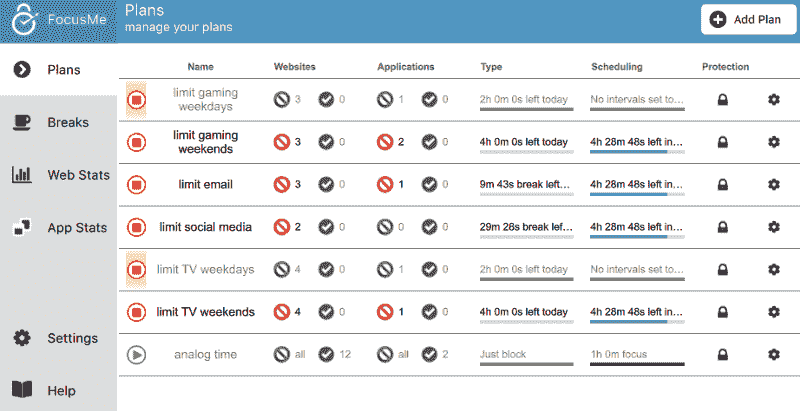

# 如何克服数字成瘾，更有意志力

> 原文：<https://www.freecodecamp.org/news/how-to-overcome-digital-addiction-and-have-more-willpower/>

## 作者的长篇大论:

我是一个梦想家。我一生都在梦想有一天能过上非常舒适的生活。能够做只有不担心钱的人才能做的事情。20 年来，我一直在努力开发应用程序和创业。我仍然没有成功，但我从未放弃，也永远不会放弃。

我过去常常幻想一旦我“到达”了，我的生活会是什么样子。但是我总是和自己的冲动和逃避做斗争，比如玩游戏、看网飞、神经质地查看脸书和电子邮件、摆弄手机等等。我无法告诉你有多少次我发现自己关闭脸书只是为了打开我的电子邮件，然后关闭我的电子邮件只是为了打开脸书。因为这个原因，我总是达不到我的生产目标，不能完成我的项目。在某个时刻，我停止了幻想。我从未停止追逐我的梦想，但在某种程度上，我已经失去了希望。

昨晚我又开始幻想了。原因是[我发现了一个应用](https://focusme.com/?ref=37)，它将帮助我控制我的数字成瘾，确保我关掉电脑，睡个好觉，并限制我在手机上可以做的事情。

## 关于意志力:

我最近读了一本名为《意志力本能》的好书，作者是 Kelly McGonigal 博士。我从书中学到的一个主要观点是意志力像肌肉一样发挥作用。我们有一个有限的数量，它可以被抽干。这就是为什么他们把糖果放在杂货店的收银台。在商店里走来走去试图做出好的决定后，我们的意志力耗尽了，我们更有可能做出错误的决定。

我们可以做一些事情来建立我们的意志力，但每次我们不得不抵制一些东西，它会消耗我们一点。意识到这一点的人和企业正在不断削弱我们的意志力。如果我们上班迟到，不吃早餐，快餐看起来会非常诱人。当我们听到手机铃声时，我们会像巴甫洛夫的狗一样拔出手机，寻找红色数字。如果我们看到一个有吸引力的人，我们会想采取行动去更多地看到那个人。或者我们可能想采取行动，让 ****变成**** 那个人。如果我们在手机上玩游戏，它会利用各种心理学来削弱我们的意志力，所以我们会购买下一个升级，下一个，下一个…

## 关于多巴胺:

我从《意志力本能》中得到的另一个收获是关于多巴胺的。多巴胺是我们大脑释放的一种化学物质，因此我们会寻找奖励。它既是胡萝卜又是大棒。当我们得到它时，它会给我们一点满足的快乐。当我们得不到它时，它会给我们带来压力。

在老鼠身上做了多巴胺实验，给老鼠接上电线，让它们能够接受多巴胺的电子刺激。然后他们被放在一个有两根杠杆的笼子里。一根杠杆给它们食物，另一根给它们多巴胺。老鼠不吃不睡，一遍又一遍地敲击多巴胺杠杆。他们会一直这样做，直到筋疲力尽或死去。

人和老鼠没什么不同。由于我们的认知能力，我们可以抵抗一些诱惑，所以直接接触多巴胺不会杀死我们。但它会让我们不太可能去寻找食物、住所、真正的社会交往以及其他需求和满足形式。就我个人而言，过去的日子里，我每天从起床到睡觉都在玩电脑游戏。我可能只会在下午晚些时候停下来吃点东西，我会尽可能长时间地“憋着”,直到我真的不得不离开。电脑和电子游戏是我的多巴胺杠杆。但是我们都在口袋里带着多巴胺杠杆到处走。

## 关于数字成瘾:

多年来，我听说上瘾的标签贴在从游戏到互联网到脸书到色情的所有东西上。所有这些东西都有一个共同点——它们都是数字化的。数字成瘾不是真的，只是我创造的一个标签，用来掩盖所有其他成瘾。但这很符合，因为它们都以同样的方式让我们上瘾。事实是，我们并没有沉迷于游戏或脸书或色情，我们沉迷于多巴胺。

每当我们查看电子邮件、脸书通知、Instagram hearts 和 follows 时，看到那个红色的小数字，我们就会有一点点多巴胺。游戏给了我们大量的奖励，让我们充满了多巴胺。高潮也会给我们带来大量的多巴胺。知道还有什么能给我们带来多巴胺吗？可卡因。说到数字世界，我们都是瘾君子。

如果你像我一样，从事数字领域的工作，比如设计师、开发人员、研究员、学生等等，那就更糟了。如果你要靠电脑谋生或受教育，你不能关掉电脑或收起手机。

## 超载:

增强我们的意志力是一件非常好的事情。但是我们每天都被诱惑包围着。那些释放多巴胺的诱惑非常难以抗拒。我在某个地方读到过，普通人每天会触摸手机 2000 次以上。仅仅从我们口袋里有一个物理设备开始，我们就要锻炼我们的意志力 2000 多次。然后，我们花时间在我们最喜欢的社交媒体平台上滚动，希望从一个猫视频或一组被击中胯部的家伙或朋友的感人声明或挑逗的图像中获得另一种多巴胺。与此同时，我们有其他的责任，必须锻炼很大的意志力来摆脱这种行为。

我们的现代生活提供了远远超出我们生理能力的诱惑。有些人对此没有意见。他们天生对社交媒体不感兴趣。或者也许他们从日复一日的成功中获得了足够的快乐。

但是，我们中的许多人，或者说大多数人，都在与某种形式的数字成瘾作斗争。我们还没有进化到能够处理它。实在是太多了。如果我们与焦虑或抑郁作斗争，它会极大地放大感觉良好或感觉更好的需要，使这些成瘾更加强大。

## 解决方案是:

有一个关于史蒂夫·乔布斯高领毛衣的故事正在流传。他们说他每天都穿同样的高领毛衣，这样他就可以少做一个决定。这样他每天就少了一件消耗意志力的事情，让他更有效率。这可能不是真的，实际上与品牌更有关系。但还是个好故事！

解决方法是拿走我们的决定。我们需要尽可能多地消除我们每天都在进行的意志力斗争。我们需要让它更易于管理！

我花了几年时间寻找一款能帮我阻挡诱惑的应用。通常，当我用谷歌搜索时，我会找到家长控制应用程序。他们不帮你控制自己，只是帮别人。我见过网站屏蔽浏览器插件，但它们对应用程序没有帮助，很容易被禁用。我曾经在我的电脑上使用管理工具来停止某些活动，但我总能找到一种方法来覆盖它们。屏蔽社交媒体的应用程序不起作用，因为我需要它来推广我的业务。

我见过简单断开互联网的工具。作为一名数字工作者，这甚至不是一个选项。作为一个终身学习者，我一直依赖谷歌。作为一名流浪者，我每天都需要谷歌地图。简单地关闭我的设备也不是一个选项。

> *[FocusMe](https://focusme.com/?ref=37) 无所不能！*

****然后昨天，我找到了！一个很牛逼的小 app 叫****[****focus me****](https://focusme.com/?ref=37)****。其他类似的 app 太简单了。他们提供全有或全无的解决方案。我需要能够根据我想如何使用它们来启用和禁用不同的东西。它还能让我限制对 Steam 和《我的世界》等应用程序以及网站的访问。他们也有一个安卓应用，几乎和 PC 版一样好用。它仍然比外面的任何东西都好，绝对符合我的需求。****[****FocusMe****](https://focusme.com/?ref=37)****无所不包！****

## 我如何使用它:

我喜欢游戏！但是它消耗了我的生命，就像我前面提到的。有了 [FocusMe](https://focusme.com/?ref=37) ，我可以限制每天玩游戏的时间，比如说一两个小时。如果我只是想偶尔跑一次马拉松，我甚至可以每周或每月去一次。

我需要访问我的电子邮件和社交媒体账户，但我想停止一遍又一遍地查看或盲目滚动的循环。有了 [FocusMe](https://focusme.com/?ref=37) ，我可以将我的会议限制在每次 10 分钟(或更少)，然后一个小时(或更长)内不再进行。

每晚保证 8 小时睡眠是至关重要的。在固定的时间睡觉对保持健康的生理节奏也很重要。但我经常熬夜打游戏，看《网飞》,或者找 1000 种其他方式来分散自己的注意力。然后我休息一下，糟糕，又是凌晨 2 点了。FocusMe 可以在晚上完全锁定我的电脑。我把它设置为从晚上 9 点到早上 6 点锁定。更规律的睡眠时间表也有助于确保更规律的工作时间表，这对我的自由职业生涯有好处。

我看了很多，我指的是网飞的 ****很多**** ，亚马逊 Prime 视频，以及其他来源的电视。我可以使用 [FocusMe](https://focusme.com/?ref=37) 来限制我花在 VLC 等视频网站和应用上的时间，就像我玩游戏一样。

我想出了一个我称之为“模拟时间”的东西，在那里我可以听音乐和有声读物，也许还可以看电视，但除此之外别无选择。没有谷歌，没有游戏，没有社交媒体，什么都没有，除了一些我可以在后台运行的东西，当我做一些艺术或手工艺或物理的东西。

我可以设置在工作模式下禁止某些活动，比如玩游戏。它甚至内置了番茄追踪器，这样我就可以在做番茄的时候完全屏蔽注意力。

我还可以锁定除了一个应用程序或页面之外的所有内容来做我不想做的工作。例如，我每天都会将大量有趣的文章和有用的信息剪辑到 OneNote 中。在使用它的这些年里，我实际上只尝试整理了大概 3 次。有了 [FocusMe](https://focusme.com/?ref=37) ，我可以屏蔽除 OneNote 之外的所有内容，比如每天一小时。我甚至可以将其他保存数据的应用程序列入白名单，这些数据需要像我的 Google Drive 一样进行组织。

## 最终注释:

当我第一次安装 [FocusMe](https://focusme.com/?ref=37) 时，我遇到了一些问题，它不能识别我打开了哪个浏览器标签。那对我来说是一个交易破坏者。开发人员对我的支持票做出了回应，在周六的 15 分钟内更新了应用程序，修复了问题！天哪！这是我现在完全信任的一款应用。

我有一些关于用法的注意事项。我建议全押 [FocusMe](https://focusme.com/?ref=37) ，但要循序渐进。除非你有很多经验，否则不要使用“强迫”。坚持使用短的随机密码，比如 3 个字符。一旦你简化了你的系统，让密码更难一点，比如 20-50 个字符左右。在你已经使用它一周或更长时间而没有想太多之后，去用 100-200 次。如果你发现这个水平没有阻止你，你可以一直到 2000！或者你可以把“被迫”作为绝对的最后手段。

此外，有一种趋势是，当有人想要做出重大改变时，他们往往会走极端。我要停止吃所有的碳水化合物！我打算每天锻炼两个小时！这些极端的尝试只会让我们失败，因为它们是无法实现的。请不要剥夺你生活中享受的一切。脸书是和你爱的人保持联系的好方法。游戏是一种很好的分散注意力的方式，充满了乐趣，也是辛苦一天结束后的一种舒缓的逃避。首先要爱自己，并以此来减少和控制占据你生活的事情。权力越大，责任越大。

多亏了 [FocusMe](https://focusme.com/?ref=37) ，我在两天内完成了这篇文章，而不是两周。