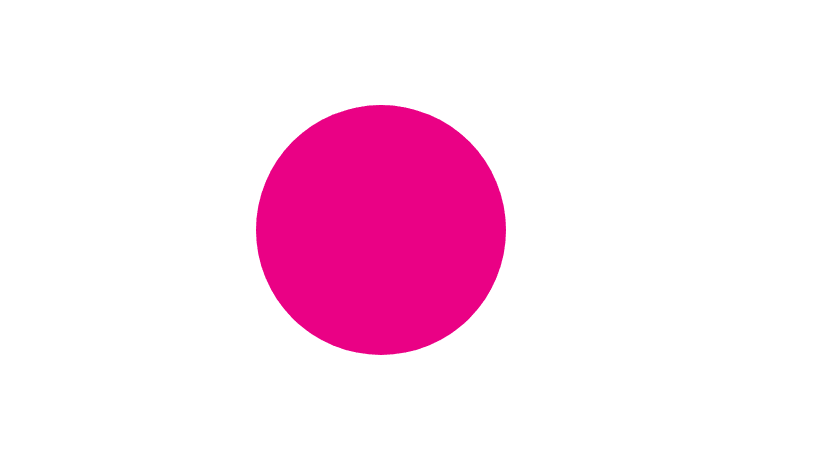
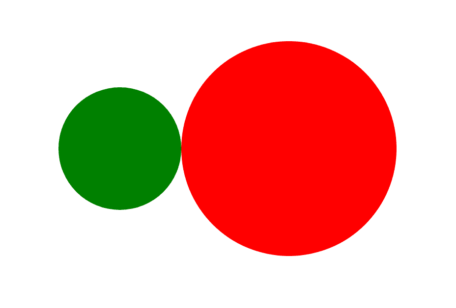
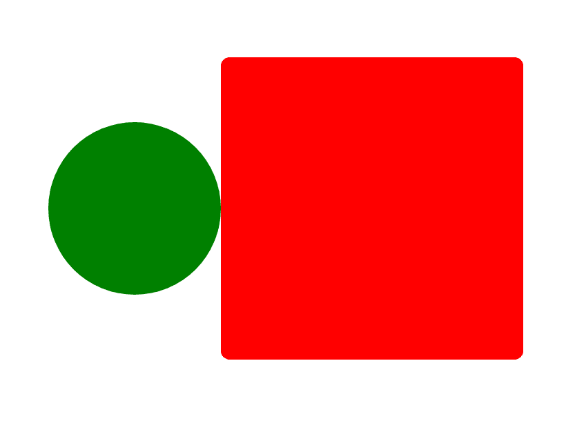

# 如何在 Sass 中使用 Mixins 并传递参数——代码示例

> 原文：<https://www.freecodecamp.org/news/how-to-pass-arguments-to-mixins/>

Mixins 是我最喜欢的事情。他们让我的生活变得简单多了，所以我想向你展示他们如何为你做同样的事情。

一开始理解 Mixins 可能有点棘手，但是不要担心。通过练习，你会找到窍门的，也会像我一样爱上 mixins。

在开始之前，让我向您展示您将在本文中读到的内容:

*   什么是混音
*   如何编写 mixins 并将其包含在代码中
*   如何以及何时传递参数

现在让我们言归正传，好吗？

## 萨斯中的 Mixins 是什么？

首先，让我们快速了解一下什么是 mixin:

> " [Mixins](https://sass-lang.com/documentation/at-rules/mixin) 允许您定义可以在整个样式表中重用的样式。它们使得避免使用像`.float-left`这样的非语义类，以及在库中分发样式集合变得容易。”–Sass 文档

简单地说，mixin 是一个代码块，它允许你在其中编写自己的风格，并在整个项目中使用它。你也可以把它想象成一个*可重用的*组件。这也有助于你写出更简洁的代码，而不必重复自己的工作。

## 如何写一个 Mixin

这是你如何在 Sass 中编写一个 mixin:

```
@mixin name {
    properties;
}
```

下面是如何将它包含在您的代码中:

```
div {
    @include name;
}
```

下面是一个在代码中使用 mixin 的例子:

```
@mixin circle {
    width: 200px;
    height: 200px;
    background: red;
    border-radius: 50%;
}

div {
   @include circle;
}
```

现在让我们看看上面的代码发生了什么:

1.  首先，我们使用`@mixin` at-rule 定义一个 mixin。
2.  然后我们给它一个名字——选择任何你认为适合你要用它的东西。
3.  添加您的 CSS 属性。
4.  只需使用`@include`就可以将它传递给 mixin 块。

## 混合示例

现在让我们看一个 mixin 的例子。

以下是如何用混音创建一个粉红色的圆圈:

```
@mixin circle {
    width: 200px;
    height: 200px;
    border-radius: 50%;
    background: #ea0185 ;
}
```

```
.circle {
    @include circle;
}
```



现在你可能会问*“为什么我要用一个 mixin 来创建一个粉红色的圆圈？我可以给我的元素一个类，然后设计它。”*

Mixins 是可重复使用的，记得吗？当我们知道自己会重复很多遍的时候，我们会使用它们。所以重点是*避免*重复，保持代码干净。

## 传递参数

现在我们已经看到了如何编写 mixin，让我们继续下一节。我想把这部分分成更小的部分:

*   什么是 mixin 参数？
*   何时传递参数？
*   如何传递参数？+例子。

### 什么是 Mixin 参数？

参数是由逗号分隔的变量的名称。

### 什么时候应该将参数传递给 Mixin？

我将用一个例子来开始这一部分:

如果你要创造两个不同的圈子呢？比如绿色圈和粉色圈？

您可以创建两个单独的混音，一个用于绿色混音，一个用于粉色混音:

```
// a mixin for the green circle
@mixin green-circle {
    width: 200px;
    height: 200px;
    border-radius: 50%;
    background: green;
}

// and another mixin for the pink circle
@mixin pink-circle {
    width: 200px;
    height: 200px;
    border-radius: 50%;
    background: pink;
}
```

但是这并不好，因为你在重复你的代码。而且要坚持干(不要重复自己)原则，记得吗？

这就是 mixin 论点的由来。

在正则 mixin 中(正则是指没有参数传递的 mixin ),你定义了一些特定的样式。但是参数允许你通过把它们变成变量来定义不同的样式。就像是为每个元素定制了每种风格。让我们继续下一部分，看看一些例子。

### 如何将参数传递给 Mixins

我们已经看到了什么是论点，什么时候使用它。现在是时候看看如何传递参数了:

```
@mixin name($argument,$argument) {
    property: $argument;
    property: $argument;

}
```

By passing arguments you can customize them

这里有一个例子:

```
@mixin circle2 ($width,$height,$color) {
    width: $width;
    height: $height;
    background: $color;
}
```

您可以将参数视为可定制的变量，您可以在不同的情况下使用这些变量来创建不同的东西，而无需重复自己。

就像当你把`$width`传递给 width 属性时，你可以在不同的情况下定义它。可能你需要宽度在一个地方是 50px，在另一个地方是 500px。

这有意义吗？让我用另一个例子来解释给你听。

好吧，回到我们的圈子。

我想用一个 mixin 制作一个大的红色圆圈和一个小的绿色圆圈(两个不同的东西)。


现在我需要什么属性来做一个圆？

```
width, height and background-color, right?
```

因为我们正在构建圆，所以两种情况下的边界半径都是 50%。所以我不会去管它，也不会传递任何参数给它。

现在我们只剩下 3 处房产:

1.  宽度
2.  高度
3.  背景颜色

这意味着我们只需要 3 个参数:

```
@mixin circle($width,$height,$color) {
    // We passed $width to the width property
    width: $width;

    // We passed $height to the height property
    height: $height;

    // And we passed $color to width background-color
    background: $color;

    // no argument for this property, beacuase it's gonna be the
    // same in both circles
    border-radius: 50%;
} 
```

This is how our mixin would look like

现在让我们看看如何将参数传递给 mixin:

#### 对于红色的大圆圈

```
.circle-red {

    // circle ($width,$height,$color);
   @include circle (350px,350px,red);
}
```

#### 对于绿色的小圆圈

```
.circle-green {

     // circle ($width,$height,$color);
    @include circle (200px,200px,green);
}
```

这是结果:



如果您想了解更多关于向 mixins 传递参数的信息，这里有一个小视频可以帮助您:

[https://www.youtube.com/embed/0s-xjyXOtP4?feature=oembed](https://www.youtube.com/embed/0s-xjyXOtP4?feature=oembed)

好吧，回到我们的教程。如前所述，我没有给 border-radius 属性传递任何参数，因为它总是 50%(在*这个*例子中)。

但是如果我要做一个正方形和一个圆形，那么我也需要传递一个参数给`border-radius`:

```
@mixin circle($width,$height,$color,$radius) {
    width: $width;
    height: $height;
    background: $color;
    // passed argument to border-radius to have control over it 
    border-radius: $radius;
}

.square {
            // ($width,$height,$color,$radius)
    @include circle (350px,350px,red, 10px);
}

.circle {
            // ($width,$height,$color,$radius)
    @include circle (200px,200px,green, 50%);
}
```

现在我们有一个红色的大方块和一个绿色的小圆圈:



让我们看另一个例子。这一次，让我们尝试在一些文本上使用混音。

这是我想做的，一个黑色背景的绿色文本和一个透明背景的红色文本:


首先，我创建了两个 h2 元素:

```
<h2 class="text1">Text</h2>
<h2 class="text2">Text</h2>
```

这里我们需要`font-size, color, and background`属性。现在我应该通过把参数变成变量来传递它们。

```
@mixin text($font-size,$color,$bg-color) {

     // we pass the $font-size to font-size property
    font-size: $font-size;

    // we pass the $color to color property
    color: $color;

    // we pass the $bg-color to background property
    background: $bg-color;
}

.text1 {
          // ($font-size,$color,$bg-color)
    @include text(3rem,green , black)
}

.text2 {
          // ($font-size,$color,$bg-color)
    @include text(5em,red , transparent)
}
```

现在你知道了。

快速提示:记住*争论的顺序很重要。*

这很重要，因为知道要为每个参数传递什么值的唯一方法是使用正确的顺序。

例如，如果您的参数顺序是 *$width，$height，$color* ，那么传递它们也应该按顺序进行:

```
@mixin circle($width,$height,$color) {
    width: $width;
    height: $height;
    background: $color;
    border-radius: 50%;

}
```

```
.circle-red {
             // ($width,$height,$color)
    @include circle (350px,350px,red);
}
```

The right order

不能先传递颜色，再传递宽度和高度:

```
.circle-red {
    @include circle (red,350px,350px);
}
```

The wrong order

关于这个错误的顺序，我们将`$width`传递给了 width 属性，因此第一个值需要是一个数字。所以如果你先通过`$color`，值就不会被识别。这就是为什么我们必须按顺序传递参数。

## 下面是我们在本文中讨论的内容的快速回顾

*   Mixins 是可重用的代码块。
*   当我们知道我们将大量重复代码片段时，我们使用它们。
*   这就是我们如何编写一个 mixin:

```
@mixin name {
    properties;
}
```

*   参数是由逗号分隔的变量的名称。
*   参数允许您定义不同的样式。
*   论点的顺序很重要。
*   这是我们传递论点的方式:

```
@mixin name($argument,$argument) {
    property: $argument;
    property: $argument;

}
```

这就是这篇文章的总结——我希望你喜欢它，并发现它很有用。😊


*You can also connect with me on [**twitter-**](https://twitter.com/nazanin_ashrafi)*