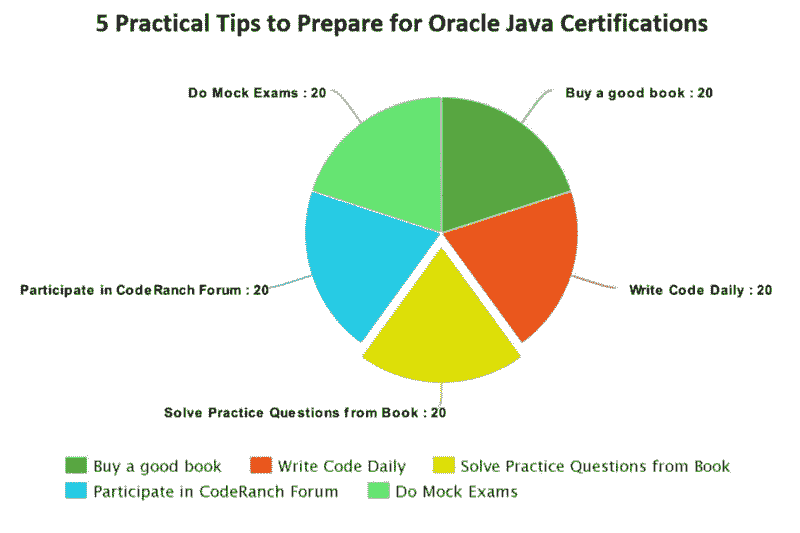
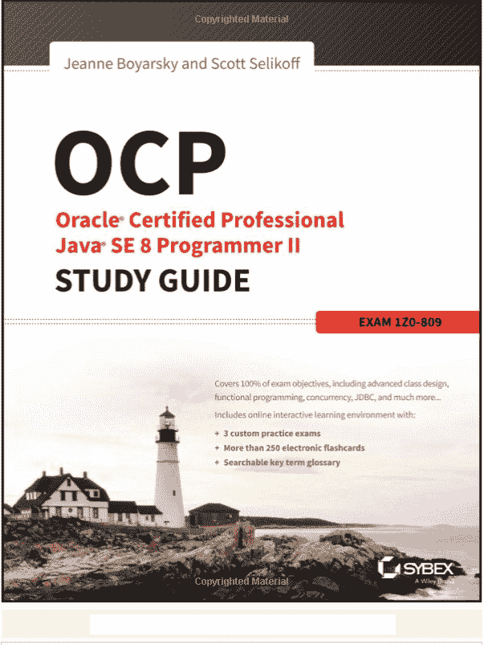
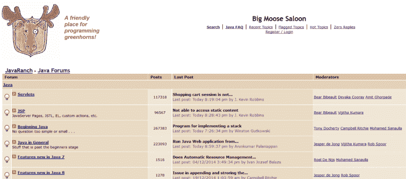

# 如何通过 Oracle 的 Java 认证——开发者实用指南

> 原文：<https://www.freecodecamp.org/news/how-to-pass-oracles-java-certifications-a-practical-guide-for-developers-e9b607ba6173/>

作者:javinpaul

# 如何通过 Oracle 的 Java 认证——开发者实用指南

Java 认证在 IT 行业受到高度重视，它为 Java 开发人员提供了全球认可。它帮助你找到一份更好的工作，获得更高的薪水，甚至在你目前的工作中获得更高的加薪或奖金。

这就是为什么每年都有成千上万的 Java 开发人员试图成为认证者，但在这个考试中成功并不容易。

甲骨文的 Java 认证有一个艰难的通过率，**接近 65%** 对于 [OCAJP](https://javarevisited.blogspot.com/2017/08/java-se-8-certification-books-ocajp8-ocpjp8.html) (甲骨文认证助理 Java 程序员)和 [OCPJP](https://javarevisited.blogspot.com/2018/07/do-you-need-to-pass-ocajp-before-taking-OCPJP-Java-certification.html#axzz5KQoN3YqB) (甲骨文认证专业 Java 程序员)。

要想通过考试，你需要对 Java 语言和 API 有深入的了解。

值得注意的是，为 OCPJP 做准备与 OCAJP 并没有太大的不同，尽管你不得不使用只集中在 OCPJP 的资源。你还需要涵盖更多的话题和更深入的内容，因为 OCPJP 8 号肯定是一块难啃的骨头。

为了做好准备，取得高分，下面是我准备分享的一些小技巧。这些建议在过去帮助我获得了超过 90%的认证分数。

所以，不浪费更多的时间，这里是我为准备好 OCAJP 和 T2 和 OCPJP 考试的五个建议。

### 1.每天编码

编码是不可替代的。你必须每天编码以培养编码意识，这将有助于你阅读真实考试中给出的代码。

在 [OCPJP](https://javarevisited.blogspot.com/2017/01/difference-between-ocpjp-8-upgrade-exams-1Z0-813-1Z0-810.html#axzz5TRkZ9aeh) 的例子中，它变得更加重要，因为在你选择选项之前，需要注意细节来理解每个编码问题。

### 2.参加一门好课程

在我看来，在线课程是在短时间内学习新技术的最佳方式之一，对于准备像 Oracle 的 Java 认证这样的认证考试也是如此。

他们是第二好的方法，仅次于私人教练或课堂培训。你会主动向有经验的专业人士学习，他们走过那条路，确切知道哪里是突破口，哪里是崎岖不平的道路。

大约 10 年前，当我准备 Java 认证时，书籍是唯一的途径，尤其是 Khalid Mughal 的书，但是现在你有了更多的书籍和课程来帮助你。

1.  [**神童 OCAJP 8 期培训班**](http://shareasale.com/r.cfm?b=1130601&u=880419&m=43514&urllink=&afftrack=)
2.  [**神童 OCPJP 8 期培训班**](http://shareasale.com/r.cfm?b=1130600&u=880419&m=43514&urllink=&afftrack=)
3.  [**甲骨文 Java 认证—通过准 1z 0–808 考试**](https://click.linksynergy.com/fs-bin/click?id=JVFxdTr9V80&subid=0&offerid=323058.1&type=10&tmpid=14538&RD_PARM1=https%3A%2F%2Fwww.udemy.com%2Foracle-java-associate-certification-exam-course-1z0-808%2F)

### 3.阅读一本好的学习书籍

如果您正在准备 Java 认证，没有比一本好的学习书籍更好的伴侣了。

它们涵盖了所有的考试主题，在本章末尾给出了练习题，并分享了许多你在任何普通 Java 书中都找不到的考试专用技巧。

市场上有很多学习指南，但如果你正在准备 [OCAJP 7](http://www.java67.com/2016/07/3-best-books-to-prepare-ocajp-7-1z0-803.html) 或 [OCAJP 8](https://javarevisited.blogspot.com/2017/07/ocajp-8-faq-oracle-certified-associate-certification-1z0-808-exam.html) 你可以看看这些资源，找到一个好的学习指南。

1.  [**OCA Oracle 认证助理 Java SE 8 程序员 I 由 Jean Boyarsky 和 Scott Selikoff**](http://www.amazon.com/OCA-Certified-Associate-Programmer-1Z0-808/dp/1118957407?tag=javamysqlanta-20)
2.  [**OCA Java SE 8 程序员 I 认证指南(考试 1z 0–808)(马拉古普塔)**](https://www.amazon.com/OCA-Java-Programmer-Certification-Guide/dp/1617293253?tag=javamysqlanta-20)
3.  [**甲骨文认证专业 Java SE 8 程序员考试 1z 0–809 由 Ganesh、Hari、Tushar**](https://www.amazon.com/Oracle-Certified-Professional-Programmer-1Z0-809/dp/1484218353/?tag=javamysqlanta-20)

### 4.选择一个好的考试模拟器

在选择了一本好书或学习指南后，接下来你需要的是一个好的考试模拟器。如果你想得高分，这是必须的，但如果你只是为了通过考试，这不是必需的。

考试模拟器将帮助您提高在 2.5 小时内完成所有问题所需的速度和准确度。

我建议你在参加真正的考试之前，坚持做模拟测试，直到你连续获得 80%的分数。

以下是我对考试模拟器的一些建议:

1.  [**Whizlab 的考试模拟器**](http://shrsl.com/?g0ce)
    市面上有最好的，经过包括我自己在内的很多开发者的反复试验。
2.  [**Enthuware 的练习测试**](https://enthuware.com/index.php/java-mock-exams/oracle-certified-professional/java-se-8-1z0-809)
    那在我看来也是次好的，也很便宜，10 美元以下就能搞定。它也经过了许多认证 Java 开发人员的尝试和测试
3.  [**大卫·迈耶的模拟测试**](https://www.certification-questions.com/java8-dumps/1Z0-808-dumps.html?affiliateCode=fcff36fd-557a-4713-abf6-973e9924770f&utm_source=Javin&utm_medium=affiliate&utm_campaign=affiliate)
    如果你需要在准备中多做一点，我建议你解决大卫·迈耶测试中的 450+道题。
4.  [**Java 认证:OCA(1z 0–808)考试模拟【2018】**](https://click.linksynergy.com/fs-bin/click?id=JVFxdTr9V80&subid=0&offerid=323058.1&type=10&tmpid=14538&RD_PARM1=https%3A%2F%2Fwww.udemy.com%2Fjava-oca%2F)
    260+选择题带讲解考核 Oracle Certified Associate、Java SE 8 程序员 I 备考
5.  [**Java 认证—OCA(1z 0–808)分题测试【2018】**](https://click.linksynergy.com/fs-bin/click?id=JVFxdTr9V80&subid=0&offerid=323058.1&type=10&tmpid=14538&RD_PARM1=https%3A%2F%2Fwww.udemy.com%2Fjava-ocajp%2F)
    选择题涵盖 Oracle Certified Associate、Java SE 8 程序员 I 的所有考试目标

顺便说一句，如果你正在购买 Whizlab 的模拟器，那么你也可以使用优惠券代码" **JAVACOMBO2"** 获得 25%的折扣。

因为他们提供终身访问他们的模拟器，我建议你一起购买 OCAJP 和 OCPJP 模拟器，并利用这个优惠券代码。

### 5.定期参加论坛

你必须让自己保持动力，了解考试和其他细节。考虑到这一点，没有什么比参加像 [CodeRanch](http://coderanch.com/) 或甲骨文[官方 Java 认证论坛](https://community.oracle.com/community/technology_network_community/certification/)这样的论坛更好的了。

可以提问，解惑，和其他正在备考的考生熟悉起来。

你也可以找到一些可以和你一起准备考试的伙伴。

### 6.解决尽可能多的练习题

熟能生巧，所以尽可能多地解决问题。你会慢慢养成考试需要的速度和准确度。

有许多这样的免费考试，谷歌是你的朋友。你可以找到很多这样的例子。

以下是 OCAJP 8 级和 OCPJP 8 级考试的一些**免费练习题**:

1.  [http://www . Java 67 . com/2017/05/10-free-Java-8-certification-sample-questions-OCA jp 8-OCPJP8-Mock-exams . html](http://www.java67.com/2017/05/10-free-java-8-certification-sample-questions-OCAJP8-OCPJP8-Mock-Exams.html)
2.  [http://Java re visited . blogspot . SG/2015/11/5-free-ocajp 8-ocpjp8-mock-exams-and-practice-questions . html # ax ZZ 5a clhr 0 b 5](http://javarevisited.blogspot.sg/2015/11/5-free-ocajp8-ocpjp8-mock-exams-and-practice-questions.html#axzz5ACLhR0b5)
3.  [http://Java re visited . blogspot . SG/2016/08/5-free-OCA jp-7-and-ocpjp 7-mock-exams . html # ax ZZ 4 pxl 8 axsv](http://javarevisited.blogspot.sg/2016/08/5-free-ocajp-7-and-ocpjp7-mock-exams.html#axzz4pXl8Axsv)

[**5 道免费 OCAJP8、OCPJP8 模拟考试及练习题- 1Z0-808 809 (Java 8 认证)**](https://javarevisited.blogspot.com/2015/11/5-free-ocajp8-ocpjp8-mock-exams-and-practice-questions.html)
[*为了做好 Java 认证，你需要在…*javarevisited.blogspot.com](https://javarevisited.blogspot.com/2015/11/5-free-ocajp8-ocpjp8-mock-exams-and-practice-questions.html)[**10 道免费 Java 8 认证样题- OCAJP8 和 OCPJP8 - 1Z0-808 和 1Z09 转储**](http://www.java67.com/2017/05/10-free-java-8-certification-sample-questions-OCAJP8-OCPJP8-Mock-Exams.html)

### Java 8 认证的其他有用资源:

下面是一些准备 ocajp 8([1z 0–808](http://javarevisited.blogspot.com/2017/04/ocajp-1z0-808-best-books-and-mock-exams-Java8-certification.html))和 ocapjp 8([1z 0–809](http://www.java67.com/2017/05/top-5-books-for-ocajp8-and-ocpjp8-Java-8-certification-exam.html))考试的有用资源。

有些资源是免费的，你必须购买其他资源，但鉴于实际考试费用为 **245 美元或 10，100 印度卢比**，多花一些钱做好准备是值得的。总比重考好。

*   [免费 OCAJP 8 和 OCPJP8 模拟考试](http://javarevisited.blogspot.com/2015/11/5-free-ocajp8-ocpjp8-mock-exams-and-practice-questions.html)
*   [ocajp 8 和 OCPJP8 的最佳考试模拟器](http://javarevisited.blogspot.com/2016/11/top-5-java-8-practice-test-and-exam-simulators-best-OCAJP-OCAPJP.html)
*   [Java SE 8 认证(OCAJP 8)的大纲和完整细节](https://education.oracle.com/pls/web_prod-plq-dad/db_pages.getpage?page_id=5001&get_params=p_exam_id:1Z0-809)
*   [链接报名 Java 8 考试](http://www.pearsonvue.com/oracle/)
*   [进一步阅读的最佳 Java 8 书籍](http://www.java67.com/2015/07/5-books-learn-java-8-functional-programming.html)
*   [做 Java 认证的好处](http://javarevisited.blogspot.com/2014/01/does-java-certifications-like-scjp-ocjp-ocpjp-helps-carrer-job-interviews.html)
*   [准备 OCAJP8 认证的技巧](http://javarevisited.blogspot.com/2016/12/5-tips-to-prepare-for-oracle-java-certifications-OCAJP-OCPJP-exams.html)
*   [面向 Java 开发人员的 OCAJP 8 常见问题解答](https://javarevisited.blogspot.com/2017/07/ocajp-8-faq-oracle-certified-associate-certification-1z0-808-exam.html)

#### 结束语

谢谢，你坚持到了文章的结尾…祝你的 Java 认证考试好运！这当然不容易，但是通过遵循这个路线图和提示，你离成为一名[认证的 Java 开发人员](https://javarevisited.blogspot.com/2018/07/why-become-certified-java-programmer.html)更近了一步。

#### 附言——如果你需要一些免费资源，你可以看看这个免费的 OCAJP 8 级和 OCPJP 8 级模拟考试列表，开始准备。