# 如何使用角度 13 执行 CRUD 操作

> 原文：<https://www.freecodecamp.org/news/how-to-perform-crud-operations-using-angular-13/>

构建一个全栈应用可能很困难。构建这样一个应用程序的基础是学习如何执行 CRUD 操作——创建、读取、更新和删除。

正是通过使用这些操作，我们管理了客户端应用程序和服务器之间的数据流。

因此，在本文中，您将学习如何使用 Angular 服务在 Angular 中执行 CRUD 操作。

让我们开始吧。

## 但是什么是角度服务呢？

角度服务是当我们想要在角度应用程序中执行某个操作时触发的方法。在我们的例子中，它们是执行 CRUD 操作的方法。换句话说，我们将有一个在数据库中创建数据的服务。就像那样，我们将有从服务器读取数据、更新服务器中的数据以及删除数据的不同服务。

## 基本设置

在系统中创建一个名为 Angular CRUD 的文件夹。在该文件夹中，创建两个文件。一个是客户端，一个是服务器。

**客户端**将包含我们的 Angular 应用程序，**服务器**将拥有服务器的后端代码，使用 Node、Express 和 MongoDB 构建。

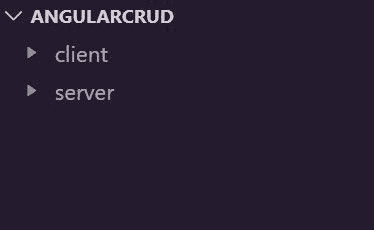

如果你想学习如何设计和开发 RESTful API，可以看我关于[RESTful API 的视频——使用 Node、Express 和 MongoDB](https://youtu.be/paxagc55loU) 构建一个 RESTful API。你也可以参考我的博客[如何使用 Node、Express 和 MongoDB](https://www.freecodecamp.org/news/build-a-restful-api-using-node-express-and-mongodb/) 构建 RESTful API。

但是如果你只想要代码，你可以从 GitHub 获得。

将这个后端代码添加到服务器文件夹中，然后使用 **npm start** 运行它。不要忘记首先使用 **npm install** 来安装包。

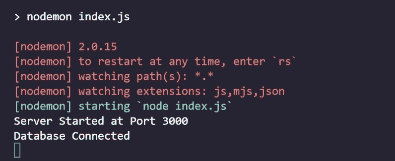

现在，在客户端文件夹中，从下面的存储库中添加 Angular 项目的启动代码。它只是一个在控制台中打印姓名和年龄的表单。

在运行项目之前，在这里做一个 **`npm i`** 。而要跑项目，只需做 **`ng serve`** 。

Angular Stater Code:[https://github . com/ni shant-666/Angular-crud/tree/Stater-Code](https://github.com/nishant-666/Angular-crud/tree/Stater-Code)

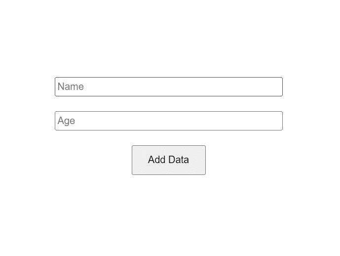

这是我们的输出，有两个输入和一个提交按钮。

## 如何为 CRUD 操作编写服务

现在，让我们为 CRUD 操作编写服务。但是我们首先需要生成一个服务组件。让我们称这个服务为**用户**。

要生成新服务，只需在新终端中键入以下命令:

```
ng g s users
```

这里， **g** 是 generate 的简称， **s** 是 service 的简称，后面是服务名，也就是 users。

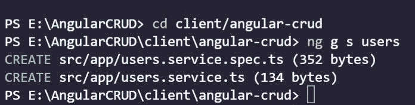

服务现在已经创建好了。您可以将新创建的服务签入到 **app** 文件夹中。

```
import { Injectable } from '@angular/core';

@Injectable({
  providedIn: 'root'
})
export class UsersService {

  constructor() { }
} 
```

现在，让我们为从数据库获取数据的 read 服务编写代码。为此，我们需要 **HttpClientModule** ，以便发送或接收 **http 请求。**

我们将把它放到 **app.module.ts** 中，因为所有的导入都在那里。

```
import { HttpClientModule } from '@angular/common/http';
```

然后将这个 **HttpClientModule** 添加到导入列表中:

```
imports: [
    BrowserModule,
    AppRoutingModule,
    FormsModule,
    HttpClientModule
 ],
```

以下是完整的 **app.module.ts** 供你参考:

```
import { NgModule } from '@angular/core';
import { BrowserModule } from '@angular/platform-browser';
import { FormsModule } from '@angular/forms';
import { AppRoutingModule } from './app-routing.module';
import { AppComponent } from './app.component';
import { HttpClientModule } from '@angular/common/http';

@NgModule({
  declarations: [
    AppComponent
  ],
  imports: [
    BrowserModule,
    AppRoutingModule,
    FormsModule,
    HttpClientModule
  ],
  providers: [],
  bootstrap: [AppComponent]
})
export class AppModule { } 
```

现在，我们可以从我们的应用程序发送 **http** 请求。

为了从后端接收数据，让我们创建一个服务。在 users.service.ts 中，导入 **HttpClient** 和 **Observable。**

```
import { HttpClient } from '@angular/common/http';
import { Observable } from 'rxjs';
```

因此，我们将使用这个 **HttpClient** 向后端 API 发送请求，并且我们将使用一个 **observable 接收传入的数据。**

现在，让我们在构造函数中创建一个 HttpClient 实例。

```
constructor(private http: HttpClient) { }
```

让我们也定义后端 API 的基本 URL。如果您检查服务器文件夹，您会看到一个名为 **index.js.** 的文件，在这里，我们有这个基础端点 **/api** 。

```
private baseURL = `http://localhost:3000/api`
```

```
app.use('/api', routes)
```

## 如何创建获取数据的服务

创建一个函数，它将在我们每次向服务器发送一个 **GET** 请求时运行。

```
getAllData(): Observable<any> {
   return this.http.get(`${this.baseURL}/getAll`)
}
```

这个 **getAll** 是获取所有数据的路径。因此，我们在 **baseURL** 后面添加了路由路径。

现在，我们必须在任何想要显示输入数据的地方调用这个函数。让我们在 **app.component.ts.** 中完成它

首先，导入服务。

```
import { UsersService } from './users.service';
```

然后，在构造函数中创建该服务的实例。

```
constructor(
    private userService: UsersService
  ) { }
```

然后在 **ngOnInit** 中，调用 **userService** 中的函数。此外，使用**订阅**订阅输入数据。

```
ngOnInit() {
    this.userService.getAllData()
      .subscribe(data => {
        console.log(data)
      })
  }
```

因此，这个 **ngOnInit** 在页面加载时运行，相当于 React 中的 **useEffect 钩子**和 **componentDidMount** 。

这个订阅从后端服务器返回数据给我们。

现在，让我们检查一下控制台。

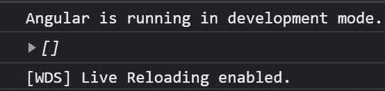

我们在数据库中没有任何数据，这就是为什么我们得到一个空数组。

## 如何创建添加数据的服务

现在，让我们创建一个使用后端服务器向后端数据库添加一些数据的服务。

```
postData(data: any): Observable<any> {
    return this.http.post(`${this.baseURL}/post`, data)
}
```

这与 read 服务非常相似。唯一的区别是它需要两个参数，而不是一个。一个是端点，另一个是我们将要发布的数据。我们将从我们的 **app.component.ts.** 传递这些数据

在 **app.component.ts** 文件中，创建一个函数 submitData。它应该包含一个将要发送的 body 对象。

```
 submitData(value: any) {
    let body = {
      name: value.name,
      age: value.age
    }
  }
```

然后，我们将像这样张贴这个身体:

```
this.userService.postData(body)
  .subscribe(response => {
    	console.log(response)
})
```

所以，这样想。我们在 userService.postData 函数中发送主体，它在另一端作为服务中的**数据**参数被接收。然后，我们只是发布它。

```
postData(data: any): Observable<any> {
    return this.http.post(`${this.baseURL}/post`, data)
}
```

下面是完整的 submitData 函数供你参考:

```
submitData(value: any) {
    let body = {
      name: value.name,
      age: value.age
    }

    this.userService.postData(body)
      .subscribe(response => {
        console.log(response)
      })
  }
```

现在，我们来补充一些数据。

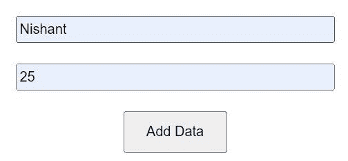

添加一些姓名和年龄，然后单击添加数据。


而且还会加。刷新页面，您将看到 read data 服务也在工作，因为我们将获得传入的数据。

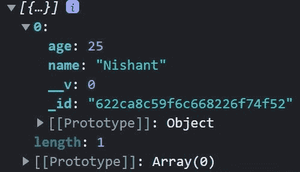

## 如何创建更新和删除数据的服务

现在，让我们创建更新和删除数据的服务。

```
updateData(data: any, id: string): Observable<any> {
    return this.http.patch(`${this.baseURL}/update/${id}`, data)
}
```

因此，这个 **updateData** 服务有两个参数。一个是我们要更新的文档的 id，第二个是将替换以前数据的新数据。 **updateData** 使用补丁方法更新数据。

我们将使用 id 作为路径参数。它将被追加到 **http.patch** 方法中。我们也会传递新的数据。

类似地，我们有 **deleteData** 服务。这只将 id 作为参数，它将被删除。 **deleteData** 使用`delete`方法删除数据。

```
deleteData(id: string): Observable<any> {
    return this.http.delete(`${this.baseURL}/delete/${id}`)
}
```

将 updateData 函数导入到 **app.component.ts** 文件中。

```
updateData(value: any) {
    let body = {
      name: value.name,
      age: value.age
    }

    this.userService.updateData(body, `622ca8c59f6c668226f74f52`)
      .subscribe(response => {
        console.log(response)
      })
  }
```

这里，我们传递新更新的主体和我们想要更新的文档的 id。

```
<form #loginForm="ngForm" (ngSubmit)="updateData(loginForm.value)">
  <div class="main">
    <div class="input-fields">
      <input name="name" ngModel placeholder="Name" id="name" type="text" class="input-field" />
    </div>
    <div class="input-fields">
      <input name="age" ngModel placeholder="Age" id="age" type="number" class="input-field" />
    </div>
    <button>Update Data </button>
  </div>
</form>
```

同样，在表单标签中，也要改变**app.component.html**中的函数。

因此，如果我们在输入字段中添加一些新数据，它将替换 id **622ca8c59f6c668226f74f52 的旧数据。**因为那是我们要传递的数据和 id。

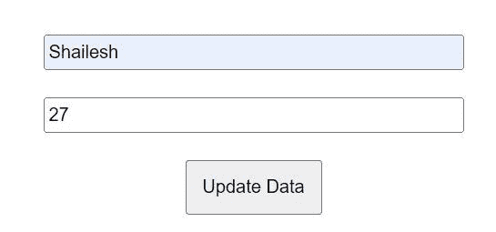

让我们将这个新数据添加到表单中，并单击 Update Data 按钮。您将看到数据将被更新，并出现在控制台中。

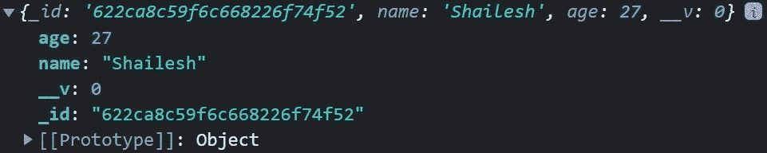

要删除数据，在 app.component.ts 中创建一个名为 **delete，**的函数，并在其中添加 **deleteData** 服务。

```
delete() {
    this.userService.deleteData(`622c573cf23ce54e445b2bed`)
      .subscribe(response => {
        console.log(response);
      })
  }
```

此外，更改 HTML 按钮文本和功能。

```
<form #loginForm="ngForm" (ngSubmit)="delete()">
  <div class="main">
    <div class="input-fields">
      <input name="name" ngModel placeholder="Name" id="name" type="text" class="input-field" />
    </div>
    <div class="input-fields">
      <input name="age" ngModel placeholder="Age" id="age" type="number" class="input-field" />
    </div>
    <button>Delete Data </button>
  </div>
</form>
```

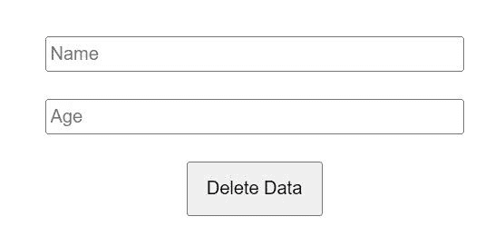

在 Chrome Dev Tools 中打开 Newtork 标签，点击删除数据按钮。它将删除 id 为 **622ca8c59f6c668226f74f52，**的文档，因为这是我们传递给 **deleteData** 服务的内容。

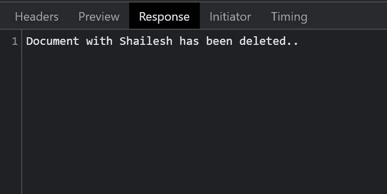

我们会收到确认信息。

## 包扎

这就是我们如何使用服务在 Angular 13 中进行 CRUD 操作的。

你也可以在[上查看我的视频让我们用 Angular 13 执行 CRUD 操作——初学者完整教程](https://youtu.be/O-MAtagUJjM)

在这里获取完整代码:[https://github . com/ni shant-666/Angular-crud/tree/Finished-Code](https://github.com/nishant-666/Angular-crud/tree/Finished-Code)