# 如何使用 Blazor 和 Google Cloud Firestore 执行 CRUD 操作

> 原文：<https://www.freecodecamp.org/news/how-to-perform-crud-operations-using-blazor-and-google-cloud-firestore-52890b06e2f8/>

### 介绍

在本文中，我们将使用 Google Firstore 作为数据库提供者来创建一个 Blazor 应用程序。我们将创建一个单页面应用程序(SPA)并在其上执行 CRUD 操作。我们将使用 Bootstrap 4 来显示一个处理用户输入的模态弹出窗口。该表单还有一个下拉列表，它将绑定到我们的数据库中的一个集合。我们还将实现一个客户端搜索功能，通过员工姓名搜索员工列表。

看一看最终的应用程序。

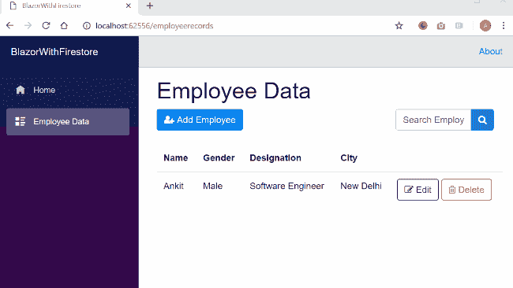

### 先决条件

*   安装。NET Core 2.1 以上 SDK 从[这里](https://www.microsoft.com/net/learn/get-started-with-dotnet-tutorial#windowscmd)
*   从[这里](https://www.visualstudio.com/downloads/)安装最新版本的 Visual Studio 2017
*   从[这里](https://marketplace.visualstudio.com/items?itemName=aspnet.blazor)安装 ASP.NET 核心 Blazor 语言服务扩展

### 源代码

从 [GitHub](https://github.com/AnkitSharma-007/Blazor-CRUD-With-CloudFirestore) 获取源代码。

### 配置云风暴

第一步是在 google Firebase 控制台中创建一个项目。导航至[https://console.firebase.google.com](https://console.firebase.google.com/)，使用您的谷歌帐户登录。点击添加项目链接。将会打开一个弹出窗口，如下图所示。提供您的项目名称，然后单击底部的“创建项目”按钮。

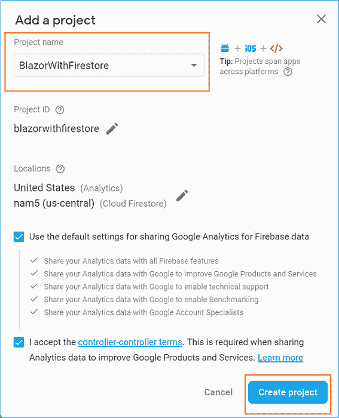

请在此处记下项目 id。Firebase 项目 id 是全球唯一的。您可以在创建新项目时编辑您的项目 id。项目一旦创建，您就不能更改您的项目 id。我们将在下一节初始化应用程序时使用这个项目 id。

单击您刚刚创建的项目。将会打开一个项目概述页面。从左侧菜单中选择“数据库”。然后点击“创建数据库”按钮。将打开一个弹出窗口，要求您选择“云 Firestore 的安全规则”。选择“在锁定模式下启动”,然后点击“启用”。

请参考下图:

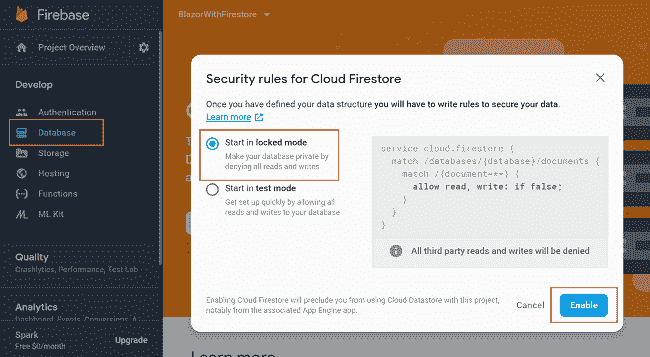

这将为您的项目启用数据库。Firebase 项目有两种数据库选择——实时数据库和云 Firestore。对于这个应用程序，我们将使用“云 Firestore”数据库。点击页面顶部的“数据库”下拉菜单，并选择“云 Firestore”。

请参考下图:

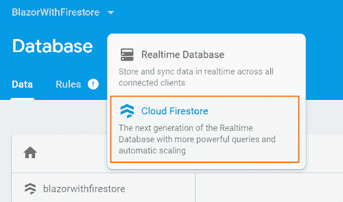

我们将创建 cities 集合来存储雇员的城市名称。我们还将这个集合绑定到我们的 web 应用程序中的下拉列表，用户将从该列表中选择所需的城市。点击“添加收藏”。将收藏 ID 设置为“城市”。点击“下一步”。请参考下图:

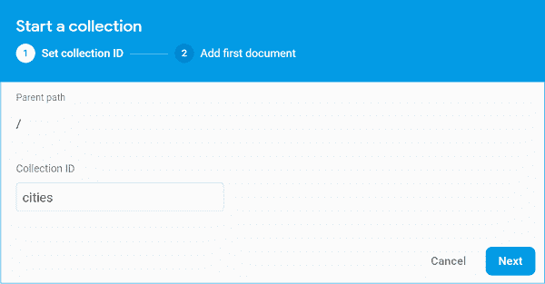

将字段值设置为“CityName”，从类型下拉列表中选择 string，并在值中填入城市名称“Mumbai”。点击保存。请参考下图:

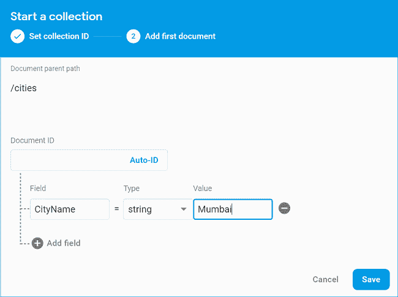

这将创建“cities”集合，并在其中插入第一个文档。类似地，在这个集合中再创建四个文档，并将“CityName”的值设为 Chennai、新德里、Bengaluru 和 Hyderabad。

我们将使用“employees”集合来存储雇员数据，但是我们不会手动创建它。我们将创建“雇员”集合，同时从应用程序中添加第一个雇员数据。

### 配置 Google 应用程序凭据

为了从我们的项目中访问数据库，我们需要设置`GOOGLE_APPLICATION_CREDENTIALS`环境变量来指向一个 JSON 服务帐户密钥文件。这将设置一个从我们的应用程序到云 Firestore 的认证管道。

要生成服务帐户密钥文件，请执行以下步骤:

**第一步**:导航到 https://console.cloud.google.com/iam-admin/。使用您用来创建 Firestore DB 的同一个 google 帐户登录。

**第二步**:从顶部菜单栏的下拉菜单中选择项目。

**第三步**:从左侧菜单中选择“服务账户”。选择要为其创建密钥的服务帐户。单击该行“Actions”列中的 more 按钮，然后单击 Create key。

请参考下图:

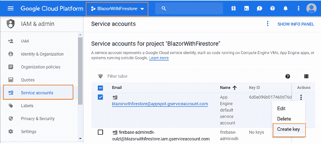

**第四步**:将打开一个弹出模式，要求您选择按键类型。选择“JSON”并点击创建按钮。这将创建用于访问您的 Firestore 帐户的私钥，并将 JSON 密钥文件下载到您的机器上。在本文的后面部分，我们将使用这个文件来设置`GOOGLE_APPLICATION_CREDENTIALS`环境变量。

### 创建 Blazor Web 应用程序

打开 Visual Studio 并选择文件>>新建>>项目。选择项目后，将会打开一个“新项目”对话框。选择。NET Core 里面的 Visual C#菜单从左侧面板。然后，选择“ASP。NET 核心 Web 应用程序”。输入 ithFirestore 的名称，然后按 OK。

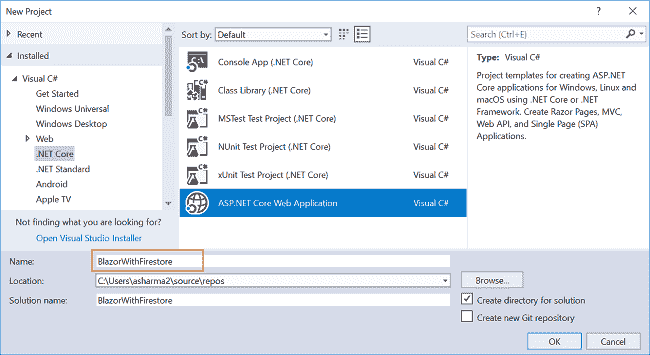

单击 OK 后，将打开一个新对话框，要求您选择项目模板。您可以在模板窗口的左上角看到两个下拉菜单。选择”。NET Core”和“ASP。NET Core 2.1 英寸。然后，选择“Blazor (ASP。NET Core hosted)”模板，然后按确定。

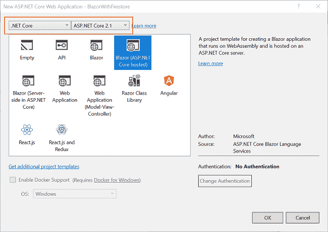

现在，我们的 Blazor 解决方案将被创建。您可以看到，我们在这个解决方案中创建了三个项目文件。

1.  BlazorWithFirestore。客户端—它具有客户端代码，并包含将在浏览器上呈现的页面。
2.  BlazorWithFirestore。服务器—它有服务器端代码，如数据访问层和 web API。
3.  BlazorWithFirestore。共享—它包含客户端和服务器都可以访问的共享代码。它包含了我们的模型类。

### 为 Firestore 添加包参考

我们需要添加 Google cloud Firestore 的包引用，这将允许我们从 Blazor 应用程序访问我们的 DB。右键点击`BlazorWithFirestore.Shared`项目。

选择“编辑 BlazorWithFirestore。Shared.csproj "。它将打开`BlazorWithFirestore.Shared.csproj`文件。在其中添加下面几行。

```
<ItemGroup>  <PackageReference Include="Google.Cloud.Firestore" Version="1.0.0-beta14" /></ItemGroup>
```

同样，也将这些行添加到`BlazorWithFirestore.Server.csproj`文件中。

### 创建模型

我们将在`BlazorWithFirestore.Shared`项目中创建我们的模型类。右键点击`BlazorWithFirestore.Shared`，选择添加> >新文件夹。将文件夹命名为 Models。同样，右击 Models 文件夹并选择 Add > > Class 来添加一个新的类文件。将您的类命名为 Employee.cs，然后单击 Add。

打开`Employee.cs`类，将下面的代码放入其中。

```
using System;using Google.Cloud.Firestore;namespace BlazorWithFirestore.Shared.Models{    [FirestoreData]    public class Employee    {        public string EmployeeId { get; set; }        public DateTime date { get; set; }        [FirestoreProperty]        public string EmployeeName { get; set; }        [FirestoreProperty]        public string CityName { get; set; }        [FirestoreProperty]        public string Designation { get; set; }        [FirestoreProperty]        public string Gender { get; set; }    }}
```

我们用`[FirestoreData]`属性修饰了这个类。这将允许我们将这个类对象映射到 Firestore 集合。当我们将文档保存到集合中时，只考虑那些标有`[FirestoreProperty]`属性的类属性。我们不需要将 EmployeeId 保存到数据库中，因为它是自动生成的。

在获取数据时，我们将自动生成的文档 id 绑定到 EmployeeId 属性。类似地，我们将在获取记录时使用 date 属性来绑定集合的创建日期。我们将使用这个日期属性按照创建日期对雇员列表进行排序。因此，我们没有对这两个属性应用`[FirestoreProperty]`属性。

类似地，创建一个类文件 Cities.cs，并将以下代码放入其中。

```
using System;using Google.Cloud.Firestore;namespace BlazorWithFirestore.Shared.Models{    [FirestoreData]    public class Cities    {        public string CityName { get; set; }    }}
```

### 为应用程序创建数据访问层

右键点击`BlazorWithFirestore.Server`项目，然后选择>添加>新文件夹，并将文件夹命名为`er as Data` Access。我们将添加我们的类来处理这个文件夹中与数据库相关的操作。右击 DataAccess 文件夹，选择 Add > > Class。名称 `your class EmployeeDataAc`塞斯莱尔. cs

将下面的代码放在这个类中。

```
using System;using System.Collections.Generic;using System.Linq;using System.Threading.Tasks;using BlazorWithFirestore.Shared.Models;using Google.Cloud.Firestore;using Newtonsoft.Json;namespace BlazorWithFirestore.Server.DataAccess{    public class EmployeeDataAccessLayer    {        string projectId;        FirestoreDb fireStoreDb;        public EmployeeDataAccessLayer()        {            string filepath = "C:\\FirestoreAPIKey\\blazorwithfirestore-6d0a096b0174.json";            Environment.SetEnvironmentVariable("GOOGLE_APPLICATION_CREDENTIALS", filepath);            projectId = "blazorwithfirestore";            fireStoreDb = FirestoreDb.Create(projectId);        }        public async Task<List<Employee>> GetAllEmployees()        {            try            {                Query employeeQuery = fireStoreDb.Collection("employees");                QuerySnapshot employeeQuerySnapshot = await employeeQuery.GetSnapshotAsync();                List<Employee> lstEmployee = new List<Employee>();                foreach (DocumentSnapshot documentSnapshot in employeeQuerySnapshot.Documents)                {                    if (documentSnapshot.Exists)                    {                        Dictionary<string, object> city = documentSnapshot.ToDictionary();                        string json = JsonConvert.SerializeObject(city);                        Employee newuser = JsonConvert.DeserializeObject<Employee>(json);                        newuser.EmployeeId = documentSnapshot.Id;                        newuser.date = documentSnapshot.CreateTime.Value.ToDateTime();                        lstEmployee.Add(newuser);                    }                }                List<Employee> sortedEmployeeList = lstEmployee.OrderBy(x => x.date).ToList();                return sortedEmployeeList;            }            catch            {                throw;            }        }        public async void AddEmployee(Employee employee)        {            try            {                CollectionReference colRef = fireStoreDb.Collection("employees");                await colRef.AddAsync(employee);            }            catch            {                throw;            }        }        public async void UpdateEmployee(Employee employee)        {            try            {                DocumentReference empRef = fireStoreDb.Collection("employees").Document(employee.EmployeeId);                await empRef.SetAsync(employee, SetOptions.Overwrite);            }            catch            {                throw;            }        }        public async Task<Employee> GetEmployeeData(string id)        {            try            {                DocumentReference docRef = fireStoreDb.Collection("employees").Document(id);                DocumentSnapshot snapshot = await docRef.GetSnapshotAsync();                if (snapshot.Exists)                {                    Employee emp = snapshot.ConvertTo<Employee>();                    emp.EmployeeId = snapshot.Id;                    return emp;                }                else                {                    return new Employee();                }            }            catch            {                throw;            }        }        public async void DeleteEmployee(string id)        {            try            {                DocumentReference empRef = fireStoreDb.Collection("employees").Document(id);                await empRef.DeleteAsync();            }            catch            {                throw;            }        }        public async Task<List<Cities>> GetCityData()        {            try            {                Query citiesQuery = fireStoreDb.Collection("cities");                QuerySnapshot citiesQuerySnapshot = await citiesQuery.GetSnapshotAsync();                List<Cities> lstCity = new List<Cities>();                foreach (DocumentSnapshot documentSnapshot in citiesQuerySnapshot.Documents)                {                    if (documentSnapshot.Exists)                    {                        Dictionary<string, object> city = documentSnapshot.ToDictionary();                        string json = JsonConvert.SerializeObject(city);                        Cities newCity = JsonConvert.DeserializeObject<Cities>(json);                        lstCity.Add(newCity);                    }                }                return lstCity;            }            catch            {                throw;            }        }    }}
```

在这个类的构造函数中，我们设置了`GOOGLE_APPLICATION_CREDENTIALS`环境变量。您需要将 filepath 变量的值设置为 JSON 服务帐户密钥文件在您的机器中所处的路径。记住，我们在上一节下载了这个文件。projectId 变量应该设置为 Firebase 项目的项目 Id。

我们还定义了执行 CRUD 操作的方法。GetAllEmployees 方法将从我们的“Employees”集合中获取所有雇员文档的列表。它将返回按文档创建日期排序的员工列表。

`AddEmployee`方法将向我们的“雇员”集合添加一个新的雇员文档。如果集合不存在，它将首先创建集合，然后在其中插入一个新文档。

`UpdateEmployee`方法将根据传递给它的雇员 id 更新一个已经存在的雇员文档的字段值。我们将文档 id 绑定到 employeeId 属性，因此我们可以轻松地操作文档。

`GetEmployeeData`方法将根据雇员 id 从我们的“雇员”集合中获取一个雇员文档。

方法将从“雇员”集合中删除特定雇员的文档。

方法将从“城市”集合中返回城市列表。

### 向应用程序添加 web API 控制器

右击`BlazorWithFirestore.Server/Controllers`文件夹，选择添加> >新项目。将会打开“添加新项目”对话框。从左侧面板中选择 Web，然后从模板面板中选择“API 控制器类”并放置 na `me as EmployeeControl` ler.cs。单击添加。

这将创建我们的 API EmployeeController 类。我们将调用 EmployeeDataAccessLayer 类的方法来获取数据并将数据传递给客户端。

打开`EmployeeController.cs`文件，将以下代码放入其中。

```
using System;using System.Collections.Generic;using System.Threading.Tasks;using BlazorWithFirestore.Server.DataAccess;using BlazorWithFirestore.Shared.Models;using Microsoft.AspNetCore.Mvc;namespace BlazorWithFirestore.Server.Controllers{    [Route("api/[controller]")]    public class EmployeeController : Controller    {        EmployeeDataAccessLayer objemployee = new EmployeeDataAccessLayer();        [HttpGet]        public Task<List<Employee>> Get()        {            return objemployee.GetAllEmployees();        }        [HttpGet("{id}")]        public Task<Employee> Get(string id)        {            return objemployee.GetEmployeeData(id);        }        [HttpPost]        public void Post([FromBody] Employee employee)        {            objemployee.AddEmployee(employee);        }        [HttpPut]        public void Put([FromBody]Employee employee)        {            objemployee.UpdateEmployee(employee);        }        [HttpDelete("{id}")]        public void Delete(string id)        {            objemployee.DeleteEmployee(id);        }        [HttpGet("GetCities")]        public Task<List<Cities>> GetCities()        {            return objemployee.GetCityData();        }    }}
```

### 创建 Blazor 组件

我们将在`BlazorWithFirestore.Client/Pages`文件夹中创建组件。默认情况下，应用程序模板在该文件夹中提供计数器和获取数据文件。在添加我们自己的组件文件之前，我们将删除这两个默认文件，以使我们的解决方案更加清晰。右键单击`BlazorWithFirestore.Client/Pages`文件夹，然后选择添加> >新项目。一个“添加新项目”对话框将打开，选择“ASP。NET Core”，然后从模板面板选择“Razor Page”和 na `me it EmployeeData.` cshtml。单击添加。请参考下图:

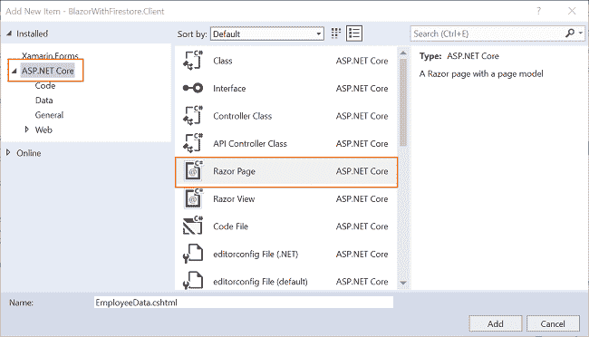

这将在我们的 BlazorSPA.Client/Pages 文件夹中添加一个`EmployeeData.cshtml`页面。这个 razor 页面将有两个文件——employee data . cs html 和 EmployeeData.cshtml.cs。

### 为 JS 互操作添加引用

我们将在应用程序中使用引导模式对话框。我们还将在应用程序中包含一些字体很棒的图标。为了能够使用这两个库，我们需要添加 CDN 引用来允许 JS 互操作。

```
<link rel="stylesheet" href="https://cdnjs.cloudflare.com/ajax/libs/font-awesome/4.7.0/css/font-awesome.min.css"><script src="https://ajax.googleapis.com/ajax/libs/jquery/3.3.1/jquery.min.js"></script><script src="https://cdnjs.cloudflare.com/ajax/libs/popper.js/1.14.3/umd/popper.min.js"></script><script src="https://maxcdn.bootstrapcdn.com/bootstrap/4.1.3/js/bootstrap.min.js"></script>
```

这里，我们包括了 CDN 参考，这将允许我们在应用程序中使用引导模态对话框和字体图标。现在，我们将向视图文件添加代码。

### EmployeeData.cshtml.cs

打开`EmployeeData.cshtml.cs`，把下面的代码放进去。

```
using System;using System.Collections.Generic;using System.Linq;using System.Net.Http;using System.Threading.Tasks;using BlazorWithFirestore.Shared.Models;using Microsoft.AspNetCore.Blazor;using Microsoft.AspNetCore.Blazor.Components;namespace BlazorWithFirestore.Client.Pages{    public class EmployeeDataModel : BlazorComponent    {        [Inject]        protected HttpClient Http { get; set; }        protected List<Employee> empList = new List<Employee>();        protected List<Cities> cityList = new List<Cities>();        protected Employee emp = new Employee();        protected string modalTitle { get; set; }        protected string searchString { get; set; }        protected override async Task OnInitAsync()        {            await GetCityList();            await GetEmployeeList();        }        protected async Task GetCityList()        {            cityList = await Http.GetJsonAsync<List<Cities>>("api/Employee/GetCities");        }        protected async Task GetEmployeeList()        {            empList = await Http.GetJsonAsync<List<Employee>>("api/Employee");        }        protected void AddEmployee()        {            emp = new Employee();            modalTitle = "Add Employee";        }        protected async Task EditEmployee(string empID)        {            emp = await Http.GetJsonAsync<Employee>("/api/Employee/" + empID);            modalTitle = "Edit Employee";        }        protected async Task SaveEmployee()        {            if (emp.EmployeeId != null)            {                await Http.SendJsonAsync(HttpMethod.Put, "api/Employee/", emp);            }            else            {                await Http.SendJsonAsync(HttpMethod.Post, "/api/Employee/", emp);            }            await GetEmployeeList();        }        protected async Task DeleteConfirm(string empID)        {            emp = await Http.GetJsonAsync<Employee>("/api/Employee/" + empID);        }        protected async Task DeleteEmployee(string empID)        {            Console.WriteLine(empID);            await Http.DeleteAsync("api/Employee/" + empID);            await GetEmployeeList();        }        protected async Task SearchEmployee()        {            await GetEmployeeList();            if (searchString != "")            {                empList = empList.Where(                x => x.EmployeeName.IndexOf(searchString,                StringComparison.OrdinalIgnoreCase) != -1).ToList();            }        }    }}
```

这里，我们定义了 EmployeeDataModel 类，它继承自 BlazorComponent。这允许 EmployeeDataModel 类充当 Blazor 组件。

我们还注入了 HttpClient 服务，以支持对 EmployeeController API 的 web API 调用。

我们将使用两个变量——empList 和 city list——分别保存雇员和城市集合的数据。类型为 string 的 modalTitle 属性用于保存将在模式对话框中显示的标题。搜索框中提供的值存储在 searchString 属性中，该属性也是 String 类型。

`GetCityList`方法将调用我们的 web API GetCities 方法，从 Cities 集合中获取城市数据列表。`GetEmployeeList`方法将向我们的 web API 发送一个 GET 请求，从 Employee 表中获取雇员数据列表。

我们在`OnInitAsync`方法中调用这两个方法，以确保雇员数据和城市数据在页面加载时可用。

`AddEmployee`方法将初始化 Employee 对象的一个空实例，并设置 modalTitle 属性，这将在添加模式弹出窗口上显示标题消息。

`EditEmployee`方法将接受雇员 ID 作为参数。它将向我们的 web API 发送一个 GET 请求，以获取与提供给它的员工 ID 相对应的员工记录。

我们将使用`SaveEmployee`方法为添加请求和编辑请求保存雇员的记录。为了区分添加和编辑请求，我们将使用 Employee 对象的 EmployeeId 属性。如果发出了编辑请求，那么 EmployeeId 属性包含一个字符串值，我们将向 web API 发送一个 PUT 请求，这将更新雇员的记录。否则，如果我们发出一个添加请求，那么 EmployeeId 属性不会被初始化，因此它将为 null。在这种情况下，我们需要向我们的 web API 发送一个 POST 请求，这将创建一个新的雇员记录。

`DeleteConfirm`方法将接受雇员 ID 作为参数。它将获取与提供给它的员工 ID 相对应的员工数据。

`DeleteEmployee`方法将向我们的 API 发送一个删除请求，并将雇员 ID 作为参数传递。然后，它将调用 GetEmployeeList 方法，用更新后的雇员数据列表刷新视图。

`SearchEmployee`方法用于实现按雇员姓名搜索的功能。我们将返回该员工的所有记录，这些记录将完全或部分符合搜索标准。为了使搜索更有效，我们将忽略搜索字符串的文本大小写。这意味着无论搜索文本是大写还是小写，搜索结果都是一样的。

### EmployeeData.cshtml

打开`EmployeeData.cshtml`页面，将以下代码放入其中。

```
@page "/employeerecords"@inherits EmployeeDataModel<h1>Employee Data</h1><div class="container">    <div class="row">        <div class="col-xs-3">            <button class="btn btn-primary" data-toggle="modal" data-target="#AddEditEmpModal" onclick="@AddEmployee">                <i class="fa fa-user-plus"></i>                Add Employee            </button>        </div>        <div class="input-group col-md-4 offset-md-5">            <input type="text" class="form-control" placeholder="Search Employee" bind="@searchString" />            <div class="input-group-append">                <button class="btn btn-info" onclick="@SearchEmployee">                    <i class="fa fa-search"></i>                </button>            </div>        </div>    </div></div><br />@if (empList == null){    <p><em>Loading...</em></p>}else{    <table class='table'>        <thead>            <tr>                <th>Name</th>                <th>Gender</th>                <th>Designation</th>                <th>City</th>            </tr>        </thead>        <tbody>            @foreach (var emp in empList)            {                <tr>                    <td>@emp.EmployeeName</td>                    <td>@emp.Gender</td>                    <td>@emp.Designation</td>                    <td>@emp.CityName</td>                    <td>                        <button class="btn btn-outline-dark" data-toggle="modal" data-target="#AddEditEmpModal"                                onclick="@(async () => await EditEmployee(@emp.EmployeeId))">                            <i class="fa fa-pencil-square-o"></i>                            Edit                        </button>                        <button class="btn btn-outline-danger" data-toggle="modal" data-target="#deleteEmpModal"                                onclick="@(async () => await DeleteConfirm(@emp.EmployeeId))">                            <i class="fa fa-trash-o"></i>                            Delete                        </button>                    </td>                </tr>            }        </tbody>    </table>}<div class="modal fade" id="AddEditEmpModal">    <div class="modal-dialog">        <div class="modal-content">            <div class="modal-header">                <h3 class="modal-title">@modalTitle</h3>                <button type="button" class="close" data-dismiss="modal">                    <span aria-hidden="true">X</span>                </button>            </div>            <div class="modal-body">                <form>                    <div class="form-group">                        <label class="control-label">Name</label>                        <input class="form-control" bind="@emp.EmployeeName" />                    </div>                    <div class="form-group">                        <label class="control-label">Gender</label>                        <select class="form-control" bind="@emp.Gender">                            <option value="">-- Select Gender --</option>                            <option value="Male">Male</option>                            <option value="Female">Female</option>                        </select>                    </div>                    <div class="form-group">                        <label class="control-label">Designation</label>                        <input class="form-control" bind="@emp.Designation" />                    </div>                    <div class="form-group">                        <label class="control-label">City</label>                        <select class="form-control" bind="@emp.CityName">                            <option value="-- Select City --">-- Select City --</option>                            @foreach (var city in cityList)                            {                                <option value="@city.CityName">@city.CityName</option>                            }                        </select>                    </div>                </form>            </div>            <div class="modal-footer">                <button class="btn btn-block btn-success"                        onclick="@(async () => await SaveEmployee())" data-dismiss="modal">                    Save                </button>            </div>        </div>    </div></div><div class="modal fade" id="deleteEmpModal">    <div class="modal-dialog">        <div class="modal-content">            <div class="modal-header">                <h3 class="modal-title">Confirm Delete !!!</h3>                <button type="button" class="close" data-dismiss="modal">                    <span aria-hidden="true">X</span>                </button>            </div>            <div class="modal-body">                <table class="table">                    <tr>                        <td>Name</td>                        <td>@emp.EmployeeName</td>                    </tr>                    <tr>                        <td>Gender</td>                        <td>@emp.Gender</td>                    </tr>                    <tr>                        <td>Designation</td>                        <td>@emp.Designation</td>                    </tr>                    <tr>                        <td>City</td>                        <td>@emp.CityName</td>                    </tr>                </table>            </div>            <div class="modal-footer">                <button class="btn btn-danger" data-dismiss="modal"                        onclick="@(async () => await DeleteEmployee(@emp.EmployeeId))">                    Delete                </button>                <button data-dismiss="modal" class="btn">Cancel</button>            </div>        </div>    </div></div>
```

我们组件的路由在顶部定义为“/employeerecords”。为了使用 EmployeeDataModel 类中定义的方法，我们将使用`@inherits`指令继承它。

我们已经定义了一个添加员工按钮。点击后，该按钮将调用`AddEmployee`方法并打开一个模态对话框，允许用户在表单中填写新的雇员数据。

我们还定义了搜索框和相应的搜索按钮。搜索框会将值绑定到 searchString 属性。点击搜索按钮，将调用`SearchEmployee`方法，该方法将根据搜索文本返回过滤后的数据列表。如果 empList 属性不为 null，我们将把雇员数据绑定到一个表，以便在网页上显示它。每个员工记录都有以下两个对应的操作按钮:

*   编辑:该按钮将执行两项任务。它将调用 EditEmployee 方法并打开编辑雇员模式对话框来编辑雇员记录。
*   删除:该按钮还将执行两项任务。它将调用 DeleteConfirm 方法，并打开一个删除确认模式对话框，要求用户确认删除员工记录。

我们已经在 bootstrap 模型中定义了一个表单来接受用户对雇员记录的输入。该表单的输入字段将绑定到 employee 类的属性。City 字段是一个下拉列表，它将在 cityList 变量的帮助下绑定到数据库的 cities 集合。当我们点击保存按钮时，`SaveEmployee`方法将被调用，模态对话框将被关闭。

当用户点击与员工记录相对应的删除按钮时，将显示另一个引导模式对话框。该模式将在一个表中显示雇员数据，并要求用户确认删除。单击这个模式对话框中的 Delete 按钮将调用 DeleteEmployee 方法并关闭该模式。单击取消按钮将关闭模式，而不对数据执行任何操作。

### 向我们的组件添加导航链接

在执行应用程序之前，我们将在导航菜单中添加组件的导航链接。

打开`BlazorWithFirestore.Client/Shared/NavMenu.cshtml`页面，添加以下导航链接:

```
<li class="nav-item px-3">  <NavLink class="nav-link" href="employeerecords">    <span class="oi oi-list-rich" aria-hidden="true"></span> Employee Data  </NavLink></li>
```

因此，在 cloud Firestore 作为数据库提供商的帮助下，我们使用 Blazor 成功创建了一个单页面应用程序(SPA)。

### 执行演示

按 F5 启动应用程序。

将打开一个网页，如下图所示。左侧的导航菜单显示了员工数据页面的导航链接。

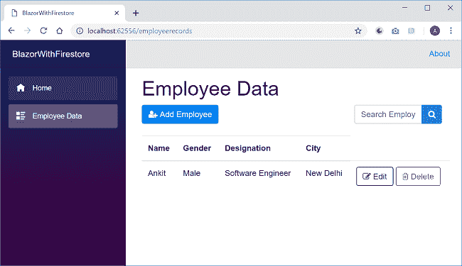

您可以在这个应用程序上执行 CRUD 操作，如本文开头的 GIF 图片所示。

### 结论

在数据库提供商 Google cloud Firestore 的帮助下，我们使用 Blazor 创建了一个单页面应用程序(SPA)。我们已经创建了一个样本员工记录管理系统，并在其上执行了 CRUD 操作。Firestore 是一个 NoSQL 数据库，它允许我们以集合和文档的形式存储数据。我们还使用了一个引导模式弹出窗口来处理用户输入。我们还实现了一个搜索框，通过员工姓名搜索员工列表。

请从 [GitHub](https://github.com/AnkitSharma-007/Blazor-CRUD-With-CloudFirestore) 获取源代码，并四处播放，以便更好地理解。

获取我的书 [Blazor 快速入门指南](https://amzn.to/2OToEji)以了解更多关于 Blazor 的信息。

准备面试？阅读我关于技术面试的 C#编码问题的文章

### 请参见

*   [Blazor Grid——Blazor 的可重用网格组件](https://ankitsharmablogs.com/blazorgrid-reusable-grid-component-for-blazor/)
*   [将 Blazor 组件发布到 Nuget Gallery](https://ankitsharmablogs.com/publishing-blazor-component-to-nuget-gallery/)
*   [在 IIS 上部署 Blazor 应用程序](https://ankitsharmablogs.com/deploying-a-blazor-application-on-iis/)
*   [在 Azure 上部署 Blazor 应用](https://ankitsharmablogs.com/deploying-a-blazor-application-on-azure/)
*   [在 Firebase 上托管 Blazor 应用](https://ankitsharmablogs.com/hosting-a-blazor-application-on-firebase/)
*   [使用 Blazor 和 MongoDB 进行 CRUD】](https://ankitsharmablogs.com/crud-using-blazor-with-mongodb/)
*   [使用服务器端 Blazor 的单页面应用](https://ankitsharmablogs.com/single-page-application-using-server-side-blazor/)

最初发表于[https://ankitsharmablogs.com/](https://ankitsharmablogs.com/)