# 如何通过 MongoDB 使用 Blazor 执行 CRUD 操作

> 原文：<https://www.freecodecamp.org/news/how-to-perform-crud-operations-using-blazor-with-mongodb-8ee216ad513e/>

### 介绍

在本文中，我们将使用 MongoDB 作为数据库提供者来创建一个 Blazor 应用程序。我们将创建一个单页面应用程序(SPA)并在其上执行 CRUD 操作。一个模态弹出窗口将显示表单来处理用户输入。该表单还有一个下拉列表，它将绑定到一个 DB 集合。

我们将使用 Visual Studio 2017 和 MongoDB 4.0。

看一看最终的应用程序。

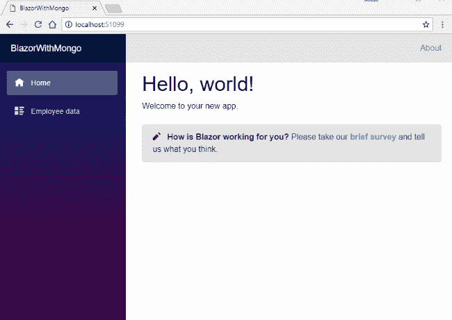

### 先决条件

*   安装。NET Core 2.1 以上 SDK 从[这里](https://www.microsoft.com/net/learn/get-started-with-dotnet-tutorial#windowscmd)
*   从此处[安装 Visual Studio 2017 v15.7 或以上版本](https://www.visualstudio.com/downloads/)
*   从[这里](https://marketplace.visualstudio.com/items?itemName=aspnet.blazor)安装 ASP.NET 核心 Blazor 语言服务扩展
*   下载并安装 MongoDB 社区版。您可以在此找到安装指南[。](https://docs.mongodb.com/manual/administration/install-community/)

v15.7 以下的 Visual Studio 2017 版本不支持 Blazor 框架。

### 源代码

从 [GitHub](https://github.com/AnkitSharma-007/Blazor-CRUD-With-MongoDB) 获取源代码。

### 配置 MongoDB

安装 MongoDB 后，我们需要将 MongoDB 二进制文件的路径添加到系统 path 变量中。Windows 机器中的默认安装路径是`C:\Program Files\MongoDB`。因此，您需要在系统路径变量中包含`C:\Program Files\MongoDB\Server\4.0\bin`。如果您没有使用 Windows，那么您可以在上面的先决条件部分提供的安装指南链接中找到配置 MongoDB 二进制文件的过程。

### 使用 MongoDB

我们需要设置数据在机器中的存储路径。以管理员身份打开命令提示符，并运行以下命令在您的计算机中设置数据存储路径。

```
mongod --dbpath C:\MongoData
```

您可以提供要存储数据的任何文件夹的路径。这个命令将在端口 27017(MongoDB 连接的默认端口)上连接到 MongoDB。请参考下图:


**重要提示:**

> *在执行 MongoDB 命令时，建议在 PowerShell 上使用命令提示符，因为所有 MongoDB 命令在 PowerShell 中都无法工作。*

打开一个新的命令提示符窗口，执行命令`mongo`启动 mongo 服务器。参考下图。

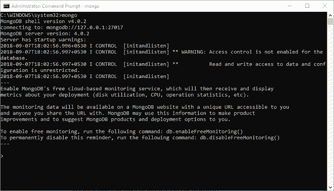

运行以下命令创建数据库:

```
use EmployeeDB
```

这将创建我们的数据库`EmployeeDB`。执行以下命令在数据库中创建一个新集合:

```
db.createCollection('EmployeeRecord')
```

这将在我们的数据库中创建一个集合`EmployeeRecord`。MongoDB 将数据存储在类似 JSON 的文档中。让我们在我们的`EmployeeRecord`集合中插入一个样本文档。运行以下命令。

```
db.EmployeeRecord.insert({'Name':'Ankit','Gender':'Male','Department':'HR','City':'Mumbai'})
```

您可以观察到，我们已经以 JSON 格式将数据作为键值对提供。运行以下命令列出 EmployeeRecord 集合中的所有文档。

```
db.EmployeeRecord.find({})
```

数据库模式将为集合中的每个文档添加 _id 属性。此属性属于 ObjectId 类型，将自动生成。我们将使用 this _id 属性惟一地标识集合中的一个文档。请参考下图:

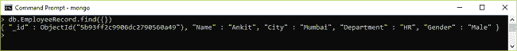

如果要从 EmployeeRecord 集合中删除所有文档，则需要运行以下命令:

```
db.EmployeeRecord.remove({})
```

我们将创建另一个集合来存储城市名称列表，该列表用于填充`EmployeeRecord`集合的城市字段。我们还将这个集合绑定到我们的 web 应用程序中的下拉列表，用户将从该列表中选择所需的城市。

运行以下命令来创建`Cities`集合。

```
db.createCollection('Cities')
```

我们将在这个集合中插入五个示例城市名称。要在`Cities`集合中批量插入文档，运行以下命令:

```
db.Cities.insertMany([   { CityName : "New Delhi" },   { CityName : "Mumbai"},   { CityName : "Hyderabad"},   { CityName : "Chennai"},   { CityName : "Bengaluru" }])
```

请参考下图:

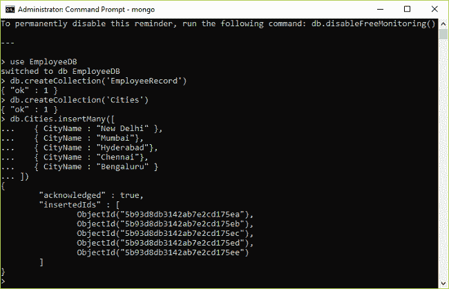

### 创建 Blazor Web 应用程序

打开 Visual Studio 并选择文件>>新建>>项目。

选择项目后，将会打开一个“新项目”对话框。选择。NET Core 里面的 Visual C#菜单从左侧面板。然后，选择“ASP。NET 核心 Web 应用程序”。将项目名称设为`BlazorWithMongo`并按 OK。

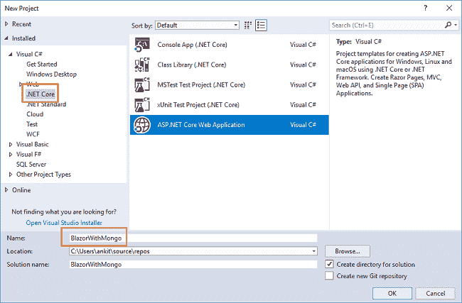

单击 OK 后，将打开一个新对话框，要求您选择项目模板。您可以在模板窗口的左上角看到两个下拉菜单。选择”。NET Core”和“ASP。NET Core 2.0”。然后，选择“Blazor (ASP。NET Core hosted)”模板，然后按确定。

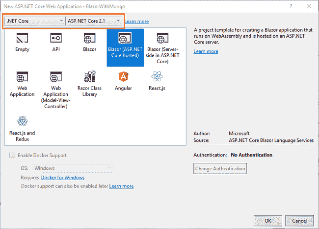

现在，我们的 Blazor 解决方案将被创建。您可以看到，我们在这个解决方案中创建了三个项目文件

1.  BlazorWithMongo。客户端—它具有客户端代码，并包含将在浏览器上呈现的页面。
2.  BlazorWithMongo。服务器—它有服务器端代码，如数据访问层和 web API。
3.  BlazorWithMongo。共享—它包含客户端和服务器都可以访问的共享代码。它包含我们的模型类和 DB context 类。

### 安装 MongoDB 驱动程序

要从我们的应用程序访问 MongoDB，我们需要使用包管理器控制台安装 MongoDB 驱动程序。我们将在 BlazorWithMongo 中安装它。共享项目，以便服务器项目也可以访问它。

导航到工具>> NuGet 包管理器> >包管理器 Cons `ole. Select BlazorWith` Mongo。从默认项目下拉列表中共享，并运行以下命令:

```
Install-Package MongoDB.Driver
```

请参考下图:

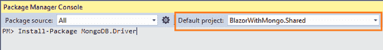

### 创建模型

我们将在`BlazorWithMongo.Shared`项目中创建我们的模型类。右键点击`BlazorWithMongo.Shared`，选择添加> >新文件夹。将文件夹命名为 Models。同样，右键单击 Models 文件夹并选择 Add > > Class 来添加一个新的类文件。将您的类的名称设为 Employee.cs，然后单击 Add。

打开 Employee.cs 类，将以下代码放入其中。

```
using System;using System.Collections.Generic;using System.Text;using MongoDB.Bson;using MongoDB.Bson.Serialization.Attributes;namespace BlazorWithMongo.Shared.Models{    public class Employee    {        [BsonId]        [BsonRepresentation(BsonType.ObjectId)]        public string Id { get; set; }        public string Name { get; set; }        public string City { get; set; }        public string Department { get; set; }        public string Gender { get; set; }    }}
```

我们在类定义中包含了 ObjectId 类型的 Id 属性，并用`[BsonId]`属性对其进行了修饰。这个属性是将模型对象映射到 MongoDB 集合所必需的。

类似地，创建另一个类文件`Cities.cs`，并将下面的代码放入其中。

```
using System;using System.Collections.Generic;using System.Text;using MongoDB.Bson;using MongoDB.Bson.Serialization.Attributes;namespace BlazorWithMongo.Shared.Models{    public class Cities    {        [BsonId]        [BsonRepresentation(BsonType.ObjectId)]        public string Id { get; set; }        public string CityName { get; set; }    }}
```

### 创建数据库上下文类

向 Models 文件夹添加一个新的类文件，并将其命名为`EmployeeDBContext.cs`。将以下代码放入其中:

```
using MongoDB.Driver;using System;using System.Collections.Generic;using System.Text;namespace BlazorWithMongo.Shared.Models{    public class EmployeeDBContext    {        private readonly IMongoDatabase _mongoDatabase;        public EmployeeDBContext()        {            var client = new MongoClient("mongodb://localhost:27017");            _mongoDatabase = client.GetDatabase("EmployeeDB");        }        public IMongoCollection<Employee> EmployeeRecord        {            get            {                return _mongoDatabase.GetCollection<Employee>("EmployeeRecord");            }        }        public IMongoCollection<Cities> CityRecord        {            get            {                return _mongoDatabase.GetCollection<Cities>("Cities");            }        }    }}
```

这里我们定义了一个`MongoClient`，它将使用 MongoDB 的默认连接字符串连接到 MongoDB 服务器实例。我们使用 GetDatabase 方法来获取数据库实例。方法`EmployeeRecord`用于从我们的数据库中获取`EmployeeRecord`集合，并将其映射到 Employee 模型类。类似地，方法`CityRecord`将从数据库中获取城市集合，并将其映射到城市模型类。

### 为应用程序创建数据访问层

右键单击`BlazorWithMongo.Server`项目，然后选择添加> >新文件夹，并将文件夹 *er 命名为数据*访问。我们将添加我们的类来处理这个文件夹中与数据库相关的操作。

右击*数据访问*文件夹，选择添加> >类。将您的`class EmployeeDataAccessLa` *命名为 ye*r . cs `Open EmployeeDataAccessLa`yer . cs，并将以下代码放入其中:

```
using BlazorWithMongo.Shared.Models;using MongoDB.Driver;using System;using System.Collections.Generic;using System.Linq;using System.Threading.Tasks;namespace BlazorWithMongo.Server.DataAccess{    public class EmployeeDataAccessLayer    {        EmployeeDBContext db = new EmployeeDBContext();        //To Get all employees details               public List<Employee> GetAllEmployees()        {            try            {                return db.EmployeeRecord.Find(_ => true).ToList();            }            catch            {                throw;            }        }        //To Add new employee record               public void AddEmployee(Employee employee)        {            try            {                db.EmployeeRecord.InsertOne(employee);            }            catch            {                throw;            }        }        //Get the details of a particular employee              public Employee GetEmployeeData(string id)        {            try            {                FilterDefinition<Employee> filterEmployeeData = Builders<Employee>.Filter.Eq("Id", id);                return db.EmployeeRecord.Find(filterEmployeeData).FirstOrDefault();            }            catch            {                throw;            }        }        //To Update the records of a particular employee              public void UpdateEmployee(Employee employee)        {            try            {                db.EmployeeRecord.ReplaceOne(filter: g => g.Id == employee.Id, replacement: employee);            }            catch            {                throw;            }        }        //To Delete the record of a particular employee              public void DeleteEmployee(string id)        {            try            {                FilterDefinition<Employee> employeeData = Builders<Employee>.Filter.Eq("Id", id);                db.EmployeeRecord.DeleteOne(employeeData);            }            catch            {                throw;            }        }        // To get the list of Cities          public List<Cities> GetCityData()        {            try            {                return db.CityRecord.Find(_ => true).ToList();            }            catch            {                throw;            }        }    }}
```

这里，我们定义了在 EmployeeDB 数据库上执行 CRUD 操作的方法。

### 向应用程序添加 web API 控制器

右击`BlazorWithMongo.Server/Controllers`文件夹，选择添加>新项目。将会打开“添加新项目”对话框。S *ele* ct Web，然后从 templates 面板选择“API Controller Class”并放入 na `me as EmployeeControl` ler.cs .点击 Add。

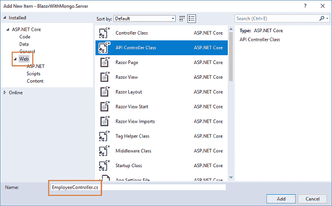

这将创建我们的 API *EmployeeController* 类。我们将调用 *EmployeeDataAccessLayer* 类的方法来获取数据并将数据传递给客户端

打开`EmployeeController.cs`文件，将以下代码放入其中:

```
using System;using System.Collections.Generic;using System.Linq;using System.Threading.Tasks;using BlazorWithMongo.Server.DataAccess;using BlazorWithMongo.Shared.Models;using Microsoft.AspNetCore.Mvc;namespace BlazorWithMongo.Server.Controllers{    public class EmployeeController : Controller    {        EmployeeDataAccessLayer objemployee = new EmployeeDataAccessLayer();        [HttpGet]        [Route("api/Employee/Index")]        public IEnumerable<Employee> Index()        {            return objemployee.GetAllEmployees();        }        [HttpPost]        [Route("api/Employee/Create")]        public void Create([FromBody] Employee employee)        {            objemployee.AddEmployee(employee);        }        [HttpGet]        [Route("api/Employee/Details/{id}")]        public Employee Details(string id)        {            return objemployee.GetEmployeeData(id);        }        [HttpPut]        [Route("api/Employee/Edit")]        public void Edit([FromBody]Employee employee)        {            objemployee.UpdateEmployee(employee);        }        [HttpDelete]        [Route("api/Employee/Delete/{id}")]        public void Delete(string id)        {            objemployee.DeleteEmployee(id);        }        [HttpGet]        [Route("api/Employee/GetCities")]        public List<Cities> GetCities()        {            return objemployee.GetCityData();        }    }}
```

我们现在已经完成了后端逻辑的编码。因此，我们现在开始编写客户端代码。

### 创建视图组件

我们将在`BlazorWithMongo.Client/Pages`文件夹中添加查看页面。默认情况下，我们在应用程序中提供了“计数器”和“获取数据”页面。这些默认页面不会影响我们的应用程序。出于本教程的考虑，我们将从该文件夹中删除 *fetchdata* 和 *counter* 页面。

右击`BlazorWithMongo.Client/Pages`文件夹，然后选择添加>新项目。将会打开“添加新项目”对话框。选择“ASP。NET Core”。然后从模板面板中选择“Razor Page”和 na `me it EmployeeData.` cshtml。单击添加。请参考下图:

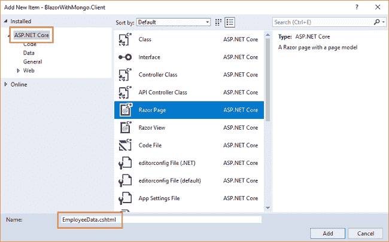

这将在我们的`BlazorSPA.Client/Pages`文件夹中添加一个`EmployeeData.cshtml`页面。这个 razor 页面将有两个文件——*employeedata . cshtml*和 *EmployeeData.cshtml.cs.*

现在，我们将向这些页面添加代码。

### EmployeeData.cshtml

打开`EmployeeData.cshtml`页面，将以下代码放入其中:

```
@page "/fetchemployee"@inherits EmployeeDataModel<h1>Employee Data</h1><h3>CRUD operation with Blazor using MongoDB</h3><br /><div>    <div style="float:left">        <button class="btn btn-primary" onclick="@AddEmp">Add Employee</button>    </div></div><br />@if (empList == null){    <p><em>Loading...</em></p>}else{    <table class='table'>        <thead>            <tr>                <th>Name</th>                <th>Gender</th>                <th>Department</th>                <th>City</th>            </tr>        </thead>        <tbody>            @foreach (var emp in empList)            {                <tr>                    <td>@emp.Name</td>                    <td>@emp.Gender</td>                    <td>@emp.Department</td>                    <td>@emp.City</td>                    <td>                        <button class="btn btn-info" onclick="@(async () => await EditEmployee(@emp.Id))">Edit</button>                        <button class="btn btn-danger" onclick="@(async () => await DeleteConfirm(@emp.Id))">Delete</button>                    </td>                </tr>            }        </tbody>    </table>    if (isAdd)    {        <div class="modal" tabindex="-1" style="display:block" role="dialog">            <div class="modal-dialog">                <div class="modal-content">                    <div class="modal-header">                        <h3 class="modal-title">@modalTitle</h3>                        <button type="button" class="close" onclick="@closeModal">                            <span aria-hidden="true">X</span>                        </button>                    </div>                    <div class="modal-body">                        <form>                            <div class="form-group">                                <label for="Name" class="control-label">Name</label>                                <input for="Name" class="form-control" bind="@emp.Name" />                            </div>                            <div class="form-group">                                <label asp-for="Gender" class="control-label">Gender</label>                                <select asp-for="Gender" class="form-control" bind="@emp.Gender">                                    <option value="">-- Select Gender --</option>                                    <option value="Male">Male</option>                                    <option value="Female">Female</option>                                </select>                            </div>                            <div class="form-group">                                <label asp-for="Department" class="control-label">Department</label>                                <input asp-for="Department" class="form-control" bind="@emp.Department" />                            </div>                            <div class="form-group">                                <label asp-for="City" class="control-label">City</label>                                <select asp-for="City" class="form-control" bind="@emp.City">                                    <option value="">-- Select City --</option>                                    @foreach (var city in cityList)                                    {                                        <option value="@city.CityName">@city.CityName</option>                                    }                                </select>                            </div>                        </form>                    </div>                    <div class="modal-footer">                        <button class="btn btn-block btn-success" onclick="@(async () => await SaveEmployee())" data-dismiss="modal">Save</button>                    </div>                </div>            </div>        </div>    }    if (isDelete)    {        <div class="modal" tabindex="-1" style="display:block" role="dialog">            <div class="modal-dialog">                <div class="modal-content">                    <div class="modal-header">                        <h3 class="modal-title">Delete Employee</h3>                    </div>                    <div class="modal-body">                        <h4>Do you want to delete this employee ??</h4>                        <table class="table">                            <tr>                                <td>Name</td>                                <td>@emp.Name</td>                            </tr>                            <tr>                                <td>Gender</td>                                <td>@emp.Gender</td>                            </tr>                            <tr>                                <td>Department</td>                                <td>@emp.Department</td>                            </tr>                            <tr>                                <td>City</td>                                <td>@emp.City</td>                            </tr>                        </table>                    </div>                    <div class="modal-footer">                        <button class="btn btn-danger" onclick="@(async () => await DeleteEmployee(emp.Id))" data-dismiss="modal">YES</button>                        <button class="btn btn-warning" onclick="@closeModal">NO</button>                    </div>                </div>            </div>        </div>    }}
```

让我们来理解这个代码。在顶部，我们将该页面的路由定义为“/fetchemployee”。这意味着，如果我们将“/fetchemployee”附加到应用程序的根 URL，我们将被重定向到此页面。

我们还继承了在`EmployeeData.cshtml.cs`文件中定义的`EmployeeDataModel`类。这将允许我们使用在`EmployeeDataModel`类中定义的方法。

在这之后，我们定义了一个按钮来添加新的雇员记录。单击时，该按钮将打开一个模态弹出窗口来处理用户输入。

从数据库返回的员工文档列表存储在变量 *empList* 中。如果变量不为空，那么我们将把值绑定到一个表中，以表格的形式显示雇员文档。表格中的每一行都有两个操作链接。*编辑*编辑员工文档。*删除*删除员工文档。

为了处理用户输入，我们使用了一个表单。我们使用一个表单来实现添加员工和编辑员工功能。该表单在模式弹出窗口中定义，并且该模式弹出窗口基于布尔属性 isAdd 的值显示在屏幕上。此布尔属性的值在代码隐藏(. cshtml.cs)页中设置。

在变量 *cityList* 的帮助下，表单中的城市下拉列表绑定到数据库中的城市集合。城市列表将在应用程序启动时填充。

该表单将有一个*保存*按钮，该按钮将调用`SaveEmployee`方法。该方法在代码隐藏文件中定义，用于添加或更新雇员文档。

类似于*添加*模态弹出，我们也有一个*删除*模态弹出。这将是一个只读模式，将要求确认删除员工文档。单击“是”，将调用`DeleteEmployee`方法删除员工文档。

### EmployeeData.cshtml.cs

打开`EmployeeData.cshtml.cs`并将以下代码放入其中:

```
using System;using System.Collections.Generic;using System.Linq;using System.Threading.Tasks;using System.Net.Http;using Microsoft.AspNetCore.Blazor;using Microsoft.AspNetCore.Blazor.Components;using BlazorWithMongo.Shared.Models;namespace BlazorWithMongo.Client.Pages{    public class EmployeeDataModel : BlazorComponent    {        [Inject]        protected HttpClient Http { get; set; }        protected List<Employee> empList;        protected List<Cities> cityList = new List<Cities>();        protected Employee emp = new Employee();        protected string modalTitle { get; set; }        protected Boolean isDelete = false;        protected Boolean isAdd = false;        protected string SearchString { get; set; }        protected override async Task OnInitAsync()        {            await GetEmployee();            await GetCities();        }        protected async Task GetEmployee()        {            empList = await Http.GetJsonAsync<List<Employee>>("api/Employee/Index");        }        protected async Task GetCities()        {            cityList = await Http.GetJsonAsync<List<Cities>>("api/Employee/GetCities");        }        protected void AddEmp()        {            emp = new Employee();            this.modalTitle = "Add Employee";            this.isAdd = true;        }        protected async Task EditEmployee(string ID)        {            emp = await Http.GetJsonAsync<Employee>("/api/Employee/Details/" + ID);            this.modalTitle = "Edit Employee";            this.isAdd = true;        }        protected async Task SaveEmployee()        {            if (emp.Id != null)            {                await Http.SendJsonAsync(HttpMethod.Put, "api/Employee/Edit", emp);            }            else            {                await Http.SendJsonAsync(HttpMethod.Post, "/api/Employee/Create", emp);            }            this.isAdd = false;            await GetEmployee();        }        protected async Task DeleteConfirm(string ID)        {            emp = await Http.GetJsonAsync<Employee>("/api/Employee/Details/" + ID);            this.isDelete = true;        }        protected async Task DeleteEmployee(string ID)        {            await Http.DeleteAsync("api/Employee/Delete/" + ID);            this.isDelete = false;            await GetEmployee();        }        protected void closeModal()        {            this.isAdd = false;            this.isDelete = false;        }    }}
```

在这个文件中，我们定义了一个类`EmployeeDataModel`，它将保存我们将在`EmployeeData.cshtml`页面中使用的所有方法。我们还注入了`HttpClient`服务来支持 web API 调用。

定义变量*Employee list*和 *cityList* 分别保存来自 Employee 表和 city 表的数据。变量被填充到 OnInitAsync 中，以确保页面加载时数据对我们可用。

点击“添加员工”按钮将调用`AddEmp`方法。它将初始化 Employee 模型的一个空实例，并将 *isAdd* 布尔标志的值设置为 true。这将打开一个带有表单的模式弹出窗口，要求用户输入新员工文档的值。类似地，我们定义了一个`EditEmployee`方法，该方法将根据调用它的 Id 获取雇员的记录。它还会将 *isAdd* 的值设置为 true，以打开模式弹出窗口来编辑员工文档。

`SaveEmployee`方法将检查它是被调用来添加新的雇员记录还是编辑现有的雇员记录。如果 Id 不为空，那么这是一个“编辑”请求，我们将向 Web API 发送一个 PUT 请求来更新现有的员工文档。

如果 Id 为空，那么它是一个“创建”请求，我们将向 Web API 发送一个 POST 请求来创建一个新的员工文档。

然后，我们将通过调用`GetEmployee`方法获取员工文档的更新列表。我们还将 *isAdd* 的值设置为 false，从而关闭了模态弹出窗口。

通过单击对应于雇员记录的 Delete 按钮来调用`DeleteConfirm`方法。它将 isDelete 布尔标志的值设置为 true，这将显示一个删除确认模式弹出窗口。在弹出窗口中单击 YES，调用`DeleteEmployee`方法。它发送一个删除 Web API 调用来删除雇员文档。它还将 *isDelete* 布尔标志设置为假，从而关闭模式弹出窗口。

### 向导航菜单添加链接

最后一步是在导航菜单中添加指向“EmployeeData”页面的链接。打开`BlazorWithMongo/Shared/NavMenu.cshtml`页面，将以下代码放入其中。

```
<div class="top-row pl-4 navbar navbar-dark">    <a class="navbar-brand" href="">BlazorWithMongo</a>    <button class="navbar-toggler" onclick=@ToggleNavMenu>        <span class="navbar-toggler-icon"></span>    </button></div><div class=@(collapseNavMenu ? "collapse" : null) onclick=@ToggleNavMenu>    <ul class="nav flex-column">        <li class="nav-item px-3">            <NavLink class="nav-link" href="" Match=NavLinkMatch.All>                <span class="oi oi-home" aria-hidden="true"></span> Home            </NavLink>        </li>        <li class="nav-item px-3">            <NavLink class="nav-link" href="fetchemployee">                <span class="oi oi-list-rich" aria-hidden="true"></span> Employee data            </NavLink>        </li>    </ul></div>@functions {bool collapseNavMenu = true;void ToggleNavMenu(){    collapseNavMenu = !collapseNavMenu;}}
```

因此，在 MongoDB 作为数据库提供者的帮助下，我们使用 Blazor 成功地创建了一个单页面应用程序(SPA)。

### 执行演示

按 F5 启动应用程序。

将打开一个网页，如下图所示。左侧的导航菜单显示了员工数据页面的导航链接。

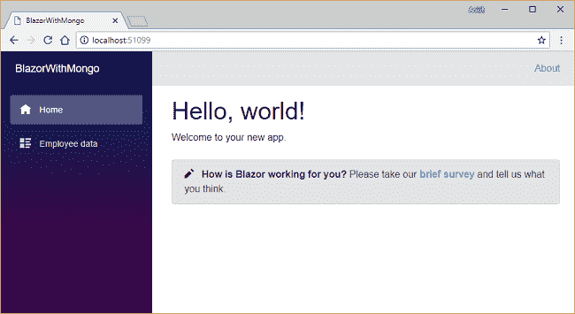

单击“员工数据”链接，将重定向到 Employee data 视图。在这里，您可以以表格的形式看到所有的员工数据。请注意，URL 后面附加了“/fetchemployee”。

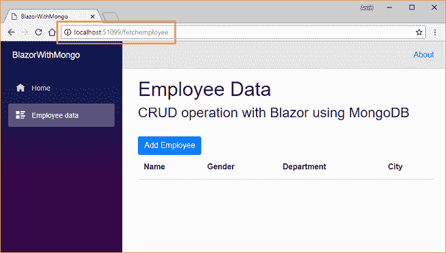

点击*添加员工*按钮，打开“添加员工”模式弹出窗口。在所有字段中输入数据，然后单击 Save 创建一个新的员工文档。

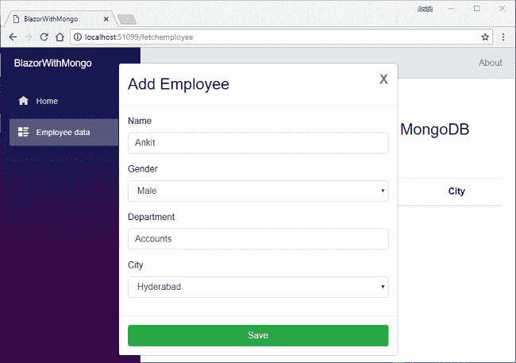

这将创建一个新的雇员文档，并在视图表中显示数据。单击表中任意行对应的编辑按钮，将再次打开模式弹出窗口，用于编辑员工记录。编辑输入字段，然后单击保存以更新员工文档。

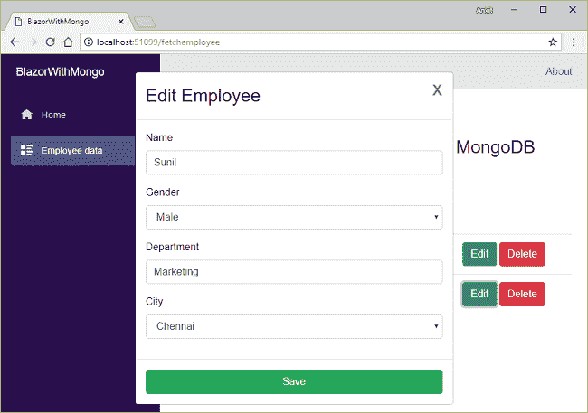

如果您单击与员工记录对应的删除按钮，它将打开一个删除确认弹出窗口，要求确认删除员工记录。

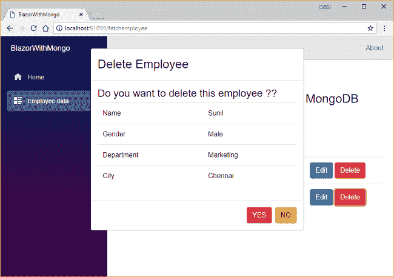

单击“是”将删除员工数据，并通过刷新视图表显示更新的员工列表。

### 结论

在 MongoDB 作为数据库提供者的帮助下，我们使用 Blazor 创建了一个单页面应用程序(SPA)。我们创建了一个样本员工记录管理系统，并在其上执行 CRUD 操作。为了处理用户输入，我们在一个模态弹出窗口中使用了一个表单。我们的演示使用了 Visual Studio 2017 和 MongoDB 4.0。

请从 [GitHub](https://github.com/AnkitSharma-007/Blazor-CRUD-With-MongoDB) 获取源代码，并四处播放，以便更好地理解。

获取我的书 [Blazor 快速入门指南](https://www.amazon.com/Blazor-Quick-Start-Guide-applications/dp/178934414X/ref=sr_1_1?ie=UTF8&qid=1542438251&sr=8-1&keywords=Blazor-Quick-Start-Guide)以了解更多关于 Blazor 的信息。

你可以在这里查看我的其他文章。

准备面试？阅读我关于[技术面试 C#编码问题](http://ankitsharmablogs.com/csharp-coding-questions-for-technical-interviews/)的文章。

### 请参见

*   [了解服务器端 Blazor](http://ankitsharmablogs.com/understanding-server-side-blazor/)
*   [使用服务器端 Blazor 的单页面应用](http://ankitsharmablogs.com/single-page-application-using-server-side-blazor/)
*   [使用 Blazor 的 Razor 页面创建 SPA](http://ankitsharmablogs.com/creating-a-spa-using-razor-pages-with-blazor/)
*   [ASP.NET 核心—使用 Blazor 的 CRUD 和实体框架核心](http://ankitsharmablogs.com/asp-net-core-crud-using-blazor-and-entity-framework-core/)
*   [在 IIS 上部署 Blazor 应用程序](http://ankitsharmablogs.com/deploying-a-blazor-application-on-iis/)
*   [Blazor 中的 JavaScript 互操作](http://ankitsharmablogs.com/javascript-interop-in-blazor/)

最初发表于[https://ankitsharmablogs.com/](https://ankitsharmablogs.com/)