# 如何使用 VS 代码和 ADO.NET 对 ASP.NET 核心执行 CRUD 操作

> 原文：<https://www.freecodecamp.org/news/how-to-perform-crud-operations-with-asp-net-core-using-vs-code-and-ado-net-b12404aef708/>

### 介绍

在这篇文章中，我们将在 Visual Studio 代码和 ADO.NET 的帮助下，使用 ASP.NET 核心 MVC 创建一个 web 应用程序。我们将创建一个样本员工记录管理系统，并在其上执行 CRUD 操作。

我们将使用 VS 代码和 SQL Server 进行演示。

### 先决条件

*   安装。NET Core 2.0.0 或以上 SDK 从[这里](https://www.microsoft.com/net/core#windowscmd)
*   从[这里](https://code.visualstudio.com/)下载并安装 Visual Studio 代码
*   SQL Server 2008 或以上版本

### 源代码

在继续之前，我建议您从 [GitHub](https://github.com/AnkitSharma-007/CRUD.With.VSCode.ADO) 下载源代码。

### 创建表和存储过程

我们将使用一个 DB 表来存储所有员工的记录。

打开 SQL Server 并使用以下脚本创建 **tblEmployee** 表。

```
Create table tblEmployee(            EmployeeId int IDENTITY(1,1) NOT NULL,            Name varchar(20) NOT NULL,            City varchar(20) NOT NULL,            Department varchar(20) NOT NULL,            Gender varchar(6) NOT NULL        )
```

现在，我们将创建存储过程来添加、删除、更新和获取雇员数据。

#### 要插入员工记录

```
Create procedure spAddEmployee         (            @Name VARCHAR(20),             @City VARCHAR(20),            @Department VARCHAR(20),            @Gender VARCHAR(6)        )        as         Begin             Insert into tblEmployee (Name,City,Department, Gender)             Values (@Name,@City,@Department, @Gender)         End
```

#### 更新员工记录

```
Create procedure spUpdateEmployee          (             @EmpId INTEGER ,           @Name VARCHAR(20),            @City VARCHAR(20),           @Department VARCHAR(20),           @Gender VARCHAR(6)        )          as          begin             Update tblEmployee              set Name=@Name,             City=@City,             Department=@Department,           Gender=@Gender             where EmployeeId=@EmpId          End
```

#### 要删除员工记录

```
Create procedure spDeleteEmployee         (             @EmpId int          )          as           begin             Delete from tblEmployee where EmployeeId=@EmpId          End
```

#### 查看所有员工记录

```
Create procedure spGetAllEmployees      as      Begin          select *          from tblEmployee       order by EmployeeId End
```

现在，我们的数据库部分已经完成。因此，我们将继续使用 Visual Studio 代码创建 MVC 应用程序。

### 创建 MVC Web 应用程序

我们将在 Visual Studio 代码中从终端窗口创建一个源项目。打开 VS 代码并导航至视图>>集成终端。

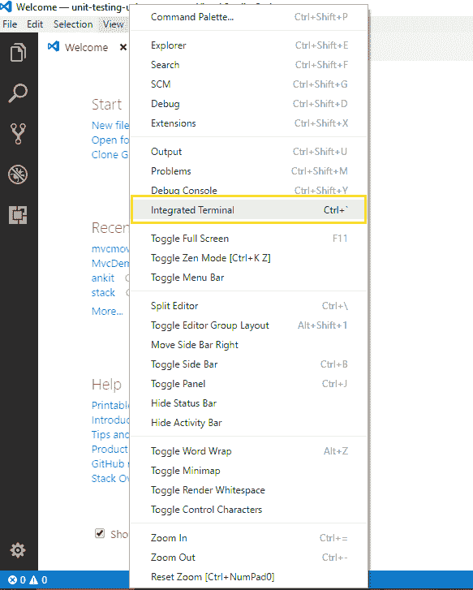

这将打开终端窗口，如下图所示。

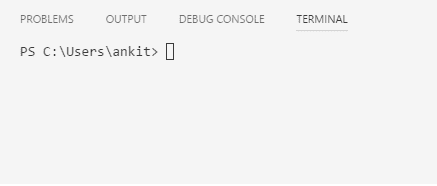

在终端窗口中键入以下命令序列。它将创建我们的 MVC 应用程序“MvcAdoDemo”。

*   mkdir mvcaadobeo
*   cd mvcaadobeo
*   dotnet 新 mvc

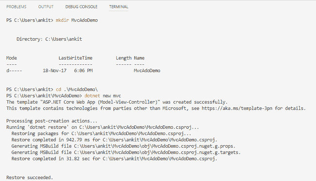

现在使用 VS 代码打开这个“MvcAdoDemo”项目文件。如果它提示消息“MvcAdoDemo 中缺少构建和调试所需的资产。加他们？”，选择“是”。

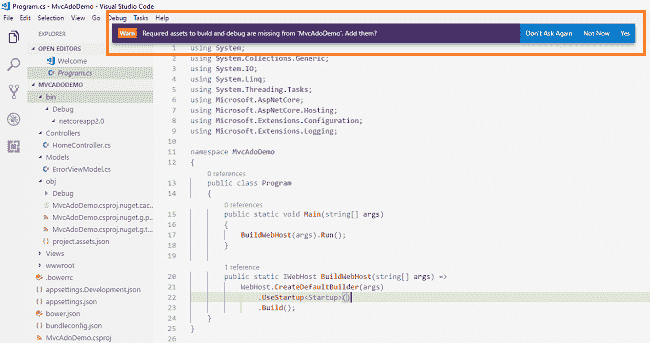

您可以在解决方案资源管理器中观察到，我们已经创建了名为控制器、模型和视图的文件夹。我们将只在这些文件夹中添加代码文件。

### 将模型添加到应用程序中

右键单击模型文件夹并选择“新建文件”。将其命名为 **Employee.cs** *。*它将在 Models 文件夹中创建一个文件。

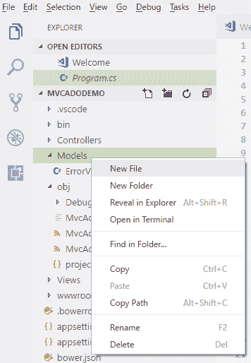

向 Models 文件夹中再添加一个文件。将其命名为**employeedataaccesslayer . cs***。这个类将包含我们数据库相关的操作。*

打开 **Employee.cs** 因为我们正在向 Employee 类的字段添加所需的验证器，所以我们需要使用 System。顶部的注释:

```
using System;    using System.Collections.Generic;    using System.ComponentModel.DataAnnotations;    using System.Linq;    using System.Threading.Tasks;        namespace MVCAdoDemo.Models    {        public class Employee        {            public int ID { get; set; }            [Required]            public string Name { get; set; }            [Required]            public string Gender { get; set; }            [Required]            public string Department { get; set; }            [Required]            public string City { get; set; }        }    }
```

打开**employeedataaccesslayer . cs***，放入以下代码处理数据库操作。确保输入您自己的连接字符串。*

```
*`using System;    using System.Collections.Generic;    using System.Data;    using System.Data.SqlClient;    using System.Linq;    using System.Threading.Tasks;        namespace MVCAdoDemo.Models    {        public class EmployeeDataAccessLayer        {            string connectionString = "Your Connection String here";                //To View all employees details              public IEnumerable<Employee> GetAllEmployees()            {                List<Employee> lstemployee = new List<Employee>();                    using (SqlConnection con = new SqlConnection(connectionString))                {                    SqlCommand cmd = new SqlCommand("spGetAllEmployees", con);                    cmd.CommandType = CommandType.StoredProcedure;                        con.Open();                    SqlDataReader rdr = cmd.ExecuteReader();                        while (rdr.Read())                    {                        Employee employee = new Employee();                            employee.ID = Convert.ToInt32(rdr["EmployeeID"]);                        employee.Name = rdr["Name"].ToString();                        employee.Gender = rdr["Gender"].ToString();                        employee.Department = rdr["Department"].ToString();                        employee.City = rdr["City"].ToString();                            lstemployee.Add(employee);                    }                    con.Close();                }                return lstemployee;            }                //To Add new employee record              public void AddEmployee(Employee employee)            {                using (SqlConnection con = new SqlConnection(connectionString))                {                    SqlCommand cmd = new SqlCommand("spAddEmployee", con);                    cmd.CommandType = CommandType.StoredProcedure;                        cmd.Parameters.AddWithValue("@Name", employee.Name);                    cmd.Parameters.AddWithValue("@Gender", employee.Gender);                    cmd.Parameters.AddWithValue("@Department", employee.Department);                    cmd.Parameters.AddWithValue("@City", employee.City);                        con.Open();                    cmd.ExecuteNonQuery();                    con.Close();                }            }                //To Update the records of a particluar employee            public void UpdateEmployee(Employee employee)            {                using (SqlConnection con = new SqlConnection(connectionString))                {                    SqlCommand cmd = new SqlCommand("spUpdateEmployee", con);                    cmd.CommandType = CommandType.StoredProcedure;                        cmd.Parameters.AddWithValue("@EmpId", employee.ID);                    cmd.Parameters.AddWithValue("@Name", employee.Name);                    cmd.Parameters.AddWithValue("@Gender", employee.Gender);                    cmd.Parameters.AddWithValue("@Department", employee.Department);                    cmd.Parameters.AddWithValue("@City", employee.City);                        con.Open();                    cmd.ExecuteNonQuery();                    con.Close();                }            }                //Get the details of a particular employee            public Employee GetEmployeeData(int? id)            {                Employee employee = new Employee();                    using (SqlConnection con = new SqlConnection(connectionString))                {                    string sqlQuery = "SELECT * FROM tblEmployee WHERE EmployeeID= " + id;                    SqlCommand cmd = new SqlCommand(sqlQuery, con);                        con.Open();                    SqlDataReader rdr = cmd.ExecuteReader();                        while (rdr.Read())                    {                        employee.ID = Convert.ToInt32(rdr["EmployeeID"]);                        employee.Name = rdr["Name"].ToString();                        employee.Gender = rdr["Gender"].ToString();                        employee.Department = rdr["Department"].ToString();                        employee.City = rdr["City"].ToString();                    }                }                return employee;            }                //To Delete the record on a particular employee            public void DeleteEmployee(int? id)            {                    using (SqlConnection con = new SqlConnection(connectionString))                {                    SqlCommand cmd = new SqlCommand("spDeleteEmployee", con);                    cmd.CommandType = CommandType.StoredProcedure;                        cmd.Parameters.AddWithValue("@EmpId", id);                        con.Open();                    cmd.ExecuteNonQuery();                    con.Close();                }            }        }    }`*
```

*为了在 VS 代码中使用 ADO.NET 功能，我们需要添加对**系统的 nuget 包引用。Data.SqlClient** *。*打开 **MvcAdoDemo.csproj** 文件，将以下代码放入其中。*

```
*`<PackageReference Include="System.Data.SqlClient" Version="4.4.0" />`*
```

*将此代码放在下图中突出显示的位置。*

**

### *将控制器添加到应用程序*

*右键单击控制器文件夹并选择“新建文件”。将其命名为**employee controller . cs***。*它将在控制器文件夹内创建一个新文件。*

*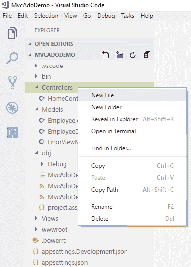*

*现在我们的**employee controller***已经创建好了。我们将把所有的业务逻辑放在这个控制器中。**

### **向应用程序添加视图**

**为了给我们的控制器类添加视图，我们需要在 **Views** 文件夹中创建一个与我们的控制器同名的文件夹，然后将我们的视图添加到该文件夹中。**

**右键点击视图文件夹，选择“新建文件夹”，将文件夹命名为**员工** *。***

**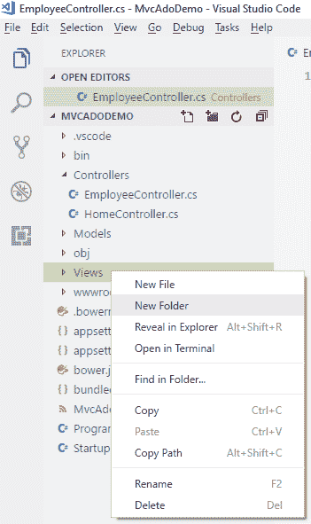**

**要添加视图文件，右键单击视图文件夹中的员工文件夹，然后选择“新建文件”。将其命名为 **Index.cshtml** *。*这将在员工文件夹*中创建一个视图文件。*因此，我们创建了第一个视图。类似地，在 Views/Employee 文件夹中再添加 4 个视图: **Create.cshtml、Delete.cshtml、Details.cshtml、**和 **andEdit.cshtml.****

**现在，我们的视图文件夹将如下所示:**

**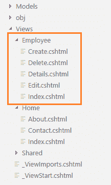**

**既然我们所有的视图都已经创建好了，我们将在视图和控制器中放一些代码来执行 CRUD 操作。**

### **索引视图**

**该视图将显示数据库中的所有员工记录。此外，我们还将提供每个记录的操作方法 Edit、Details 和 Delete。**

**打开 **Index.cshtml** ，把下面的代码放进去。**

```
**`@model IEnumerable<MVCAdoDemo.Models.Employee>           @{            ViewData["Title"] = "Index";        }    <h2>Index</h2>    <p>        <a asp-action="Create">Create New</a>    </p>    <table class="table">        <thead>            <tr>                <th>                    @Html.DisplayNameFor(model => model.Name)                </th>                <th>                    @Html.DisplayNameFor(model => model.Gender)                </th>                <th>                    @Html.DisplayNameFor(model => model.Department)                </th>                <th>                    @Html.DisplayNameFor(model => model.City)                </th>                <th></th>            </tr>        </thead>        <tbody>            @foreach (var item in Model)    {                <tr>                    <td>                        @Html.DisplayFor(modelItem => item.Name)                    </td>                    <td>                        @Html.DisplayFor(modelItem => item.Gender)                    </td>                    <td>                        @Html.DisplayFor(modelItem => item.Department)                    </td>                    <td>                        @Html.DisplayFor(modelItem => item.City)                    </td>                    <td>                        <a asp-action="Edit" asp-route-id="@item.ID">Edit</a> |                        <a asp-action="Details" asp-route-id="@item.ID">Details</a> |                        <a asp-action="Delete" asp-route-id="@item.ID">Delete</a>                    </td>                </tr>            }        </tbody>    </table>`**
```

**打开你的**employee controller . cs***文件。你会看到它是空的。将下面的代码放入其中。***

```
**`using System;  using System.Collections.Generic;  using System.Diagnostics;  using System.Linq;  using System.Threading.Tasks;  using Microsoft.AspNetCore.Mvc;  using MVCAdoDemo.Models;    namespace MVCAdoDemo.Controllers  {      public class EmployeeController : Controller      {          EmployeeDataAccessLayer objemployee = new EmployeeDataAccessLayer();            public IActionResult Index()          {              List<Employee> lstEmployee = new List<Employee>();              lstEmployee = objemployee.GetAllEmployees().ToList();                return View(lstEmployee);          }       }  }`**
```

**为了处理数据库操作，我们在**employee controller***类中创建了一个**EmployeeDataAccessLayer***类的对象。****

### ***创建视图***

***该视图将用于向数据库添加新员工数据。***

***打开 **Create.cshtml** ，放入以下代码。***

```
**`@model MVCAdoDemo.Models.Employee        @{        ViewData["Title"] = "Create";    }    <h2>Create</h2>    <h4>Employees</h4>    <hr />    <div class="row">        <div class="col-md-4">            <form asp-action="Create">                <div asp-validation-summary="ModelOnly" class="text-danger"></div>                <div class="form-group">                    <label asp-for="Name" class="control-label"></label>                    <input asp-for="Name" class="form-control" />                    <span asp-validation-for="Name" class="text-danger"></span>                </div>                <div class="form-group">                    <label asp-for="Gender" class="control-label"></label>                    <select asp-for="Gender" class="form-control">                        <option value="">-- Select Gender --</option>                        <option value="Male">Male</option>                        <option value="Female">Female</option>                    </select>                    <span asp-validation-for="Gender" class="text-danger"></span>                </div>                <div class="form-group">                    <label asp-for="Department" class="control-label"></label>                    <input asp-for="Department" class="form-control" />                    <span asp-validation-for="Department" class="text-danger"></span>                </div>                <div class="form-group">                    <label asp-for="City" class="control-label"></label>                    <input asp-for="City" class="form-control" />                    <span asp-validation-for="City" class="text-danger"></span>                </div>                <div class="form-group">                    <input type="submit" value="Create" class="btn btn-default" />                </div>            </form>        </div>    </div>    <div>        <a asp-action="Index">Back to List</a>    </div>    @section Scripts {        @{await Html.RenderPartialAsync("_ValidationScriptsPartial");}    }`**
```

**为了处理**创建**的业务逻辑，打开**employee controller . cs***，将下面的代码放入其中。***

```
***`[HttpGet]  public IActionResult Create()  {      return View();  }    [HttpPost]  [ValidateAntiForgeryToken]  public IActionResult Create([Bind] Employee employee)  {      if (ModelState.IsValid)      {          objemployee.AddEmployee(employee);          return RedirectToAction("Index");      }      return View(employee);  }`***
```

***[Bind]属性与参数“employee”一起使用，以防止过账。要了解更多关于过度发布的信息，请访问[此链接。](https://docs.microsoft.com/en-gb/aspnet/mvc/overview/getting-started/getting-started-with-ef-using-mvc/implementing-basic-crud-functionality-with-the-entity-framework-in-asp-net-mvc-application#overpost)***

### ***编辑视图***

***该视图将使我们能够编辑现有员工的数据。***

***打开 **Edit.cshtml** ，放入以下代码。***

```
**`@model MVCAdoDemo.Models.Employee        @{        ViewData["Title"] = "Edit";    }    <h2>Edit</h2>    <h4>Employees</h4>    <hr />    <div class="row">        <div class="col-md-4">            <form asp-action="Edit">                <div asp-validation-summary="ModelOnly" class="text-danger"></div>                <input type="hidden" asp-for="ID" />                <div class="form-group">                    <label asp-for="Name" class="control-label"></label>                    <input asp-for="Name" class="form-control" />                    <span asp-validation-for="Name" class="text-danger"></span>                </div>                <div class="form-group">                    <label asp-for="Gender" class="control-label"></label>                    <select asp-for="Gender" class="form-control">                        <option value="">-- Select Gender --</option>                        <option value="Male">Male</option>                        <option value="Female">Female</option>                    </select>                    <span asp-validation-for="Gender" class="text-danger"></span>                </div>                <div class="form-group">                    <label asp-for="Department" class="control-label"></label>                    <input asp-for="Department" class="form-control" />                    <span asp-validation-for="Department" class="text-danger"></span>                </div>                <div class="form-group">                    <label asp-for="City" class="control-label"></label>                    <input asp-for="City" class="form-control" />                    <span asp-validation-for="City" class="text-danger"></span>                </div>                            <div class="form-group">                    <input type="submit" value="Save" class="btn btn-default" />                </div>            </form>        </div>    </div>    <div>        <a asp-action="Index">Back to List</a>    </div>    @section Scripts {        @{await Html.RenderPartialAsync("_ValidationScriptsPartial");}    }`**
```

**为了处理**编辑**视图的业务逻辑，打开**employee controller . cs***并添加以下代码。***

```
***`[HttpGet]  public IActionResult Edit(int? id)  {      if (id == null)      {          return NotFound();      }      Employee employee = objemployee.GetEmployeeData(id);        if (employee == null)      {          return NotFound();      }      return View(employee);  }    [HttpPost]  [ValidateAntiForgeryToken]  public IActionResult Edit(int id, [Bind]Employee employee)  {      if (id != employee.ID)      {          return NotFound();      }      if (ModelState.IsValid)      {          objemployee.UpdateEmployee(employee);          return RedirectToAction("Index");      }      return View(employee);  }`***
```

***您将看到我们有两个编辑动作方法:一个用于 HttpGet，另一个用于 HttpPost。HttpGet 编辑操作方法获取雇员数据并填充编辑视图的字段。一旦用户在编辑记录后单击 Save 按钮，就会生成一个 Post 请求，由 HttpPost 编辑操作方法处理。***

### ***详细视图***

***该视图将显示特定员工的详细信息。***

***打开 **Details.cshtml** ，放入以下代码。***

```
**`@model MVCAdoDemo.Models.Employee        @{        ViewData["Title"] = "Details";    }    <h2>Details</h2>    <div>        <h4>Employees</h4>        <hr />        <dl class="dl-horizontal">            <dt>                @Html.DisplayNameFor(model => model.Name)            </dt>            <dd>                @Html.DisplayFor(model => model.Name)            </dd>            <dt>                @Html.DisplayNameFor(model => model.Gender)            </dt>            <dd>                @Html.DisplayFor(model => model.Gender)            </dd>            <dt>                @Html.DisplayNameFor(model => model.Department)            </dt>            <dd>                @Html.DisplayFor(model => model.Department)            </dd>            <dt>                @Html.DisplayNameFor(model => model.City)            </dt>            <dd>                @Html.DisplayFor(model => model.City)            </dd>        </dl>    </div>    <div>        <a asp-action="Edit" asp-route-id="@Model.ID">Edit</a> |        <a asp-action="Index">Back to List</a>    </div>`**
```

**为了处理 **Details** 视图的业务逻辑，打开**employee controller . cs***并添加以下代码。***

```
***`[HttpGet]  public IActionResult Details(int? id)  {      if (id == null)      {          return NotFound();      }      Employee employee = objemployee.GetEmployeeData(id);        if (employee == null)      {          return NotFound();      }      return View(employee);  }`***
```

### ***删除视图***

***该视图将帮助我们删除员工数据。***

***打开 **Delete.cshtml** ，将以下代码放入其中。***

```
**`@model MVCAdoDemo.Models.Employee        @{        ViewData["Title"] = "Delete";    }    <h2>Delete</h2>    <h3>Are you sure you want to delete this?</h3>    <div>        <h4>Employees</h4>        <hr />        <dl class="dl-horizontal">            <dt>                @Html.DisplayNameFor(model => model.Name)            </dt>            <dd>                @Html.DisplayFor(model => model.Name)            </dd>            <dt>                @Html.DisplayNameFor(model => model.Gender)            </dt>            <dd>                @Html.DisplayFor(model => model.Gender)            </dd>            <dt>                @Html.DisplayNameFor(model => model.Department)            </dt>            <dd>                @Html.DisplayFor(model => model.Department)            </dd>            <dt>                @Html.DisplayNameFor(model => model.City)            </dt>            <dd>                @Html.DisplayFor(model => model.City)            </dd>        </dl>            <form asp-action="Delete">            <input type="hidden" asp-for="ID" />            <input type="submit" value="Delete" class="btn btn-default" /> |            <a asp-action="Index">Back to List</a>        </form>    </div>`**
```

**为了处理**删除**视图的业务逻辑，打开**employee controller . cs***并添加以下代码。***

```
***`[HttpGet]  public IActionResult Delete(int? id)  {      if (id == null)      {          return NotFound();      }      Employee employee = objemployee.GetEmployeeData(id);        if (employee == null)      {          return NotFound();      }      return View(employee);  }    [HttpPost, ActionName("Delete")]  [ValidateAntiForgeryToken]  public IActionResult DeleteConfirmed(int? id)  {      objemployee.DeleteEmployee(id);      return RedirectToAction("Index");  }`***
```

***为了完成删除操作，我们需要两个接受相同参数(雇员 Id)的删除方法。但是具有相同名称和方法签名的两个方法会产生编译时错误。如果我们重命名删除方法，那么路由将找不到它，因为 ASP.NET 通过名称将 URL 段映射到操作方法。***

***因此，为了解决这个问题，我们向 DeleteConfirmed 方法添加了 ActionName("Delete ")属性。此属性为路由系统执行映射，以便包含 POST 请求的/Delete/的 URL 将找到 DeleteConfirmed 方法。***

***当我们单击索引页面上的 Delete 链接时，它将发送一个 Get 请求，并使用 HttpGet Delete 方法返回一个雇员视图。当我们单击这个视图上的 Delete 按钮时，它将发送一个 Post 请求来删除记录，这个请求由 HttpPost DeleteConfirmed 方法处理。***

***执行删除操作来响应 Get 请求(或者，就此而言，执行编辑操作、创建操作或任何其他更改数据的操作)会打开一个安全漏洞。因此，我们有两种不同的方法。***

### ***配置路由 URL***

***在启动应用程序之前，我们将配置路由 URL。打开 **Startup.cs** 文件，设置路由格式。向下滚动到**应用程序。使用 Mvc** 方法，在这里可以设置路由 URL。***

***确保您的路由 URL 设置如下:***

```
***`app.UseMvc(routes =>   {       routes.MapRoute(           name: "default",           template: "{controller=Home}/{action=Index}/{id?}");   });`***
```

***这个 URL 模式将 HomeController 设置为默认控制器，将 Index 方法设置为默认操作方法(而 Id 参数是可选的)。默认和可选路由参数不需要出现在匹配的 URL 路径中。***

***如果我们在 URL 中不追加任何控制器名称，那么它会把 HomeController 作为默认控制器，把 HomeController 的 Index 方法作为默认的 action 方法。类似地，如果我们只在 URL 中附加控制器名称，它将导航到该控制器的索引操作方法。***

### ***执行演示***

***现在，按 F5 启动应用程序，并通过将**/雇员** 附加到 URL 来导航到雇员控制器。***

**您可以看到如下所示的页面。**

**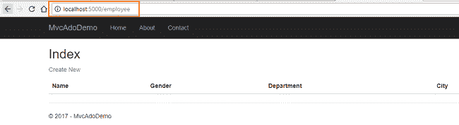**

**点击**创建新的**导航到**创建** 视图。如下图所示，添加新的员工记录。**

**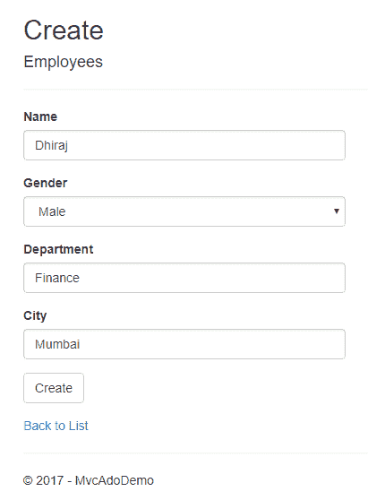**

**如果我们在创建员工记录时遗漏了任何字段中的数据，我们将收到一条必填字段验证错误消息。**

**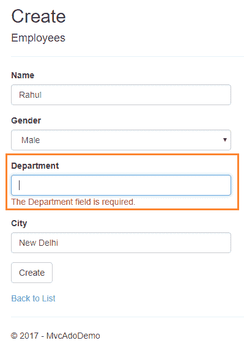**

**在所有字段中插入数据后，单击“创建”按钮。新的雇员记录将被创建，您将被重定向到索引视图，该视图显示所有雇员的记录。在这里，我们还可以看到操作方法 Edit、Details 和 Delete。**

**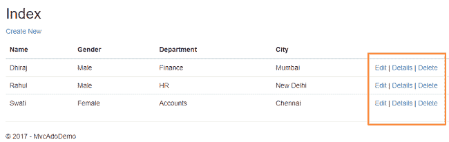**

**如果我们想要编辑现有的员工记录，则单击“编辑操作”链接。它将打开如下所示的编辑视图，我们可以在其中更改员工的数据。**

**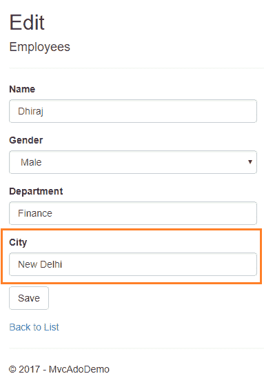**

**在这里，我们将雇员 Dhiraj 的城市从孟买改为新德里。单击“保存”返回到索引视图，以查看下图中突出显示的更新后的更改。**

**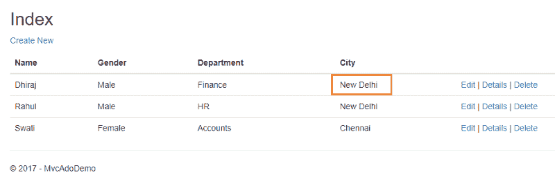**

**如果我们在编辑员工记录时遗漏了任何字段，那么编辑视图也会抛出必填字段验证错误消息。**

**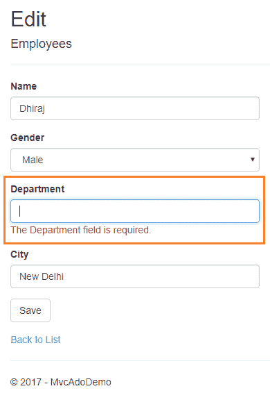**

**如果您想要查看任何员工的详细信息，请单击详细信息操作链接，这将打开详细信息视图，如下图所示。**

**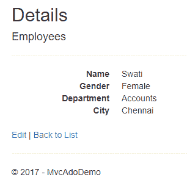**

**单击“返回列表”返回到索引视图。现在，我们将对名为 Rahul 的雇员执行删除操作。单击删除操作链接，这将打开删除视图，要求确认删除。**

****

**一旦我们单击 Delete 按钮，它将发送一个 HttpPost 请求来删除雇员的记录，我们将被重定向到索引视图。在这里，我们可以看到名为 Rahul 的雇员已经从我们的记录中删除。**

**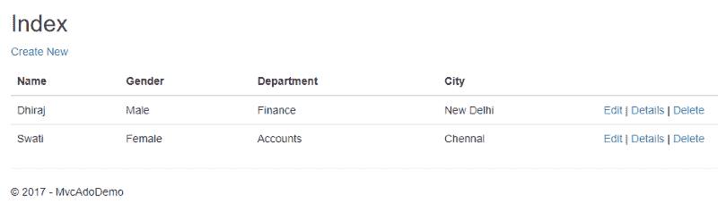**

### **结论**

**我们已经了解了如何在 Visual Studio 代码的帮助下，使用 ASP.Net 核心 2.0、about 和 SQL server 创建一个示例 MVC web 应用程序。**

**从 [GitHub](https://github.com/AnkitSharma-007/CRUD.With.VSCode.ADO) 下载源代码，玩一玩可以更好的理解。**

**你可以看看我在 ASP 上的其他文章。网芯[这里](http://ankitsharmablogs.com/category/asp-net-core/)**

**准备面试？阅读我关于[技术面试 C#编码问题](http://ankitsharmablogs.com/csharp-coding-questions-for-technical-interviews/)的文章。**

### **请参见**

*   **[使用 ADO.NET 和 Visual Studio 2017 的 ASP.NET 核心 MVC 的 CRUD 操作](http://ankitsharmablogs.com/crud-operation-with-asp-net-core-mvc-using-ado-net/)**
*   **[使用 Visual Studio 代码和 EF 的 ASP.NET 核心 MVC 的 CRUD 操作](http://ankitsharmablogs.com/crud-operation-asp-net-core-mvc-using-visual-studio-code-ef/)**
*   **[ASP.NET 核心—带有 React.js 的 CRUD 和实体框架核心](http://ankitsharmablogs.com/asp-net-core-crud-with-react-js-and-entity-framework-core/)**
*   **[使用角度 5°和 ADO.NET 的 ASP.NET 堆芯的积垢操作](http://ankitsharmablogs.com/crud-operations-asp-net-core-using-angular-5-ado-net/)**
*   **[ASP.NET 核心 Blazor 入门](http://ankitsharmablogs.com/asp-net-core-getting-started-with-blazor/)**
*   **[使用 ASP.NET 核心 2.0 进行 Cookie 认证](http://ankitsharmablogs.com/cookie-authentication-with-asp-net-core-2-0/)**

**最初发表于**