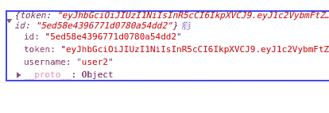
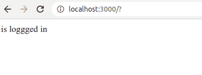

# 如何在 React 中持久化登录的用户

> 原文：<https://www.freecodecamp.org/news/how-to-persist-a-logged-in-user-in-react/>

如果您运行一个快速的 Google 搜索，在 React 中持久化一个登录的用户(或者在 React 中保持一个用户登录)，您不会得到很多直接的结果。关于如何实现这一点，没有什么简单的例子。所以我决定我必须写这个简单的指南。

你可能已经对此进行了搜索，并看到了单词 **localStorage** 被到处乱扔。是的，我们将使用**本地存储**，但我将向您展示它是如何做到的。

## 关于本地存储的一些注意事项。

1.  **localStorage** 是浏览器的数据库。数据存储在你的浏览器中，在你的电脑内存中。
2.  **localStorage** 特定于一个原点。换句话说，一个网站的本地存储不能被另一个网站访问。

## 初始设置

让我们开始吧。我已经在 Heroku 上部署了一个简单的 express 服务器，用于测试这个应用程序。

1.  创建一个新的 React 应用程序并进入 **`<App />`** 组件。
2.  使用`npm install axios`安装 axios 并导入到 **`<App />`** 中
3.  接下来，创建一个接受用户名和密码的简单登录表单。

```
import React, { useState } from "react";
import axios from "axios";

const App = () => {
  const [username, setUsername] = useState("");
  const [password, setPassword] = useState("");
  const [user, setUser] = useState()

  const handleSubmit = async e => {

  };

// if there's a user show the message below
  if (user) {
    return <div>{user.name} is loggged in</div>;
  }

  // if there's no user, show the login form
  return (
    <form onSubmit={handleSubmit}>
      <label htmlFor="username">Username: </label>
      <input
        type="text"
        value={username}
        placeholder="enter a username"
        onChange={({ target }) => setUsername(target.value)}
      />
      <div>
        <label htmlFor="password">password: </label>
        <input
          type="password"
          value={password}
          placeholder="enter a password"
          onChange={({ target }) => setPassword(target.value)}
        />
      </div>
      <button type="submit">Login</button>
    </form>
  );
};

export default App; 
```

如您所见，我们定义了一个异步的 **handleSubmit** 函数来处理登录请求。我们还定义了一个条件来显示一个**用户。如果我们有用户的话，用户名会记录在**消息中，如果我们没有用户的话，则记录在登录表单中。

接下来，我们来完成函数。该功能将按以下步骤工作:

1.  将登录详细信息发送到服务器。
2.  如果请求成功(async-await)，则将用户信息存储在 localStorage 中，并设置用户的状态。

## 处理登录事件

让我们定义 **handleSubmit** 事件处理程序。

```
const handleSubmit = async e => {
  e.preventDefault();
  const user = { username, password };
  // send the username and password to the server
  const response = await axios.post(
    "http://blogservice.herokuapp.com/api/login",
    user
  );
  // set the state of the user
  setUser(response.data)
  // store the user in localStorage
  localStorage.setItem('user', response.data)
  console.log(response.data)
}; 
```

注意:使用一个 **tryCatch** 块来处理异步函数中的错误。

现在我们的功能已经完成，您可以运行 **npm start** 来测试您的应用程序。使用**用户名** : user2、**密码** : password 登录。

您应该会收到以下响应。*用户名*、*令牌*和*用户名*



## 检查用户以前是否登录过

接下来，我们需要一种方法来检查每次加载应用程序时是否有用户登录。为此，我们使用了 useEffect 钩子。

```
 useEffect(() => {
    const loggedInUser = localStorage.getItem("user");
    if (loggedInUser) {
      const foundUser = JSON.parse(loggedInUser);
      setUser(foundUser);
    }
  }, []); 
```

记住在你的 useEffect 钩子中使用一个空的依赖数组，以便它在应用程序第一次加载时检查是否有登录的用户。

现在我们的应用程序应该可以完美地工作了。在用户第一次登录并存储了他们的详细信息后，我们会看到下面的页面。如果您刷新页面，您将看到我们的用户保持登录状态，并且登录页面继续显示。



作为奖励提示，下面介绍如何实现注销。

## 实现注销功能

对于注销，我们只需清空用户状态，并从 localStorage 中删除用户。

让我们实现这一点。

首先，我们创建一个注销按钮

```
<button onClick={handleLogout}>logout</button> 
```

然后，我们创建注销函数。

```
const handleLogout = () => {
    setUser({});
    setUsername("");
    setPassword("");
    localStorage.clear();
  }; 
```

就这样，我们结束了。

这里是 GitHub 上完整的[要点](https://gist.github.com/onedebos/bbf7cd4634bce53103c1cfefa6164637)的链接。您可以关注我，了解更多更新。