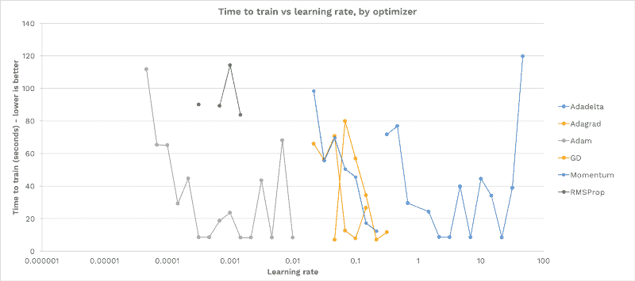
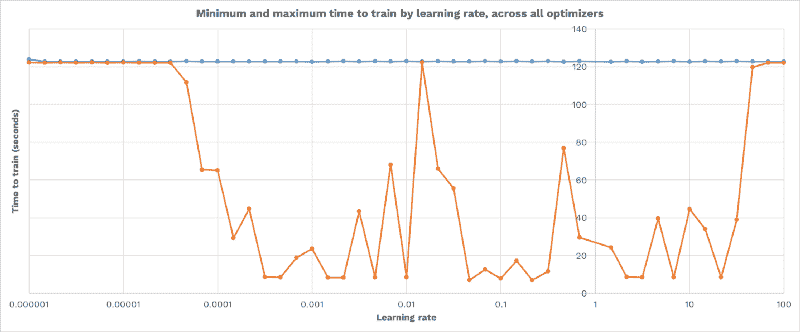
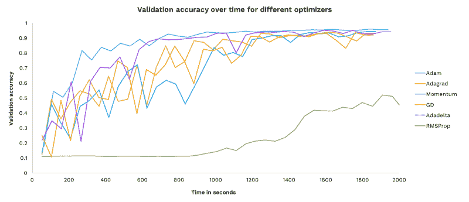
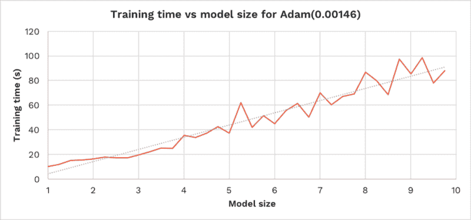
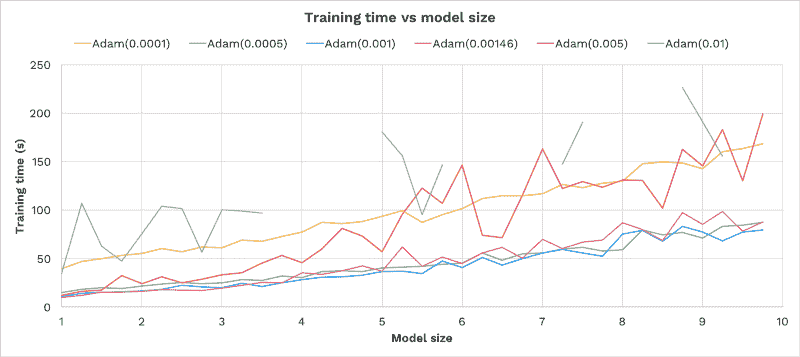

# 如何为你的机器学习项目选择最佳的学习速率

> 原文：<https://www.freecodecamp.org/news/how-to-pick-the-best-learning-rate-for-your-machine-learning-project-9c28865039a8/>

大卫·麦克

# 如何为你的机器学习项目选择最佳的学习速率

我们在从事深度学习项目时面临的一个常见问题是选择学习速率和优化器(超参数)。如果你像我一样，你会发现自己在猜测一个优化器和学习率，然后检查它们是否有效([而且我们并不孤单](http://blog.dlib.net/2017/12/a-global-optimization-algorithm-worth.html))。

为了更好地理解优化器和学习率选择的影响，我对同一个模型进行了 500 次训练。结果表明，正确的超参数对训练成功至关重要，但很难找到。

在本文中，我将讨论使用自动方法选择最佳超参数来解决这个问题。

#### 实验装置

我从 TensorFlow 的教程系列中训练了基本的[卷积神经网络](https://www.tensorflow.org/tutorials/layers)，它学习识别 [MNIST](https://en.wikipedia.org/wiki/MNIST_database) 数字。这是一个相当小的网络，有两个卷积层和两个密集层，总共需要训练大约 3400 个权重。每次训练使用相同的随机种子。

应该注意，下面的结果是针对一个特定的模型和数据集的。其他模型和数据集的理想超参数会有所不同。

*(如果你愿意贡献一些 GPU 时间在 CIFAR-10 上运行这个实验的更大版本，请[联系](mailto:hello@octavian.ai))。*

### 哪种学习率效果最好？

我们要探讨的第一件事是学习率如何影响模型训练。在每次运行中，从头开始训练相同的模型，仅改变优化器和学习率。

该模型使用 6 种不同的优化器进行训练:梯度下降、Adam、Adagrad、Adadelta、RMS Prop 和 Momentum。对于每个优化器，它以 48 种不同的学习率进行训练，从 0.000001 到 100，以对数间隔。

在每次运行中，训练网络，直到它达到至少 97%的训练准确度。允许的最长时间是 120 秒。实验在 Nvidia Tesla K80 上进行，由 [FloydHub](https://www.floydhub.com/davidmack/projects/learning-rates) 主持。源代码是[，可以下载](https://github.com/Octavian-ai/learning-rates)。

以下是每个学习率和优化器选项的培训时间:

Failed trainings are shown as missing points and disconnected lines

上图很有意思。我们可以看到:

*   对于每个优化器，大多数学习率都无法训练模型。
*   每个优化器都有一个谷形:太低的学习率永远不会进步，而太高的学习率会导致不稳定和永远不会收敛。在这两者之间，有一个成功训练的“恰到好处”的学习率区间。
*   没有对所有优化者都有效的学习率。
*   学习速度可以影响训练时间一个数量级。

综上所述，选择正确的学习速度至关重要。否则，您的网络要么无法训练，要么需要更长时间才能收敛。

为了说明每个优化器在最佳学习速率方面的差异，下面是针对所有优化器的每个学习速率训练的最快和最慢的模型。请注意，整个图表中的最大时间是 120 秒(例如，网络训练失败)——不存在适用于每个优化器的单一学习率:

查看上图中至少有一个优化器取得成功的学习率范围(从 0.001 到 30)。

### 哪个优化器性能最好？

现在我们已经确定了每个优化器的最佳学习率，让我们将每个优化器培训的性能与上一节中找到的最佳学习率进行比较。

这是一段时间内每个优化器的验证准确性。这让我们可以观察到每种技术的执行速度、准确性和稳定性:

(Note that this training was run much slower than the earlier experiments, with frequent pauses to evaluate, so I could capture higher resolution)

一些观察结果:

*   所有的优化器，除了 [RMSProp](http://ruder.io/optimizing-gradient-descent/index.html#rmsprop) *(见最后一点)*，都设法在合理的时间内收敛。
*   亚当学得最快。
*   Adam 比其他优化器更稳定，并且在准确性上没有任何大的下降。
*   RMSProp 使用 TensorFlow 的默认参数运行(衰变率 0.9，ε1e-10，动量 0.0)，可能这些参数不适用于此任务。这是自动超参数搜索的一个很好的用例(参见最后一节了解更多)。

在之前的实验中，亚当的成功学习率也相对较高。总的来说，对于这个模型和数据集，Adam 是我们六个优化器的最佳选择。

### 模型大小如何影响训练时间？

现在让我们看看模型的大小如何影响它的训练。

我们将通过一个线性因子来改变模型的大小。该因子将线性缩放卷积滤波器的数量和第一密集层的宽度，从而近似线性缩放模型中的权重总数。

我们将研究两个方面:

1.  对于固定的优化器和训练率，训练时间如何随着模型的增长而变化？
2.  对于一个固定的优化器，在每种规模的模型上，哪种学习速率训练得最快？

#### 随着模型的增长，训练时间如何变化？

下面显示了在模型上达到 96%的训练准确率所需的时间，模型的大小从 1 倍增加到 10 倍。我们使用了之前最成功的超参数之一:

Red line is the data, grey dotted line is a linear trend-line, for comparison

*   训练时间随着模型大小线性增长。
*   相同的学习率成功地训练了所有模型大小的网络。

*(注意:以下结果只能依赖于此处测试的数据集和模型，但可能值得在您的实验中测试。)*

这是一个不错的结果。我们对超参数的选择不会因为模型的线性缩放而失效。这可能暗示超参数搜索可以在网络的缩小版本上执行，以节省计算时间。

这也表明，随着网络变得更大，它在收敛模型时不会招致任何 O(n)工作(时间上的线性增长可以由每个权重的训练所招致的额外操作来解释)。

这个结果更加令人放心，因为它表明我们的深度学习框架(这里是 TensorFlow)可以有效地扩展。

#### 对于不同大小的模型，哪种学习率表现最好？

让我们针对多种学习速率运行相同的实验，看看训练时间如何响应模型大小:

Failed trainings are shown as missing points and disconnected lines

*   学习率 0.0005，0.001，0.00146 表现最好——这些在第一个实验中也表现最好。我们在这里看到与第一个实验中相同的“甜点”带。
*   每个学习率的训练时间随着模型大小线性增长。
*   学习率的表现不依赖于模型的大小。对于 1x 大小表现最佳的速率对于 10x 大小表现最佳。
*   在 0.001 以上，增加学习率增加了训练时间，也增加了训练时间的方差(与模型大小的线性函数相比)。
*   对于具有 *n* 权重、固定成本 c 和学习常数 *k=f(学习速率)*的模型，训练时间可以大致建模为 *c + kn* 。

总之，尺寸 1x 的最佳学习率也是尺寸 10x 的最佳学习率。

### 自动选择学习速度

正如前面的结果所显示的，对于模型训练来说，选择一个好的优化器和学习速率是至关重要的。

手动选择这些超参数既耗时又容易出错。随着模型的变化，以前选择的超参数可能不再理想。手动连续执行新的搜索是不切实际的。

有许多方法可以自动选择超参数。我将在这里概述几种不同的方法。

#### 网格搜索

[网格搜索](https://en.wikipedia.org/wiki/Hyperparameter_optimization#Grid_search)是我们在第一个实验中执行的操作——为每个超参数创建一个可能值的列表。然后，对于可能的超参数值的每个组合，训练网络并测量其表现如何。最佳超参数是那些给出最佳观察性能的参数。

网格搜索非常容易实现和理解。也很容易验证您已经搜索了参数搜索的足够宽的部分。由于这些原因，它在研究中非常受欢迎。

#### 基于人口的培训

[基于群体的训练(DeepMind)](https://deepmind.com/blog/population-based-training-neural-networks/) 是使用[遗传算法](https://en.wikipedia.org/wiki/Evolutionary_algorithm)进行超参数选择的优雅实现。

在 PBT 中，创建了一组模型。都是持续平行训练。当群体中的任何成员有足够长的时间来训练以显示改进时，其验证准确性将与群体中的其他成员进行比较。如果它的性能在最低的 20%，那么它复制并变异前 20%性能之一的超参数和变量。

以这种方式，最成功的超参数产生了它们自身的许多轻微突变的变体，并且最好的超参数可能被发现。

### 后续步骤

感谢您阅读这项关于学习率的调查。我开始这些实验是出于我自己对超参数调整的好奇和失望，我希望你和我一样喜欢这些结果和结论。

如果有你感兴趣的特定主题或扩展，[让我知道](mailto:hello@octavian.ai)。此外，如果你有兴趣捐赠一些 GPU 时间来运行这个实验的更大版本，[我很乐意谈谈](mailto:hello@octavian.ai)。

这些文章是长达一年的人工智能建筑主题探索的一部分。关注这篇文章(并给这篇文章一些掌声！)以便在下一部作品出来时获得更新。