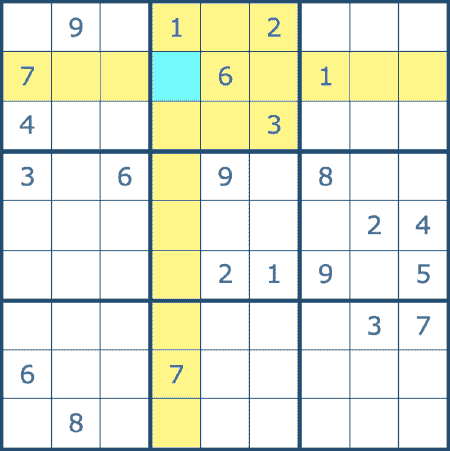
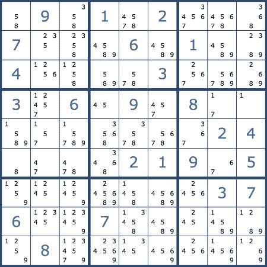
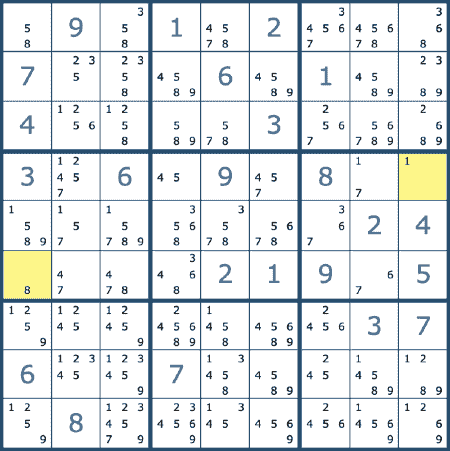
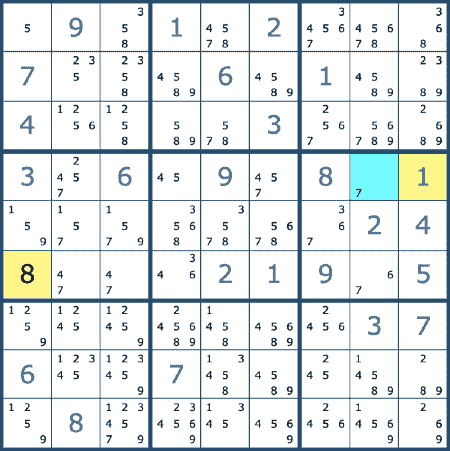
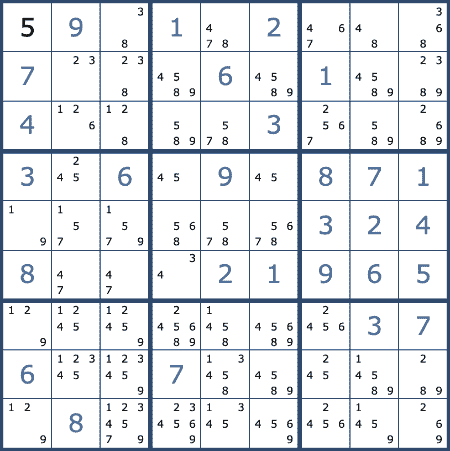
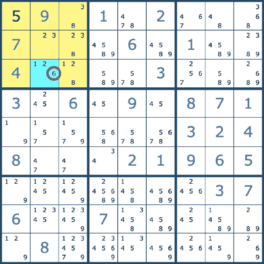
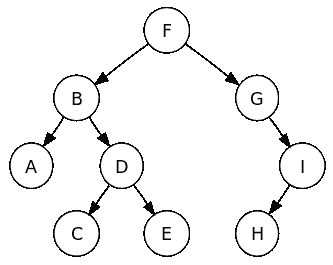
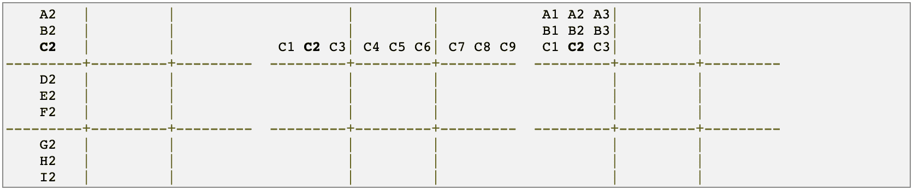
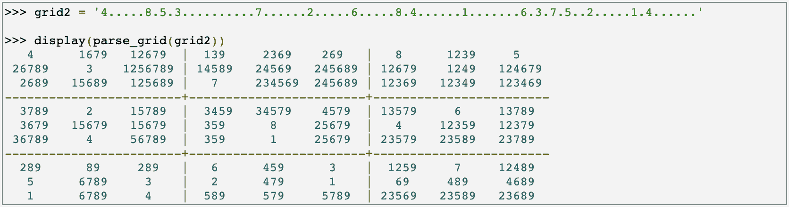

# 如何玩并赢得数独——使用数学和机器学习来解决每一个数独难题

> 原文：<https://www.freecodecamp.org/news/how-to-play-and-win-sudoku-using-math-and-machine-learning-to-solve-every-sudoku-puzzle/>

数独(及其前身)已经玩了一百多年了。当它第一次出现的时候，人们不得不用他们的大脑来解决这些难题。现在我们有电脑了！(好吧，所以大部分人还是只是用脑子...)

在这篇文章中，你将学习如何玩和赢得数独。但更重要的是，你将学会如何使用机器学习来轻松解决每一个数独难题。当你能让计算机替你思考时，谁还需要思考。？

Peter Norvig 使用 Python 开发了一个优雅的程序，通过约束传播和搜索来赢得数独。Norvig 的解决方案被认为是经典的，当人们开发自己的代码来玩数独时，经常会引用它。在复习了数独和一些策略之后，我将一步一步地分解 Norvig 的代码，这样你就可以理解它是如何工作的了。

## 数独是什么？

数独是一种数字定位游戏，有几种不同的类型。这篇文章是关于最受欢迎的类型。

目标是用数字(1-9)填充一个 9x9 的网格，这样每一列、每一行以及九个 3x3 的子网格(也称为盒子)都包含从 1 到 9 的数字。谜题从网格上已经存在的一些数字开始，由你来填写其他数字。

在数独游戏的下图中，应该放在蓝色突出显示的方块中的数字不能放在与列、行和 3x3 框相对应的任何黄色方块中。



## 数独怎么解

当解决数独难题时，你应该不断地做两件事。你应该做的第一件事是从行、列和框中消除数字(3x3 子网格)。你应该做的第二件事是寻找一个单一的候选人。

在下面的例子中，每个方块的可能数字用较小的字体标注。通过消除出现在同一列、行或框中的所有数字来确定可能的数字。大多数人会一次确定一个框的可能数量，而不是整个网格的数量。



排除数字后，您可以寻找单个候选人。这意味着找到一个只能是一个可能数字的正方形。在下面的例子中，两个黄色高亮显示的正方形必须包含 **1** 和 **8** ，因为所有其他数字已经出现在正方形的列、行或方框中，所以它们已经被删除。



现在用黄色突出显示的两个方块是已知的，这排除了其他方块的更多可能性。现在你知道用蓝色突出显示的方块一定是 7。



如果你一直寻找单个候选人，然后从其他方格中排除选项，你可能最终会到达不再有单个候选人的点。



此时，您可以寻找正方形的可能解决方案，其中数字仅在一个框、行或列中的单个正方形中。在下面的例子中，我们可以确定用蓝色突出显示的方块的解一定是 6，因为数字 6 不会出现在黄色方框中的任何其他方块中。



有时棋盘会达到一种状态，似乎每个未解的方块都可能有多个值。这意味着有多条路可以选择，哪条路能解决这个难题并不明显。

在这一点上，有必要尝试每一种选择。选择一个，继续解决，直到你选择的选项显然不是一个解决方案。然后，您将不得不返回并尝试不同的选项。

这种类型的搜索可以通过使用二叉查找树的计算机轻松完成。当有两个不同的数来解一个正方形时，有必要分成两种不同的可能性。二叉查找树将允许算法沿着一个选择分支，然后尝试不同的选择分支。



Representation of Binary Search Tree

现在，我们将看到 Python 代码可以使用与刚才描述的类似的方法来解决数独难题。

## 彼得·诺维格赢得数独的程序

Peter Norvig 解释了他解决数独的方法，以及他在文章[解决每一个数独难题](http://www.norvig.com/sudoku.html)中使用的代码。

有些人可能会觉得他的解释有点难以理解，尤其是初学者。我将把事情分解，以便更容易理解 Norvig 的代码是如何工作的。

在本文中，Norvig 的 Python 2 代码已经更新为 Python 3。(Python 3 转换由[涩谷直树](https://medium.com/activating-robotic-minds/peter-norvigs-sudoku-solver-25779bb349ce)。)我将一次看几行代码，但是您可以在本文末尾看到完整的代码。对于一些人来说，在继续阅读之前查看完整的代码可能会有所帮助。

首先，我们将介绍基本的设置和符号。下面是 Norvig 如何描述他在代码中使用的基本符号:

> 一个数独谜题是 81 个方块的 ***格子***；大多数爱好者将列 1-9，行 A-I 命名为九个方块(列、行或框)的集合称为 ***单元*** ，共享一个单元的方块称为 ***对等方*** 。

以下是这些方块的名称:

```
 A1 A2 A3| A4 A5 A6| A7 A8 A9
 B1 B2 B3| B4 B5 B6| B7 B8 B9
 C1 C2 C3| C4 C5 C6| C7 C8 C9
---------+---------+---------
 D1 D2 D3| D4 D5 D6| D7 D8 D9
 E1 E2 E3| E4 E5 E6| E7 E8 E9
 F1 F2 F3| F4 F5 F6| F7 F8 F9
---------+---------+---------
 G1 G2 G3| G4 G5 G6| G7 G8 G9
 H1 H2 H3| H4 H5 H6| H7 H8 H9
 I1 I2 I3| I4 I5 I6| I7 I8 I9
```

Norvig 将数字、行和列定义为字符串:

```
digits   = '123456789'
rows     = 'ABCDEFGHI'
cols     = digits
```

您会注意到`cols`被设置为等于`digits`。虽然它们是相同的值，但代表不同的东西。`digits`变量代表进入方块解决谜题的数字。`cols`变量代表网格的列名。

正方形也被定义为字符串，但是字符串是用一个函数创建的:

```
def cross(A, B):
    "Cross product of elements in A and elements in B."
    return [a+b for a in A for b in B]

squares  = cross(rows, cols)
```

`cross`函数的返回部分(`[a+b for a in A for b in B]`)只是编写这段代码的一种奇特方式:

```
squares = []
for a in rows:
    for b in cols:
        squares.append(a+b)
```

`squares`变量现在等于所有方块名称的列表。

```
['A1', 'A2', 'A3', 'A4', 'A5', 'A6', 'A7', 'A8', 'A9', 'B1', 'B2', 'B3', 'B4', 'B5', 'B6', 'B7', 'B8', 'B9', 'C1', 'C2', 'C3', 'C4', 'C5', 'C6', 'C7', 'C8', 'C9', 'D1', 'D2', 'D3', 'D4', 'D5', 'D6', 'D7', 'D8', 'D9', 'E1', 'E2', 'E3', 'E4', 'E5', 'E6', 'E7', 'E8', 'E9', 'F1', 'F2', 'F3', 'F4', 'F5', 'F6', 'F7', 'F8', 'F9', 'G1', 'G2', 'G3', 'G4', 'G5', 'G6', 'G7', 'G8', 'G9', 'H1', 'H2', 'H3', 'H4', 'H5', 'H6', 'H7', 'H8', 'H9', 'I1', 'I2', 'I3', 'I4', 'I5', 'I6', 'I7', 'I8', 'I9']
```

网格中的每个方块有 3 个单元和 20 个对等点。正方形的单位是它所在的行、列和框。一个正方形的对等体是单位中的所有其他正方形。例如，以下是 C2 广场的单位和对等点:



每个方块的所有单位都是使用以下代码的`cross`函数创建的:

```
unitlist = ([cross(rows, c) for c in cols] +
            [cross(r, cols) for r in rows] +
            [cross(rs, cs) for rs in ('ABC','DEF','GHI') for cs in ('123','456','789')])
```

在 Python 中，字典是键值对的集合。下面几行代码创建字典，这些字典使用正方形名称作为键，使用三个单元或 20 个对等点作为值。

```
units = dict((s, [u for u in unitlist if s in u]) 
             for s in squares)
peers = dict((s, set(sum(units[s],[]))-set([s]))
             for s in squares)
```

现在，可以使用`units['C2']`访问“C2”的 3 个单元，并将给出以下结果:

```
[['A2', 'B2', 'C2', 'D2', 'E2', 'F2', 'G2', 'H2', 'I2'], ['C1', 'C2', 'C3', 'C4', 'C5', 'C6', 'C7', 'C8', 'C9'], ['A1', 'A2', 'A3', 'B1', 'B2', 'B3', 'C1', 'C2', 'C3']]
```

接下来，我们需要完整的数独游戏网格的两个表示。名为`grid`的文本格式将是谜题的初始状态。

还需要网格的另一种表示来内部描述拼图的当前状态。它将跟踪每个方块所有剩余的可能值，并将其命名为`values`。

与`units`和`peers`类似，`values`将是一个以方块为键的字典。每个键的值将是一串数字，这些数字可能是方块的数字。如果数字是在字谜中给出的或者已经被算出，那么钥匙中就只有一个数字。例如，如果有一个网格，其中 A1 是 6，A2 是空的，`values`看起来像`{'A1': '6', 'A2': '123456789', ...}`。

## 解析网格和网格值函数

`parse_grid`函数(代码如下)将网格转换成可能值的字典。`grid`是给定的 Sukou 谜题。`grid_values`函数提取数字、`0`和`.`等重要值。在`values`字典中，方块是键，网格中给定的数字是值。

对于每个具有给定值的方块，`assign`函数用于将该值分配给方块，并从对等点中消除该值。`assign`功能即将覆盖。如果出现任何问题，该函数将返回 False。

下面是`parse_grid`和`grid_values`函数的代码。

```
def parse_grid(grid):
    """Convert grid to a dict of possible values, {square: digits}, or
    return False if a contradiction is detected."""
    ## To start, every square can be any digit; then assign values from the grid.
    values = dict((s, digits) for s in squares)
    for s,d in grid_values(grid).items():
        if d in digits and not assign(values, s, d):
            return False ## (Fail if we can't assign d to square s.)
    return values

def grid_values(grid):
    "Convert grid into a dict of {square: char} with '0' or '.' for empties."
    chars = [c for c in grid if c in digits or c in '0.']
    assert len(chars) == 81
    return dict(zip(squares, chars))
```

## 约束传播

正方形的初始值将是特定的数字(1-9)或空值。我们可以对每个方块施加约束，排除不可能的值。

Norvig 使用两种策略来帮助确定正方形的正确值(对应于上述策略):

> *(1)如果一个方块只有一个可能的值，那么从方块的对等体中消除那个值。*
> *②如果一个单位对于一个值只有一个可能的位置，那么就把这个值放在那里。*

第一种策略的一个例子是，如果我们知道 A1 的值为 5，那么 5 可以从它的所有 20 个对等体中删除。

下面是第二种策略的一个例子:如果可以确定 A1 到 A8 都不包含 9 作为可能的值，那么我们可以确定 A9 的值为 9，因为 9 必须出现在单元中的某个地方。

每一次方块的更新，都会引起其所有对等方可能的更新。这个过程将继续下去，它被称为**约束传播**。

## 分配功能

在`parse_grid`函数内部调用`assign(values, s, d)`函数。它返回更新后的值。它接受三个参数:`values`、`s`和`d`。

请记住，`values`是一个将每个方块与该方块所有可能的数字值相关联的字典。`s`是我们要赋值的正方形，`d`是需要赋值给正方形的值。开始时`d`来自我们正在解决的给定难题。

它调用函数`eliminate(values, s, d)`来消除 s 中除 d 以外的所有值。

如果存在矛盾，比如两个方块被分配了相同的数字，则消除函数将返回 False。

```
def assign(values, s, d):
    """Eliminate all the other values (except d) from values[s] and propagate.
    Return values, except return False if a contradiction is detected."""
    other_values = values[s].replace(d, '')
    if all(eliminate(values, s, d2) for d2 in other_values):
        return values
    else:
        return False
```

## 消除函数

我们看到`assign`函数调用了`eliminate`函数。消除函数是这样调用的:`eliminate(values, s, d2) for d2 in other_values)`

`eliminate`函数将消除我们知道使用上述两种策略无法解决的值。第一个策略是当`s`只有一个潜在值时，从`s`的对等体中删除该值。第二种策略是，当值`d`只能到达一个位置时，从所有对等体中删除该值。

下面是完整的函数:

```
def eliminate(values, s, d):
    """Eliminate d from values[s]; propagate when values or places <= 2.
    Return values, except return False if a contradiction is detected."""
    if d not in values[s]:
        return values ## Already eliminated
    values[s] = values[s].replace(d,'')
    ## (1) If a square s is reduced to one value d2, then eliminate d2 from the peers.
    if len(values[s]) == 0:
        return False ## Contradiction: removed last value
    elif len(values[s]) == 1:
        d2 = values[s]
        if not all(eliminate(values, s2, d2) for s2 in peers[s]):
            return False
    ## (2) If a unit u is reduced to only one place for a value d, then put it there.
    for u in units[s]:
        dplaces = [s for s in u if d in values[s]]
        if len(dplaces) == 0:
            return False ## Contradiction: no place for this value
        elif len(dplaces) == 1:
        # d can only be in one place in unit; assign it there
            if not assign(values, dplaces[0], d):
                return False
    return values
```

## 显示功能

`display`函数将显示调用`parse_grid`后的结果。

```
def display(values):
    "Display these values as a 2-D grid."
    width = 1+max(len(values[s]) for s in squares)
    line = '+'.join(['-'*(width*3)]*3)
    for r in rows:
        print(''.join(values[r+c].center(width)+('|' if c in '36' else '') for c in cols))
        if r in 'CF': 
            print(line)
    print()
```

下面是一个例子，它展示了在解析一个很难的网格后，调用 display 函数后，网格会是什么样子。



你会注意到，许多方块有多个潜在值，而有些是完全解出来的。上面的网格是以上两种策略的机械应用的结果。但是正如你所看到的，仅仅这些策略还不足以完全解决这个难题。

## 搜索

有许多方法可以解决数独问题，但有些方法比其他方法更有效。Norvig 提出了一种特定类型的搜索算法。

搜索算法会做一些事情。首先，它确保没有找到解决办法或悔悟。然后，它选择一个未填充的正方形，并考虑所有仍然可能的值。最后，一次一个，它尝试给正方形赋值，并从结果位置开始搜索。

变量排序用于选择从哪个方块开始探索。诺尔维格是这样描述的:

> 我们将使用一种常见的试探法，称为最小剩余值，这意味着我们选择可能值最少的正方形(或其中之一)。为什么？考虑上面的 grid2。假设我们先选择 B3。它有 7 种可能性(1256789)，所以我们预计猜错的概率为 6/7。相反，如果我们选择 G2，它只有 2 种可能性(89)，我们预计错误概率只有 1/2。因此，我们选择可能性最小、猜对的可能性最大的方块。

数字按数字顺序排列。

这里是`search`函数，以及解析初始网格并调用`search`的`solve`函数。

```
def solve(grid): return search(parse_grid(grid))

def search(values):
    "Using depth-first search and propagation, try all possible values."
    if values is False:
        return False ## Failed earlier
    if all(len(values[s]) == 1 for s in squares): 
        return values ## Solved!
    ## Chose the unfilled square s with the fewest possibilities
    n,s = min((len(values[s]), s) for s in squares if len(values[s]) > 1)
    return some(search(assign(values.copy(), s, d)) 
        for d in values[s])
```

根据数独的规则，当每个方块只有一个值时，这个难题就解决了。递归调用`search`函数，直到解出谜题。`values`被复制是为了避免复杂。

这里有一个`some`函数，用来检查一次尝试是否成功解出谜题。

```
def some(seq):
    "Return some element of seq that is true."
    for e in seq:
        if e: return e
    return False
```

这段代码现在将解决每一个数独难题。您可以查看下面的完整代码。

## 完整的数独求解器代码

```
def cross(A, B):
    "Cross product of elements in A and elements in B."
    return [a+b for a in A for b in B]

digits   = '123456789'
rows     = 'ABCDEFGHI'
cols     = digits
squares  = cross(rows, cols)
unitlist = ([cross(rows, c) for c in cols] +
            [cross(r, cols) for r in rows] +
            [cross(rs, cs) for rs in ('ABC','DEF','GHI') for cs in ('123','456','789')])
units = dict((s, [u for u in unitlist if s in u]) 
             for s in squares)
peers = dict((s, set(sum(units[s],[]))-set([s]))
             for s in squares)

def parse_grid(grid):
    """Convert grid to a dict of possible values, {square: digits}, or
    return False if a contradiction is detected."""
    ## To start, every square can be any digit; then assign values from the grid.
    values = dict((s, digits) for s in squares)
    for s,d in grid_values(grid).items():
        if d in digits and not assign(values, s, d):
            return False ## (Fail if we can't assign d to square s.)
    return values

def grid_values(grid):
    "Convert grid into a dict of {square: char} with '0' or '.' for empties."
    chars = [c for c in grid if c in digits or c in '0.']
    assert len(chars) == 81
    return dict(zip(squares, chars))

def assign(values, s, d):
    """Eliminate all the other values (except d) from values[s] and propagate.
    Return values, except return False if a contradiction is detected."""
    other_values = values[s].replace(d, '')
    if all(eliminate(values, s, d2) for d2 in other_values):
        return values
    else:
        return False

def eliminate(values, s, d):
    """Eliminate d from values[s]; propagate when values or places <= 2.
    Return values, except return False if a contradiction is detected."""
    if d not in values[s]:
        return values ## Already eliminated
    values[s] = values[s].replace(d,'')
    ## (1) If a square s is reduced to one value d2, then eliminate d2 from the peers.
    if len(values[s]) == 0:
        return False ## Contradiction: removed last value
    elif len(values[s]) == 1:
        d2 = values[s]
        if not all(eliminate(values, s2, d2) for s2 in peers[s]):
            return False
    ## (2) If a unit u is reduced to only one place for a value d, then put it there.
    for u in units[s]:
        dplaces = [s for s in u if d in values[s]]
        if len(dplaces) == 0:
            return False ## Contradiction: no place for this value
        elif len(dplaces) == 1:
            # d can only be in one place in unit; assign it there
            if not assign(values, dplaces[0], d):
                return False
    return values

def solve(grid): return search(parse_grid(grid))

def search(values):
    "Using depth-first search and propagation, try all possible values."
    if values is False:
        return False ## Failed earlier
    if all(len(values[s]) == 1 for s in squares): 
        return values ## Solved!
    ## Chose the unfilled square s with the fewest possibilities
    n,s = min((len(values[s]), s) for s in squares if len(values[s]) > 1)
    return some(search(assign(values.copy(), s, d)) 
        for d in values[s])

def some(seq):
    "Return some element of seq that is true."
    for e in seq:
        if e: return e
    return False
```