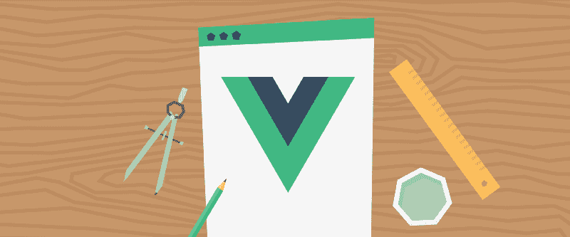
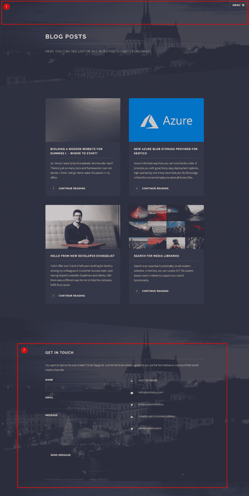
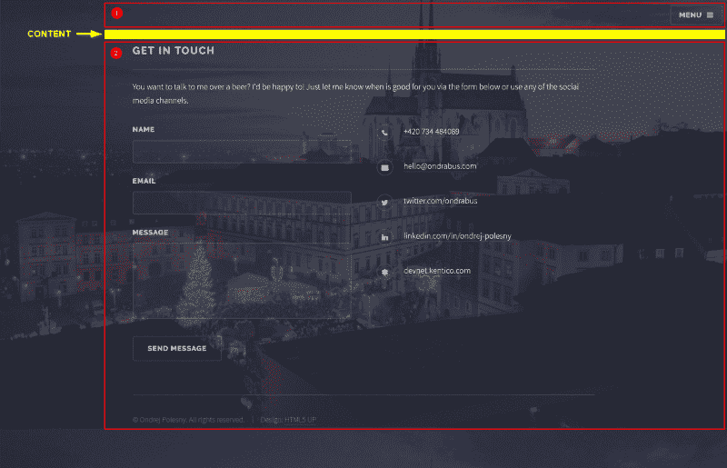
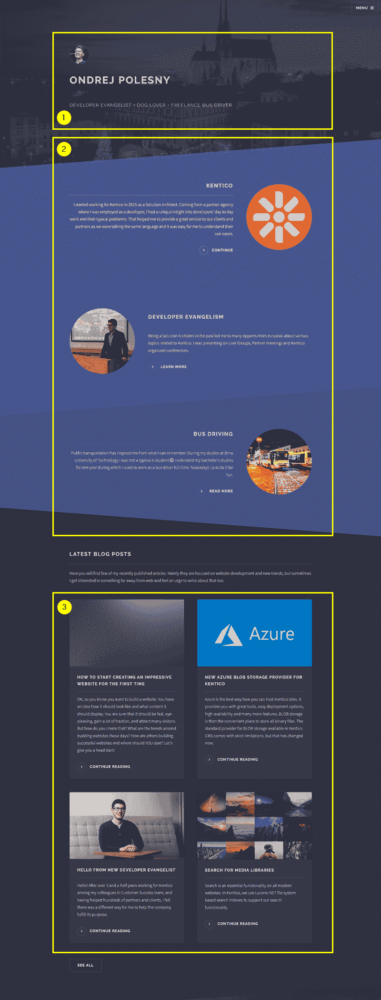

# 如何用 Vue.js 和最少的努力增强你的网站

> 原文：<https://www.freecodecamp.org/news/how-to-power-up-your-website-with-vue-js-and-minimal-effort-dc8042cc383c/>

by Ondřej Polesný

# 如何用 Vue.js 和最少的努力增强你的网站



你有一个静态网站，你知道哪个框架最适合你和你的项目。但是如何将框架集成到网站中呢？如何将设计拆分成组件？你如何处理页面之间的路由？如何定义子页面应该在哪里显示它们的具体内容？

使网站动态化是其发展过程中非常激动人心的一步。这种感觉就像当你安装了一个游戏，你第一次启动它，或者当你买了一个新手机，然后拆箱。Vue.js 帮助你很快实现这一时刻。创建组件并将它们组合在一起就像用乐高积木搭建你的网站一样。让我们开始吧，玩得开心点！

### 集成 Vue.js

为我的网站选择了正确的框架后，我可以开始将所有的部分整合在一起。那些部分是什么？

*   HTML 模板—标记
*   网站逻辑— Vue.js 及其组件
*   所有组件的内容—通过 API 提供数据的所有服务

你听说过 [JAMstack](https://jamstack.org/) 吗？这是一个基于我上面概述的这三个部分的现代 web 开发架构。他们的网站上还有一些额外的最佳实践，但我们稍后会谈到这些。

让我们从网站开发开始。首先，我们需要将 Vue.js 库添加到我们的主 HTML 模板中。如果你计划有多个页面，你还需要 Vue.js 路由器。在 Head 标签结束前添加两者。

```
...  <! — development version, includes helpful console warnings →  <script src="https://cdn.jsdelivr.net/npm/vue/dist/vue.js"></script>  <script src="https://unpkg.com/vue-router/dist/vue-router.js"></script></head>...
```

其次，我们需要挑选一个元素来包装所有的 Vue.js 功能。Vue.js 不一定需要控制你的整个网站，只是其中的一小部分。然而，在我们的例子中，我们希望 Vue.js 控制整个页面。因此，我们可以选择最顶层的元素，如果它还没有 ID，就给它分配一个 ID。

```
...<body class="is-preload">  <div id="page-wrapper">    <header id="header" class="alt">...
```

干得好！我们现在已经为 Vue.js 组件准备好了主页。

### 布置组件

当你开始把你的网站切割成更小的部分时，这个过程在某种程度上总是一样的，不管使用什么技术或框架。总有一部分页面会显示在所有页面上，比如主菜单和页脚。这些构成了您的母版页，或者在我们的例子中是母版模板。让我们来看看这些部分在我的设计中是什么样子的。



1.  标题包括主菜单
2.  包括联系人表单的页脚

这两者之间的所有内容都可以根据页面上下文互换。换句话说，突出显示的部分总是保持不变。基于 URL 改变的是中间。

首先，让我们创建两个空文件:

*   app.js
*   组件. js

将它们放入文件夹`assets/js`(如果您愿意，您可以选择任何其他文件夹)并在网站中引用它们。在 Body 标签的结尾之前添加这些资产。如果有任何其他 JavaScript 功能，请确保在任何其他可能更改 HTML 标记的文件之前包含这些文件。

```
...<script src="assets/js/components.js"></script><script src="assets/js/app.js"></script>...
```

在我的网站上有 3 个页面，所以总共我会有 3 个网址和 3 个主要组成部分在我的页面上:

*   / -主页
*   /博客-博客页面
*   /关于-关于我页面

### 主模板

主 HTML 文件将被用作整个网站的主模板。因此，我们需要删除所有页面特定的内容。我们只留下那些将在整个网站的所有页面上显示的元素。当我这样做并在浏览器中打开页面时，我会看到:



有一个带有菜单(1)的页眉，带有页脚(2)的联系表单，空的黄色位置是我的所有子页面的内容将出现的地方。还记得我们在主要的 Vue.js 框架库中包含了 Vue.js 路由器吗？路由器将为我们处理所有的导航。它将确保每个子页面都在这个主模板中呈现。我们需要告诉路由器在哪里渲染它们。在您的 HTML 代码中找到由黄色条纹标记的位置，并在那里添加以下组件:

```
...<router-view></router-view>...
```

这告诉路由器使用这个地方来呈现子页面及其组件。我们还需要调整主导航中的链接，从通常的`a`标签到路由器链接。以下是我的实现:

```
... <li><router-link to="/">Home</router-link></li> <li><router-link to="/blog">Blog</router-link></li> <li><router-link to="/about">About</router-link></li>...
```

如果您的`a`标签上有任何其他参数，您也可以将它们用于路由器链接标签。Vue.js 路由器会确保它们出现在最终的 HTML 代码中。

恭喜你，你的主模板完成了。

### 子页面

因为我的网站很小，我们的目标是实现简单，子页面将不会有他们的物理解释。但是，如果您有很多页面，并且希望使用物理文件将它们分开，这是可能的。在这种情况下，我建议使用编译器为您的实现生成一个最终的最小化 JavaScript 文件。

首先，让我们在`app.js`文件中初始化我们的 Vue.js 应用程序和 routes。路线直接来自上面的页面列表。实现应该是这样的:

```
const router = new VueRouter({ routes: [  { path: '/', component: Home },  { path: '/blog', component: Blog },  { path: '/about', component: About } ]})const app = new Vue({ el: '#page-wrapper', router})
```

我们创建路由器实例，并将所有页面和组件名称的 URL 传递给它。我们还没有这些组件，所以我只是使用相应页面的名称。我们稍后将创建具有相同名称的组件。

每个 Vue.js 应用程序都是通过创建一个 Vue 类的实例并将其连接到一个元素来实现的。在我的例子中，它是一个 id 为`page-wrapper`的 div——body 标签下的顶级元素。该实例还需要知道我们想要使用 Vue.js 路由器。这就是路由器实例被传递到主实例中的原因。

我们需要做的最后一件事是为每个页面定义组件。注意，我们需要在定义 Vue 应用程序之前创建它们，否则 Vue.js 不会知道它们。

还记得从主模板中删除的代码吗？这就是我们主页组件的内容。我们来定义一下:

```
const Home = { template: `  <div>   <section id="banner">    <div class="inner">     <div class="logo">     ...     </div>     <h2>Ondrej Polesny</h2>     <p>Developer Evangelist + dog lover + freelance bus driver</p>    </div>   </section>   <section id="wrapper">    <div>     <section id="one" class="wrapper spotlight style1">      <div class="inner">       <router-link to="/about" class="image"></router-link>       <div class="content">        <h2 class="major">Kentico</h2>        <p>...</p>        <router-link to="/about" class="special">Continue</router-link>       </div>      </div>     </section>     <section id="two" class="wrapper alt spotlight style2">     ...     </section>     <section id="three" class="wrapper spotlight style3">     ...     </section>     <section id="four" class="wrapper alt style1">     ...     </section>     <div class="inner">      <div>       <h2 class="major">Latest blog posts</h2>       <p>...</p>       ... <!-- list of blogs -->      </div>     </div>     <ul class="actions">      <li><a href="/blog" class="button">See all</a></li>     </ul>    </div>   </section>  </div>`}
```

你可以看到它有很多 HTML 标记，这使得我们的`app.js`文件变得很大，不可读。而且，有些内容还会显示在其他页面上。例如关于我的博客文章或文本列表。

### 成分

这就是组件混合的地方。组件表示可以分离出来的可重用内容。它们也可以包含功能。例如，从外部服务收集内容或根据用户操作重写内容。他们也可以进行一些计算。让我们来看看我是如何优化主页以使用组件的:

```
const Home = { template: `  <div>   <banner></banner>   <section id="wrapper">    <about-overview></about-overview>    <section id="four" class="wrapper alt style1">     <div class="inner">      <div>       <h2 class="major">Latest blog posts</h2>       <p>...</p>       <blog-list limit="4"></blog-list>       <ul class="actions">        <li><a href="/blog" class="button">See all</a></li>       </ul>      </div>     </div>    </section>   </section>  </div>`}
```

正确识别组件非常重要。它们需要是独立的，涵盖特定的功能或标记。看看我是如何把它们分开的:



我确定了 3 个组成部分:

*   横幅(1)
*   关于概述(2)
*   博客列表(3)

请注意，一些控件位于标记相应组件的黄色区域之外。例如，看看博客列表组件。您会看到按钮“查看全部”，介绍该部分的段落及其标题，都从组件中排除了。原因是博客列表组件也会用在博客页面上。这些文本会有所不同，并且“查看全部”按钮根本不会显示。因此，组件应该只包含可重用的内容和标记。

我将这些组件的定义添加到了`components.js`文件中。它们可以独立使用，所以如果你想进一步分离它们，你可以。

横幅是这些组件中最简单的。它不包含任何功能，只有 HTML 标记。看看下面是什么样子:

```
Vue.component('banner', { template: `  <section id="banner">   <div class="inner">    <div class="logo">     <span class="icon">           </span>    </div>    <h2>Ondrej Polesny</h2>    <p>Developer Evangelist + dog lover + freelance bus driver</p>   </div>  </section>` })
```

每个组件需要有一个唯一的名称(横幅)和一个模板，这只是 HTML 标记。通常组件还包含数据和其他功能，它们需要这些功能。看看博客列表组件:

```
Vue.component('blog-list', { props: ['limit'], data: function(){  return {   articles: [    {     url: 'https://medium.com',     header: 'How to start creating an impressive website for the first time',     image: 'https://cdn-media-1.freecodecamp.org/images/1*dVlw9tLq4lVaXrGG0gZc8Q@2x.png',     teaser: `OK, so you know you want to build a website. You have an idea how it should look like and what content it should display. You are sure that it should be fast, eye-pleasing, gain a lot of traction, and attract many visitors. But how do you create that? What are the trends around building websites these days? How are others building successful websites and where should YOU start? Let's give you a head start!`    },    …   ]  } }, template: `  <section class="features">   <article v-for="article in articles">    <a :href="article.url" class="image"></a>    <h3 class="major">{{article.header}}</h3>    <p>{{article.teaser}}</p>    <a :href="article.url" class="special">Continue reading</a>   </article>  </section>`})
```

在博客列表组件的范围内，我想列出最新的博客文章。我也希望能够限制主页上显示的文章数量，只显示 4 篇最新的文章。因此我引入了一个*限制*属性。当内容来自内容服务时，我将稍后使用它。使用组件时，将在标记中设置限制:`<blog-list limit="` 4" >。

在模板(标记)中有一个简单的`v-for` 循环，它遍历一组文章。任何属性前的冒号`:href`意味着它将被 Vue.js 解析为一个指定的变量，例如文章 URL。花括号`{{article.teaser}}`也有同样的效果。

文章在对象的`data`属性中定义。稍后我将向您展示如何在一个组件之外，在一个无头 CMS 中存储这些内容。这是云中的内容服务。但是不用担心，我们将使用无头 CMS [Kentico Cloud](http://bit.ly/2QzUALM) 的免费计划，不会花一分钱。

最后一个组件“关于概述”看起来非常相似。所以我们现在跳过它。让我们看看如何将组件和页面粘合在一起，并创建两个仍然缺失的页面——About 和 Blog。

### 创建其他页面

这两个页面——关于和博客——的创建方式与我们创建主页的方式相同。请注意，我们并没有真正创建组件，而是页面。因此将没有`Vue.component()`定义，而是一个具有一个属性的简单对象——模板。这些对象将进入`app.js`文件。让我们看看博客页面:

```
const Blog = { template: `  <section id="wrapper">   <header>    <div class="inner">     <h2>Blog posts</h2>     <p>Here you can see list of all blog posts that I published.</p>    </div>   </header>   <div class="wrapper">    <div class="inner">     <blog-list></blog-list>    </div>   </div>  </section>`}
```

你看，这个页面变得非常简单，因为博客列表组件可以被重用。

还记得我们之前为 Vue.js 路由器创建路由的时候吗？我们用一个描述为组件的不存在的标识符连接每条路由。

```
const router = new VueRouter({ routes: [  { path: '/', component: Home },  { path: '/blog', component: Blog },  { path: '/about', component: About } ]})
```

实际上，这些组件是页面。我们刚刚创建的简单对象，并把它们赋给了常量。请注意，这些常量的名称必须与各自路由的组件名称相匹配。例如，`/blog`路线上的一个页面需要在常量`Blog`中定义为 object。

### 收尾工作

定义完所有组件和页面后，打开主模板并查看结果。即使我们没有使用任何服务器端渲染技术，网站也是动态的。组件的路由和渲染都是由 Vue.js 完成的。

最后一个提示:如果你看到一个不完整的网站，很可能是你在 JavaScript 文件中打错了。点击`F12`(或`CTRL+SHIFT+C`)打开浏览器的控制台，切换到控制台标签。您将在那里看到错误的原因。

恭喜你！你刚刚使你的网站充满活力。在下一篇文章中，我将向您展示如何将内容从组件中分离出来，并使用 [headless CMS](http://bit.ly/2QzUALM) 创建真正的微服务架构。

#### 该系列的其他文章:

1.  [第一次如何开始创建一个令人印象深刻的网站](http://bit.ly/2Duglu1)
2.  如何为你的网站决定最好的技术？
3.  **如何用 Vue.js 和最少的努力启动你的网站**
4.  [如何将无头 CMS 与一个 Vue.js 网站混合，并且零付费](http://bit.ly/2CyDnhX)
5.  [如何在 API 网站上安全提交表单](http://bit.ly/2P0gidP)
6.  用 CMS 建立一个超级快速安全的网站没什么大不了的。或者是？
7.  [如何用 Vue.js 快速生成静态网站](http://bit.ly/2PN46Jy)
8.  [如何快速建立静态站点的构建流程](http://bit.ly/2Dv2UGS)