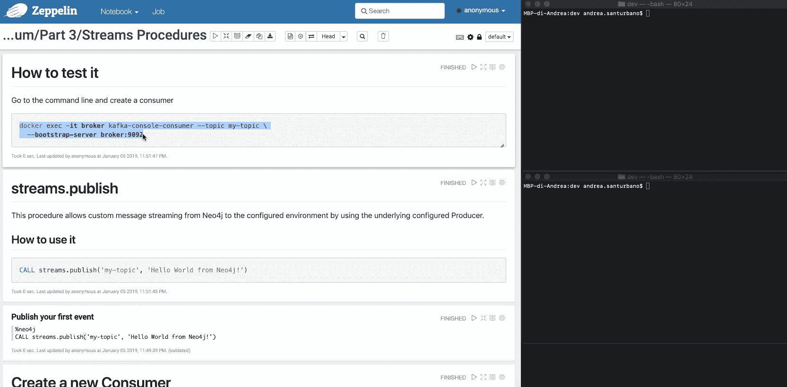
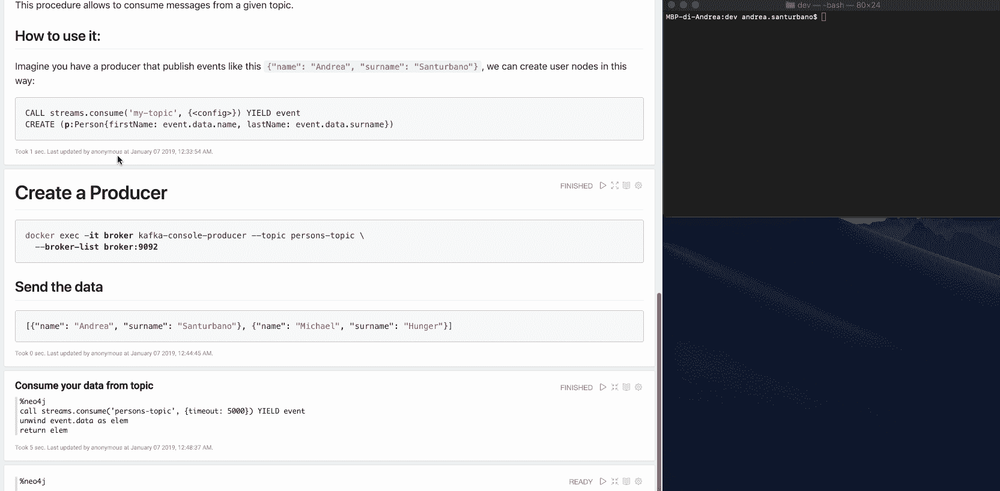

# 如何通过 Cypher with Streams 过程直接生成和使用数据流

> 原文：<https://www.freecodecamp.org/news/how-to-produce-and-consume-data-streams-directly-via-cypher-with-streams-procedures-52cbc5f543f1/>

安德烈·桑图尔班诺

# 如何通过流程序直接生成和使用 Kafka 数据流

#### 利用 Neo4j 流—第 3 部分

本文是**借力 Neo4j 流**系列的第三部分(第一部分是[这里](https://medium.freecodecamp.org/how-to-leverage-neo4j-streams-and-build-a-just-in-time-data-warehouse-64adf290f093)，第二部分是[这里](https://medium.freecodecamp.org/how-to-ingest-data-into-neo4j-from-a-kafka-stream-a34f574f5655))。在这篇文章中，我将向您展示如何通过使用 [**Neo4j streams**](https://medium.com/neo4j/a-new-neo4j-integration-with-apache-kafka-6099c14851d2) 提供的 Streams 过程，将 Neo4j 引入到您的 **Apache Kafka** 流中。

为了展示如何集成它们，简化集成，并让您手动测试整个项目，我将使用[**Apache Zeppelin**](https://towardsdatascience.com/building-a-graph-data-pipeline-with-zeppelin-spark-and-neo4j-8b6b83f4fb70)**，一个简单地允许您与 Neo4j 进行本机交互的笔记本运行程序。**

### 什么是 Neo4j 存储过程？

从 Neo4j 3.x 开始，引入了 [**自定义过程和函数**](https://neo4j.com/docs/java-reference/current/extending-neo4j/procedures/) 的概念。这些是某些功能和/或业务规则的定制实现，不能(容易地)用 Cypher 本身来表达。

Neo4j 提供了许多内置的过程。APOC 库又增加了 450 个，涵盖了从数据集成到图形重构的各种用途。

### 什么是流程序？

Neo4j Streams 项目推出了两个程序:

*   `streams.publish`:通过使用底层配置的生产者，允许自定义消息从 Neo4j 流到配置的环境
*   `streams.consume`:允许消费给定主题的消息。

### 设置环境

转到下面的 [Github repo](https://github.com/conker84/leveraging-neo4j-streams) ，你会发现复制我在这篇文章中介绍的内容所必需的一切。您需要启动的是 [**Docker**](https://docs.docker.com/) ，然后您只需进入目录并从终端执行以下命令即可启动堆栈:

```
$ docker-compose up
```

这将启动整个环境，包括:

*   Neo4j + Neo4j 流模块+ APOC 程序
*   阿帕奇卡夫卡
*   Apache Spark(这在本文中不是必需的，但在前两篇文章中使用过)
*   阿帕奇齐柏林飞艇

通过进入 Apache Zeppelin @ `http://localhost:8080`你会在目录`Medium/Part 3`中找到一本名为“**流程序**的笔记本，这也是本文的主题。

### 流.发布

该过程允许通过使用底层的已配置的生产者将定制消息从 Neo4j 流式传输到已配置的环境。

它接受两个变量作为输入，不返回任何内容(因为它将有效负载异步发送到流):

*   **主题**，*类型字符串*:数据发布的位置
*   **payload** ， *type Object* :你要流的东西。

示例:

```
CALL streams.publish('my-topic', 'Hello World from Neo4j!')
```

从消费者处检索到的消息如下:

```
{"payload": "Hello world from Neo4j!"}
```

您可以在有效载荷中发送任何类型的数据:**节点、关系、路径、列表、映射、标量值及其嵌套版本**。

对于节点和/或关系，如果主题是在变更数据捕获(CDC)配置提供的模式中定义的，则它们的属性将根据配置进行筛选。

下面是一个简单的视频，展示了实际操作过程:



The streams.publish procedure in action

### 流.消费

该过程允许消费来自给定主题的消息。

它接受两个变量作为输入:

*   **主题**，*类型字符串*:你要消费数据的地方
*   **配置**、*类型图<串、Obje* ct >:配置参数

并返回收集的事件列表。

**配置**参数为:

*   **超时**，*类型长*:传递给 Kafka `[Consumer#poll](https://kafka.apache.org/10/javadoc/org/apache/kafka/clients/consumer/KafkaConsumer.html#poll-long-)`方法的值(毫秒)。默认 1000。
*   、*类型字符串*中的**:卡夫卡配置参数`auto.offset.reset`**

使用:

```
CALL streams.consume('my-topic', {<config>}) YIELD event RETURN event
```

示例:假设您有一个发布如下事件的制作人:

```
{"name": "Andrea", "surname": "Santurbano"}
```

我们可以这样创建用户节点:

```
CALL streams.consume('my-topic', {<config>}) YIELD eventCREATE (p:Person{firstName: event.data.name, lastName: event.data.surname})
```

下面是一个简单的视频，展示了实际操作过程:



The stream.consume procedure in action

“利用 Neo4j 流”系列到此结束，希望您喜欢！

如果您已经测试过 Neo4j-Streams 模块或通过此笔记本进行过测试，请填写我们的 [**反馈调查**](https://goo.gl/forms/VLwvqwsIvdfdm9fL2) 。

如果您遇到任何问题或有改进我们工作的想法，[请提出 GitHub 问题](http://github.com/neo4j-contrib/neo4j-streams/issues)。