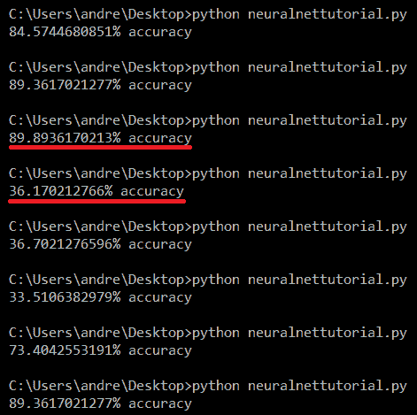
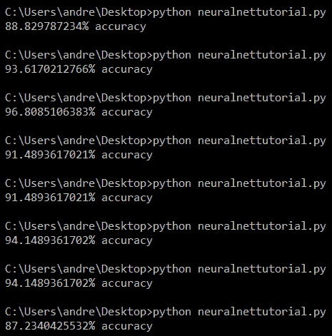

# 如何设计一个神经网络在 5 分钟内预测乳腺癌

> 原文：<https://www.freecodecamp.org/news/how-to-program-a-neural-network-to-predict-breast-cancer-in-only-5-minutes-23289d62a4c1/>

作者:李国能

# 如何设计一个神经网络在 5 分钟内预测乳腺癌

#### 就这么简单。

Stop wasting time reading this caption because this tutorial is only supposed to take 5 minutes! ⏳

#### 第一分钟—简介:

这是一个面向机器学习和人工智能新手的高级教程，假设您已经:

1.  安装了 Python 2 或 3
2.  至少有初级编码经验
3.  5 分钟

本教程将跳过神经网络的低级、数学繁重的细节，专注于在 5 分钟内获得预测乳腺癌的神经网络！

我们将使用来自`scikit-learn`库的神经网络实现，使用来自加州大学欧文分校“乳腺癌威斯康星州”数据集的数据来预测某人是否患有乳腺癌。乳房块的细胞核属性(例如纹理或面积)将被输入到神经网络中，并且随后对该块是恶性还是良性的预测将由神经网络输出。

#### 第二分钟—开始:

如果你还没有安装`scikit-learn`，在你的终端中运行`pip install scikit-learn` 。这应该处理安装`scikit-learn`和我们将需要的所有先决条件库。

打开一个 IDE 或编辑器，创建一个名为`neuralnet.py`的空白文件或您喜欢的名称。接下来，我们将导入神经网络实现、乳腺癌数据集和一个用于将我们的数据分成训练集和测试集的函数，以输入到我们的神经网络中。

下面是相关的`scikit-learn`文档，供我们参考:

1.  [乳腺癌数据集的文档(`load_breast_cancer` )](https://scikit-learn.org/stable/modules/generated/sklearn.datasets.load_breast_cancer.html)
2.  [预处理功能文档(`train_test_split` )](https://scikit-learn.org/stable/modules/generated/sklearn.model_selection.train_test_split.html)
3.  [神经网络实施文件(`MLPClassifier` )](https://scikit-learn.org/stable/modules/generated/sklearn.neural_network.MLPClassifier.html#sklearn.neural_network.MLPClassifier)

#### 第三分钟—预处理:

在我们准备对乳腺癌数据集执行机器学习之前，首先需要进行数据预处理。我们首先加载数据，然后将乳腺肿块属性(包含数值的列表列表)保存为`attributes`，并将乳腺肿块是恶性还是良性(0 和 1 的列表)保存为`labels`。每个列表的每个索引的内容对应于例如在`attributes[0]`具有属性的乳房肿块在`labels[0]`被定义为恶性或良性。

接下来，我们将数据分为训练集(用于训练神经网络)和测试集(用于测试神经网络的性能)。训练集由`attributes_train`和`labels_train`组成，测试集由`attributes_test`和`labels_test`组成。我们将数据集的三分之一分配给测试集，剩下的三分之二在训练集中。

#### 第四分钟——神经网络:

既然我们的数据已经被分成了训练集和测试集，我们就可以开始本教程的神经网络部分了！在实例化一个多层感知器神经网络之后，我们使用`fit`函数用我们的训练集训练我们的神经网络，使用`score`函数评估我们的神经网络的准确性，并打印准确性。

尝试使用`python neuralnetworktutorial.py`通过终端运行神经网络大约 10 次(每次只需一秒钟)并记录结果！

#### 第五分钟—优化结果:

Results for default MLPClassifier

很有可能，你会看到神经网络的性能有很大的变化。当我们将数据分成训练集和测试集时，使用随机种子将数据打乱，这解释了我们结果中的波动；由于我们的数据集中只有 569 个条目，神经网络并不总是用代表整个数据集的训练集(379 个条目)来训练，从而导致过度拟合。

此外，当我们在代码中用`neuralnet = MLPClassifier()`实例化一个新的神经网络时，我们将构造函数留空，这意味着神经网络是用由`scikit-learn`定义的默认参数构造的，这导致了一个非优化的神经网络。

我们可以通过在更大的数据集上进行训练和测试来解决这个问题，或者通过调整数据集的参数来充分利用我们的情况。

尝试后者，我选择将权重优化求解器从默认的`adam`切换到`lbfgs`，简而言之，因为文档提到`lbfgs`在小数据集上表现最好。经过一些试验后，我还将隐藏层中的激活函数从`relu`改为`logistic`，最后将`alpha`从 0.0001 提高到 10.0，以防止过度拟合，我怀疑这是多次运行中我们的精度大幅波动的原因。

Results for tweaked MLPClassifier

这样看起来好多了！准确度仍有一些下降，但我们能够在多次运行中持续获得更高的准确度，准确度下降幅度也小得多。我们所做的调整是简单和基本的，为更多的优化留下了空间，但那是另一次。

#### 结论

你所学到的扩展到`scikit-learn`中找到的任何数据集和任何机器学习算法实现；我选择演示使用神经网络来预测乳腺癌，因为上述两个主题目前都是 STEM 领域的热门话题。

尝试另一种算法非常简单，只需将导入和实例化神经网络实现的代码行替换为导入和实例化不同算法实现的代码行，如下所示:

如果你没有机会参加与机器学习和人工智能相关的面对面课程，有很多在线资源可以培养你对这些学科的理解。如果本教程中的许多机器学习都复习了一遍，不要担心，[这篇速成文章非常有用](https://medium.com/fintechexplained/neural-networks-activation-function-to-back-propagation-understanding-neural-networks-bdd036c3f29f)。如果这个教程看起来太高级了，我推荐 t [他的由吴恩达](https://www.coursera.org/learn/machine-learning)教授的 Coursera 课程，我的许多同事都发现它很有帮助，它专注于机器学习背后的数学和理论以及底层实现。

感谢您的阅读，记得鼓掌并在 Medium 上关注我，获取更多以技术为中心的教程和评论！

**也请在[推特](https://twitter.com/andrewyinli)上关注我！**