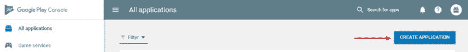
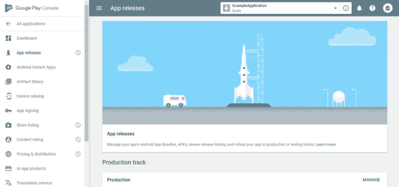
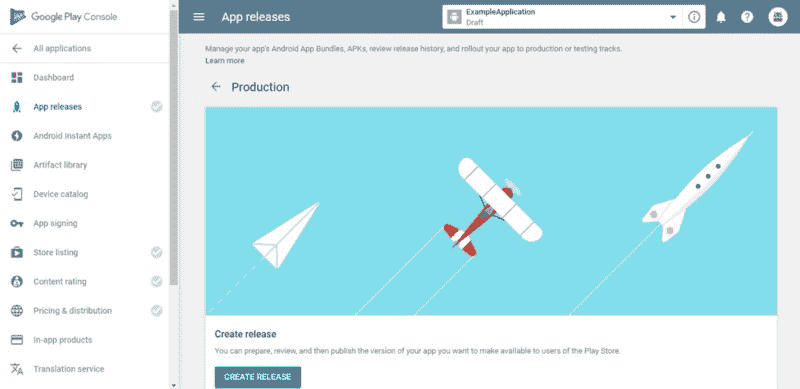
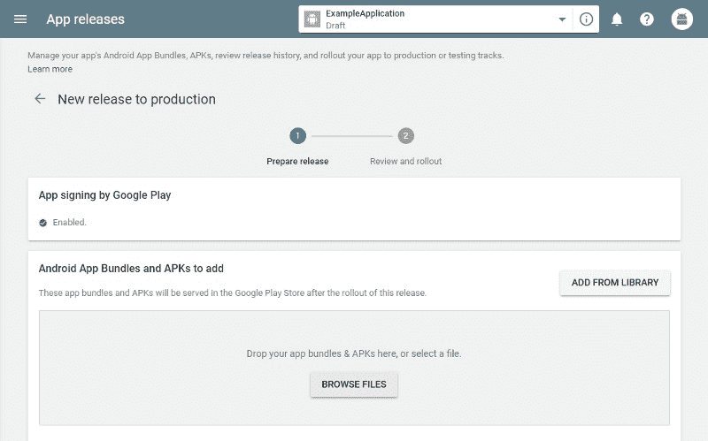
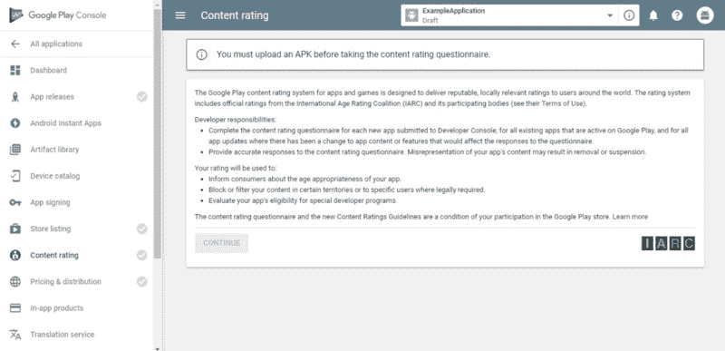
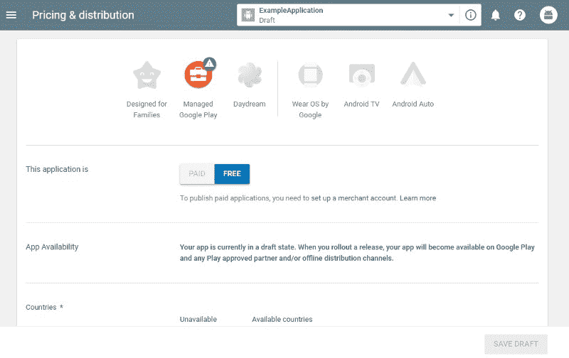

# 如何在 Play Store 中发布应用程序

> 原文：<https://www.freecodecamp.org/news/how-to-publish-an-application-in-the-play-store-8ddcc6dc3587/>

如果你一直在关注我的文章，你可能已经注意到我一直在写关于开发和发布 Chrome 扩展的文章。现在，我想带你踏上一段不同的旅程。在 Play store 中发布应用程序必须经历的过程。来吧，我们来玩吧。

#### 在我们过于兴奋之前

在去玩具店之前，我们必须核实几件事:

*   对你的 APK 进行数字签名——这是谷歌要求的，这样他们就可以验证应用程序的作者是谁。
*   [构建你的 APK](https://developer.android.com/studio/run/)——你需要构建一个 ***发布*** 版本的应用程序
*   [创建开发者账户](https://play.google.com/apps/publish/) -您需要在 Google Play 控制台中拥有一个开发者账户。 ***虽然创建一个是免费的，但你需要支付 25 美元才能发布应用程序。***

Photo by [Henrik Dønnestad](https://unsplash.com/@spaceboy?utm_source=medium&utm_medium=referral) on [Unsplash](https://unsplash.com?utm_source=medium&utm_medium=referral)

### 走过场

现在我们已经完成了所有的正式工作，我们可以开始发布应用程序了。

> ⚠️免责声明:如果您没有完成以下所有步骤，您将无法发布您的申请

1.  登录 Google Play 控制台
2.  当你在 ***所有应用*** 选项卡上时，在右上角你会看到一个 ***创建应用*** 按钮。

Click it

3.接下来，给你的应用程序一个标题和默认语言

4.您现在将被移至 ***商店列表*** 屏幕

Store Listing - Everything related to how your app will look in the store

在这里，你将需要提供以下 ***强制*** 的东西(它们是强制的，因为它们有一个⭐ ️next 给它们):

*   对您的应用程序的简短描述
*   完整的描述
*   截图(至少 2 张)
*   高分辨率图标
*   特写图片
*   应用程序的类型及其类别
*   您的电子邮件
*   您的隐私政策(如果您没有隐私政策，请勾选“不提交隐私政策”复选框)

5.现在进入 ***App 发布*** 窗口

App Releases - Choose a track to release your application

在这里，您必须选择一个轨道来发布您的应用程序。跟踪基本上是你的应用程序的发布过程。您可以选择将它直接发布到产品中，或者发布到 beta 阶段，或者进行内部测试。除了明显的差异之外，大多数曲目在您必须做的事情上是相似的，所以我将专注于发布一个应用程序到 ***生产*** 。

Click on Create Release

6.在这里，您需要使用 Google Play 签署您的应用程序，或者您可以选择退出。然后，您需要上传您构建的 APK。

Upload Your APK

在这里，您还可以为该版本命名，并指定该版本中的新增内容。 ***请特别注意您在此版本中键入的任何新内容，因为它将出现在 Play store 的新内容部分*** 下。完成后，可以按页面右下角的 ***复习*** 按钮。

7.接下来， ***内容评分***

The Continue button will not be grayed out if you completed all the necessary things

按下“继续”按钮后，如果您完成了上述所有步骤，该按钮将不会变灰，您将被询问几个关于申请内容的问题。就按照他们的顺序，一个一个的填。

8.最后一点， ***定价&分销***

Decide on monetary issues of your application

在最后一页，您可以决定:

*   如果你的应用程序是免费的
*   您的应用程序将在哪些国家可用
*   如果它包含广告
*   用户程序
*   同意

请注意填写所有必填字段(标有⭐️)

Photo by [Andre Hunter](https://unsplash.com/@dre0316?utm_source=medium&utm_medium=referral) on [Unsplash](https://unsplash.com?utm_source=medium&utm_medium=referral)

就是这样！完成所有这些艰苦的工作后，您现在可以发布您的应用程序了。返回到应用程序发布窗口，继续发布您的应用程序。

请务必在下面的评论中让我知道你的想法。

如果你喜欢这篇文章，请鼓掌让其他人也能欣赏它！？