# 如何将包发布到 npm(行业做事的方式)

> 原文：<https://www.freecodecamp.org/news/how-to-publish-packages-to-npm-the-way-the-industry-does-things-2077ec34d7e8/>

将一个包发布到 npm 上很简单。有两个步骤:

1.  创建您的包。
2.  发布包。

但是出版行业包装的方式呢？没那么简单。还有更多步骤。我们将介绍所需的步骤，我将向您展示一种发布和更新您的包的简单方法。

### 创建您的第一个包

如果您以前没有向 npm 发布过包，那么这一节是为您准备的。如果您以前发表过，请随意跳到下一部分。

要将您的第一个包发布到 npm，您需要完成以下步骤:

**首先，你需要有一个 npm 账户**。如果你还没有的话，在这里创建一个[。](https://www.npmjs.com/signup)

**其次，你需要通过命令行**登录你的 npm 账号。(在执行此步骤之前，您需要在系统上安装节点和 npm。在这里安装。

要登录，您需要使用`npm login`。

```
npm login
```

系统会提示您输入用户名、密码和电子邮件地址。

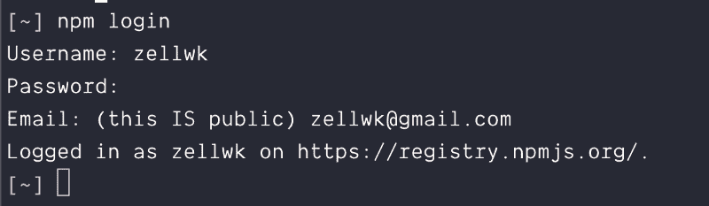

**第三，你需要创建一个包**。为此，请在计算机上的某个位置创建一个文件夹，并导航到该文件夹。命令行版本是:

```
# Creating a folder named how-to-publish-to-npm mkdir how-to-publish-to-npm # Navigating into the folder cd how-to-publish-to-npm
```

接下来，您想用`npm init`命令开始项目。

```
npm init
```

这个命令会带您回答几个问题，并在最后为您创建一个`package.json`文件。这个`package.json`文件包含了发布项目所需的基本必需品。(没有意义的问题可以随意跳过)。

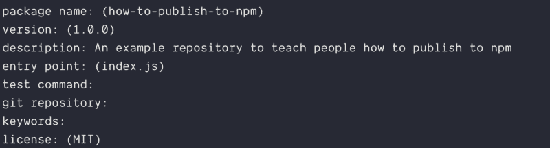

**最后一步是用`npm publish`命令发布你的包**。

```
npm publish
```

如果 npm 上已经存在该包(因为您的包与 npm 上的另一个包同名)，您将无法发布它。你会得到一个错误。

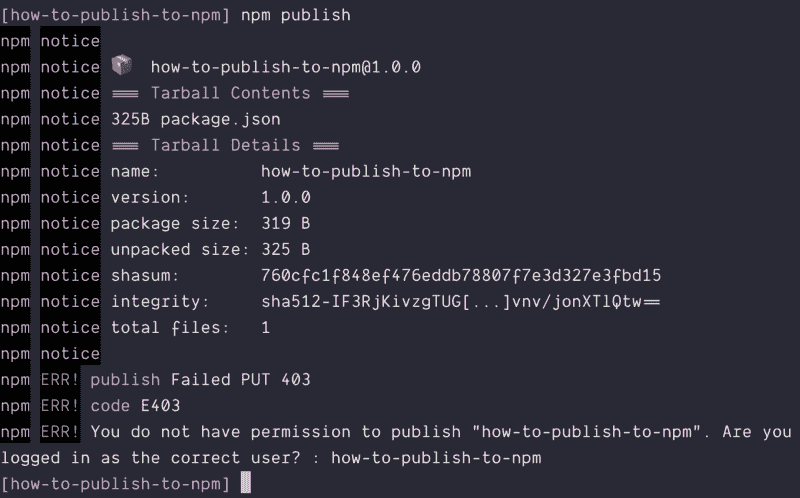

您需要更改您的套餐名称。

要更改您的包名，您需要更改`package.json`文件中的`name`属性。这里，我把它改成了`publishing-to-npm`。

(您可以通过在 npm 上进行搜索或者通过`npm search`命令来检查命名冲突)。

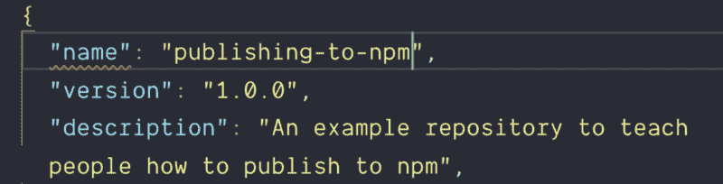

为了保持一致性，更新文件夹名称也是一个好主意。下面是等效的命令行。

```
# Command to change folder names by moving everything mv how-to-publish-to-npm publishing-to-npm
```

再次尝试`publish`命令。您现在应该会收到一条成功消息。

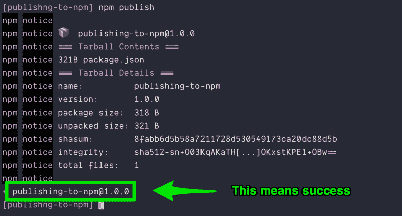

### 如果你想出的每个名字都已经有人取了，该怎么办

这是一个常见的问题，因为许多人在 npm 上创建包。有时候很难找到你想要的包名。(就好像我怎么能*永远*找不到好的`.com`域名一样)。

为了解决这个问题，npm 允许您发布到一个范围。这意味着您可以用自己的用户名(或 npm 组织)发布软件包，因此您不会遇到命名问题。

要发布到某个范围，您可以:

1.  在`package.json`中手动将`name`改为`@username/package-name`
2.  运行`npm init --scope=username`而不是`npm init`

如果您的存储库有一个范围，您需要稍微调整发布命令:

```
npm publish --access public
```

这就是将包发布到 npm 所需做的全部工作。

现在，让我们继续讨论这个行业是如何发布软件包的。

考虑一个流行的框架，比如 React。如果您仔细研究 React，您会注意到一些事情:

首先，React 有一个 [Github 库](https://github.com/facebook/react)。

第二，React 是[发布在](https://www.npmjs.com/package/react) npm 上。

第三，React 遵循[语义版本化](https://zellwk.com/blog/semantic-versioning/)(简称 Semver)。

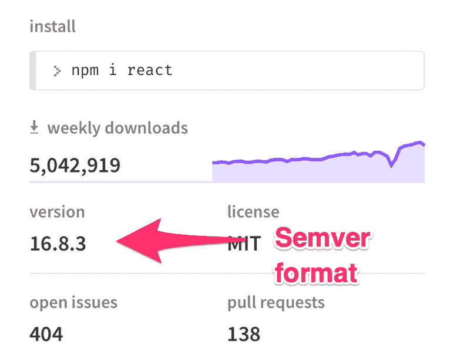

第四，React 的每个更新都有一个与之关联的 git 标签。这个 git 标签也跟在 Semver 后面。

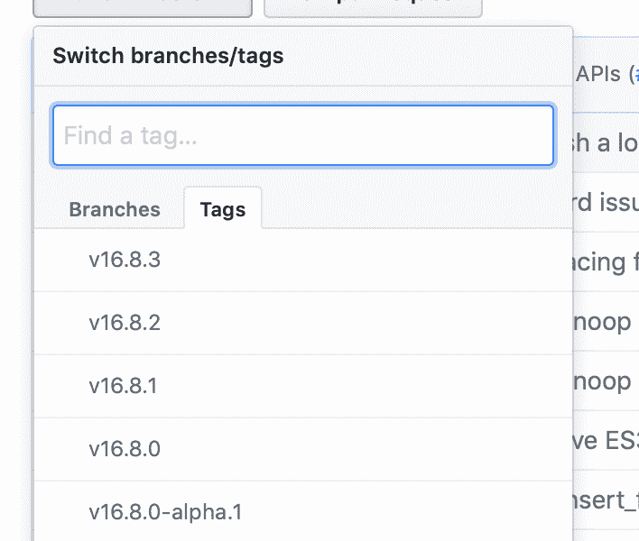

第五，每次 React 更新都有[发布说明](https://github.com/facebook/react/releases)。

这意味着发布一个包需要很多步骤。至少，你需要:

1.  运行测试(如果有)
2.  根据 Semver 更新`package.json`中的`version`
3.  根据 Semver 创建一个 git 标签
4.  将包推送到 Github
5.  将包推送到 npm
6.  为每次更新创建发行说明

当我们准备推动时，很容易忘记这些事情中的一件。有时我们喜欢休息。当我们回来的时候，我们为遗忘而自责。

有更简单的方法。是用一个叫`np`的工具。

### 铭牌

np (由[辛德雷·索胡斯](https://github.com/sindresorhus)创建)让我们更容易发布软件包，而不会错过我上面详述的任何步骤。

### 安装 np

要安装`np`，您可以运行以下命令:

```
npm install np
```

这个管用。但是我更喜欢在我的计算机上全局安装`np`，这样我就可以在任何地方运行`np`命令。

```
sudo npm install --global np
```

### 在使用 np 之前

在使用`np`之前，您需要确保:

1.  您的项目是一个 Git 资源库
2.  它需要一个遥控器
3.  你必须至少按过一次遥控器。
4.  您还需要确保您的工作目录是干净的。

```
# Initialize Git git init # Adds a remote repository git remote add origin some-url # Commit changes git add . git commit -m "Initial Commit"
```

如果您的项目不是 Git 存储库，您将得到以下错误:

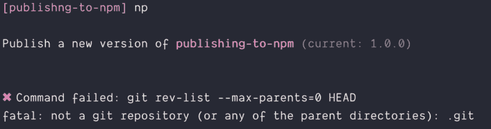

如果您的项目没有 remote，您将会得到这个错误(在检查的后面部分)。


如果您的工作目录是脏的，您将得到以下错误:

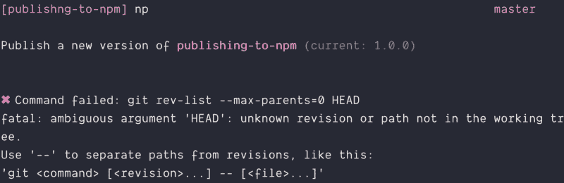

如果你一次都没有按下 Git 遥控器，`np`将会挂起，什么也不做。

### 使用 npm

要使用`np`，您可以运行`np`命令。

```
np
```

`np`将提示您输入一个永远的号码。

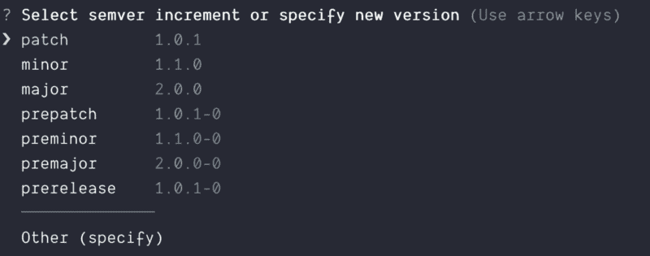

选择一个数字，`np`会要求您确认您的选择。

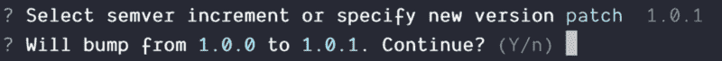

然后为你做剩下的出版工作。

### 运行测试时出错

`np`运行`npm test`命令作为其检查的一部分。

如果您按照教程进行到这一步，您将得到如下所示的错误:

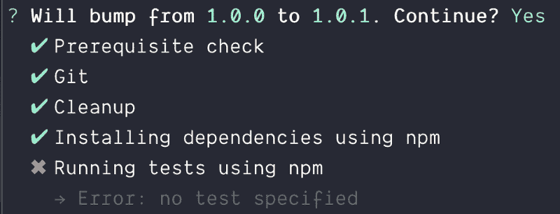

这是因为我们的`npm test`命令导致了一个错误。你可以自己试试:

```
npm test
```

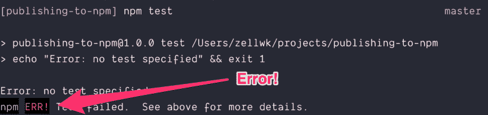

要修复这个错误，我们需要更改`package.json`文件中的`test`脚本。

现在看起来是这样的:

```
"scripts": {     "test": "echo \"Error: no test specified\" && exit 1"},
```

改成这样:

```
"scripts": {     "test": "echo \"No test specified\""},
```

这种改变之所以有效，是因为`exit 1`产生了一个错误。

有了这个改变，`np`应该完成发布过程。(记得在运行`np`之前提交更改)。

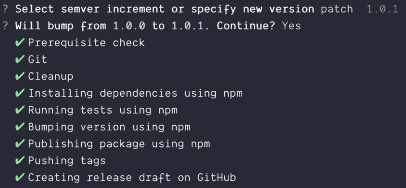

在该过程结束时，`np`会启动一个浏览器窗口，供您编写发行说明。

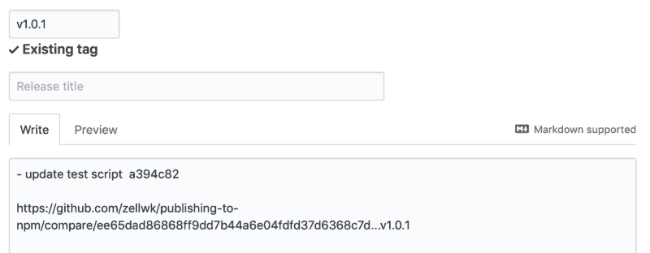

简而言之，`np`让发布包变得简单多了！

感谢阅读。这篇文章对你有帮助吗？如果是的话，我希望你能考虑分享它。你可能会帮助其他人。非常感谢！

本文原载于 [*我的博客*](https://zellwk.com/blog/publish-to-npm) 。
如果你想要更多的文章来帮助你成为更好的前端开发人员，注册我的[时事通讯](https://zellwk.com/)。