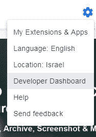
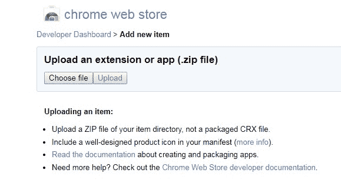
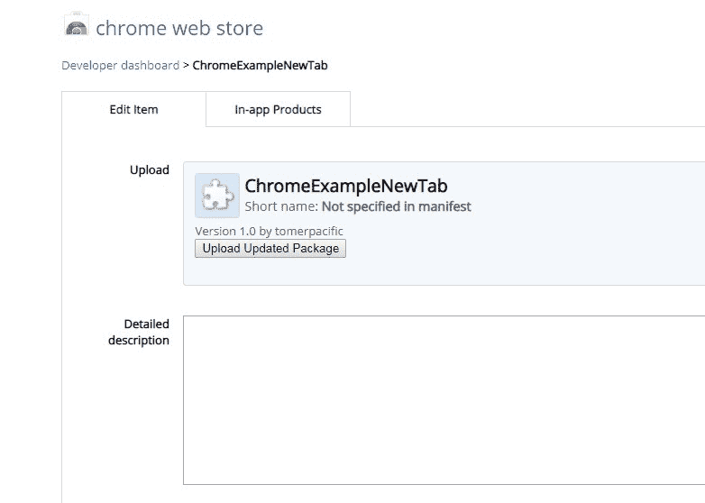
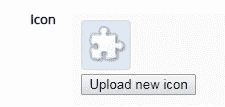
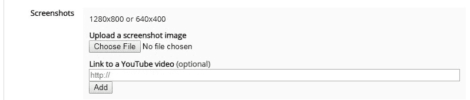
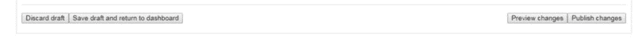
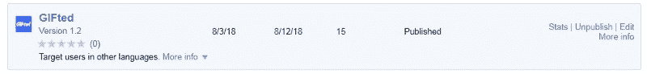

# 如何发布你的 Chrome 扩展

> 原文：<https://www.freecodecamp.org/news/how-to-publish-your-chrome-extension-dd8400a3d53/>

在我之前写的文章中，我谈到了 Chrome 扩展的构建模块。现在，我想把重点放在构建 Chrome 扩展的另一部分:**当你完成构建后该做什么**。这个过程本身不长也不辛苦，但是有一些事情你要注意。

每一个 Chrome 扩展都发布在 Chrome 网络商店上。你可以把它想象成谷歌的 Play Store 或者苹果的 App Store，但只是针对 Chrome 的扩展和主题。

### 步伐

如果您还没有创建帐户，您需要创建一个开发者帐户。在其中，您将拥有一个开发人员仪表板。

> 正如我在上一篇文章中提到的，如果你想发布 Chrome 扩展，一次性注册费用是 5 美元。这将使您能够发布多达 20 个扩展

一旦你自豪地拥有了一个开发者账户，下一步就是将你的 Chrome 扩展上传到你的账户。为此，创建一个 ZIP 文件，其中包含与您的扩展相关联的所有文件。Google 要求你上传的唯一一个文件是 manifest.json 文件。但是您也希望添加您已经拥有的 JavaScript 文件。

之后，下一步是发布我们的扩展。登录您的开发人员帐户，并转到您的开发人员仪表板。

您将看到一个**添加新项目**按钮。

Click Me

> ***⚠️请注意，一旦您将扩展添加到您的开发者仪表板，您就不能删除它。只要没有发布，它就不会计入您的延期限制。***

这将引导您进入一个页面，您可以在此上传我们之前创建的 ZIP 文件:

Click choose file and press upload

假设一切顺利，您将进入下一页:

Here you can provide a description of your extension

> 如果您计划对您的扩展进行更改，您可以使用上传更新包按钮来重新上传您的 ZIP 文件。

在此页面上，您可以添加将显示在工具栏上的图标:

添加您的扩展的屏幕截图(这些将在用户查看您的扩展时使用):

以及各种其他功能，如选择扩展的类别(即乐趣)，选择您的扩展将可用的地区，您的扩展的价格，以及我建议您查看的其他类别。

当您完成对扩展细节的微调后，您将到达页面的末尾，并看到以下按钮:

左边的两个按钮允许您保存到目前为止配置您的扩展所做的工作(或者丢弃它)，右边的两个按钮是当您准备发布时使用的。要查看您配置的所有内容在 Chrome 网上商店的外观，请按下**预览更改**按钮。当你对你所拥有的感到满意时，点击**发布更改**。

Photo by [Val Vesa](https://unsplash.com/@adspedia?utm_source=medium&utm_medium=referral) on [Unsplash](https://unsplash.com?utm_source=medium&utm_medium=referral)

恭喜你！你刚刚发布了你的第一个 Chrome 扩展！

在您的开发人员控制面板中，您将看到以下内容:

点击 *Stats* 链接会给你关于你的扩展的分析(多少印象，安装和活跃用户)。我很期待看到你发布的 Chrome 扩展。