# 如何避开恶意软件并获得堆栈溢出方面的帮助

> 原文：<https://www.freecodecamp.org/news/how-to-push-past-the-trolls-and-get-the-help-you-need-on-stack-overflow-52fd42ebe7c4/>

作者金·克雷顿

当你刚接触编码时，堆栈溢出可能是一个可怕的地方。对于新手来说，这是一个惊人的资源。但这也是恶霸寻找新受害者的地方。

随着成千上万的编程职位空缺，以及该领域对多样性的需求，你会认为有经验的程序员会渴望帮助新手。一般来说，他们是。

但是也有少数人会对你的问题出言不逊，或者像“读读该死的手册(RTFM)”这样的回答。他们可能会把你的问题标记为重复，而没有花时间去阅读，或者采取任何其他被动-主动的行动。

在你寻找答案的过程中，你需要抛开这一切。

我是一名高中老师，所以网上一些匿名的人对我说的话很少会让我的问题得不到答案。

尽管如此，我还是花了一些时间将堆栈溢出添加到我的工具箱中。这并不是出于对巨魔的恐惧。这是因为我还不确定如何提出正确的问题。

### 如何问正确的问题

这里有一些初学者的步骤，新手可以利用堆栈溢出的力量来提高他们的学习水平。所有例子都是我自己:-)

#### 在发布之前，在网上研究一下你的问题。

措辞决定一切。

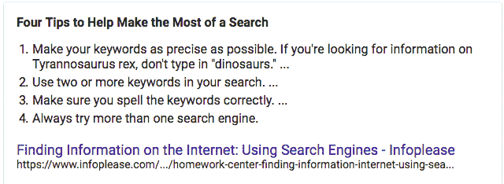

阅读本文了解更多详情:[作业中心:在互联网上查找信息:使用搜索引擎](https://www.infoplease.com/homework-help/homework-center-finding-information-internet-using-search-engines)

#### 提供所有相关信息

这包括你在研究你的问题时已经看过的其他资源的链接。

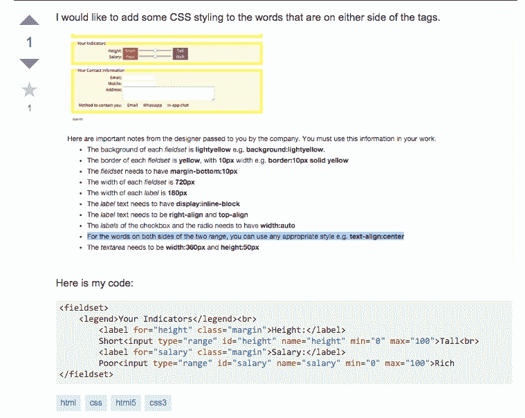

#### 不要包含代码库的截图。

将实际代码复制并粘贴到文本框中(使用{ })。

那些想要帮助你的人会使用你的代码来尝试和复制你的错误或问题。

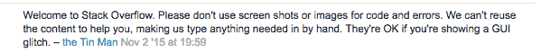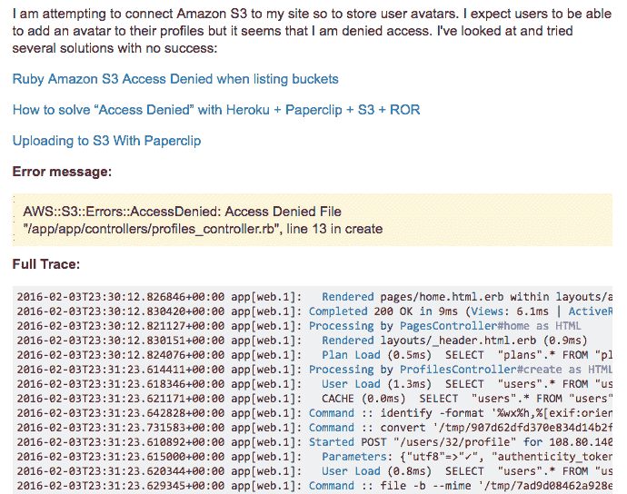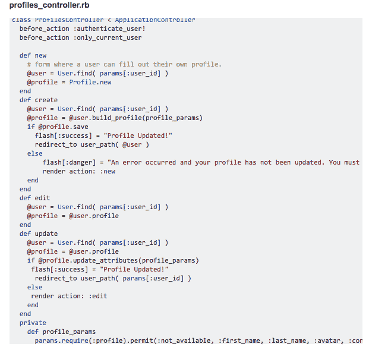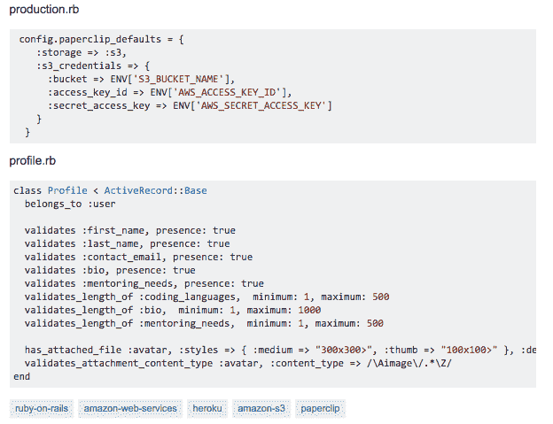

你可以点击查看整个问答提要[。](https://stackoverflow.com/questions/35190087/awss3errorsaccessdenied-cannot-save-to-s3-with-rails)

#### 学会使用格式化工具。

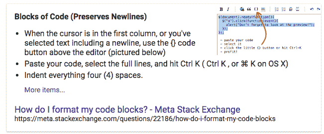

关于如何做的更多细节，请阅读[我如何格式化我的代码块？](https://meta.stackexchange.com/questions/22186/how-do-i-format-my-code-blocks)

#### 使用标签。

它们有助于确保拥有您所寻求的专业知识的合适人群看到您的问题。

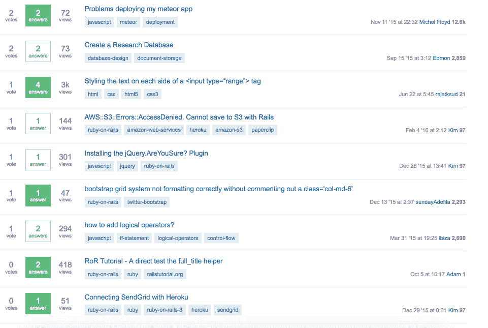

#### 如果你收到一个你不明白的答案，礼貌地要求进一步澄清。

比如:“你好(人名)我是新来的，听不懂你的回答。为了清楚起见，您能否提供额外的信息？谢谢大家。”

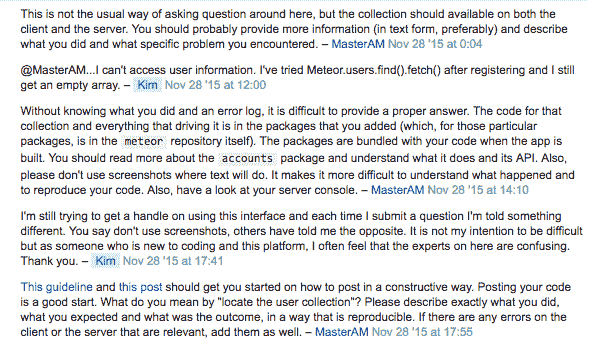

更多详情，请查看[如何问一个好问题？](http://stackoverflow.com/help/how-to-ask)和[阻止代码截图和/或错误](https://meta.stackoverflow.com/questions/303812/discourage-screenshots-of-code-and-or-errors)。

#### 如果你收到一个似乎很严厉的回应，礼貌地提醒他们你是新来的，还在学习中。

例如:“谢谢你(人名)，我是新来的，如果你能解释我的问题有什么问题，以及我可以采取哪些措施来确保我不会再犯同样的错误，那会很有帮助。”

#### 如果您收到的一个或多个答案对您的问题有帮助，请使用该答案旁边的箭头向上投票。

堆栈溢出有一个积分系统。这对那些花时间帮助你的人来说很重要，所以对你来说也应该很重要。

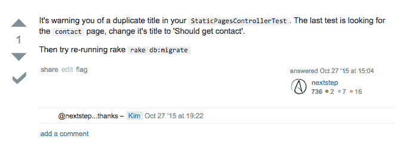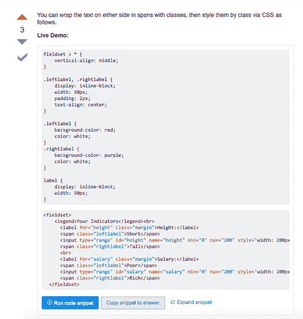

要了解更多详细信息并运行代码片段:[在<输入 type = " range "&g](https://stackoverflow.com/questions/32926670/styling-the-text-on-each-side-of-a-input-type-range-tag)t；标签

#### 如果您的问题已经解决，请单击最有帮助的答案旁边的复选标记来结束问题。

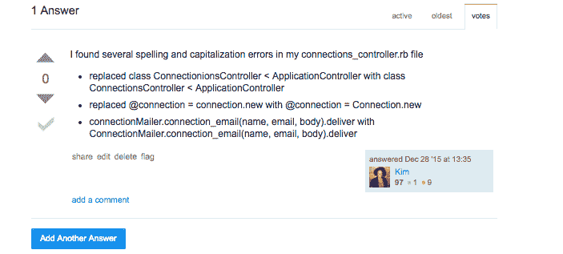

您可以在此阅读更多详细信息:[自动加载常量连接控制器时检测到循环依赖](https://stackoverflow.com/questions/34494333/circular-dependency-detected-while-autoloading-constant-connectionscontroller)

#### 最重要的是，不要往心里去。

我想用上面概述的两个非常好的例子来结束这篇文章:[如何在 RoR 创建一个以上的索引页面](https://stackoverflow.com/questions/34259517/how-to-create-more-than-one-index-page-in-ror)和[安装 jQuery。你确定吗？插件](https://stackoverflow.com/questions/34443682/installing-the-jquery-areyousure-plugin)。

感谢阅读！