# 如何推送到 Git 远程存储库

> 原文：<https://www.freecodecamp.org/news/how-to-push-to-a-git-remote-repository-570d2712b62f/>

注意:这是 Git 初学者系列的第三个视频。[在这里看第一个视频](https://zellwk.com/blog/setting-up-git)。

在 Git 术语中，我们称您计算机上的 Git 存储库为本地存储库。

Git remote 是存储在互联网上其他地方的同一个存储库。它可以作为备份。如果你的电脑崩溃了，你可以随时从遥控器上下载最新版本到你的电脑上。

在我们谈论 Git 远程之前，我们必须谈论为您提供 Git 远程的不同服务。让我们看一些例子。

### Git 服务之间的差异

就 Git 本身而言，这三个服务之间没有区别。

这些服务之间唯一的区别是它们的受欢迎程度、网络界面和价格。

很多人喜欢用 Github，因为 Github 是三者中最受欢迎的一个。这也是为什么大多数开源项目都托管在 Github 上。(注意:开源项目也可以托管在 Bitbucket 和 Gitlab 上)。

有时您可能想要创建私有存储库。私有存储库是一个 Git 存储库，只能由您和您授予权限的人读取。

如果你想创建私有库，你可以考虑 Bitbucket 或者 Gitlab。他们让你免费创建私人仓库。

如果你想在 Github 上创建一个私人知识库，你需要每月支付 7 美元。

本文向您展示了如何在 Github 上设置遥控器。其他服务遵循相同的指令。

### 在 Github 上创建存储库

登录 Github。如果您还没有帐户，请创建一个。

登录后，您会在页面的右上角看到一个加号(+)按钮。点击这个加号按钮并选择“新建存储库”

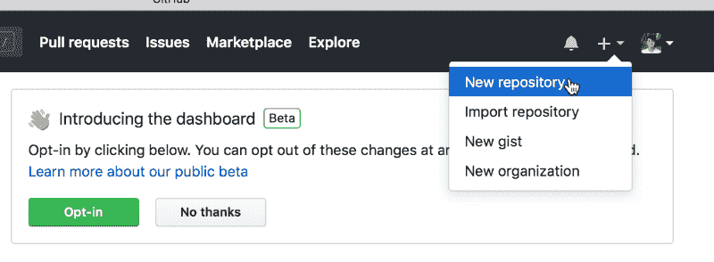

要创建新的存储库，您需要为您的存储库命名。

描述提供了详细信息，以便其他人可以了解您的项目。它是可选的。你可以暂时不考虑它。

根据您的需要，将项目设置为公共或私有。

然后，忽略其余部分，单击 create repository 按钮。

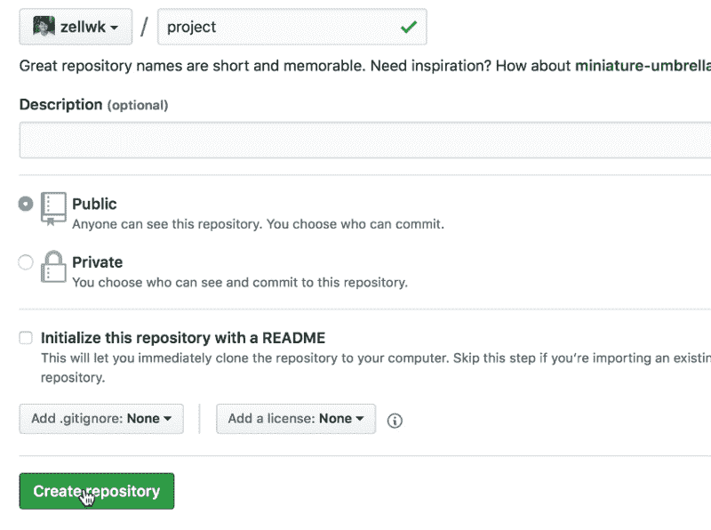

一旦你点击创建存储库，你会看到一个页面，里面有一些 Git 指令。

暂时忽略这些说明。这些知识要求您使用 Git 命令行。你将在几节课中学会如何做到这一点。

现在，我们希望将 Fork 中的本地存储库链接到我们刚刚创建的远程存储库。

复制您在页面上看到的 URL。

确保选择 SSH(而不是 HTTPS！).

SSH 允许您推送(将内容放入远程存储库)和拉取(将远程存储库复制回本地存储库),而无需每次都输入 Github 用户名和密码。这让事情变得简单多了。

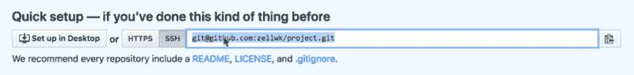

接下来，在 Fork 中打开项目并单击按钮。

从左边数第四个按钮。它看起来像一个向上的箭头。

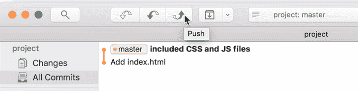

一旦你点击按钮，Fork 会要求你选择一个分支和一个遥控器。

在这种情况下，我们的分支将是主分支(因为我们只有一个分支)。

我们需要添加刚刚创建的遥控器。要添加遥控器，单击选择框并选择添加遥控器。

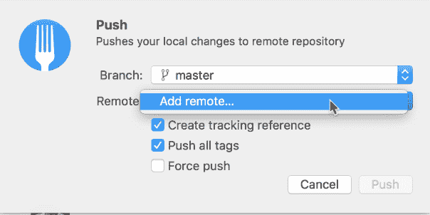

接下来，您需要命名您的遥控器。

大多数遥控器的默认名称是 origin。如果你有多个遥控器，你会希望根据它们的来源(比如 Github、Heroku 和 Bitbucket)来重命名遥控器。

存储库 URL 应该是您从 Github 复制的 URL。

完成后选择添加新遥控器。

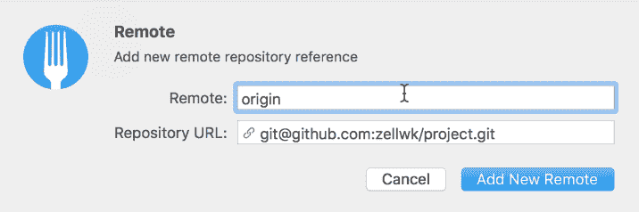

### 第一次推遥控器

当您第一次将文件推送到遥控器上时，请确定“创建跟踪引用”注记格已选中。

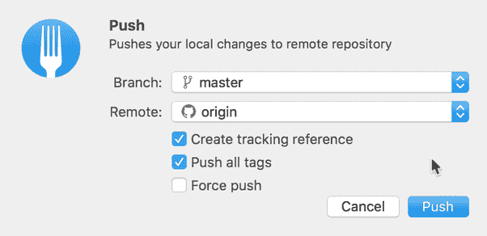

跟踪引用告诉 Git 跟踪当前分支(在本例中是主分支),并推或拉远程上的同一个分支。

如果您不创建跟踪引用，那么您将需要指定每次推送至(或从)哪个分支。

注意:如果分支现在对你来说听起来很陌生，不要担心。我们将在后面的课程中讨论分支。现在，请记住您需要创建一个跟踪参考。

选中后，你可以点击 push，Fork 会将你的项目推送到 Github 上。

一旦它被推送，您可以查看所有提交部分。(在其他 Git 客户机中，这将是 Git 历史)。

在所有提交中，您将看到两个标签。一个叫`master`(我们电脑上的主分支)。另一个称为`origin/master`(称为 origin 的遥控器上的主分支)。在这种情况下，我们的原点是 Github，所以`origin/master`指的是 Github 上的主分支。

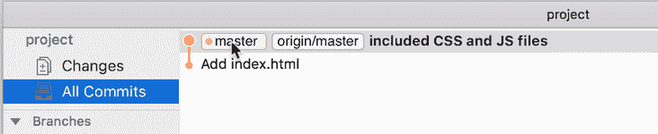

当这两个标签在同一个提交上时，这意味着我们在本地主分支上的文件与我们在 Github 主分支上的文件是相同的。

如果您回到获取 Git 远程 URL 的页面，就可以验证这一点。刷新这个页面，你会看到你通常在 Github(一个项目页面)上看到的内容。

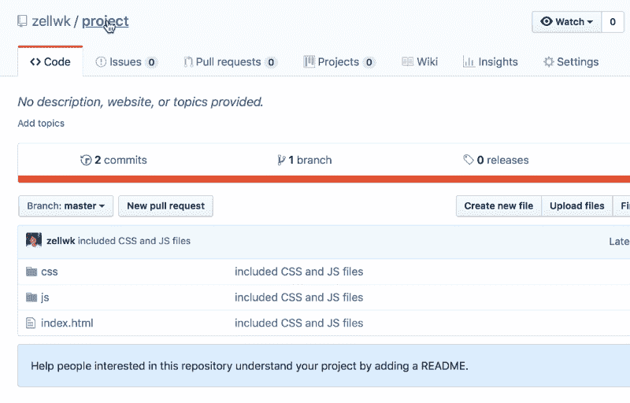

如果你看这些文件，你会注意到这些文件和你电脑上的文件完全一样。

### 第二次推动

后续的推送就容易多了。

假设我们对我们的存储库进行了更改。这一次，我们想要创建一个`README.md`文件。一个`README.md`文件显示了 Git 项目页面，帮助人们理解这个项目是关于什么的。

您想要为您创建的每个存储库创建一个`README.md`文件。

一旦我们创建了文件，如果我们单击 changes 选项卡，我们将在 Fork 中看到更改。

[和前面的](https://zellwk.com/blog/your-first-commit)一样，我们想要暂存文件并提交文件。在这种情况下，提交消息可以是“Create Readme.md”。

当您创建一个新的提交时，请看一下左侧的侧栏。在主分支旁边，您会看到一个数字、一个数字和一个向上的箭头。

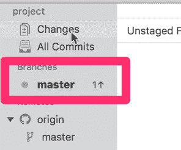

这告诉我们，我们的主分支比远程分支早一次提交。这意味着我们的主分支比远程分支更新。

如果您查看 Git 历史，您可以“Create readme.md”提交在本地分支上，但是这个提交还没有到达远程。

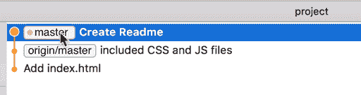

要将新提交推送到遥控器上，您需要再次单击 push 按钮。

然后，再次单击推送。

就是这样。

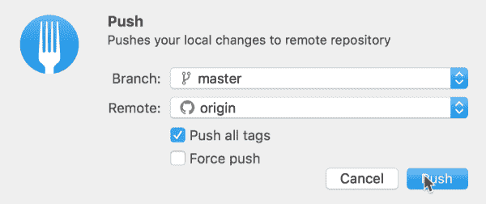

一旦提交被推送到远程分支，您可以看到`origin/master`标记被移动到与`master`标记相同的提交。

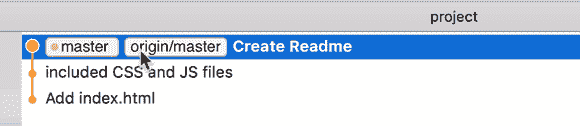

为了证明这是可行的，您可以刷新 Github 存储库页面，您将能够看到您的新`README.md`文件！

### 包扎

Git remote 有点像存储在别人电脑上的备份。要创建 Git remote，可以使用 Github、Bitbucket 和 Gitlab 等流行的服务之一。

创建一个远程存储库，然后将本地存储库链接到远程存储库。当您将它们链接起来时，您可以推送至远程存储库。

感谢阅读。这篇文章对你有什么帮助吗？如果我有，[我希望你考虑分享它](http://twitter.com/share?text=Pushing%20to%20a%20Git%20remote%20by%20@zellwk%20?%20&url=https://zellwk.com/blog/pushing-to-a-git-remote/&hashtags=)；在阅读这篇文章之前，你可能只是帮助了和你有同样感受的人。谢谢你。

本文最初发布在 *[我的博客](https://zellwk.com/blog/pushing-to-a-git-remote/)。*
如果你想要更多的文章来帮助你成为一个更好的前端开发者，请注册我的[简讯](https://zellwk.com/)。