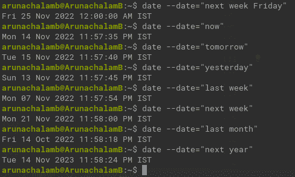
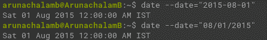
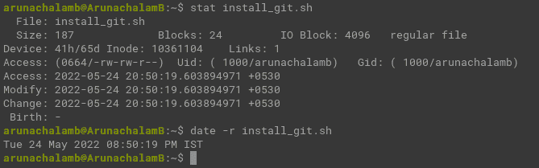
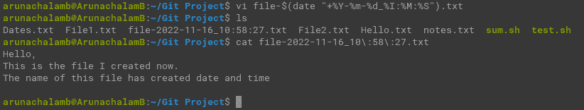
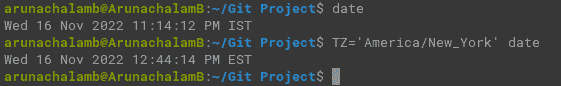
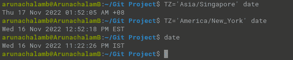
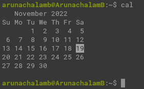
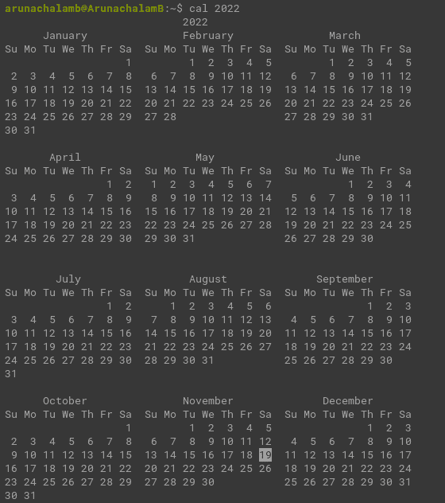
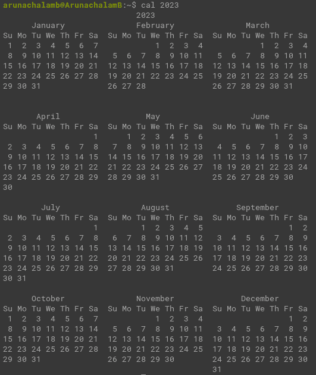

# Linux Date 命令——如何查询终端以获取日期

> 原文：<https://www.freecodecamp.org/news/how-to-query-the-terminal-to-get-dates-linux/>

Linux 有许多实用工具可以帮助您快速找到问题的答案。但是许多开发者并没有意识到它们。

在本文中，您将学习一个具有特殊好处的命令。

例如，说你想看看你的日历来计划一个假期。有哪几种方法可以打开日历？嗯，有 Google/Outlook，你的系统桌面日历，你的手机日历等等。

但是你知道吗，你只需要输入三个字母就可以得到一个日历。在本文中，我将教你这个有用的三个字母的命令，并和我的团队分享一些使用`date`的有趣经历。

## 如何在您的终端上查询日期

记得有一天忙着工作。我问坐在我旁边的一个同事，“你知道下周五的日期吗？”然后，我意识到他戴着耳机，似乎正全神贯注地写代码。

我不想进一步打扰他，正要问坐在我正对面的另一位同事。

“11 月 25 日”，我以为听不到的同事回答。

我很惊讶——他怎么这么快就知道了？

“哦，伙计！我以为你在编码。你是怎么得到日期的？”我惊讶地问他。

“我正在查询终端来找到你问我的问题的答案”，他回答，展示他的终端窗口。

终端窗口有以下命令:

```
dd "next week Friday"
```

Shortcut command to find date of a given day

我不明白他做了什么，所以我想。

“Linux 默认支持 date 命令来显示今天的日期，并在我们的系统中设置当前日期和时间。它还提供了一种方法来找到一个日期在未来和过去一样简单，因为我们说。是做所有与日期和时间有关的事情的命令”，他回答道。

我对`dd`命令更加困惑，我请他解释一下它是如何工作的。

“但如果`date`是命令，`dd`是什么？那是`date`司令部的一部分吗？”

他解释说`dd`与`date`命令没有关联。更确切地说，这只是他创建的一个快捷命令(我将在以后的教程中写这方面的内容)。`dd`缩写为`date --date="<given_date>"`。

所以，实际的命令是这样的:

```
date --date="next week Friday"
```

Linux terminal command to find date of the given day

我在我的终端中运行了同样的程序，看到输出时我感到很惊讶。


Linux terminal command to find the date of the given day

这很酷，我感谢他的超级有用的解释。经过进一步研究，我发现这个命令能够回答我的大部分问题。我觉得我在和一个人工智能系统互动。

我在这里发布了我的一些疑问:



Query terminal for a future or past date

## 如何在 Linux 中获得关于日期的特定信息

到目前为止，我们一直试图用我们的查询找到一个特定的日子。但是，如果你想找到一些关于约会的信息呢？经过进一步的研究，我发现您可以使用相同的命令来查找日期中的星期几。

以下命令显示 2015 年 8 月 1 日是星期几:

```
date --date="2015-08-01"
date --date="08/01/2015"
```



Terminal command to find the day of a date

## 如何在 Linux 中找到关于日期列表的信息

我的同事有一份约会清单。他需要一个显示每个日期的脚本。他一直在努力解决这个问题，并向我寻求帮助。

他很清楚自己的问题。但他为实现这一目标所采取的步骤出了问题。进一步讨论，我发现他在谷歌里依次搜索了以下几项。

*   如何以读取模式打开文件？
*   如何逐行阅读？
*   如何解析文件中的日期？
*   最后，如何找到那个日期的日子？

在讨论过程中，我想起可以使用超级强大的`date`命令快速完成这项工作。事实上,`date`命令完成了上述所有操作——我们的工作只是给出文件的路径。


Terminal command to parse dates from a file

事实上，它可以读取和解析任何格式的日期是一个额外的优势。从上面的截图，你就能明白解决我同事的问题有多简单了。

记住莉莉·柯林斯的名言:没有羞耻，没有遗憾，只有我

> 寻求帮助从来都不是软弱的表现。这是你能做的最勇敢的事情之一。它能救你的命。

## Date 命令如何处理文件操作

如果你读过我之前的关于 Linux 入门的教程，你可能会记得用`stat`命令我们可以得到一些关于文件的信息，比如它的大小、创建日期、最后修改日期等等。

嗯，你知道你可以使用`date`命令找到文件的最后修改时间吗？

是的——通过添加带有`date`命令的`-r`标志和文件路径，您可以找到文件的最后修改时间。看起来是这样的:

```
date -r install_git.sh
```

Terminal command to find the last modified time of a file



Terminal command showing the last modified time of a file

还有一个地方可能更熟悉这个日期命令。您可以用它来创建一个带有时间戳的文件。例如，系统管理员经常用它来查看系统和服务器日志。我还听说炒股的人也是靠创建带时间戳的文件。

下面是一个创建带有日期和时间的文件的快速示例:

```
vi file-$(date "+%Y-%m-%d_%I:%M:%S").txt
```

Terminal command to create a file with date and time



Terminal command to create a file with date and time

对于第一次使用的用户来说，可能很难理解上面的命令。

让我们把这个命令分解一下，以便更好地理解它:

*   `vi`是我的文字编辑器
*   `file-$(date "+%Y-%m-%d_%I:%M:%S").txt`是文件的名称

让我们进一步将文件名中的`date`命令一分为二:

*   `date "<some_format>"`以指定格式打印日期
*   `%Y`是当前年份
*   `%m`是当前月份
*   今天是几号
*   `%I`是小时
*   `%M`是分钟
*   `%S`是秒

## 如何找到不同时区的日期和时间

我的另一个团队成员提出了这个有趣的问题。

使用`date`命令可以找到另一个时区的日期和时间。但是，它对用户不太友好。您需要记住时区的全名来获取日期和时间。但是，它开箱即用。

我在印度，我们遵循印度标准时间(IST)。我可以使用下面的命令来查找纽约的时间。

```
TZ='America/New_York' date
```

Terminal command to find the present time at different timezone



Terminal command showing New York time

下面的截图显示了不同时区的时间对比，如新加坡、美国和印度。



Terminal command showing time across different timezone

## 获取日历的三个字母的命令是什么？

你在等着知道 3 个字母的命令来查看终端吗？

它是`cal`命令。



Terminal command to display the calendar

这是给你的**奖励**小费。

您可以通过在`cal`命令旁边添加年份来查看任何一年的日历。



Terminal command showing 2022 calendar year



Terminal command showing 2023 calendar year

如果你想了解更多关于`cal`命令的信息，你可以在社交媒体上联系我。

注意:`date`和`cal`预装在许多 Linux 发行版中。如果您在运行`date`命令时遇到`date: command not found`错误，您只需要通过运行以下命令来安装`coreutils`包:

```
sudo apt install coreutils
```

## 结论

在本教程中，我分享了我在 Linux 中使用`date`命令的经验。我希望你喜欢阅读这篇文章。

要将更多有见地的博客发送到您的收件箱，请在此订阅我的时事通讯[。](https://5minslearn.gogosoon.com/)