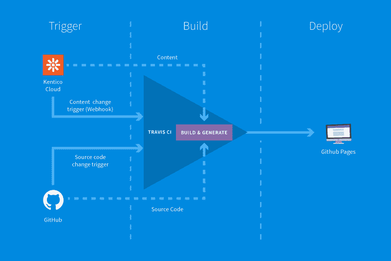
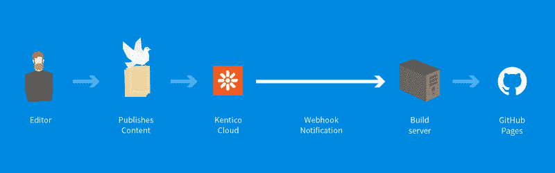
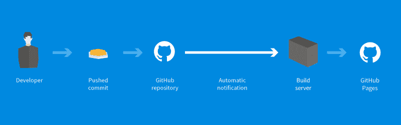

# 如何快速设置静态站点的构建过程

> 原文：<https://www.freecodecamp.org/news/how-to-quickly-set-up-a-build-process-for-a-static-site-1a6e7923e105/>

by Ondřej Polesný

# 如何快速设置静态站点的构建过程


您已经实现了一个静态站点，并准备好向全世界展示，但是您应该在哪里托管它呢？如何选择合适的平台并为一组静态文件做计划？如何确保网站在您更改内容时自动重新生成？

在本文中，我将向您展示如何生成一个静态站点，设置一个由内容更改触发的自动构建过程，并将站点部署到一个面向公众的服务器上。

### 介绍

在以前的文章中，我解释了如何用来自无头 CMS [Kentico Cloud](http://bit.ly/2QzUALM) 的内容[构建一个动态 JavaScript 网站。然后我向你展示了](http://bit.ly/2CyDnhX)[如何将它转换成一个静态网站](http://bit.ly/2PN46Jy)，以帮助提高性能、安全性和 SEO。所以现在是时候创建这个网站并把它放到网上让全世界都看到了。

### 生成静态站点

每个静态站点生成器都允许您在本地构建站点，而无需在每次文件更改后生成所有文件。如果您关注了我的文章，您在 Vue.js 上有一个站点，它被转换为使用 Nuxt.js 作为框架，但是仍然需要一个开发服务器来处理网站请求。要生成静态文件，请运行以下命令:

```
npx nuxt generate
```

打开项目根目录下的`dist`文件夹，找到生成的文件，并检查`index.html`以确保您的网站正确生成。我有一个习惯，也检查子页面，我知道那里有一些来自无头 CMS 的内容，比如博客页面。如果你看到 HTML 形式的内容，你就是赢家！

### 我应该在哪里托管静态站点？

这可能是生成所有文件后您要问的下一个问题。如果您正在重建一个网站，而您的旧网站仍然在线，您可能会考虑为静态网站使用相同的提供商。那很好。然而，如果你的旧网站是建立在传统的 CMS 或其他编程语言之上，你可能需要三思。

您当前的托管空间是可伸缩的，以适应另一个系统的要求，或设计为支持特定的设置，如 PHP 和 MySQL 或。NET 和 PostgreSQL。所以如果是这样的话，你很可能用流量、会话和其他值来计算你将需要多少计算能力(或者像我过去一样，只是希望这样就可以了)。

静态网站带来了解脱:不再有复杂的公式、近似值和专业猜测。托管一堆静态文件是每个 web 服务器都可以轻松做到的事情。最重要的一点是，服务器不再需要为每次点击经历复杂的请求处理管道。它只提供静态文件。这既简单又快捷。

因此，托管静态网站要便宜得多。有几十种服务可以让你免费托管你的网站，或者至少有免费的启动计划。它们包括:

*   github pages
*   [Netlify](http://bit.ly/2TEmPJK)
*   [Heroku](http://bit.ly/2VHD0If)
*   以及其他全球和本地提供商。当然，你也可以使用像 Azure 或 AWS 这样的全球网站托管服务。

我决定选择 GitHub 页面，因为我所有的库都已经托管在 GitHub 上了。它也是完全免费的，并支持自定义二级域名。

### 如何构建和部署一个静态站点？

但不仅仅是托管。让页面在线是必不可少的，但是考虑整个部署过程也同样重要。也就是说，静态页面将如何生成并传输到服务器。对于第一次构建，您可以使用`npx nuxt generate`在本地环境中生成页面，并通过 FTP 将静态文件复制粘贴到您的托管空间。但是，每次内容发生变化时，您都要重复这个过程吗？



部署静态站点的过程包括三个部分:

1.  引发
2.  建设
3.  部署

### 引发

当内容或实现发生变化时，需要进行新的构建。这意味着无论何时内容编辑在 [headless CMS](http://bit.ly/2QzUALM) 中发布新内容，或者你改变了源代码，网站都需要重建。但是我们如何做到这一点呢？



#### 内容更改触发器

每个成熟的无头 CMS 都有 [webhooks](http://bit.ly/2QzOdeS) 的功能。它们表示关于某种类型操作的服务到服务通知。因此，当一个编辑发布一个内容项时，headless CMS 启动一个 webhook 通知，该通知被发送到一个定义的 URL。在这种情况下，发送到构建服务器，该服务器将根据通知进行操作并重建站点。

但是构建服务器如何知道该做什么呢？嗯，它不知道你使用的是哪种内容存储，也可能不理解一般的 webhook 通知。出于这个原因，我在中间添加了一个简单的 Azure 函数，它做两件事——首先，它检查通知的来源是否是 Kentico Cloud:

```
...
```

```
if (!isValidSignature(req, process.env['KC_WEBHOOK_SECRET'])) { context.log('Signature was invalid'); return;}
```

```
...
```

```
const isValidSignature = (req, secret) => { const givenSignature = req.headers['x-kc-signature']; const computedSignature = crypto.createHmac('sha256', secret) .update(req.rawBody) .digest();
```

```
 return crypto.timingSafeEqual(Buffer.from(givenSignature, 'base64'), computedSignature);}
```

*(参见 GitHub 上完整的[文件)](https://github.com/Kentico/kentico.github.io/blob/source/src/azureFunctions/fireSiteRegeneration/index.js)*

然后使用构建服务器的 API 触发构建:

```
request.post({ url: "https://api.travis-ci.org/repo/Kentico%2Fkentico.github.io/requests", headers: { "Content-Type": "application/json", "Accept": "application/json", "Travis-API-Version": "3", "Authorization": `token ${process.env['TRAVIS_TOKEN']}` },
```

```
...
```

*(参见 GitHub 上完整的[文件)](https://github.com/Kentico/kentico.github.io/blob/source/src/azureFunctions/fireSiteRegeneration/index.js)*

我知道我知道，Azure 在你创建功能之前会要求你提供信用卡。但是可以用 [Webtask.io](http://bit.ly/2yCjNgl) ，完全免费。我在之前的一篇文章的[中解释了如何创建一个简单的函数。](http://bit.ly/2P0gidP)



### 代码更改触发器

有了代码，这个过程变得更加简单。构建服务器通常提供与 GitHub 的直接集成，因此只需向构建服务器授权 GitHub 即可。当您将代码更改推入远程存储库时，构建服务器会自动接收信息，并根据其配置触发新的构建。

### 建设

我知道，“构建服务器”这个词听起来很复杂也很昂贵。但是仔细想想，构建服务器需要为您做的唯一一件事就是生成页面并部署它们。正如您手动使用一个`npx`命令和复制粘贴操作所做的一样。这并不难，是吗？

那么，如何决定使用哪个构建服务器呢？首先，您需要选择是在您的服务器上本地运行构建，还是在第三方服务上远程运行构建。我没有可用于此目的的本地服务器，所以我决定使用第三方服务。这些服务包括:

*   [主持人](http://bit.ly/2spdv0M)
*   [特拉维斯 CI](http://bit.ly/2RKgW0q)

这两项服务对开源项目都是免费的。

“什么？我的网站是开源的吗？这家伙疯了！”

我是吗？:-)在我之前关于安全性的文章中，我已经提到了开源网站实现的好处。在大多数情况下，网站在功能上非常相似，因此在您的实现中可能没有特殊的诀窍。保持价值的是内容。

但是让我们回到构建服务器。我选择了 Travis CI，因为这是一位同事向我推荐的。我们公司的许多 GitHub 项目都使用它。那么设置它需要多长时间呢？

最初，我期望有一个复杂的 UI 来配置 Travis 中构建的所有方面(还记得 VSTS 在线吗？)，所以发现所有这些都位于一个文件中是一种解脱。因此，您需要做的第一件事是在项目的根目录下创建一个文件# .travis.yml #。这个文件定义了构建过程中发生的事情。

```
dist: trusty language: node_js node_js: — "stable" before_script: — npm install script: — npm run build deploy: ...
```

```
packages.json:"scripts": { ... "build": "npx nuxt generate && cpx CNAME dist", ...}
```

你看这很容易理解。首先，我指示 NPM 安装所有必需的包，作为运行构建的先决条件。然后所有静态文件被生成到一个`dist`文件夹中——这是使用 Nuxt 时的默认设置。我还包括了一个`packages.json`文件的预览，它定义了构建脚本。注意，我还将`CNAME` 文件复制到`dist`目录——这告诉 GitHub Pages 我使用的是自定义域，而不是 github.io

### 部署

最后是整个过程的最后一部分。我们已经生成了文件，现在我们需要将它们传输到我们的托管空间，就像我们在使用 FTP 之前所做的那样。这是构建服务器可以为您做的另一件事。

正如我之前提到的，我选择 GitHub Pages 作为我的主机，Travis CI 作为构建服务器。Travis 为自动化部署提供了许多选项，包括 GitHub 页面，所以配置是小菜一碟。看一下部署配置:

```
deploy: local-dir: dist target-branch: master provider: pages skip-cleanup: true github-token: $GITHUB_TOKEN keep-history: true verbose: true on: branch: source
```

`Local-dir`定义我生成的静态页面的位置，`target-branch`标记 GitHub 存储库中要部署到的分支，`pages`是 GitHub 页面的 Travis 提供者的名称。为了成功部署，您还需要生成并提供一个`github-token`。您可以看到，在构建配置中只有一个变量，因为文件位于公共存储库中。令牌的值存储在 Travis UI 的存储库设置中。

### 这个系列的大结局

仅此而已。这就是自动触发、构建和部署静态站点所需的全部内容。如果之前没有任何构建和部署过程的经验，这应该不会花费您超过几个小时的时间。你看，就内容而言，静态站点可以是非常动态的，实际的静态文件生成是自动处理的，不需要任何人工操作。

在这一系列文章中，我解释了如何使用内容即服务(Content-as-a-Service，CaaS)构建一个网站来存储您的内容，如何通过不使用任何数据库来确保您的网站是安全的，以及如何确保这样的网站仍然包含表单提交等动态功能。

祝你的新静态网站好运，过一个[#静态新年](http://bit.ly/2QLE7Tj)！

#### 该系列的其他文章:

1.  [第一次如何开始创建一个令人印象深刻的网站](http://bit.ly/2Duglu1)
2.  如何为你的网站决定最好的技术？
3.  [如何用 Vue.js 和最少的努力启动你的网站](http://bit.ly/2zLRE8a)
4.  [如何将无头 CMS 与一个 Vue.js 网站混合，并且零付费](http://bit.ly/2CyDnhX)
5.  [如何在 API 网站上确保表单提交的安全性](http://bit.ly/2P0gidP)
6.  用 CMS 建立一个超级快速安全的网站没什么大不了的。或者是？
7.  [如何用 Vue.js 快速生成静态网站](http://bit.ly/2PN46Jy)
8.  **如何快速建立静态站点的构建流程**