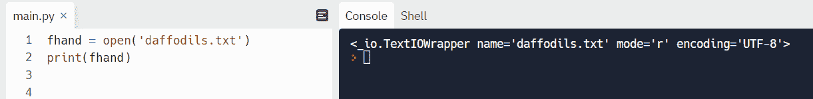
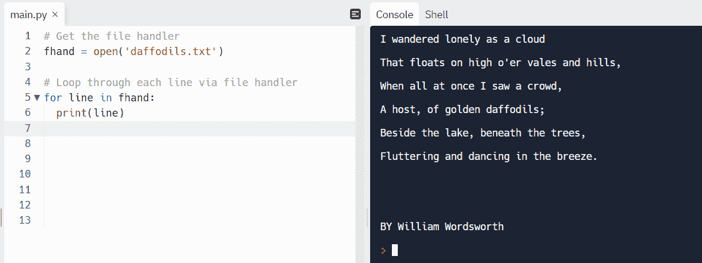
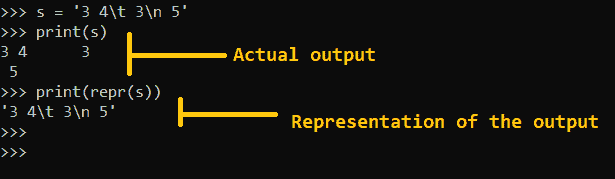
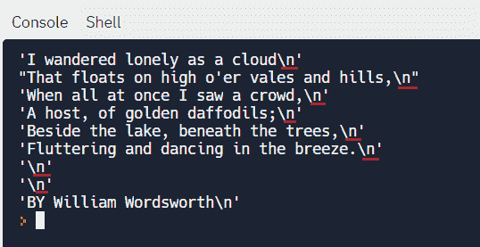
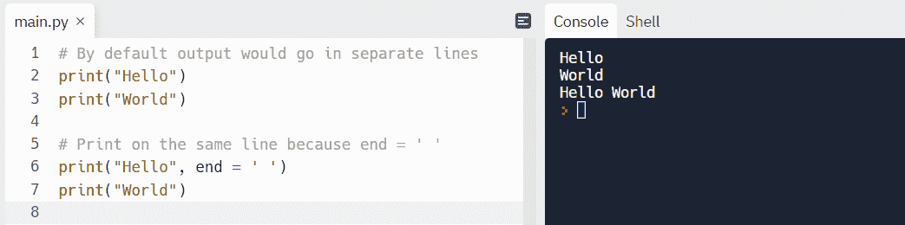
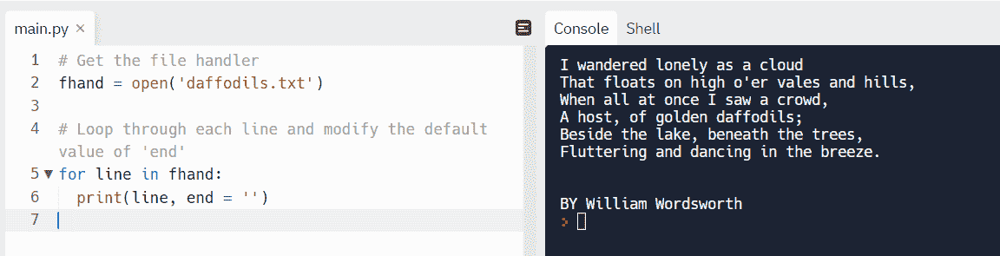
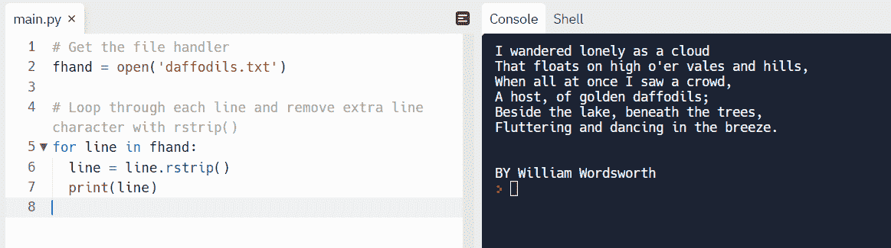
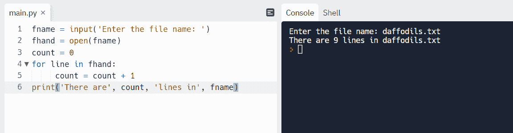
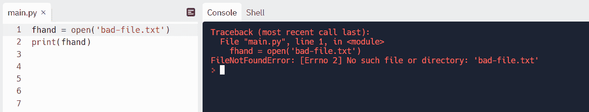
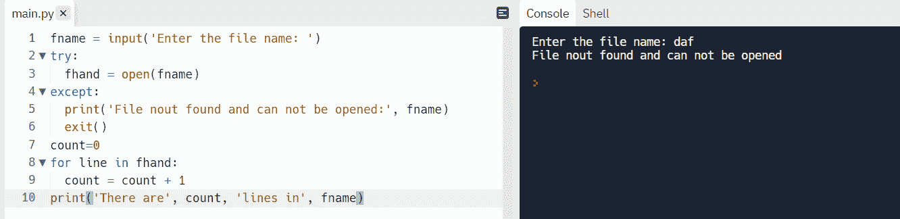

# Python 读文件——如何在 Python 中打开、读取和写入文件

> 原文：<https://www.freecodecamp.org/news/how-to-read-files-in-python/>

使用任何编程语言时，读写文件都是一种常见的操作。您可以编写代码从文件中读取数据或指令，然后再写入数据。这提高了效率，减少了人工劳动。

Python 有一套定义良好的打开、读取和写入文件的方法。Python 中文件操作的一些应用包括:读取用于算法训练和测试的数据、读取文件以创建创成式艺术、报告和读取配置文件。

在本教程中，您将学习:

1.  如何将文件加载到内存中并创建一个文件句柄。
2.  如何使用文件句柄打开文件进行读写？
3.  处理文件时的异常处理。

先决条件:

*   确保您安装了最新的 Python 版本。
*   熟悉您选择的任何 Python 支持的文本编辑器。
*   熟悉一些基本的 Python 语法。

要快速访问 Python IDE，请查看 [Replit](https://replit.com/~) 。您还可以克隆[这个](https://github.com/zairahira/read-files-python)回购并在 Replit 上运行它。

## 持久性以及如何将文件加载到主内存中

文件存在计算机的辅助存储器中。二级存储器是永久性的，这意味着当计算机关机时，数据不会被擦除。一旦您对文件进行更改并保存，这些更改将永久写入并保存在辅助存储器中。

要处理文件，我们需要先把它们装入主存。主存储器是临时的高速缓冲存储器，用于在短时间内保存请求的数据。电脑关机时，数据会丢失。


Files are loaded from secondary memory to the main memory and then processed by the CPU. Once the processing is done, the data is written back to the secondary memory.

Python 通过“**文件处理程序**”与加载到主存中的文件进行交互。让我们详细看看文件处理程序。

### 文件处理程序如何工作

当我们想读或写一个文件时，我们必须先*打开*它。打开一个文件会向操作系统发出信号，让它按文件名搜索文件，并确保它存在。

如果*打开*成功，操作系统返回一个文件处理程序。然后，我们可以通过文件处理程序与文件进行交互。

文件处理程序本身并不包含数据，它只是提供了一个处理文件操作的接口。


A file handler provides your program access to data in the secondary memory.

### 如何打开文件

在本例中，我们将打开文件`daffodils.txt`。请注意，该文件应该存储在与 Python 程序相同的文件夹中。你可以从[这个](https://github.com/zairahira/read-files-python/blob/main/daffodils.txt) GitHub 链接下载文件`daffodils.txt`。

一定要看一下这个文件，因为我们将在接下来的例子中使用它的内容。

**举例:**

```
fhand = open('daffodils.txt')
print(fhand)
```

在上面的例子中，如果*打开*成功，操作系统将返回变量`fhand`中的文件句柄。默认情况下，您只能读取该文件。

**输出:**



The output of a file handle.

在输出中，我们收到了一个文件句柄，其中`name`是文件名，`mode`是权限，在我们的例子中是`r`(代表`read`)。`encoding`是 Unicode 字符集的编码机制。你可以在这里了解更多关于 UTF-8 [的细节。](https://www.freecodecamp.org/news/what-is-utf-8-character-encoding/)

**异常:**

如果文件不存在，我们会得到如下异常:


Exception when the file is not found.

### 如何打印文件

现在我们有了文件句柄，这意味着我们可以访问文件。让我们打印文件并查看其内容。

**举例:**

```
# Get the file handler
fhand = open('daffodils.txt')

# Loop through each line via file handler
for line in fhand:
  print(line) 
```

**输出:**



Printing the contents of a file.

我们能够成功地访问和打印文件。但是，你有没有注意到我们每行之间都有多余的空行？这是有原因的。让我们在下一节看看。

### 如何处理额外的行空间

新的行字符在 Python 中由`\n`表示。该字符放在字符串中的任何位置时都会添加一个新行。

每行末尾有一个新的行字符，它将输出打印到下一行。我们可以使用`repr`方法将其可视化。

根据 Python [文档](https://docs.python.org/3/library/functions.html#repr),`repr()`方法返回一个包含一个对象的可打印表示的字符串。这意味着我们可以看到任何出现在字符串中的特殊字符，如`\t or a \n`。

让我们运行下面的例子，看看输出。



Representation of strings using `repr()`.

**举例:**

回到我们的文件，我们可以使用`repr()`来检查特殊字符。

```
# Get the file handler
fhand = open('daffodils.txt')

# Loop through each line via file handler
for line in fhand:
  print(repr(line)) 
```

**输出:**



Here we can see what's going on behind the scenes.

此外，默认情况下，print 方法会添加一个新行。这意味着使用 print，我们将在输出中获得另一个新行。我们可以使用两种方法来处理这一额外的行。

#### 方法 1:更改打印的默认最终值

下面的代码片段显示了`print`函数的参数。我们可以看到默认情况下`end`的值是`\n`。这意味着每个打印语句都将以一个`\n`结束。


Source: Python [documentation](https://docs.python.org/3/library/functions.html#:~:text=print(*objects%2C%20sep%3D%27%20%27%2C%20end%3D%27%5Cn%27%2C%20file%3Dsys.stdout%2C%20flush%3DFalse)).

我们可以将默认值`end='\n'`改为空白，这样我们就不会在每一行的末尾出现新的一行。让我们看看下面的例子，以便更好地理解。

```
# By default output would go in separate lines
print("Hello")
print("World")

# Print on the same line because end = ' '
# added single space
print("Hello", end = ' ') 
print("World") 
```

输出:



Print on the same and different lines using `print()`. 

回到我们的主文件，让我们稍微修改一下代码，得到没有多余空行的输出。

```
# Get the file handler
fhand = open('daffodils.txt')

# Loop through each line and modify the default value of 'end'
for line in fhand:
  print(line, end = '')
```

**输出:**

这就是我们想要的输出！



Print without extra lines using `print()`.

#### 方法 2:使用 rstrip()方法

我们可以使用`strip()`方法删除字符串中的某些字符。

现在我们知道，默认情况下，文件中的每一行末尾都有`"\n"`。由于我们只关心右边的字符，我们将使用代表右移的`rstrip()`。接下来我们将讨论一个`rstrip()`的例子。

你可以在这个博客[帖子](https://www.freecodecamp.org/news/python-strip-how-to-trim-a-string-or-line/)中了解更多关于`strip()`方法的信息。

```
# Get the file handler
fhand = open('daffodils.txt')

# Loop through each line and remove extra line character with rstrip()
for line in fhand:
  line = line.rstrip()
  print(line) 
```

输出:



Print without extra lines using rstrip`()`.

### 如何让用户选择一个文件

我们可以通过让用户选择一个文件来使代码动态化，而不是硬编码一个文件名。

让我们要求用户输入一个文件名。然后我们将计算文件中的行数。

**举例:**

```
fname = input('Enter the file name: ')
fhand = open(fname)
count = 0
for line in fhand:
     count = count + 1
print('There are', count, 'lines in', fname)
```

Ask the user to enter a filename.

**输出:**



Request the user to enter the file name.

### 如何用 Python 写文件

默认情况下，文件处理程序以读取模式打开文件。如果我们使用以下任一模式打开文件，就可以写入文件:

*   `w` - (Write)写入现有文件，但删除现有内容。
*   `a` - (Append)追加到现有文件。
*   创建一个文件，如果文件存在则返回一个错误。

#### 如何写入文件

注意，如果我们试图打开一个已经存在的带有`w`标志的文件，其内容将被覆盖。

```
# Open file with mode 'w'
fout = open('flower.txt', 'w')
fout.write("This content would be added and existing would be discarded")
fout.close() 
```

#### 如何追加到文件中

`a`标志附加到现有内容并保留现有内容。

```
# Open file with mode 'a'
fout = open('flower.txt', 'a')
fout.write("Now the file has more content at the end!")
fout.close() 
```

#### 如何创建一个文件并写入其中

`x`模式创建一个文件并向其中添加内容。

```
# Open file with mode 'x'
fout = open('new-file.txt', 'x')
fout.write("Now the new file has some content!")
fout.close() 
```

如果文件存在，我们将得到如下异常:

```
Traceback (most recent call last):
  File "main.py", line 2, in <module>
    fout = open('flower.txt', 'x')
FileExistsError: [Errno 17] File exists: 'flower.txt'
```

### 异常处理

我们请求的文件可能不存在。这将由于异常而破坏程序:



为了使程序更加用户友好，我们可以在`try-except`块中处理这个异常。

程序中有风险的部分被写在一个`try`块中。如果代码执行没有异常，则跳过`except`块，程序继续运行。如果发现异常，`except`模块运行并使用`exit`命令正常关闭程序。

```
fname = input('Enter the file name: ')
try:
  fhand = open(fname)
except:
  print('File nout found and can not be opened:', fname)
  exit()
count=0
for line in fhand:
  count = count + 1
print('There are', count, 'lines in', fname)
```

**输出:**



Exception handling using a try-except block.

## 包扎

知道如何处理文件是编程中的一个基本概念。在本教程中，您学习了如何使用文件处理程序在 Python 中打开文件进行读写。

作为参考，我在[这个](https://github.com/zairahira/read-files-python) GitHub repo 中包含了所有的代码片段和样本文件。

我希望这篇教程对你有所帮助。

你从这个教程中学到的最喜欢的东西是什么？在 [Twitter](https://twitter.com/hira_zaira) 上告诉我！

你也可以在这里阅读我的其他帖子[。](https://www.freecodecamp.org/news/author/zaira/)

横幅广告:

*   由 svstudioart-www.freepik.com 创建的 Php 矢量
*   [free pik-www.freepik.com 创建的网站主题向量](https://www.freepik.com/vectors/website-theme)