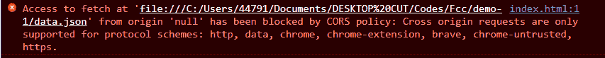
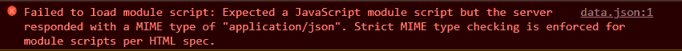

# 如何在 JavaScript 中读取 JSON 文件——在 JS 中读取 JSON

> 原文：<https://www.freecodecamp.org/news/how-to-read-json-file-in-javascript/>

当从外部数据源或服务器获取数据时，您需要确保返回的数据是 JSON 格式的。然后，您可以在应用程序中使用这些数据。

在某些情况下，当您在本地工作或者将数据文件上传到服务器时，我们可能希望从文件中读取这些 JSON 数据。

我们将在本教程中学习如何做到这一点。

## 如何使用 Fetch API 读取 JavaScript 中的 JSON 文件

我们可以用来读取 JSON 文件(本地文件或上传到服务器的文件)的一个标准方法是使用 Fetch API。两者使用相同的语法。唯一的区别是网址。

例如，假设我们的项目文件夹中有一个名为`data.json`的本地文件，其中包含以下 JSON 数据:

```
<!--./data.JSON-->

{
    "id": 1,
    "title": "Hello World",
    "completed": false
} 
```

我们现在可以使用 Fetch API 方法在 JavaScript 中读取该文件:

```
<!--./index.js-->

fetch('./data.json')
    .then((response) => response.json())
    .then((json) => console.log(json)); 
```

在上面，我们已经能够读取一个本地 JSON 文件。但不幸的是，当我们在浏览器中运行时，我们可能会得到以下 CORS 错误，因为我们的文件不在服务器上:



为了解决这个问题，我们将确保我们的 JSON 文件在本地或远程服务器上。如果我们在 IDE 上使用实时服务器，就不会出现这个错误。但是当我们直接加载我们的文件时，我们会得到这个错误。

正如我前面所说的，假设我们在远程服务器上有这个 JSON 文件，并试图用 JavaScript 读取这个文件。同样的语法也适用:

```
<!--./index.js-->

fetch('https://server.com/data.json')
    .then((response) => response.json())
    .then((json) => console.log(json)); 
```

当我们想从外部服务器或本地文件读取 JSON 文件到 JavaScript 文件时，fetch API 是更好的方法。

## 如何用 Import 语句读取 JavaScript 中的 JSON 文件

除了发出 HTTP 请求之外，我们可以使用的另一种方法是 import 语句。这种方法有一些复杂性，但是我们将解决它们。

就像上一节一样，假设我们有保存用户数据的 JSON 文件，比如`user.json`:

```
<!--./user.JSON-->

{
    "id": 1,
    "name": "John Doe",
    "age": 12
} 
```

我们可以这样使用 import 语句在 JavaScript 中读取 JSON 数据:

```
<!---./index.js-->

import data from './data.json';
console.log(data); 
```

不幸的是，这将抛出一个错误，指出我们不能在模块外使用 import 语句。当我们试图在常规 JavaScript 文件中使用`import`语句时，这是一个标准错误，尤其是对于不熟悉 JavaScript 的开发人员。

要解决这个问题，我们可以在 HTML 文件中引用 JavaScript 文件的地方添加`type="module"`脚本标签，如下所示:

```
<html lang="en">
    // ...
    <body>
        <script type="module" src="./index.js"></script>
    </body>
</html> 
```

当我们这样做时，我们仍然会得到另一个错误:



要修复这个错误，我们需要将 JSON 的文件类型添加到 import 语句中，然后我们将能够用 JavaScript 读取我们的 JSON 文件:

```
import data from './data.json' assert { type: 'JSON' };
console.log(data); 
```

只要我们在本地或远程服务器上运行我们的文件，这就能完美地工作。但是假设我们在本地运行这个——那么我们会得到 CORS 误差。


## 包扎

在本文中，我们学习了如何用 JavaScript 读取 JSON 文件，以及在使用每种方法时可能遇到的错误。

当您想要发出 HTTP 请求时，最好使用 fetch API 方法。例如，假设我们从一个模拟的 JSON 文件中获取数据，我们最终将从一个 API 中提取数据。

不过，在不需要使用 HTTP 请求的情况下，我们可以使用 import 语句。当我们使用 React、Vue 等与模块有关的库时，我们可以使用 import 语句。这意味着我们不需要添加模块的类型，也不需要添加文件的类型。

这两种方法都不需要您安装软件包或使用库，因为它们是内置的。选择使用哪种方法完全取决于你。

但是区分这些方法的一个小技巧是，Fetch API 通过发送 HTTP 请求来读取 JavaScript 中的 JSON 文件，而 import 语句不需要任何 HTTP 请求，而是像我们进行的其他导入一样工作。