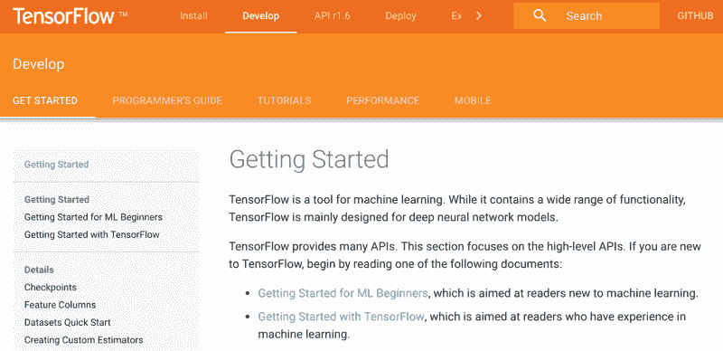
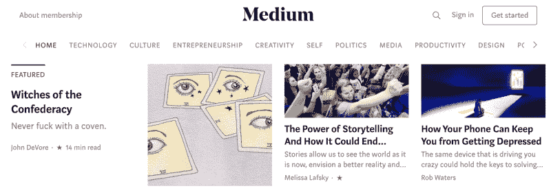
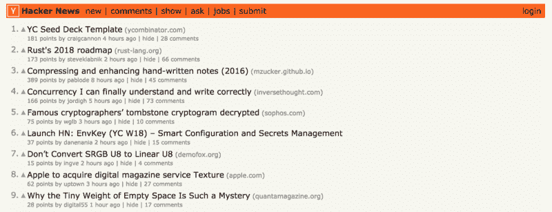
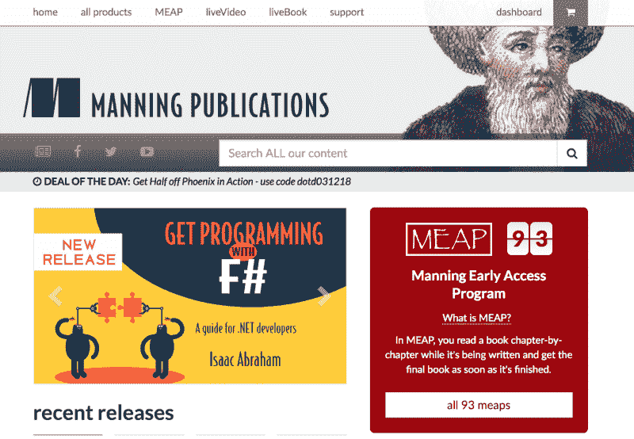
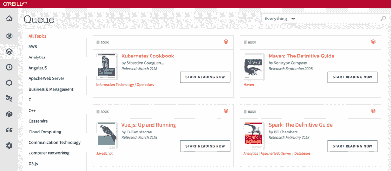
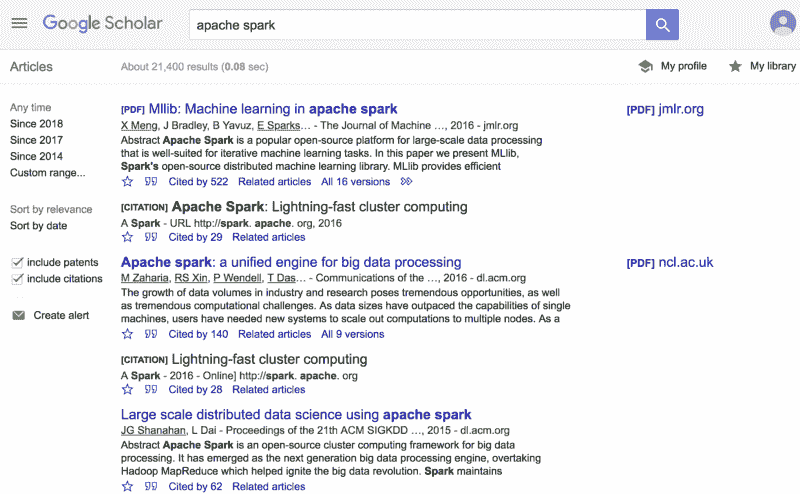
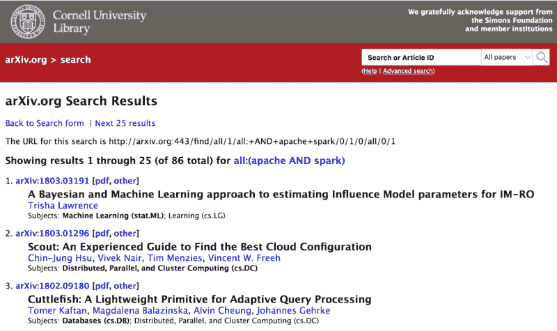
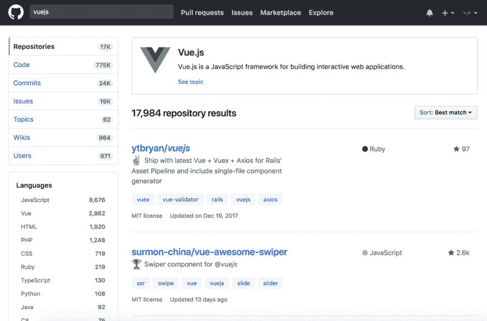

# 如何阅读成为更好的开发人员的方法

> 原文：<https://www.freecodecamp.org/news/how-to-read-your-way-to-becoming-a-better-developer-b6432fa5bc0c/>

诺兰·格雷斯

# 如何阅读成为更好的开发人员的方法

如果你想在编程方面做得更好，你需要做两件事:

**写代码**和**读一切**！

我写软件已经很长时间了，我有机会在许多不同的环境中学习编程。我独自努力解决问题，与团队合作，我甚至有机会在大学环境中学习。通过我所有的经历，我发现成为一个更好的程序员的最好方法是写代码和阅读一切！一旦你停止做任何一件事，你就会减慢你技能的进步。

太多的人对编写代码如此兴奋，以至于他们有时会忘记尽职调查。写代码很有趣，我也犯了忽视文档的错误。不管是旧工具还是新工具，总会有更多东西需要学习。如果你在开始使用新工具之前确保自己有一个良好的基础，你将会为自己节省大量的时间和精力。

为了帮助你的旅程，我想提供我最喜欢的阅读技术主题的资源。享受吧。

### **正式文件**

当您已经知道想要使用的工具时，最好从官方文档开始。当处理新的东西时，抑制住直接进入的冲动——首先浏览文档。

您将节省自己的时间和精力，同时成为一名更好的开发人员。当你阅读时，你不仅仅是在学习一个主题。您正在扩展您对整个软件开发领域的理解，并使您更容易学习下一个主题。

最起码，浏览一遍入门教程，并完成所有示例。在继续学习之前，确保你理解了一门新语言或框架的简单部分。

许多开发人员不喜欢写文档，所以如果你发现高质量的信息，那是因为作者认为它会有所帮助。

### **网上文章**

接下来，您应该在网上出版物中寻找关于技术主题的最新信息。既然你正在读这篇文章，我可以假设你已经发现了[媒介](https://medium.com/)。Medium 是我最喜欢的文章和博客来源。

Medium 包含大量技术和非技术主题的信息。如果你对某个话题感兴趣，你很有可能在 Medium 上找到关于这个话题的文章。

Medium 的另一个优点是，广泛的主题不会降低信息的质量和深度。其他出版物为了争取更多的读者，在信息的深度和质量上有所损失。Medium 的包容性和易用性使其成为查找优质信息和发布您自己的内容的最佳场所。

一定要看看我在 Medium 上最喜欢的两本出版物: [freeCodeCamp](https://medium.freecodecamp.org/) 和 [HackerNoon](https://hackernoon.com/) 。

我下一个最喜欢的在线文章来源是[黑客新闻](https://news.ycombinator.com/)。黑客新闻是一个由创业孵化器 Y Combinator 管理的网站。Hacker news 允许用户发布技术内容的链接，这些链接可以由社区根据质量进行投票表决。

《黑客新闻》很像 Reddit，但没那么铺天盖地。黑客新闻只有一个社区策划的信息来源。这使得每天早上浏览和阅读文章变得很容易。

### **编程书籍**

我最喜欢的学习新事物的来源是编程书籍！

我最喜欢的编程书籍出版商是[曼宁出版社](https://www.manning.com/)和[奥莱利出版社](https://www.oreilly.com/)。两家公司都出版了大量主题的书籍。

有了这两个出版商，你一定能找到你需要的信息——从最新的神经网络框架到帮助使用遗留系统。

我要给你一个忠告，这个忠告我可是吃了苦头才知道的。如果你更喜欢阅读纸质书，我建议你学会爱上你的电子阅读器。有太多不同的书和太多编程文本的更新。

我是实体书的狂热支持者，我收藏了大量实体书。这一切都很好，直到我搬走了！在搬了一箱又一箱沉重的书之后，我学会了喜欢在 iPad 上阅读。所以从我的经历中吸取教训，给自己订阅[野生动物园在线图书](https://www.safaribooksonline.com/)。

Safari 在线图书是一项按月订阅的服务，让您可以获得比您所能阅读的更多的技术书籍。它现在归奥赖利出版社所有，但他们继续提供曼宁出版社和许多其他出版商的书籍。Safari 在线图书是我做过的最好的投资之一。

### **研究论文**

现在来看一个更可怕的信息来源。阅读研究论文可能会让人望而生畏，但它值得你花时间去做。这个世界充满了杰出的人。那么，为什么不利用最优秀、最聪明的人的工作呢？

你可能会告诉自己，研究论文太复杂或太难阅读。嗯，一个简单的谷歌搜索会告诉你你并不孤单。

研究论文一开始可能会令人生畏，但不要气馁。

慢慢来，遵循以下建议:

1.  阅读摘要
2.  看图表
3.  阅读结论
4.  决定这篇文章是否值得一读

当你遇到不懂的东西时，做个笔记或者在文章中间查一下。随着你的学习，阅读研究论文会越来越容易。如果你偶然看到另一篇研究论文的重要参考文献，停下来看看参考文献。有时候，先阅读另一篇文章或者至少了解一下主题是有好处的。

寻找优秀研究论文的最佳起点是工具文档。许多应用程序和框架最初是作为大学或公司研究项目的一部分出现的。例如， [Apache Spark](https://spark.apache.org/) 诞生于加州大学柏克莱分校的 [AmpLab](https://amplab.cs.berkeley.edu/) 。你可以在 AmpLab 网站或[官方 Apache Spark 文档](https://spark.apache.org/research.html)中找到更多关于 Apache Spark 的研究、开发和历史的信息。

其他一些寻找研究论文的好资源有[谷歌学术](https://scholar.google.dk/)或 [arXiv](https://arxiv.org/) 。这两个网站都允许你搜索和阅读现有的研究论文。

如果你正在寻找一种服务来做更多的繁重工作，你可能会想要订阅 [DeepDyve](https://www.deepdyve.com/) 。

DeepDyve 是一种订阅服务，让数以千计的研究期刊触手可及。DeepDyve 甚至会根据你的阅读历史推荐研究论文。当你开始阅读研究论文时，这项服务非常有用。

### **别人的代码**

最后但同样重要的是，你应该阅读其他人的代码。转到 [GitHub](https://github.com/) 。找到相关的项目，看看其他人是如何编程的。

看到真实项目的代码会给你一个不同于书本和研究论文的观点。有时候编程会变得很混乱。在一个完美的世界中使用一个工具可能与在现实世界中如何使用它有很大的不同。因此，从身处前线的人那里获取观点总是有用的。

在你走之前，我想给你最后一个建议。你学得越多，你就越觉得自己愚蠢。你会意识到还有更多的东西需要了解。拥抱这种感觉，把它当成一种成就。一步一步地学习新东西。接受你永远不会知道一切的事实。依靠别人来帮助你。尽可能多的学习，成为别人可以依靠的人。

现在你可以走了！阅读和学习新的东西！

如果你有其他帮助你学习的信息来源，请在下面的评论中告诉我。我总是在寻找新的信息来源！感谢阅读。我希望这些信息能帮助你成为一名更好的开发人员。