# 如何使用 AWS SES、Lambda 和 API Gateway 接收来自您站点的“联系我们”表单的电子邮件

> 原文：<https://www.freecodecamp.org/news/how-to-receive-emails-via-your-sites-contact-us-form-with-aws-ses-lambda-api-gateway/>

我最近为一个客户建立了一个简单的登陆页面网站，这个客户想要通过他们的网站接收电子邮件而不共享他们的电子邮件。

老实说，我以前从未尝试过自己实现这个功能。我总是习惯有一个简单的“联系我们”按钮，它有一个锚标记和一个在 *href* 属性中的`mailto`，就像这样:

```
<button>
	<a href="mailto:myemail@example.com">Contact Me</a>
</button> 
```

但是这种方法有两个不便之处:

1.  它迫使双方，想要发送信息的用户和接收信息的网站所有者，互相分享他们的电子邮件。虽然这对于一些人来说没问题，但对于注重隐私的人来说并不理想。
2.  对于网站访问者来说，单击链接会迫使他们在自己的设备上打开默认的邮件程序，这可能会令人沮丧。如果他们用的是公共电脑呢？如果他们没有登录呢？如果他们只是不想使用他们的邮件程序呢？是的，从技术上来说，他们可以获取收件人的电子邮件地址，然后通过他们的浏览器或他们登录的任何地方发送消息。但这些都是额外的步骤和障碍，会阻碍用户发送信息，企业可能会失去潜在的反馈或机会。

出于这个原因，我们选择了电子邮件形式，用户可以简单地写下他们的信息，然后点击提交，向网站所有者发送电子邮件，而无需离开网站。

快速谷歌搜索显示，有第三方工具/部件可以嵌入到网站中，但大多数都是品牌化的，需要付费订阅才能完全定制。

除非你使用像 WordPress 这样有内置插件的 CMS，否则这是一笔不方便的经常性费用。

相反，我选择自己编写这个特性，这样我就可以完全控制它。

出于本指南的目的，我将重新创建使用 HTML 和 AWS 服务实现该功能的步骤。

## HTML 表单

这里我将保持它的超级简单，使用一个没有 CSS 的基本 HTML 表单，只是为了测试我们想要的功能。

```
<h2>Contact Us</h2>
<form>
  <label for="name">Name:</label>
  <input name="name" type="text"/><br/><br/>
  <label for="email">Email:</label>
  <input name="email" type="email"/><br/><br/>
  <label for="name">Message:</label>
  <textarea name="message"></textarea><br/><br/>
  <input type="submit"/>
  <div>
    <p id="result-text"></p>
  </div>
</form> 
```

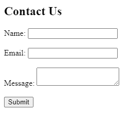

Nothing fancy to see here...

现在我们想用 JavaScript 处理提交功能。

```
const form = document.querySelector('form')
form.addEventListener('submit', event => {
  // prevent the form submit from refreshing the page
  event.preventDefault()

  const { name, email, message } = event.target
  console.log('Name: ', name.value)
  console.log('email: ', email.value)
  console.log('Message: ', message.value)

}) 
```

此时，我们有了一个从用户那里获得输入的表单和 JavaScript 代码，该代码只是向控制台显示结果。

我们现在可以把它留在那里，并开始处理后端服务，该服务将接收表单数据并发送包含该数据的电子邮件。

## 后端概述

让我们深入研究 AWS，以及我们将使用哪些服务以及如何使用。

如题，我们将使用 **AWS Lambda** 和**简单邮件服务** (SES)。SES 是一种无服务器消息服务，允许您在调用时发送电子邮件。AWS Lambda 允许您编写服务器端代码来响应事件。

我们还将使用 **API 网关**，它使我们能够通过 HTTP 调用 Lambda 函数。

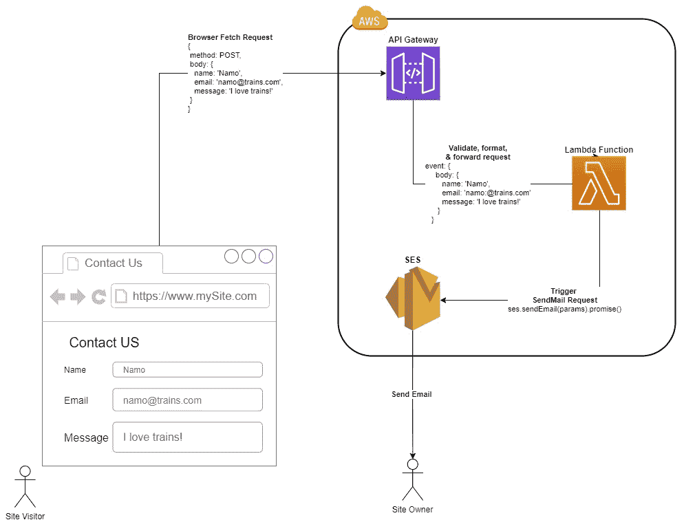

在这种情况下，当提交我们的表单时，将发生以下工作流:

1.  我们的浏览器(JavaScript)将向 AWS API Gateway 指定的端点 URL 发出 post 请求，请求体中包含表单数据
2.  API 网关将验证这个请求。然后它将触发 Lambda 函数，该函数接受一个事件参数。API Gateway 会将表单数据放入事件参数的 body 属性中。
3.  我们的 Lambda 函数将从事件正文中提取数据，然后我们将使用这些数据来构建我们要发送的电子邮件正文及其收件人。然后，我们的函数将使用 AWS SDK 通过电子邮件数据调用 SES。
4.  一旦 SES 收到 *sendMail* 请求，它会将电子邮件数据转换成实际的文本电子邮件，并通过 AWS 自己的邮件服务器发送给收件人。

发送电子邮件后，我们的浏览器将收到一个状态代码为 200 的响应和一条成功消息。如果 AWS 云中的任何步骤失败，响应将会有一个 500 状态代码。

## 步骤 1:如何设置 SES

实际上，我们将按照相反的顺序设置每一个步骤，从 SES 开始，这将会更容易。

首先在 AWS 控制台中，转到 SES 服务—>然后在侧边菜单中单击电子邮件地址—>然后单击“验证新的电子邮件地址”按钮。

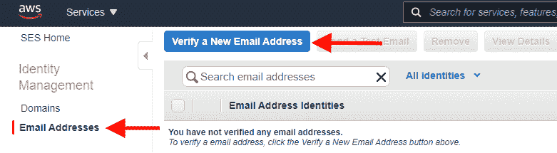

在打开的对话框中，输入您希望 SES 服务在发送电子邮件时作为*发件人*的电子邮件地址。

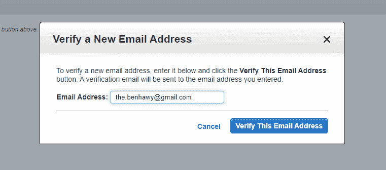

这将向您输入的电子邮件地址发送一封电子邮件，其中包含一个可点击验证的链接。这就是 AWS 知道电子邮件的所有者同意将他们的电子邮件地址用作发件人地址的方式。

在您验证电子邮件之前，SES 电子邮件控制面板会将验证状态保持为待定。

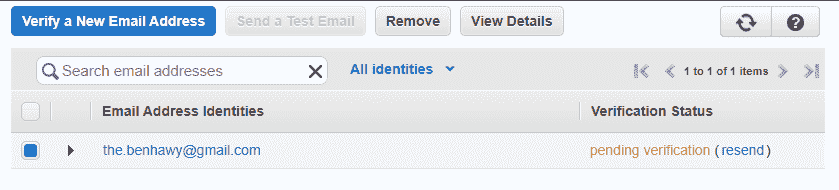

一旦电子邮件所有者打开他们从 AWS 收到的电子邮件，并单击其中的验证链接，验证状态应该更改为已验证(刷新页面以查看更改)。

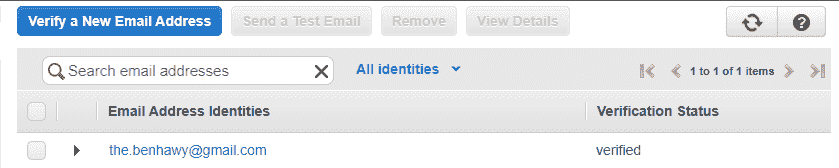

这就是你要为 SES 做的一切。您可以选择测试服务，方法是在列表中选择您已验证的电子邮件，然后单击“发送测试电子邮件”按钮。这将让您输入收件人的电子邮件地址、主题和消息，然后发送出去。

发送的电子邮件将由 AWS 服务器签名，您的验证地址应该是发件人。它应该是这样的:

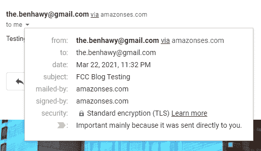

## 步骤 2:如何设置 Lambda

这是最有趣的部分。我们将创建一个接收表单数据并调用 SES 的函数。

Lambda 函数的美妙之处在于，你不必担心在服务器上 24/7 运行你的后端代码和维护那个服务器。是*无服务器*。

但这并不意味着不涉及服务器。AWS 会在幕后处理这些事情，这样你就可以专注于编写代码，而不是维护服务器。此外，你只需要为你的函数被调用的次数和它执行的时间量付费，而且非常便宜！

### 创建并配置 IAM 角色

在我们开始编写 lambda 函数之前，我们需要创建一个 IAM *角色*来将它附加到函数上，并授予它调用 SES 服务的权限(在 AWS 中称为策略)。

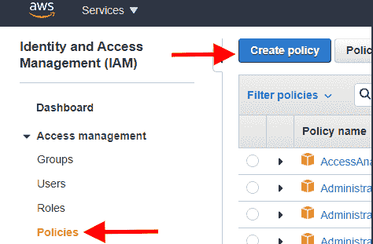

从您的 AWS 控制台，转到 IAM 服务—>单击侧面菜单中的策略—>然后单击“创建策略”按钮。

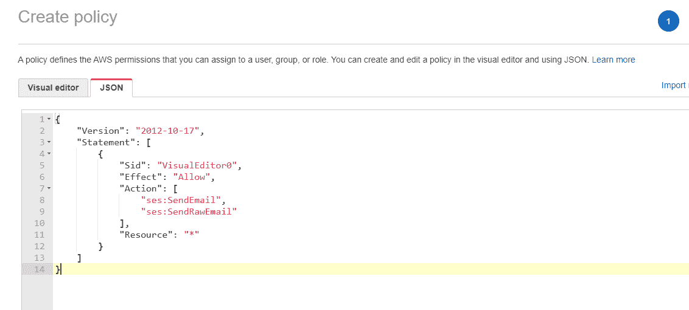

在策略创建页面中，转到 JSON 选项卡并粘贴以下权限，然后单击 Next。

```
{
    "Version": "2012-10-17",
    "Statement": [
        {
            "Sid": "VisualEditor0",
            "Effect": "Allow",
            "Action": [
                "ses:SendEmail",
                "ses:SendRawEmail"
            ],
            "Resource": "*"
        }
    ]
} 
```

在第三个屏幕中，命名策略并单击“Create Policy”按钮。

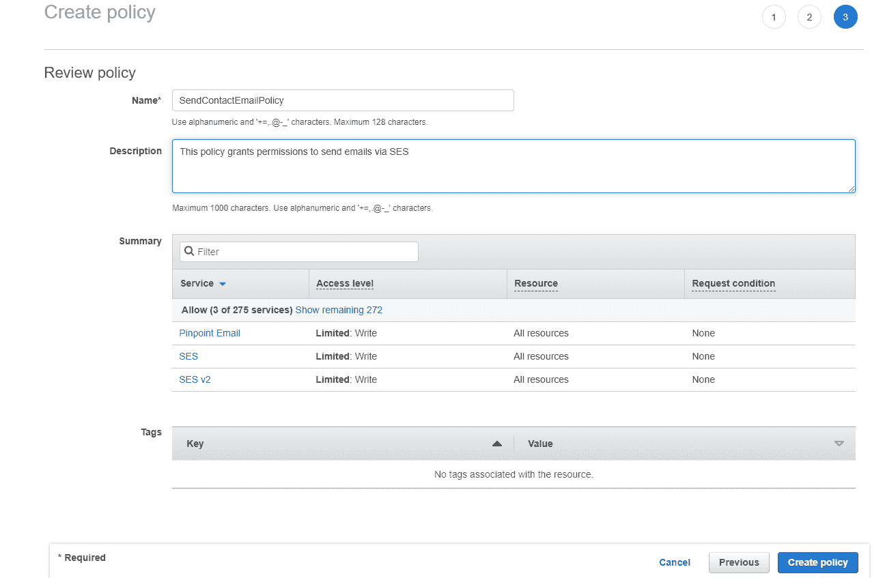

现在我们创建一个 IAM *角色*，它将被附加到 lambda 并链接到我们刚刚创建的权限策略。

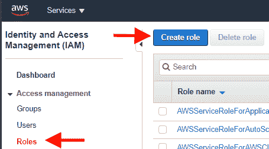

从 IAM 侧菜单中，单击“角色”,然后单击“创建角色”按钮。

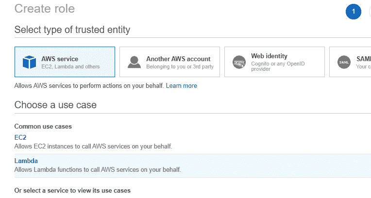

在角色创建屏幕中，确保选择的类型是“AWS service ”,并选择 Lambda 案例，然后单击“Next:Permissions”按钮。

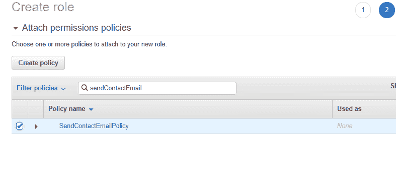

在下一个屏幕上，通过名称搜索我们之前创建的策略并选择它，然后单击 next。

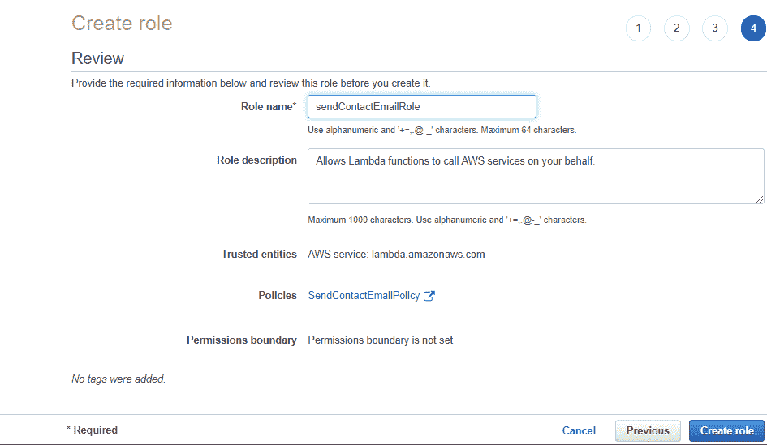

在审核屏幕上，为角色取一个您能记住的名称，然后单击“创建角色”。

现在我们可以创建一个新的 lambda 函数。转到 Lambda service dashboard 并单击“创建函数”按钮。

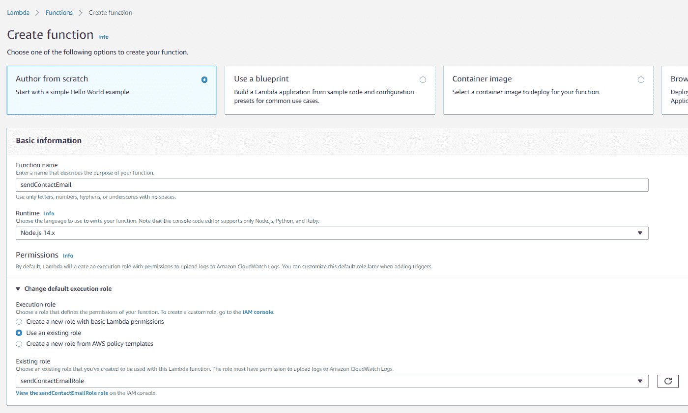

在函数创建屏幕中，命名您的函数，选择“从头开始创作”选项，并选择 Node.js 作为运行时。

在“更改默认执行角色”下，选择“使用现有角色”选项，然后从“现有角色”下拉列表中选择您在上一步中创建的角色的名称。

最后，单击“创建函数”按钮创建函数。

### 编写代码并测试它

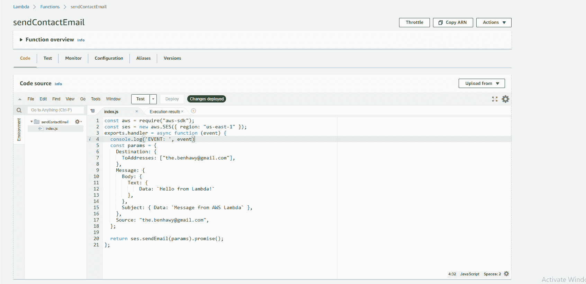

在编辑器中，打开 index.js 文件(这是调用 lambda 时将执行的文件)，并用以下代码替换其内容:

```
const aws = require("aws-sdk");
const ses = new aws.SES({ region: "us-east-1" });
exports.handler = async function (event) {
  console.log('EVENT: ', event)
  const params = {
    Destination: {
      ToAddresses: ["your@email.com"],
    },
    Message: {
      Body: {
        Text: { 
            Data: `Hello from Lambda!` 
        },
      },
      Subject: { Data: `Message from AWS Lambda` },
    },
    Source: "your@email.com",
  };

  return ses.sendEmail(params).promise()
}; 
```

注意，在第 2 行，我们使用 AWS SDK 并创建一个 SES 实例。我选择 **us-east-1** 作为地区的原因是因为那是我注册&验证我的电子邮件的*。请务必更换电子邮件，并使用您注册电子邮件的 AWS 区域。*

现在，要测试该功能，请单击“部署”按钮。然后点击 Test 按钮—> Configure test event，这将打开一个测试配置对话框，您可以在其中创建一个新的测试事件。

在测试事件主体编辑器中，输入下面的 JSON，它模拟了最终来自浏览器请求的内容。然后单击创建。

```
{
  "body": {
        "senderName": "Namo",
        "senderEmail": "namo@trains.com",
        "message": "I love trains!"
    }
} 
```

现在，单击 test 按钮将运行我们刚刚创建的测试。它应该在编辑器中打开一个新的选项卡，向我们显示运行该函数所创建的日志，看起来应该是这样的:

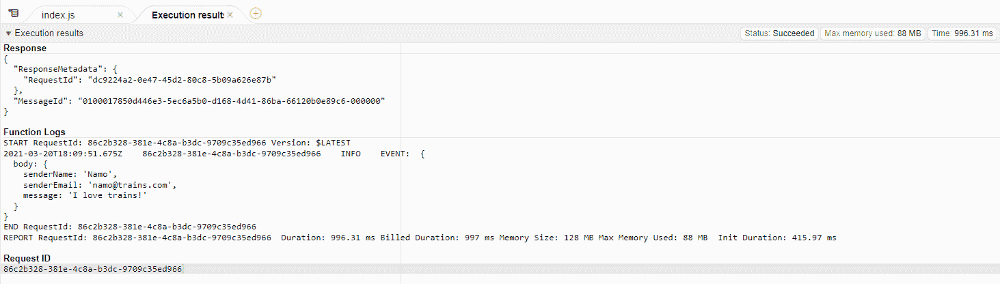

请注意，我们注销的事件对象显示在 Function logs 下，带有我们在测试事件中使用的主体数据。

这个测试也应该向我的收件箱发送一封电子邮件——让我们看看是否发生了这种情况。

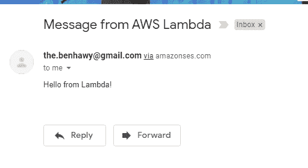

是的，正如我所料。这几乎是在运行测试后立即发生的。

现在让我们修改我们的函数代码，以便从测试数据中获得更有意义的信息。

```
const aws = require("aws-sdk");
const ses = new aws.SES({ region: "us-east-1" });
exports.handler = async function (event) {
  console.log('EVENT: ', event)
	// Extract the properties from the event body
  const { senderEmail, senderName, message } = JSON.parse(event.body)
  const params = {
    Destination: {
      ToAddresses: ["the.benhawy@gmail.com"],
    },
		// Interpolate the data in the strings to send
    Message: {
      Body: {
        Text: { 
            Data: `You just got a message from ${senderName} - ${senderEmail}:
            ${message}` 
        },
      },
      Subject: { Data: `Message from ${senderName}` },
    },
    Source: "the.benhawy@gmail.com",
  };

  return ses.sendEmail(params).promise();
}; 
```

值得注意的是，当 API Gateway 调用我们的函数时，它会向事件主体传递一个字符串。这就是为什么我在 event.body 上使用`JSON.parse`,将它转换成 JSON 并提取发件人的电子邮件、姓名和消息。然后，我使用字符串插值在电子邮件正文和主题中使用这些变量。

如果您尝试测试它，代码将返回一个错误。这是因为测试将一个 JSON 对象传递给 event.body，而我们在 JSON 上使用 JSON.parse，这会导致 JavaScript 出错。

遗憾的是，测试编辑器不允许我们向事件传递字符串，所以我们必须稍后从其他地方测试。

## 步骤 3:如何设置 API 网关

接下来，我们要使用的最后一个 AWS 服务是 API Gateway，它将使我们的浏览器能够向我们创建的 Lambda 函数发送 HTTP 请求。


不要离开你的 lambda 函数页面，展开“函数概述”部分，点击“添加触发器”。

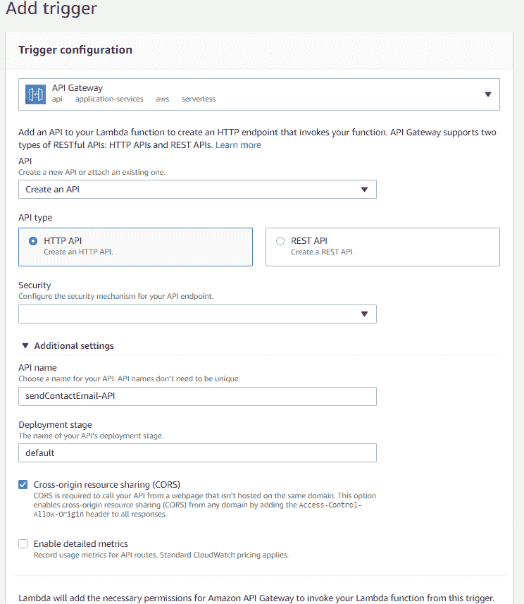

接下来，从下拉列表中选择 API Gateway，HTTP API 作为 API 类型，“Open”作为安全机制，并选中 CORS 复选框选项。然后点击“添加”。

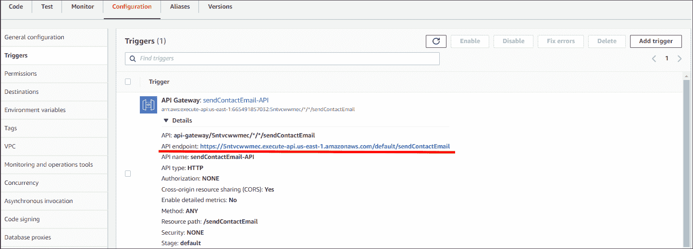

您应该被重定向到函数的“Configuration”选项卡，向您显示刚刚创建的新 API Gateway 触发器。从这里开始，注意 **API 端点**。这是我们将从浏览器中调用的带有表单数据的 URL。

## 回到 HTML

我们最终可以测试表单，看看它是否发送电子邮件。

让我们修改 JavaScript 来处理表单提交时的请求发送。

```
const form = document.querySelector("form");
form.addEventListener("submit", (event) => {
  // prevent the form submit from refreshing the page
  event.preventDefault();

  const { name, email, message } = event.target;

	// Use your API endpoint URL you copied from the previous step
  const endpoint =
    "<https://5ntvcwwmec.execute-api.us-east-1.amazonaws.com/default/sendContactEmail>";
  // We use JSON.stringify here so the data can be sent as a string via HTTP
	const body = JSON.stringify({
    senderName: name.value,
    senderEmail: email.value,
    message: message.value
  });
  const requestOptions = {
    method: "POST",
    body
  };

  fetch(endpoint, requestOptions)
    .then((response) => {
      if (!response.ok) throw new Error("Error in fetch");
      return response.json();
    })
    .then((response) => {
      document.getElementById("result-text").innerText =
        "Email sent successfully!";
    })
    .catch((error) => {
      document.getElementById("result-text").innerText =
        "An unkown error occured.";
    });
}); 
```

现在，关键时刻到了:填写表格并点击提交。如果您看到成功消息，这意味着电子邮件已发送。

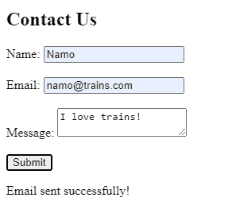

因为我拥有邮件发送到的电子邮件，所以我快速看了一下我的收件箱，看到我收到了一封来自我自己的电子邮件，其中包含了我在表单中使用的详细信息！

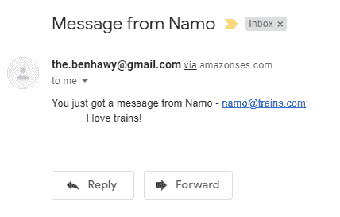

如果你已经遵循了，你现在有一个功能“联系我们”的形式，你可以插入到任何网站。而且只有在实际使用的时候你才会收到账单。

我不知道你怎么想，但我认为这很棒，几乎是不可思议的！在你的工作流程中使用云计算/服务是一种很好的、实用的方式。

当然，你可以在前端使用 React 或 Vue 之类的框架，或者使用 Python 或 Go 之类的 Lambda 编程语言来定制这个流程。

## 在你走之前...

谢谢你读到这里！我写了一些关于 JavaScript、云开发以及我作为一名自学成才的开发人员的个人教育和职业经历的帖子。所以请随时关注我的推特 [@adham_benhawy](https://twitter.com/adham_benhawy) ，我也会在推特上发布关于他们的消息！

### 资源

*   [https://AWS . Amazon . com/premium support/knowledge-center/lambda-send-email-ses/](https://aws.amazon.com/premiumsupport/knowledge-center/lambda-send-email-ses/)
*   [https://docs . AWS . Amazon . com/lambda/latest/DG/lambda-invocation . html](https://docs.aws.amazon.com/lambda/latest/dg/lambda-invocation.html)
*   [https://docs . AWS . Amazon . com/lambda/latest/DG/services-API gateway . html？icmpid=docs_lambda_console](https://docs.aws.amazon.com/lambda/latest/dg/services-apigateway.html?icmpid=docs_lambda_console)