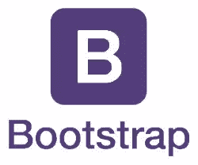
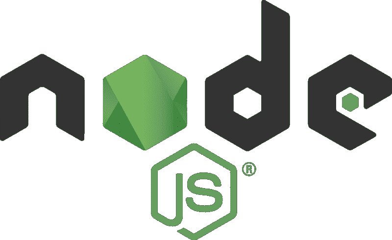
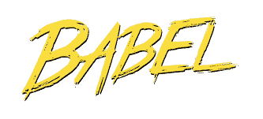

# 如何认可您的开源项目贡献者并扩大您的社区

> 原文：<https://www.freecodecamp.org/news/how-to-recognize-your-open-source-project-contributors-and-grow-your-community-3eaa472344ab/>

大卫·赫伦

# 如何认可您的开源项目贡献者并扩大您的社区

有一个不言而喻的事实——如果一个社区没有增长，它就在慢慢死亡。你的开源社区怎么样了？你的贡献者基础是停滞、萎缩还是增长？您是否像许多开源社区领导者一样，不知道如何鼓励新的参与者？

关于围绕开源项目增加活动，有很多观点。成功地构建一个开源社区驱动的项目不仅仅是把你的代码扔在 Github 上，在公开的地方进行开发。

人们必须知道项目的存在，你对贡献是开放的，贡献过程是什么，项目中的编码实践，等等。

一个非常明显的策略是建立一些人所谓的“社会证明”。也就是说，项目当前正在接收贡献的某种视觉指示器。

“社区”这个词在上下文中是什么意思？

“社区”是一群人为了共同的目的或共同的目标而聚集在一起。传统的意思是生活在城镇里的人们，他们的共同目标是在那个城市里和平地生活在一起。

但是社区可以为其他目的而形成。例如，一个关于电动摩托车的脸书小组将举办电动摩托车品牌、在哪里骑、如何维护或定制自行车等讨论。随着成员们通过讨论电动摩托车相互了解，他们形成了一个社区。

同样，维护开源软件项目的人们也形成了一个社区，其目标是改进软件。本文关注的是开源项目中社区参与度不断提高的一个方面——感谢那些为项目做出贡献的人。

许多项目网站都有显示数据的“小部件”,比如构建状态、测试是否通过等等。如果另一个小部件显示项目贡献者的指示器会怎么样？即:

*   做出代码贡献的人的列表——向公众证明这个项目有贡献者
*   给予贡献者荣誉，这样他们就有了炫耀的权利，并感到被欣赏
*   证明项目是共有的
*   证明谁在项目中有多少股份
*   告诉公众，这个项目不是一个为了迎合他们的奇思妙想而编码的人的愚蠢想法

构建状态窗口小部件等的存在为自动更新的窗口小部件提供了一个位置，这些窗口小部件提供了关于开源项目的数据。这些小部件面向公众，目的是让潜在用户或贡献者放心，项目有一个自动化的构建和测试系统，以及当前状态是否是绿色的。

但是这并不是项目团队可以使用的唯一一种状态系统。出于团队管理的目的，一个团队可能会使用一个私有的指示板来给出他们项目的各个方面的状态。商业软件项目经常这样做。仪表板由产品经理维护，用于衡量目标的进展。这篇文章并不是在谈论那种身份系统，而是一个向公众展示的系统。

知道一个开源项目是团队驱动的，这难道不让人放心吗？不止一双眼睛在寻找窃听器？这个方向不是一个人的疯狂胡言乱语，而是由一个合作过程推动的？如果您正在寻找将开源工具集成到驱动您业务的软件中，难道您不需要知道该工具有一个稳定的未来吗？

让我们首先考虑一个执行上述操作的状态小部件。然后看看一些著名的开源项目沿着这些路线在做什么。最后，寻找任何这种性质的现有工具。

### 头脑风暴

一般来说，我们谈论的是安装在项目页面上的“状态小部件”，就像源代码库一样。小部件必须提供一些关于开源项目贡献者的数据，并尽可能多地实现上面的想法。要显示的一些可能的属性有:

*   易于安装—将 HTML 小部件插入网站
*   自动从 Github/Gitlab/etc 提交中检索数据
*   确定提交中代码变更的类型、大小等
*   以多种形式呈现贡献者数据(可定制性)
*   展示每个贡献者的有用信息
*   提供关于总贡献的有用信息
*   绝对客观地列出贡献者

### 一些开源项目认可贡献者的行动

因为四处看看别人在做什么是有用的，所以让我们看看某些引人注目的开源项目。他们在认可贡献者方面做了些什么？

[**Vue.js**](https://github.com/vuejs/vue) —这个现代 web 应用程序的领先 UI 框架有一个“贡献者”小部件，它链接到一个 Github 页面，该页面显示 [Vue.js 代码贡献数据](https://github.com/vuejs/vue/graphs/contributors)。contributor 的小部件是从一个显示 Vue.js 项目“支持者”的 [OpenCollective 小部件](https://opencollective.com/vuejs)派生而来的。这显示了货币贡献者。化身不一定对应于项目中的代码贡献者。

[**ReactJS**](https://reactjs.org/) —这个现代 web 应用的领先 UI 框架有一个开发良好的贡献者区域。但是在任何地方都找不到贡献者的名单或承认。

[**Bootstrap**](https://github.com/twbs/bootstrap) —这个领先的响应式 UI 框架有一个开发良好的贡献者区域。在知识库的主页上提到了创建者 Mark Otto 和 Jacob Thornton。在“版权”下，它提到所有权在 Twitter 和“自举作者”之间分配。后者链接到 Github 生成的贡献者列表。

[**Webpack**](https://webpack.js.org/) —项目主页显示多份出资人名单。每个都是由 OpenCollective 生成的。在 [Webpack 项目库](https://github.com/webpack/webpack)上，很明显有一个开发良好的贡献者区域。它还包括一个到媒体出版物的链接。在这里，他们发布了关于如何为 Webpack 项目做贡献的信息。这里提到的只有 Webpack 核心团队。OpenCollective 生成的捐款人名单。

[**jQuery**](https://jquery.com/) —这个非常流行的用于 web 浏览器中 DOM 操作的库有一个非常好的[开发的贡献者指南](https://contribute.jquery.org/)。找不到列出贡献者的任何内容。

[**ExpressJS**](https://github.com/expressjs/express/) —这个流行的用 Node.js 开发 web 应用的框架，它显示 TJ Hollowaychuk 是原作者，Douglas Wilson 是当前的项目维护者。然后链接到 Github 生成的贡献者列表。从列表中可以清楚地看到，这两个人对项目做出了绝大多数的代码贡献。

[**Node.js**](https://nodejs.org/en/) —这个流行于 web 浏览器之外的 JavaScript 开发平台，有基础，有高度结构化的维护人员集合。Node.js 技术指导委员会拥有技术方向和治理的最终权力。存储库中有一个[手动维护的 TSC 成员列表](https://github.com/nodejs/node/blob/master/README.md#tsc-technical-steering-committee)。另一个手动维护的列表包含其他合作者。这些列表复制在 [main Node.js 存储库主页](https://github.com/nodejs/node)上。

与 TSC 一起的是关注“面向社区工作”的[社区委员会](https://github.com/nodejs/community-committee)。项目存储库中有一个手动维护的社区委员会成员列表。

关于这些手动维护的列表，需要注意的一点是，它们位于项目 Git 存储库中。从其中一个团队辞职的过程是针对宣布打算从项目团队辞职的页面发出一个拉请求。这是 Git 的一个有趣的用法，可以随时跟踪项目成员。

[**Django**](https://www.djangoproject.com/) —这个流行的用于开发 web 应用的 Python 框架，既有处理业务事务的基础，也有处理技术事务的少数技术团队。[项目网站](https://www.djangoproject.com/foundation/teams/)公布技术团队成员。有一个完善的贡献者指南。

[**Cheerio**](https://www.npmjs.com/package/cheerio) —这个流行的 Node.js 项目实现了 jQuery API 的一个子集，在 Node.js 项目上运行，用于服务器端 DOM 操作。项目自述文件包括通过运行 Git 命令生成的贡献者列表。这使得它成为一个自动生成的列表，但是用户体验非常糟糕。 [Github 存储库](https://github.com/cheeriojs/cheerio)显示了由 OpenCollective 生成的货币捐助者列表。

[**BabelJS**](https://babeljs.io/) —这个流行的 JavaScript 开发工具是一个 transpiler，允许我们在部署到旧环境时使用现代 JavaScript。该网站有一个广泛的“*遇见团队*”页面。这个页面列出了各种各样的贡献者，包括一个非人类的贡献者(一个 Twitter 机器人)。Github 存储库包含由 OpenCollective 生成的货币赞助商列表。

[**Rust**](https://www.rust-lang.org/) —这种新的系统编程语言承诺极快的执行速度、无 segfaults、线程安全等等。[团队页面](https://www.rust-lang.org/en-US/team.html#Community)似乎是手动维护的，列出了十几个支持 Rust 的团队。每个团队有十几个或更多的成员。

### 帮助自动识别贡献者的工具

我们在上一节中了解到，大多数开源项目都试图承认贡献者和核心团队成员。但是在大多数情况下，这是用人工维护的列表。

手动维护贡献者列表是一项管理负担。这可能会造成一种情况，因为没有人记得将他们添加到列表中，所以贡献者没有得到认可。正如我们努力自动化软件测试以确保良好的开发过程，我们也可能努力自动化贡献者识别以确保每个人都被公平地识别。让我们看看实现自动化小部件的几种方法。

**使用 Github 或 Gitlab 上自动生成的贡献者列表:**每个 Github 项目都有一个显示贡献的易于访问的页面。Gitlab 托管的项目有一个更难访问的类似页面。一些项目只是链接到这些页面。Github 页面非常有用，但它不同于状态小部件。

**创建自己的列表**:使用 git 命令( *git shortlog -sn* )可以生成提交者列表。一个有创造力的程序员可以把它变成一个化身列表。

我们找到了一个更老的(看起来已经废弃的)项目，它就是这么做的:[https://github.com/blossom/contributors](https://github.com/blossom/contributors)

Open Collective Widget:[Open Collective](https://opencollective.com/)是一种社会运动，旨在创造公开融资的项目。这是一个有趣的想法，值得进一步探索。出于本文的目的，Open Collective 团队提供了一个动态小部件，它很容易安装在网站上，显示贡献者。很多开源项目都是开放集体项目，使用这个小部件。然而，在这种情况下，“贡献者”是指货币贡献，而不是代码贡献。

**sourcer . io 名人堂**:[sourcer . io](https://sourcerer.io)是一项根据软件工程师提交的源代码自动生成其个人资料页面的服务。它支持从任何一组 git 存储库中生成个人配置文件。Github 和 Gitlab 得到最好的支持。例如，见我的简介【https://sourcerer.io/robogeek[。](https://sourcerer.io/robogeek)

sourcer . io*名人堂*工具生成 Github 项目提交者的摘要。它从 Sourcerer 档案或 Github 档案中获取用户头像。一旦你有了一个 Sourcerer 帐户，安装就非常简单。前往“设置”区域的“名人堂”标签，按照指示进行操作。Sourcerer 的服务会处理剩下的事情。

相关的 [Github 库](https://github.com/sourcerer-io/hall-of-fame)有几个名人堂小部件的例子，比如[迭代/dvc](https://github.com/iterative/dvc) 和 [epicmaxco/vuestic-admin](https://github.com/epicmaxco/vuestic-admin) 。

### 结论/意见

我们在这篇文章的开始提出了一个理论，公开承认开源项目的贡献者将有助于项目的发展。这个想法听起来不错，但我们不知道它是否真实。我们确实了解到，许多开源项目已经有了识别贡献者的方法(特别是那些似乎没有公司支持的项目，例如 ReactJS)。

并非所有的贡献都是以软件的形式。一些项目有营销、文档、测试或安全团队。扫描 Git 提交的自动化工具将无法列出对项目做出非代码贡献的人。这些贡献不会出现在 Git 存储库中。因此，为源贡献生成贡献者小部件的工具范围有限。通过列出代码贡献，小部件不会列出其他贡献者。

在我们研究的开源项目中，主要的确认策略是手动维护团队成员列表。一个项目可能有一个或多个“团队”被分配来处理不同的领域。当然，这些团队中的一些专注于非编码工作。这些团队列表承认非代码贡献者和编码者。

另一个常用策略是使用 OpenCollective 小部件来确认货币贡献。它很容易安装，OpenCollective 的系统会负责更新这些小部件。当然它的范围有限。它没有达到认可代码对项目的贡献的目的。

我们开始时注意到许多团队已经自动化了状态窗口小部件，并考虑为代码贡献者开发一个状态窗口小部件。虽然人们可以推出自己的代码贡献者状态小部件，但最简单的方法是安装 sourcer . io*名人堂*小部件。它易于安装，并且可以自我管理。它以一种适合其他状态小部件的方式简明地显示了一些贡献者。请记住，这只显示了代码贡献者。

承认团队成员并不是构建一个有多个贡献者的活动开源项目的唯一步骤。例如，我们[发现](https://sudarmuthu.com/blog/how-to-encourage-contribution-in-open-source-projects/)的建议更侧重于拥有一个良好记录的贡献过程。建立和培养一个为一个目标而共同努力的团队有很多方面。显然给予承认是其中之一。

记住这一点，自动化代码贡献者状态小部件应该是用来鼓励对您的开源项目做出贡献的众多工具之一。