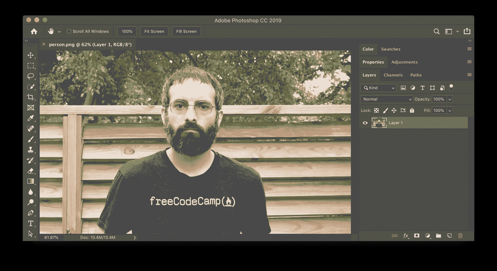
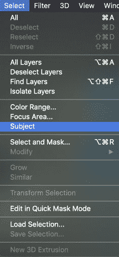
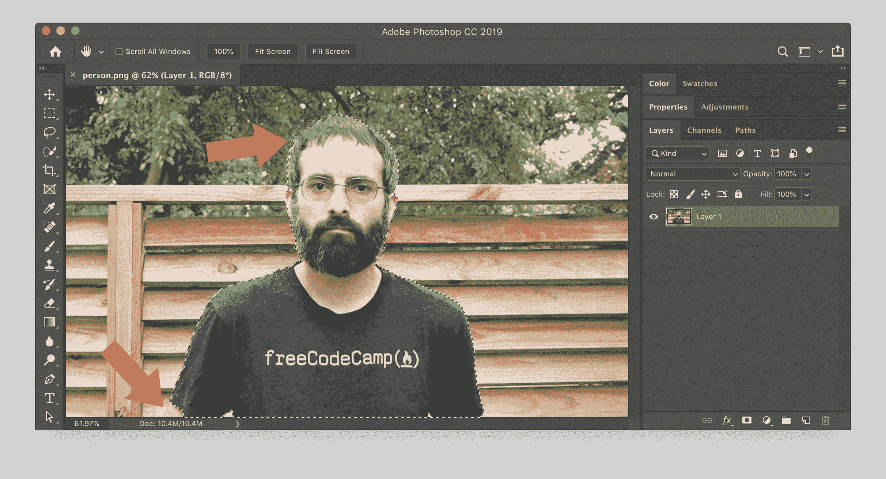
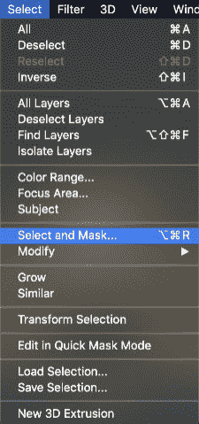
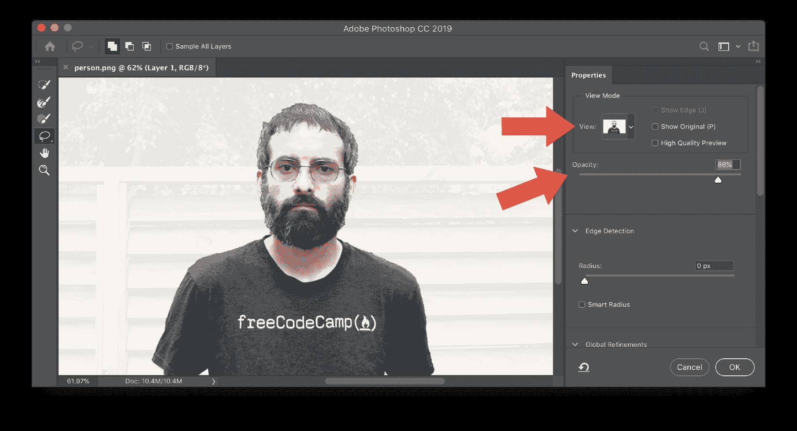
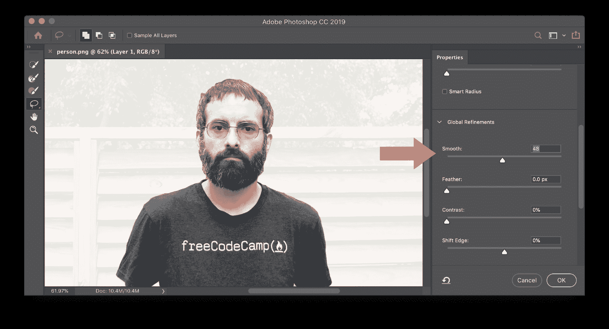
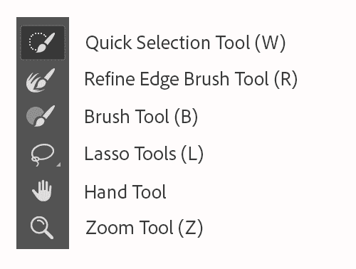
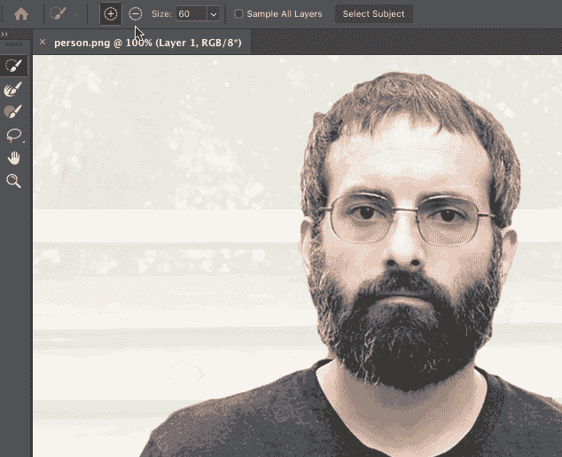
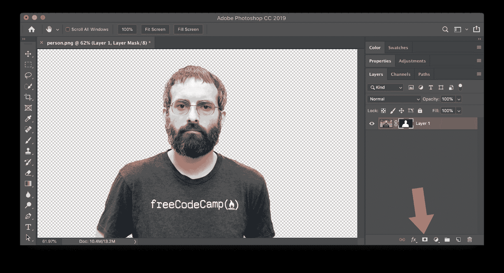

# 背景橡皮擦-如何在 Photoshop CC 中删除背景

> 原文：<https://www.freecodecamp.org/news/how-to-remove-a-background-in-photoshop-cc/>

想要去掉照片的背景，只保留主体是很常见的。照片的主体可以放在一个完全不同的背景上。本指南将展示如何使用 Photoshop CC 擦除照片的背景。有了最新版本的 Photoshop CC，移除背景比以往任何时候都更容易！

首先，确保 Photoshop 是这项工作的正确工具。如果你只是想快速移除背景，可以不使用 Photoshop，使用以下网站之一:

*   [https://www.remove.bg/](https://www.remove.bg/)
*   [https://clippingmagic.com/](https://clippingmagic.com/)
*   [https://removal.ai/](https://removal.ai/)

下面是用 Photoshop 去除背景的步骤。

### 第一步:在 Photoshop 中打开你的图片。

打开图像。如果有多个图层，请确保选择了包含要移除的背景的图层。

### 第二步:在“选择”菜单中点击“主题”。

这将导致 Photoshop 对照片主题的一部分进行猜测。

这在选择前景方面做得很好，但是可能有一些部分需要润色。下图中，箭头指向需要改进的部分。

### 第三步:再次回到“选择”菜单，点击“选择并遮罩”。

这将打开一个窗口，允许您对选择进行调整。

### 第三步:调整视图模式和不透明度。

尝试一些不同的选项，直到你可以清楚地看到选定的前景。您应该选择的确切选项将取决于前景图像的颜色和您的个人偏好。

### 步骤 3:调整边缘检测。

这对于头发等细节选择非常有用。边缘检测像素半径表示边缘，包括所有细节，可以在当前选择的每一侧的那么多像素内。如果您选择“智能半径”，那么 Photoshop 将自动确定像素半径是多少。

### 步骤 4:设置全局优化，如平滑。

平滑是照片编辑需要的主要改进。这将消除选区的锯齿边缘。您可能还想增加羽化，这将在选区周围创建一个柔和的边缘。

### 第五步:使用左侧的工具来优化选择。

快速选择工具允许您轻松添加或删除当前选择。对于此工具和任何画笔工具，您可以使用括号键来增加和减少画笔的大小。

“细化边缘笔刷”工具将调整边界区域，并有助于向选区添加头发或其他精细细节。

画笔工具用于微调选区，套索工具用于绘制徒手选区。

### 步骤 6:确认选择和应用图层蒙版。

在“选择和屏蔽”窗口，点击确定。你的前景现在被选中了。要完成删除背景，点击图层蒙版按钮，将您的选择应用到蒙版。

当您创建图层蒙版时，蒙版后面的背景仍然可用，以防您再次需要它。如果你想永远去掉背景，你可以复制前景并粘贴到另一个图像中，或者你可以反转选区(选择“选择”>“反转”),然后按“删除”键永久删除背景。