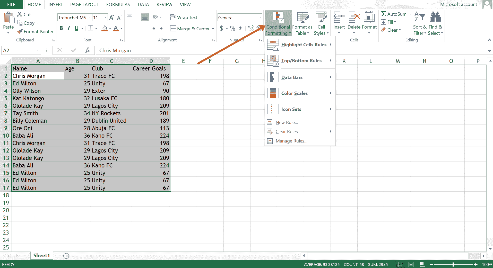
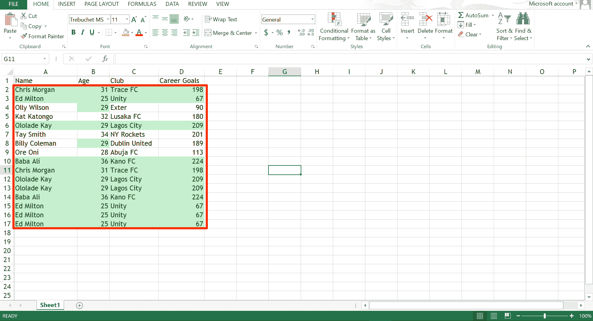

# 如何删除 Excel 中的重复项–删除重复行教程

> 原文：<https://www.freecodecamp.org/news/how-to-remove-duplicates-in-excel-delete-duplicate-rows-tutorial/>

如果 Excel 工作表包含重复项，则很难使用，尤其是如果您不是工作表的作者。

如果找到它们，您可能希望在 Excel 表中突出显示或删除这些重复项，这样就不会出错。

在这篇文章中，我将向您展示两种方法，您可以删除重复的 Excel 工作表。

## 如何使用条件格式查找和删除重复项

如果您需要有选择地删除一些重复项(但保留其他重复项)，可以使用这种方法。它是这样工作的:

**第一步**:按`CTRL` + `A`高亮显示整个表格，切换到`Home`标签，然后点击“条件格式”。

**第二步**:将鼠标悬停在“高亮单元格规则”上，选择“重复值”。

**第三步**:选择您想要的副本高亮显示方式，然后点击“确定”。

重复的单元格将会高亮显示，这样您就可以删除不需要的单元格:

同样，在某些情况下，您将需要一些重复的条目。此方法不会自动移除重复项，因此您可以自己移除。

下一种方法会自动删除重复项。

## 如何使用删除重复项命令删除重复项

这是删除重复的最可靠和最直接的方法之一。

**要使用此方法，请遵循以下步骤:**
**第一步**:切换到`Data`选项卡，点击“删除重复项”。

**第二步**:选择表格中的所有列，以便 Excel 可以查看并检查重复项，然后单击“确定”。

**第三步**:你会得到一条消息，重复的已经被删除。单击“确定”删除该消息。
T3

## 结论

在 Excel 中，重复项可能会成为提高工作效率的瓶颈。既然你已经知道如何删除重复，你可以继续有效地工作。

如果这篇文章对你有所帮助，考虑把它分享给你的朋友和家人。

感谢您的阅读。