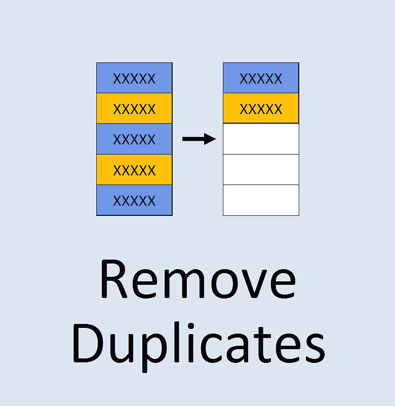
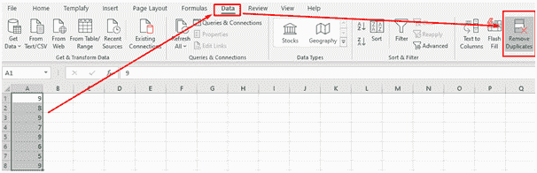
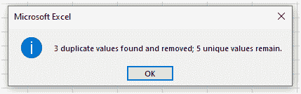
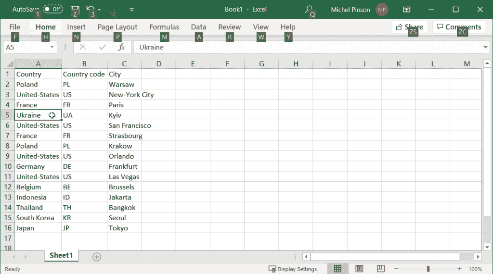
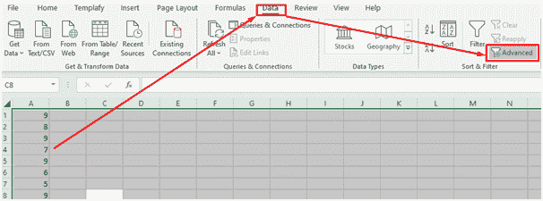
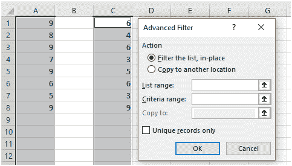
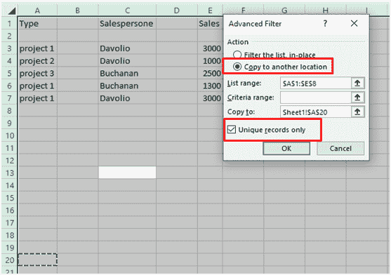
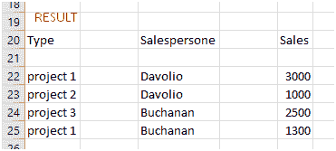
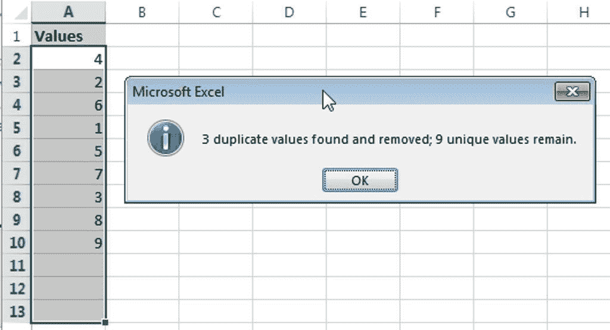
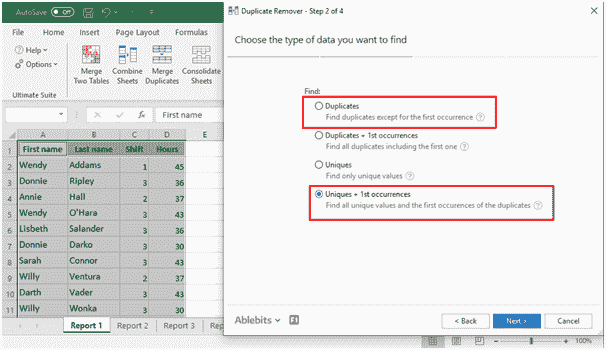

# 如何在 Excel 中删除重复项–点击几下即可删除重复行

> 原文：<https://www.freecodecamp.org/news/how-to-remove-duplicates-in-excel-delete-duplicate-rows-with-a-few-clicks/>

Excel 有许多应用程序，比如跟踪库存、维护邮件列表、制作销售报告等等。

随着数据库的增长，许多用户遇到的一个主要问题是获得重复的值和行。这会让你的计算变得不准确，也会让人们质疑你的能力。

您可能最终会给出一个包含重复值的汇总报表，甚至会给同一个人寄两次信。因此，您需要找到并删除重复的内容，以避免这些可能具有严重影响的小错误。

Remove Duplicates

## 选项 1:使用移除重复工具

因为这个问题经常发生，所以功能区上有一个专用命令，可以很容易地处理重复。最近版本的微软 Office 套件就是这种情况，比如 excel 2007 到 2016。

### 选择您要处理的表格

首先，您需要选择目标单元格，因为该工具可用于删除整行或部分匹配记录中的重复项。

您可以通过选择该表，然后按 Ctrl + A 来完成此操作。您应该确保在该过程永久删除重复项时保存原始文件。

### 点击屏幕顶部的数据选项卡

选择范围后，检查屏幕顶部并单击数据选项卡。将显示不同的命令，然后您应该检查“删除重复”并单击它。

屏幕上会弹出一个小对话框。勾选“我的数据有标题”后，第一行会被自动选中。如果没有标题，数据从第 1 ^(行开始，取消选择该选项。)

### 按“确定”按钮删除重复项

现在已经选择了整个表，因此您应该继续并按下 OK 按钮。这将删除所有重复项。删除详细信息出现在屏幕上，并显示剩余的唯一值和删除的重复条目数。

但是，如果您想要删除基于特定列的**部分副本**，您应该选择它们，留下其余的。如果表包含许多列，最好不要全部选中，然后只选择那些需要删除重复项的列。

完成后，您应该单击确定。然后，重复的信息将被删除，详细信息将显示在屏幕上。

## 选项 2:在 Excel 中使用高级过滤器

高级过滤器图标帮助您识别和删除 Excel 中的重复项。这可以在最新的 Microsoft Office 套件和 2003 版本中使用。您需要打开您的 Excel 电子表格，并通过单击 Ctrl + A 全选。

### 单击数据选项卡，然后单击排序和筛选部分下的高级按钮

然后，您应该单击屏幕顶部的数据选项卡，该选项卡下方会显示不同的部分。找到“排序和过滤”部分，然后单击“高级”按钮。

屏幕上会弹出一个对话框，您可以选择“复制到另一个位置”或“就地过滤列表”后者隐藏所有重复的行，而前者生成记录的副本。

### 调整“列表范围”下的数据范围

在对话框中，有一个列表范围字段，其中包含由 Excel 填充的数据。如果您想更改范围，可以在“列表范围”下进行调整

将标准范围留空并复制到字段仅在您选择复制到另一个位置时有用。否则，请将“就地过滤列表”选项留空。

### 勾选“仅唯一记录”框

在同一个对话框下，有一个标记为“仅唯一记录”的字段-勾选该框。这告诉 Excel 在保留唯一条目的同时过滤掉重复的条目。

### 单击“确定”删除重复项

完成此过程后，您可以单击“确定”按钮来删除重复项。然后，除了已经被删除的数据之外，文档包含重复的数据。

由于该过程假设文档中有标题，如果第 1 ^(行和第)行包含重复的标题，则不会被删除。如果它不是标题，请手动删除。

当您使用高级过滤过程时，您只能删除整个表中的重复项，因为无法选择部分删除。但是，您可以删除重复项，同时创建数据的副本。

## 选项 3:使用重复删除工具，点击两次鼠标

除了内置的重复删除器之外，你还可以使用附加组件，如[able bits duplicate](https://www.ablebits.com/excel-remove-duplicates/index.php)remover 来删除重复内容。该工具是多用途的，也可以执行其他功能。它适用于所有操作系统和所有 Excel 版本。在这里，我们将重点介绍一种只需点击两次鼠标就能使用该工具的方法。

### 选择感兴趣的表格中的单元格

选中需要删除重复记录的表，在 Ablebits 数据上点击“删除重复表”。这将选择整个表格，对话框将打开，自动选择所有列。

### 从“选择操作”字段下的下拉列表中选择删除重复项

在右下方，选择操作字段下有一个下拉列表。选择删除重复选项，然后按确定。重复值将被删除，除了第 1 ^个个。

### 删除键列中的重复项

2 鼠标点击过程可用于删除关键列下特定行的重复项。为此，取消选中其他列，保留要重复数据删除的列。遵循以上两点，重复的将被删除。

“选择”操作可用于其他操作，例如将副本复制到另一个位置而不删除它们。使用下拉菜单进行相应选择，使您的 Excel 表格整洁无误。

## 一锤定音

使用上面突出显示的三个选项，在 Excel 上删除重复项很简单。这个过程很简单，有了这个指南，你只需点击几下鼠标就可以从 Excel 中获得最终的[分配帮助](https://my-assignment.help/)和工作帮助。

当你在 Excel 中工作时，你应该总是清理你的数据集，消除任何不专业的错误。如果你遇到任何挑战，检查正在处理的数据没有小计或概述。

在这种情况下，您需要删除小计和大纲，然后使用上述任何方法。这些数据将会被清理，使得处理它们变得更加容易。