# 如何从 PowerShell 中删除开始文本

> 原文：<https://www.freecodecamp.org/news/how-to-remove-starting-text-from-powershell/>

如果您使用的是 Windows 操作系统，您可能至少使用过一次最新的 Windows PowerShell。

每当您使用 Windows 终端打开 PowerShell 时，您都会在终端中收到一条文本消息，显示 PowerShell 版本、下载最新 PowerShell 的链接等等。

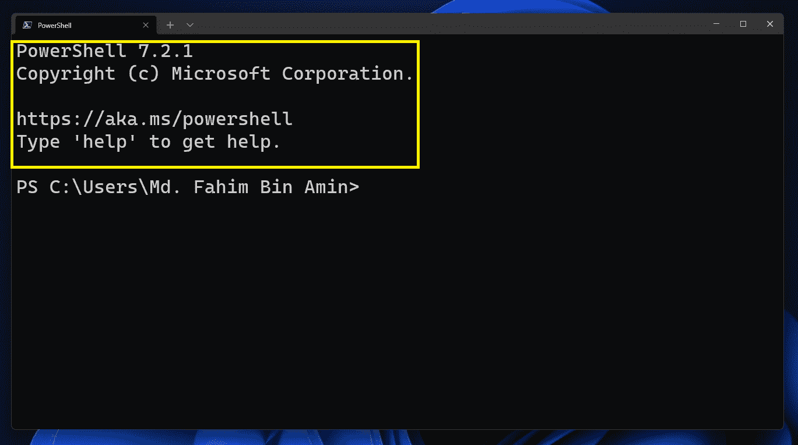

有时这可能很烦人，您可能想要删除该文本，这样该消息就不会再出现。有一种方法可以做到这一点，在本文中，我将向您展示如何从终端中一劳永逸地删除起始文本！✌️

首先，在 Windows 终端打开 PowerShell。您将照常获得起始文本。

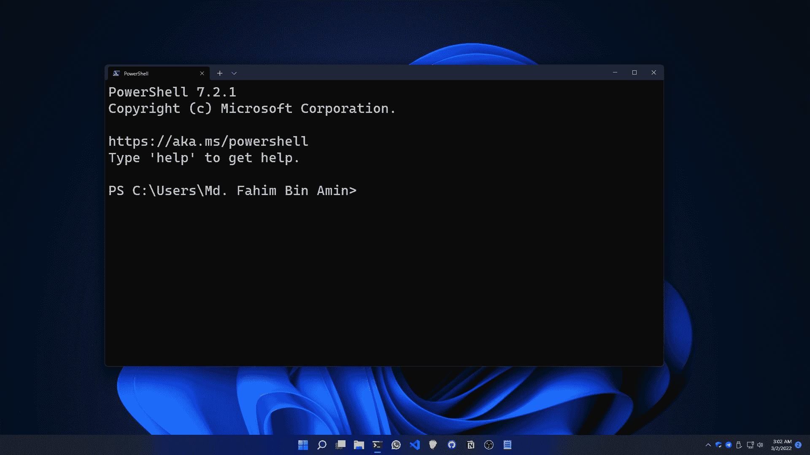

单击下拉按钮以获得其下的菜单。

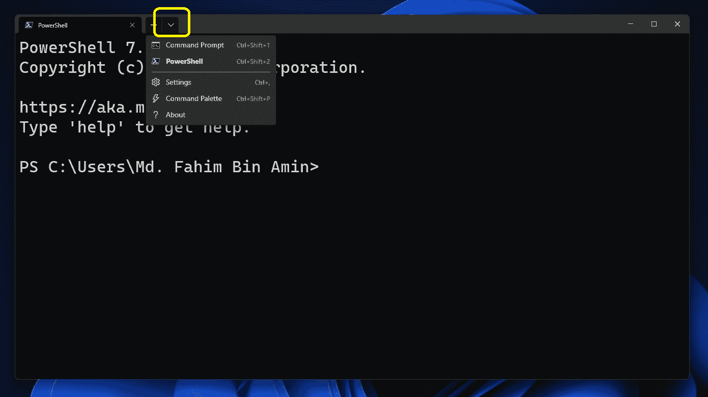

转到**设置**。

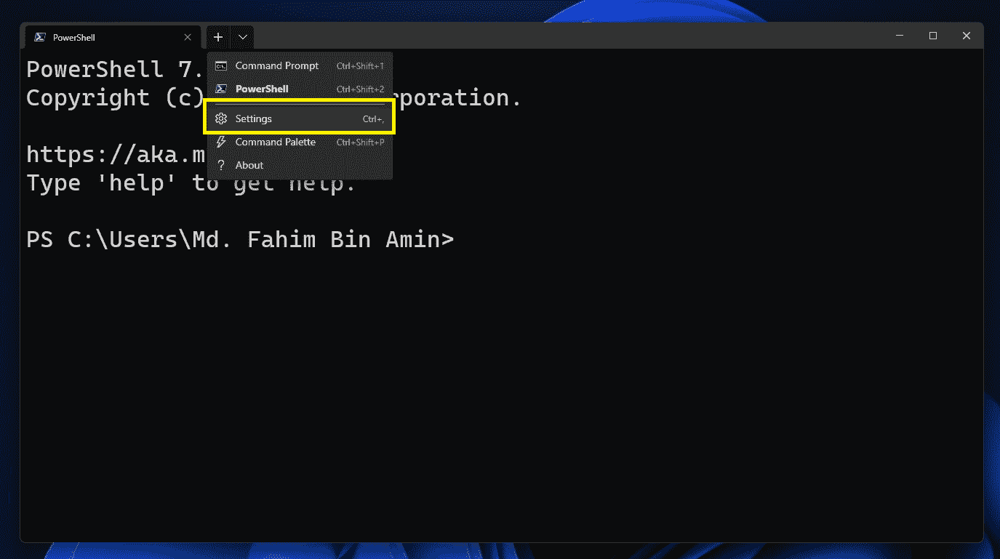

你会得到如下界面:

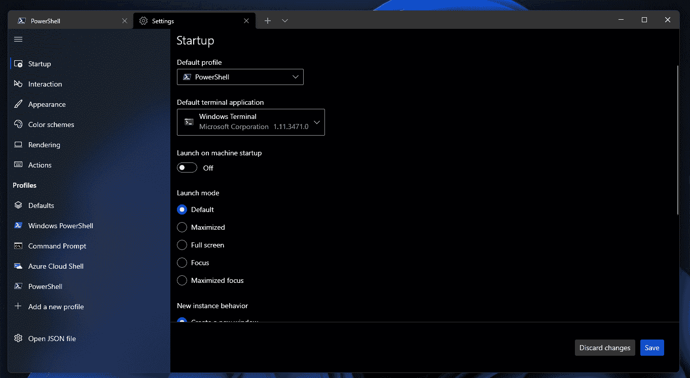

点击**打开 JSON 文件**。

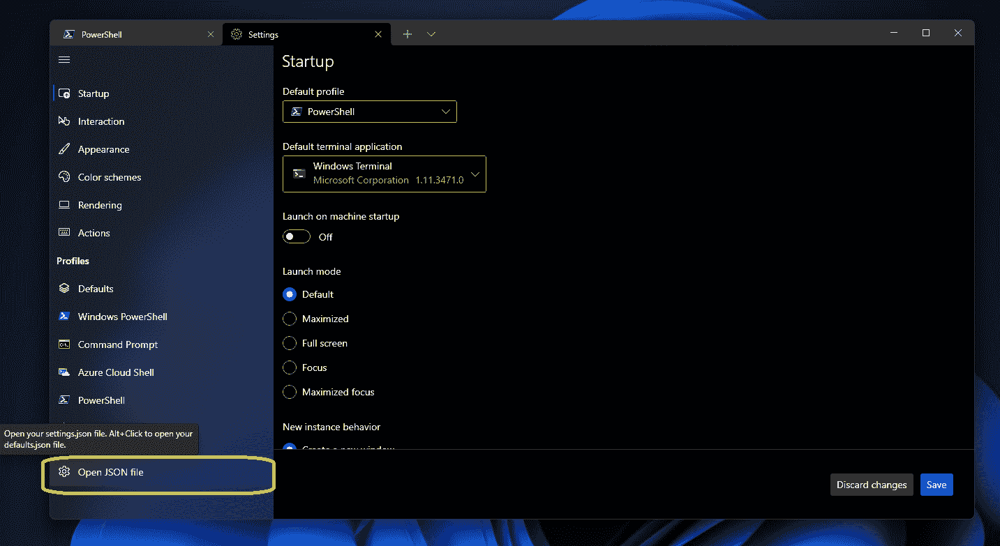

JSON 填充将在文本编辑器中打开。对我来说，它是记事本——但对你来说，它可能是 VS 代码或任何你想要的文本编辑器。

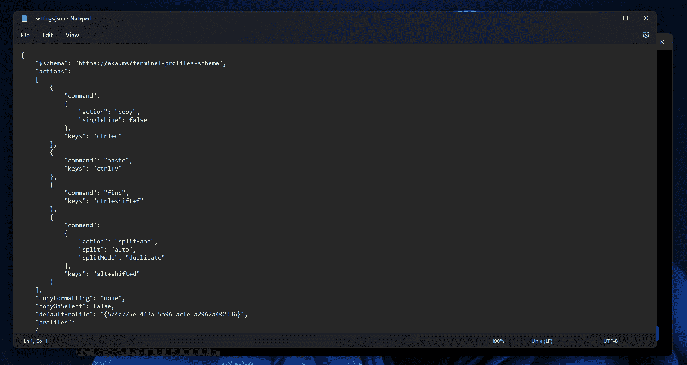

向下滚动，直到找到如下所示的 PowerShell 块。

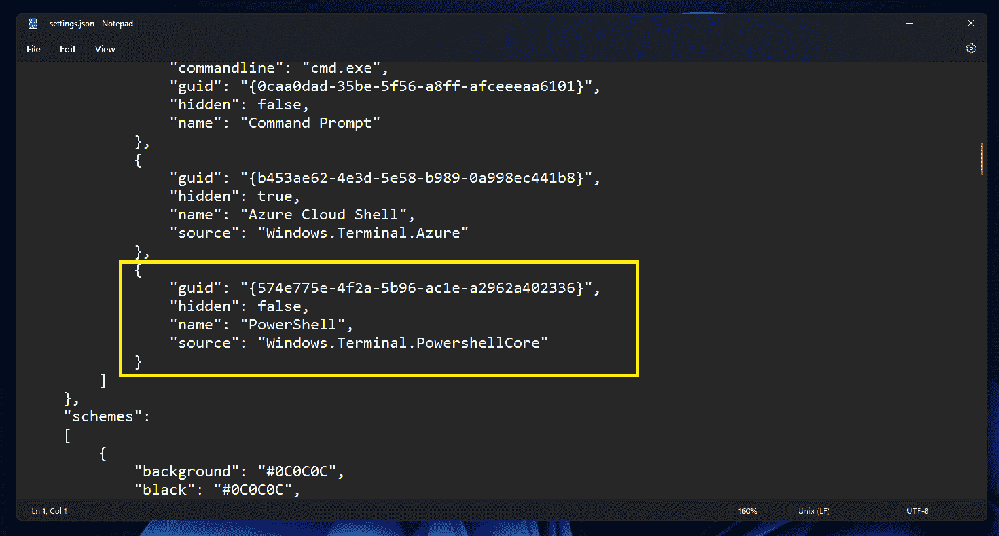

如下图添加`"commandline": "pwsh.exe -nologo",`。

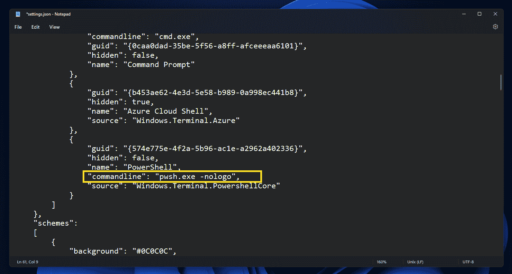

对于 PowerShell 块，该命令应该如下所示:

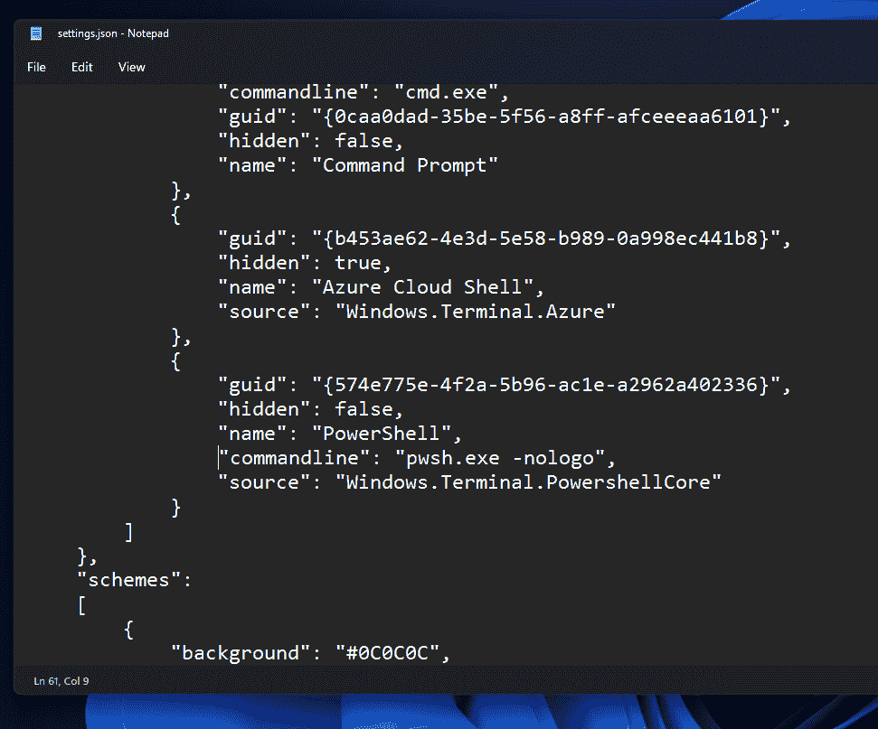

然后保存文件。您也可以使用快捷键`Ctrl` + `S`来完成此操作。

点击**保存**。

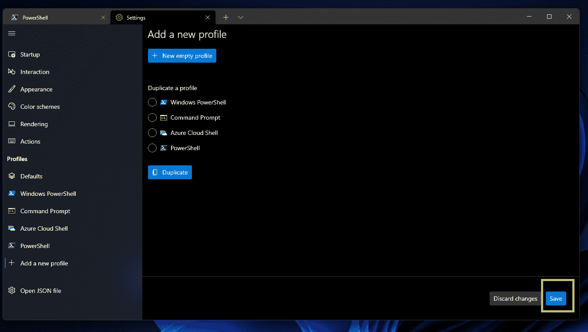

关闭所有选项卡。

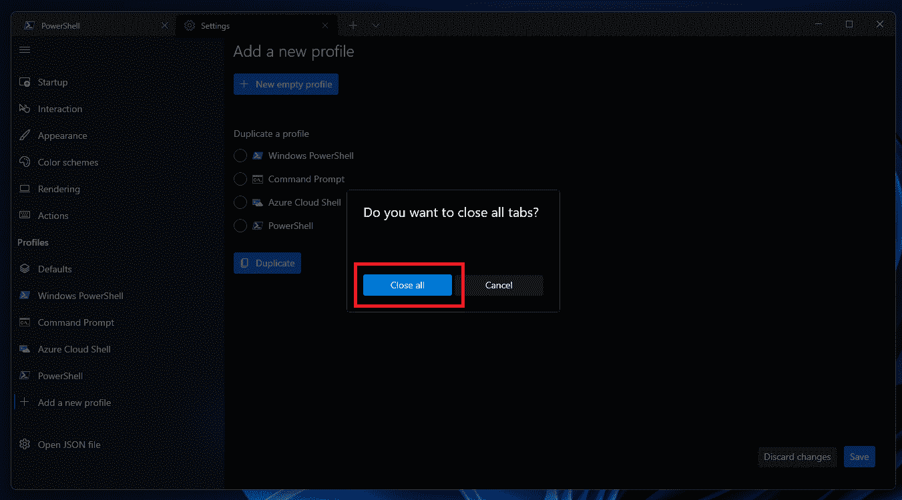

重新打开终端，看看神奇吧！🪄

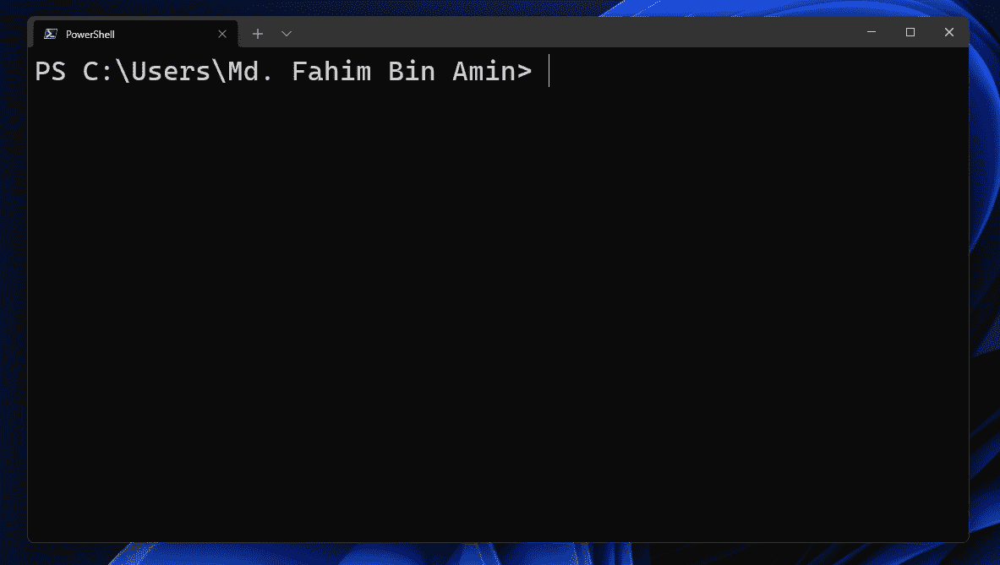

## 结论

感谢您阅读整篇文章。如果对你有帮助，你还可以在 [freeCodeCamp](https://www.freecodecamp.org/news/author/fahimbinamin/) 查看我的其他文章。

如果你想和我联系，那么你可以使用 [Twitter](https://twitter.com/Fahim_FBA) ， [LinkedIn](https://www.linkedin.com/in/fahimfba/) ， [GitHub](https://github.com/FahimFBA) ，[英语 YouTube 频道](https://www.youtube.com/channel/UCG97GCUifMS2Vm28tgXQi0Q)，或者[孟加拉语 YouTube 频道](https://www.youtube.com/channel/UCEF4lxmpBKV2oYCSFH6ExIQ)。

💫如果你想查看我的精彩部分，那么你可以在我的 [Polywork 时间轴](https://www.polywork.com/fahimbinamin)上查看。

非常感谢！

横幅图像取自[故事集](https://storyset.com/worker)(故事集的工人插图)，并使用 Adobe Photoshop 进行了修改。