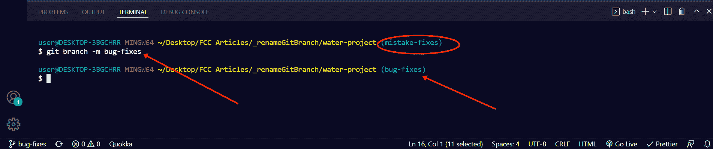
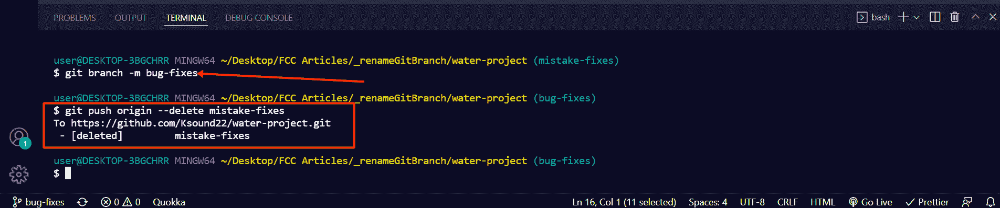
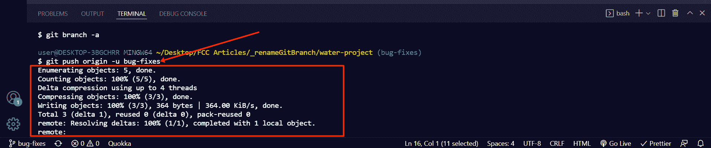

# 如何在 Git 中重命名本地或远程分支

> 原文：<https://www.freecodecamp.org/news/how-to-rename-a-local-or-remote-branch-in-git/>

Git 是一个版本控制系统，软件开发人员使用它来跟踪他们的应用程序中的变化并与其他人协作。

Git 的一个有用特性是分支。在将他们的变更与原始代码合并之前，从事软件项目的不同人员可以在不同的分支中工作。

您还可以在不影响原始代码的情况下，在不同的分支上添加新特性和修复 bug。

有时，由于打字错误或其他错误，您可能想要更改分支的名称，这就是我将在本指南中向您展示的操作。

## 如何重命名本地 Git 分支

**第一步**:要查看你拥有的分支，运行`git branch --list`或`git branch -a`

**第二步**:运行`git checkout branch-name`切换到你想要重命名的分支。

在这种情况下，我将切换到`mistake-fixes`分支，这样我可以将其重命名为`bug-fixes`。

要切换到分支，运行`git switch branch-name`或`git checkout branch-name`。

**第三步**:要重命名分支，运行`git branch -m new-name`

您可以看到该分支已经从`mistake-fixes`重命名为`bug-fixes`

如果您在另一个分支上，例如 main，并且您想从那里重命名该分支，运行`git branch -m old-name new-name`

**N.B.** :运行`git branch -a`查看所有分支，确认分支已经被重命名。

## 如何重命名远程 Git 分支

重命名远程分支不如重命名本地分支简单。

准确地说，重命名远程分支不是直接的，您必须删除旧的远程分支名称，然后将新的分支名称推送到 repo。

**按照以下步骤重命名远程 git 分支**:

**第一步**:运行`git push origin --delete old-branch-name`删除旧名字

在我一直使用的例子中，这将是`git push origin --delete mistake-fixes`

**步骤 2** :通过运行`git push origin -u new-branch-name`，将上游分支重新设置为新的本地分支的名称。

所以，举个例子，这将是`git push origin -u bug-fixes`

要确认您已成功重命名远程回购，请登录您客户的网站并检查回购。

在本教程的例子中，我使用 Github 作为客户端，并且重命名成功:

## 结论

分支是 Git 的一个很棒的特性，它让你的托管软件项目更加安全。

通常，在本地和远程重命名分支可能是不可避免的，所以这就是为什么我写了这篇文章来帮助您重命名分支而不犯代价高昂的错误。

如果你觉得这篇文章有帮助，不要犹豫，与你的朋友和家人分享。

感谢您的阅读。