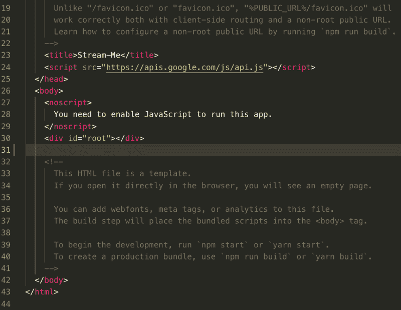
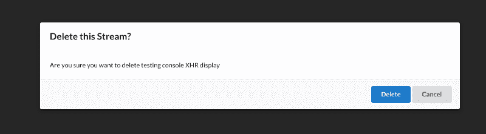

# 如何在 React 中呈现模态

> 原文：<https://www.freecodecamp.org/news/how-to-render-modals-in-react-bbe9685e947e/>

由于 React 构造 DOM 的方式，模态在 React 中可能是一个棘手的话题。如果你熟悉 React 的基础知识，你会知道整个应用程序是一个组件，通常被称为`<App/>`，它被追加为一个名为#root 的子组件`<div>`。index.html 的文件如下所示:



create-react-app’s public/index.html file

一旦`<App/>`组件被呈现到 DOM 中，id 为“#root”的实际`<div>`元素就会在其中呈现整个 React 应用程序。

因此，React 应用程序组件嵌套得非常深是很常见的。我们谈论的是几十个层次的深度，甚至更多。因此，如果那些深度嵌套的组件之一需要显示一个模态，它将面临一些严重的 CSS 问题。

模态在屏幕上覆盖一层，因此在视觉上优先于所有其他元素。如果你必须把它放在 z-index 术语中，它将需要是屏幕上所有元素中最高的数量。但是由于嵌套太深，树中的父元素优先于 CSS。

我们需要找到一种方法来渲染 DOM——但要在深层嵌套之外*,而不是接触可能被微调过的 CSS，因此在那里摆弄可能会破坏应用程序。*

### **解决方案— React 门户网站**

一种策略是使用 ReactDOM 门户，并将模态放在一个 div 中，该 div 是 id 为“#root”的 div 的兄弟组件。通过这样做，应用于 modal 的 div 包装器的 CSS 样式将只应用于它的兄弟(“#root”div ),并且不会破坏“# root”的 CSS 样式。

为此，我们需要使用 ReactDOM 的`createPortal()`方法。门户实际上就是这样一个兄弟 div，它打破了所有*React 组件必须是`<div id=”root">`的后代的规则。为此，我们需要做到以下几点:*

1.  **在 index.html，**里面的`<bod**y>**`标记:

```
<body>
    <noscript>
      You need to enable JavaScript to run this app.
    </noscript>

    <div id="root"></div>

    <div id="modal"></div> .   //ADD THIS

  </body>
</html>
```

**2。创建一个 Modal.js 组件(**类名来自 semantic-UI **):**

```
import React from "react";
import ReactDOM from "react-dom";

const JSX_MODAL = (
  <div className="ui dimmer modals visible active">  
    <div className="ui standard modal visible active">
      THIS IS SOME TEXT IN THE MODAL // add some UI features here
    </div>
  </div>
);

function Modal(props) {
  return ReactDOM.createPortal(JSX_MODAL, document.querySelector("#modal"));
}

export default Modal;
```

你会看到`createPortal`有两个参数:一个是渲染的 JSX，另一个类似于`ReactDOM.render`，是渲染 JSX 的目标元素。

如果您渲染组件并导航到它，您应该会发现它显示得很好。现在，您需要添加适当的`onClick()` 处理程序来处理内部模式 UI 中的单击事件，以及当用户在内部模式 UI 之外单击时导航离开该模式。

要做到这一点，您需要侦听正确区域的点击，然后停止传播，以便根据用户点击的区域产生正确的行为。

### **可重用性**

上面的例子非常简单，并不是一个现成的代码片段。相反，这是一个解决模态的方法。你绝对应该根据自己的需要定制组件。使用 React 可重用性原则来确保您没有在模型中硬编码数据，并根据需要传递内容甚至更小的小部件。

例如，在我的一个项目中，当用户要从数据库中删除一些东西时，我会给出一个模型。所以我的组件叫做`<DeleteThis />`。它渲染`<Modal />`，这是使底层`<DeleteThis />`屏幕变暗的覆盖图。

```
render() {
    return (
      <div>
        <Modal
          content={this.renderContentProp()}   
          header="Delete this?"                
          actions={this.renderActionButtons()}
          onDismiss={this.onDismiss}
        />
      </div>
    );
  }

  renderActionButtons = () => {
    //return JSX that renders action buttons...
    return (
      <div>
        <div className="ui button primary">Delete</div>
        <div className="ui button">Cancel</div>
      </div>
    );
  };
```

在`<Modal` / >中有一个内部组件 c `alled <Inne` rModal / >，它有实际的交互组件，有标题、内容和文本。

于是我的`<DeleteThis` / >组件创建道具传承 `into <`；Modal / >进而得到 drill`d down into <`；InnerModal / >，因此< DeleteThis / >中的 `render method`看起来像:

…实际的模态分量看起来像:

```
import React from "react";
import ReactDOM from "react-dom";
import ModalInner from './modal-inner'

function Modal(props) {
  return ReactDOM
    .createPortal(
       <ModalInner {...props} />,
       document.querySelector("#modal")                      //target DOM element
     );
}
export default Modal;
```

现在，你终于能够渲染:



瞧，这就对了！Modals，带 React 门户！希望你喜欢这个！

希望它能帮你节省一些时间…

如果你想了解更多关于我的代码之旅，请查看[免费代码营播客](http://podcast.freecodecamp.org/)的[第 53 集](http://podcast.freecodecamp.org/53-zubin-pratap-from-lawyer-to-developer)，昆西(免费代码营的创始人)和我分享了我们作为职业改变者的经验，可能对你的旅程有所帮助。你也可以在 [iTunes](https://itunes.apple.com/au/podcast/ep-53-zubin-pratap-from-lawyer-to-developer/id1313660749?i=1000431046274&mt=2) 、 [Stitcher](https://www.stitcher.com/podcast/freecodecamp-podcast/e/59201373?autoplay=true) 和 [Spotify](https://open.spotify.com/episode/4lG0RGpzriG5vXRMgza05C) 上访问播客。

在接下来的几个月里，我还将举办一些 ama 和网络研讨会。如果您对此感兴趣，请点击[此处](http://www.matchfitmastery.com/)告知我。当然，你也可以在 [@ZubinPratap](https://twitter.com/zubinpratap) 给我发微博。