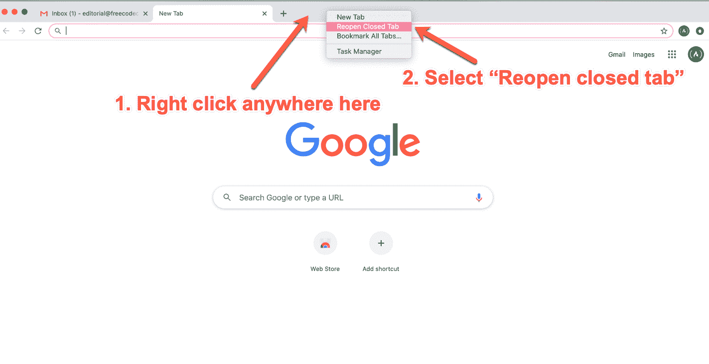
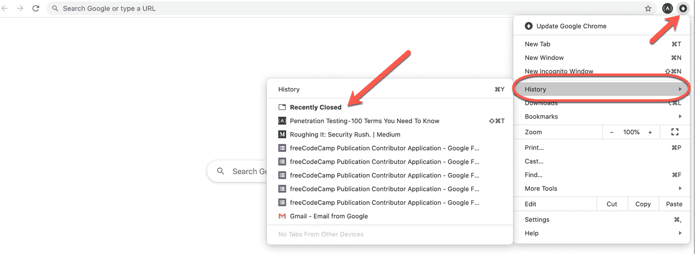
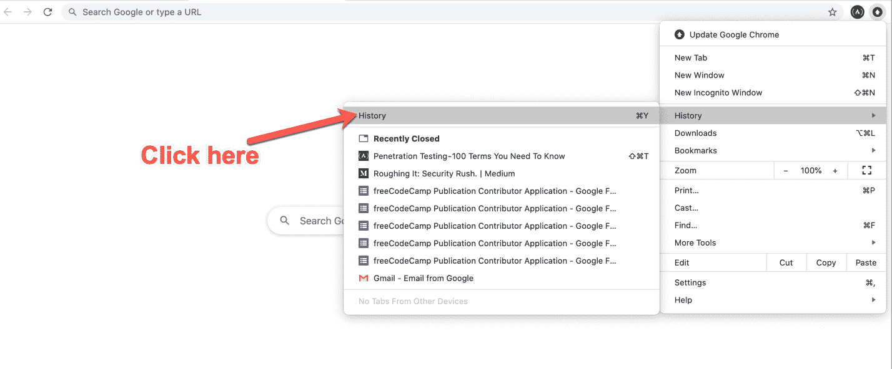
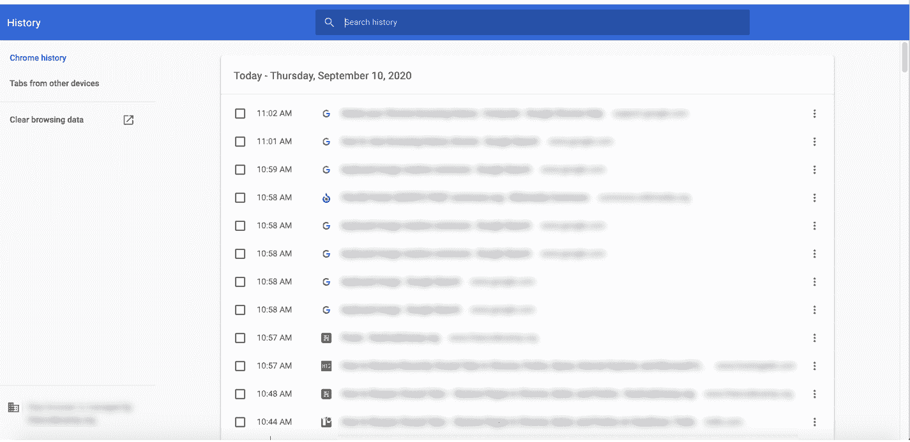
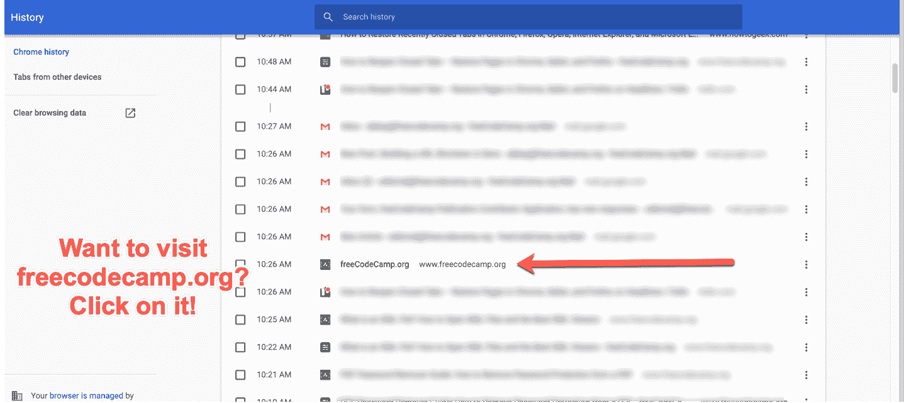
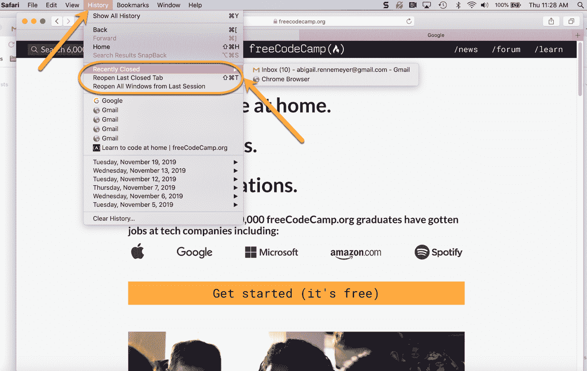
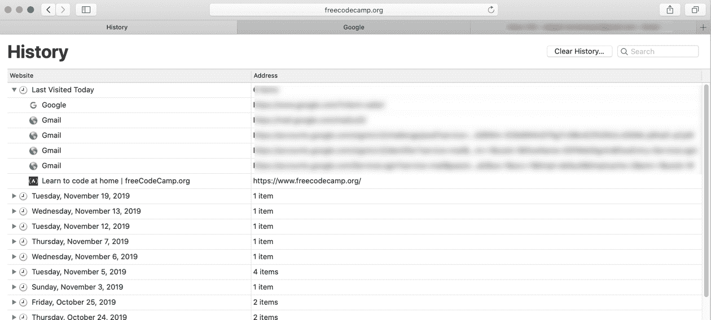
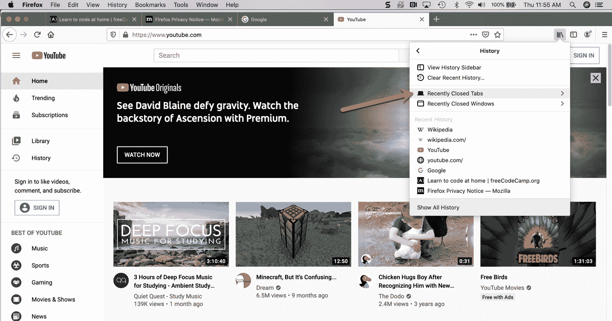
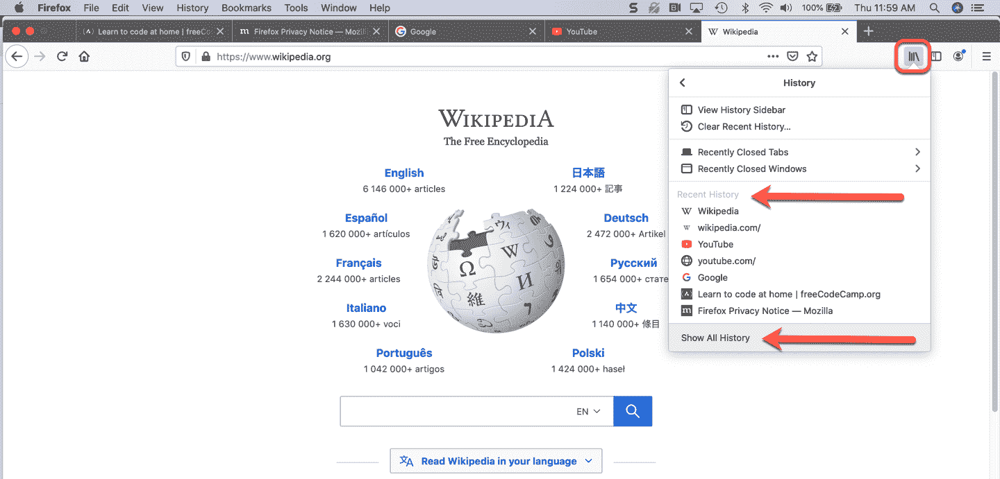
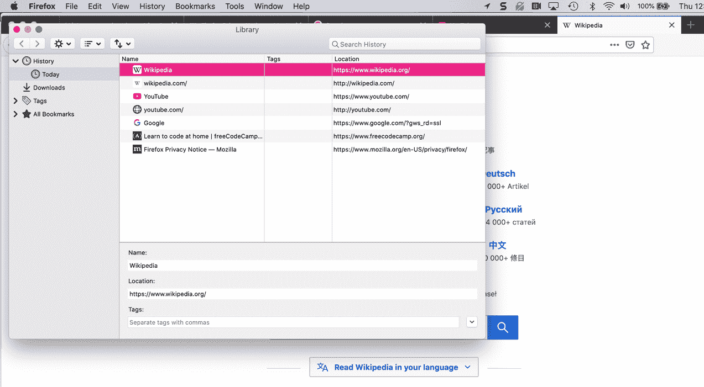

# 昨天标签——如何在 Chrome、Safari 和 Firefox 中重新打开关闭的标签

> 原文：<https://www.freecodecamp.org/news/how-to-reopen-closed-tabs-restore-pages-in-chrome-safari-and-firefox/>

这种事情经常发生——你不小心关闭了一个你并没有真正使用的标签，或者你想访问一个你昨天找到的网站。

那么，重新打开那些关闭的标签页并回到浏览状态的最简单方法是什么呢？

在本文中，你将学习如何在 Chrome、Safari 和 Firefox 中重新打开关闭的标签页，这样当你不小心关闭了某个东西时就不必惊慌了。

## 如何在 Chrome 中重新打开标签页

### 键盘快捷键

有几种方法可以在 Chrome 中重新打开标签页。如果你喜欢键盘快捷键，最简单的方法就是按 Command+Shift+T(在 Mac 上)或者 Ctrl+Shift+T(在 Windows 上)。

如果你按一下这个键，它会显示你关闭的最后一个标签。再按一次，就会调出之前的那个。诸如此类。

### 菜单选项方式

如果你更喜欢右击，只需右击选项卡菜单栏区域，并选择“重新打开关闭的选项卡”:

How to reopen closed tabs in Chrome.

如果你再次这样做，它会打开你之前关闭的标签，以此类推。

### 如何在 Chrome 中查看你的浏览器历史

如果您不记得打开要查找的选项卡的确切时间，该怎么办？或者你不记得那个网站叫什么了？

在这种情况下，你可能只想查看你的浏览历史——过去几天或几周内你访问过的最后 x 个网站/关闭的标签列表。

为此，打开你的 Chrome 浏览器，点击右上角的三个小点或绿色箭头。

Click on "History" to see your recently closed tabs.

这将调出你在上图中看到的菜单。第四个选项是“历史”——悬停或点击它，另一个菜单将在左侧打开。这将列出你最近关闭的标签页(最近 8-10 页左右)。

如果你想查看你的全部浏览历史，你可以点击弹出的最左边菜单顶部的历史标签，如下图所示:

Click on that second "History" tab to see your whole history.

这将打开您的浏览历史，看起来像这样:

Your browser history - scroll down to see more.

你可以看到右边的滚动条——如果你向下滚动，它会继续载入更多的历史。这可以让你看到你在互联网上的位置。

想参观其中一个网站吗？只需点击它，浏览器就会带你去那里(在同一个窗口)。

就是这样！

## 如何在 Safari 中重新打开标签页

同样，在 Safari 中，有几种方法可以重新打开已经关闭的标签页。

### 键盘快捷键

上面我们谈到的 Chrome 键盘快捷键同样适用于 Safari。

只需按 Command+Shift+T (Mac)或 Ctrl+Shift+T (Windows)即可打开这些标签。请记住，您可以多次这样做，以获得更多关闭的选项卡，按照您关闭它们的顺序(从最近到最近)。

### 菜单选项方式

同样，如果您更喜欢使用鼠标和菜单栏，以下是它在 Safari 中的工作方式:

在屏幕顶部的菜单栏中(其中有“Safari、文件、编辑、查看、历史记录”等选项)，选择“历史记录”:

How to view your recently closed tabs in Safari.

这将带来几个选项，正如你在上面看到的。我将鼠标悬停在“最近关闭”(第一个选项)上，它会显示我最近关闭的两个标签页。如果您使用 Safari 作为浏览器，您可能会看到更多标签。

如果你看到你刚刚关闭的标签，你想打开备份，只需点击它，它将在一个新的标签/窗口中打开。

您还可以选择“重新打开上次关闭的标签页”(该标签页旁边还会列出键盘快捷键)和“从上次会话恢复所有窗口”。

### 如何在 Safari 中查看浏览器历史记录

如果您想查看您的整个浏览器历史，只需点击“历史”菜单下的第一个选项(上面写着“显示所有历史”，见上图)，您的整个历史就会出现:

同样，如果你使用 Safari 作为常规浏览器，你的历史记录可能会更长:)

如果你想直接访问其中一个网站，只需双击列出的网址，它会在同一个窗口带你去那里。

## 如何在 Firefox 中重新打开标签页

如果你是 Firefox 用户，这个过程和我们上面讨论的非常相似。

### 键盘快捷键

你可以像在 Chrome 或 Safari 中一样在 Firefox 中打开最近关闭的标签——使用 Command+Shift+t (Mac)或 Ctrl+Shift+t (Windows)键盘快捷键。很简单。

如果你一次又一次地按这些键，它会按照从最近关闭到最近关闭的顺序不断打开你关闭的标签页。

### 菜单选项方式

要通过菜单选项打开 Firefox 中最近关闭的标签，只需找到右上角看起来像书架上的书的图标:

Step 1 - find the "History" tab.

当你点击它时，你会看到一个下拉菜单，其中有一个“历史”标签。点击上面图片中突出显示的那个。

这将打开一个新菜单，其中有一个“最近关闭的标签”选项，如下所示:

Step 2 - find your recently closed tabs in Firefox.

如果你点击它，另一个菜单会打开，列出你最近关闭的所有标签。

如果你点击其中一个标签，Firefox 会在一个新窗口中把你带到那个标签。

### 如何在 Firefox 中查看浏览器历史记录

当然，如果你想查看所有你浏览过的网页，而不仅仅是你最近关闭的标签页，你可以查看你所有的浏览历史。

在右上角的那个书架上的小图标下，再次点击“历史”选项。然后，您将看到您最近的历史记录，以及查看所有历史记录的选项:

How to see recent history or show all history in Firefox.

如果您需要的不仅仅是您最近的历史记录(显示在下拉菜单中),您可以点击底部的“显示所有历史记录”,它会打开一个单独的窗口，如下所示:

How to see all your history on Firefox.

如果你想访问其中的任何一个页面，只要双击 URL/line，Firefox 就会在同一个窗口带你去那里。

## 就是这样！

现在，您可以放心地在浏览器中重新打开标签，这样您就不会丢失您正在处理或学习的内容。