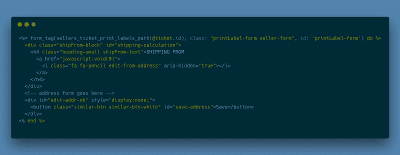
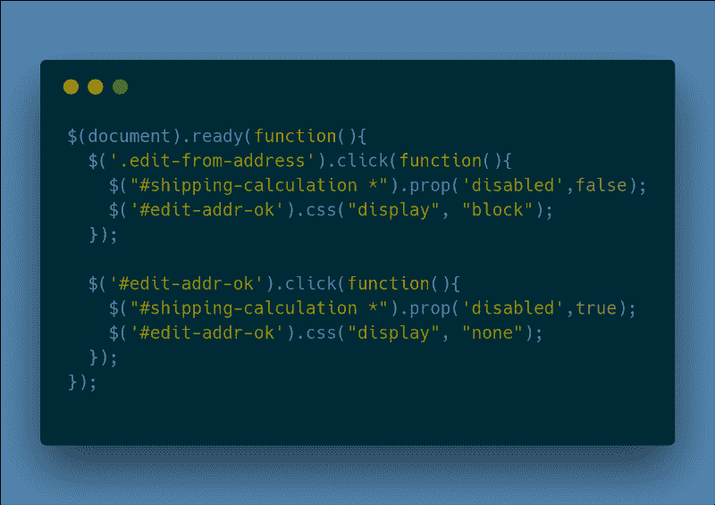
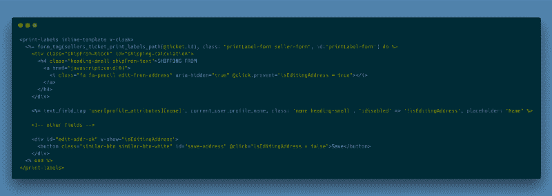

# 如何在 Ruby on Rails 应用中用 Vue.js 替换 jQuery

> 原文：<https://www.freecodecamp.org/news/how-to-replace-jquery-with-vue-js-in-ruby-on-rails-apps-b4f4af192635/>

伊戈尔·彼得罗夫

# 如何在 Ruby on Rails 应用中用 Vue.js 替换 jQuery


如果你是一个已经做了几年的 Ruby on Rails 开发者，你可能已经习惯于使用 T2 jQuery T3 作为开发前端的默认选项。几个版本之前，核心的 **Rails** 开发者将它作为一个标准提供，不久它就成为了标准。 **jQuery** 是#1 **JavaScript** 库，使用起来非常方便。

从那以后，已经过了相当一段时间，但是 **jQuery** 仍然是默认选项。然而现在，由于客户端代码越来越复杂，您需要一些不同的东西。你可以尝试 React、Angular.js 或 Vue.js，但你只能轻松地使用其中一个，同时尽最大努力将其集成到现有或新的应用程序中。

我长时间使用 jQuery 已经成为一种习惯:如果你开始一个新的 T2 Rails T3 应用，jQuery T5 已经在那里了。你已经很熟悉它了，所以你马上开始使用它。

几年前，我发现我喜欢 **Angular 1，**因为它非常简单。但是它仍然有应用程序初始化、编写控制器和注入依赖项的冗余设置。

这对于用 MVC (MVVM)方法设计你的应用程序来说是非常好的。

但是，假设您有一个现有的应用程序，其中包含大量的 **jQuery** DOM 操作代码，并且您想开始用一些更受支持的代码来替换这些混乱的代码。类似于下面的内容(当然可以优化，但这只是为了举例):

```
$(document).ready(function(){
```

```
 ...   $('#some-radio-button1').on('click', function(){     if ($(this).is(':checked')) {       // removing "active" classes, hiding some blocks       // showing related block
```

```
 } else {
```

```
 // opposite of above     }   });
```

```
});
```

### 为什么是 vista . js？

那么我为什么推荐用 **Vue.js** 代替 **jQuery** 代码呢？因为 **Vue.js** 不仅对编写复杂的 **JavaScript** 应用有用。您也可以将它用于一个简单的任务，比如 DOM 操作。如果这就是你所需要的，那么选择 **Vue** 会是一个好主意。如果您需要解决更复杂的任务，如路由、状态管理等，您可以更进一步。

所以，如果你已经有了一个包含大量 jQuery 代码的项目，并且你想摆脱那些混乱的事件处理程序，你绝对应该尝试一下 **Vue.js** 。

#### 入门指南

如果你是一个老派的 RoR 开发者，并且仍然通过**链轮**管理资产，那么只需下载`vue.js`并把它放到你的`vendor/assets/javascripts`文件夹中。

接下来，从您的主 **JavaScript** 清单文件中请求它(例如，`application.js`):

```
//= require jquery//= require jquery_ujs//= require bootstrap//= require vue
```

然后你需要实例化一个 **Vue** 实例，并将其附加到你的 **HTML** 代码中的某个元素上。为此，您可以创建一个单独的`vue_app.js`(或。咖啡)文件内`app/assets/javascripts`:

```
window.vueApp = new Vue  el: '.off-canvas-container'  data:    ...
```

就是这样，现在可以用 **Vue.js** 了！

### 更进一步

现在您可以向您的 **Vue** 实例`data`部分添加数据，并在`methods`部分编写一些处理程序。但是最好使用一个核心 **Vue.js** 单元:组件。

继续使用 **Vue.js** 的最简单方法是使用您现有的 **Rails** 视图，并将一些 **HTML** 片段包装成组件。让我们来看看如何实现这一点。

例如，我有`app/views/sellers/print_labels/new.html.erb`和一些 **jQuery** 代码与这个页面相关联:



这是一个送货地址表单，默认情况下禁用输入。一旦用户点击“铅笔”图标，表单域将变成可访问的输入，并显示“保存”按钮。单击“保存”后，表单将返回到原始状态。

为了用一个简单的 **Vue.js** 组件替换这个 **jQuery** 代码，我用类似下面的东西来创建`app/assets/javascripts/components/print_labels.coffee`(但是不要忘记需要来自`application.js`的`components`文件夹):

```
Vue.component 'print-labels',  data: ->    isEditingAddress: false
```

然后我在我的 **Rails** 视图中使用它:



需要注意的几件事:

*   如果您想将组件模板保存在 Rails 视图或局部视图中，您应该使用`inline-template`选项。
*   在组件被初始化和渲染后，需要选项来显示组件
*   我们使用`@click`来附加`onclick`事件处理程序(您可以将复杂的代码提取到组件`methods`中)

现在我们可以去掉 **jQuery** 代码，因为我们已经用一个小的 **Vue.js** 组件代替了它(只有一个数据变量！).

现在轮到你了！继续使用这种方法，我希望你很快会发现自己对 **Vue.js** 很满意。

*如果你喜欢这篇文章，请点击* ✋ *来传播这个消息。*