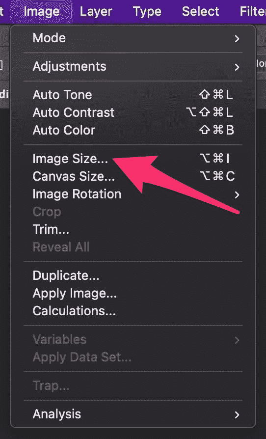
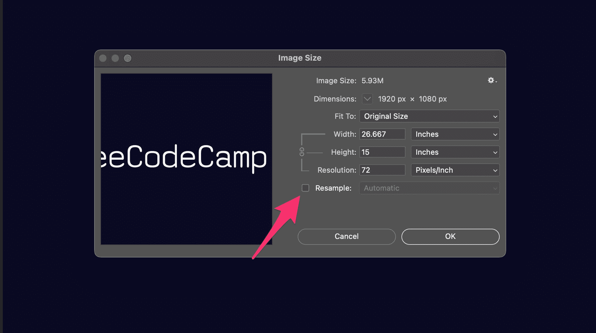
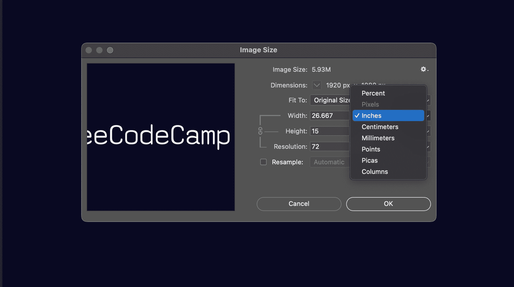
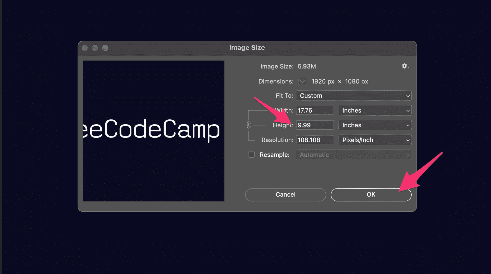
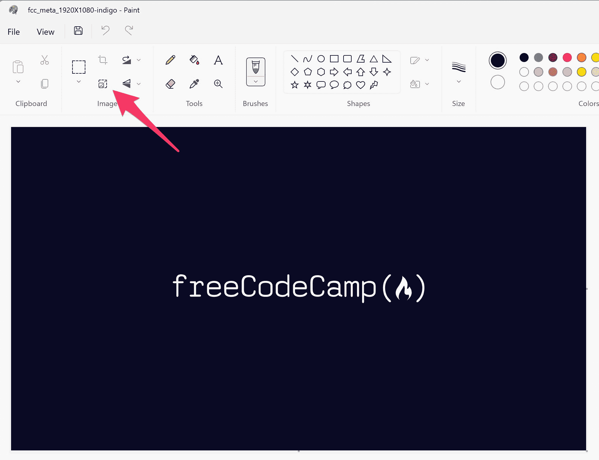
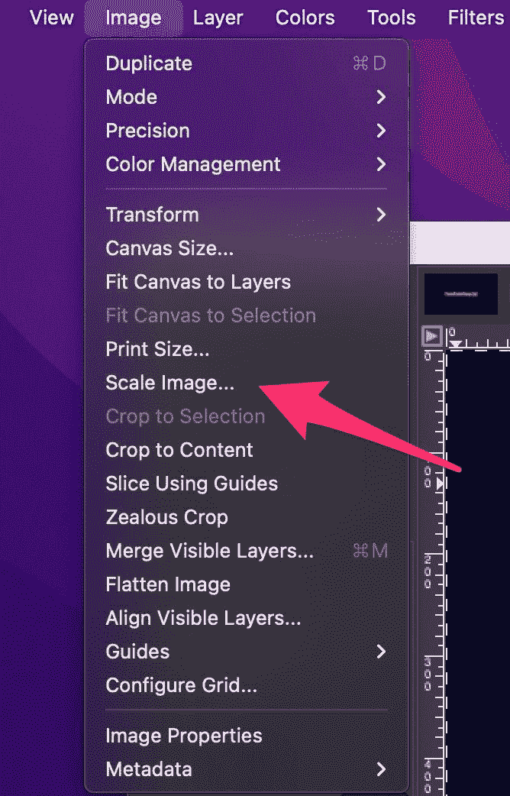
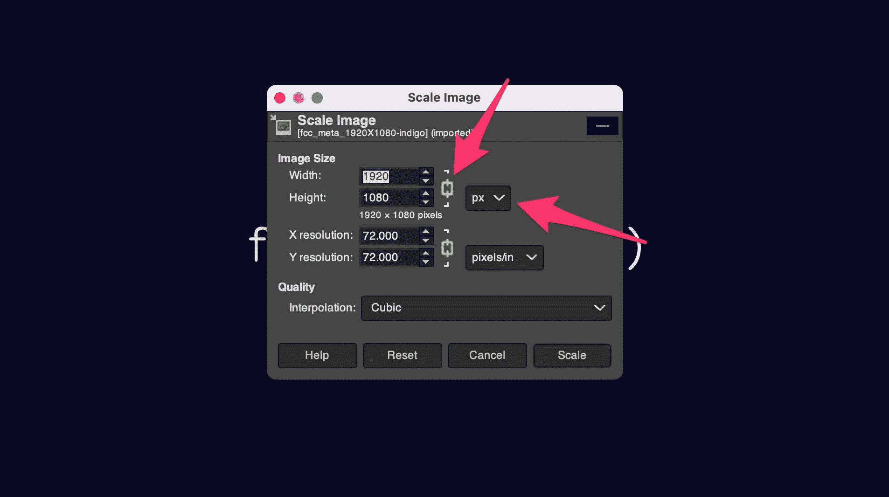
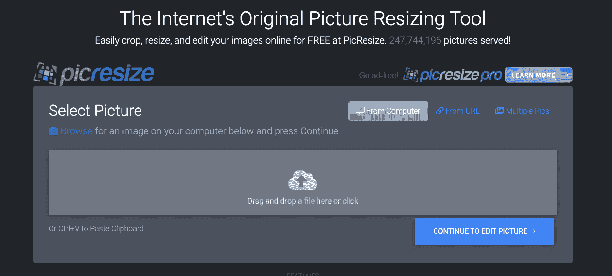

# 如何在不损失质量的情况下调整图像大小–减小文件大小教程

> 原文：<https://www.freecodecamp.org/news/how-to-resize-an-image-without-losing-quality/>

当您需要调整图像大小时，您希望在不损失质量的情况下完成。幸运的是，有很多广泛可用的工具可以帮助您做到这一点。

调整图像的大小可能很棘手，因为当你缩小图像的尺寸时，你也在减少像素的数量。减少的像素数越多，图像的质量就越差。但是有一些方法可以在不损失质量的情况下调整图像的大小。

## 如何使用 Adobe Photoshop 调整图像大小而不损失质量

一种方法是使用像 Photoshop 这样的程序。在 Photoshop 中，您可以使用“图像大小”对话框来调整图像大小，而不会降低图像质量。

要打开“图像大小”对话框，请在 Photoshop 中打开一个图像，单击“图像”下拉菜单，然后单击“图像大小”:

在“图像尺寸”对话框中，您可以更改图像的宽度和高度。您也可以更改分辨率。分辨率是每英寸的像素数。分辨率越高，图像中的像素越多，质量越好。

首先，确保未选中“对图像重新取样”复选框:

此复选框告诉 Photoshop 更改图像中的像素数。取消选中此框时，Photoshop 不会更改像素数，图像的质量和文件大小也不会降低。

接下来，选择用于调整图像大小的度量单位。点击“宽度”或“高度”右侧的下拉菜单，打开下拉菜单。

默认情况下选择英寸，因为 Photoshop 用于制作大量印刷媒体。请注意，由于未选中“重新取样”复选框，您不能从测量单位下拉列表中选择像素:

选择度量单位后，更改图像的宽度或高度，另一个尺寸会自动更新。

最后，单击“确定”按钮调整图像大小:

但是有些时候损失一点质量是可以的，比如你为一个网站调整大小和图片。在这种情况下，减少图像文件大小是好的，因为图像将加载得更快。

在这种情况下，请确保选中“重新取样”复选框。然后，您可以选择像素作为度量单位，并如上所述调整图像大小。

## 如何使用 Microsoft Paint 调整图像大小而不损失质量

另一种在不损失质量的情况下调整图像大小的方法是使用像 Microsoft Paint 这样的程序。使用画图，您可以使用“调整大小和倾斜”对话框来调整图像的大小，而不会损失质量。

要打开“调整大小和倾斜”对话框，请打开一个图像，然后在工具栏的“图像”部分，单击“调整大小和倾斜”按钮:

在“调整大小和倾斜”对话框中，您可以更改图像的宽度和高度。您还可以更改水平和垂直拉伸。水平和垂直拉伸决定了图像的拉伸程度。

在“调整大小和倾斜”对话框中，选择“百分比”或“像素”作为度量单位，并确保“水平”和“垂直”之间的链图标是连接的。这将锁定图像的长宽比，使其不会失真:

Microsoft Paint's "Resize and Skew" dialog box

然后改变图像的水平或垂直尺寸，另一个会自动更新。

最后，单击“确定”按钮调整图像大小。

## 如何用 GIMP 调整图像大小而不损失质量

也可以试试用 GIMP 之类的程序。GIMP 是一个免费的程序，你可以从网上下载。使用 GIMP，您可以使用“缩放图像”对话框来调整图像的大小，而不会损失质量。

要打开“缩放图像”对话框，请在 GIMP 中打开一个图像，单击“图像”下拉菜单，然后单击“缩放图像”:

在“缩放图像”对话框中，从下拉框中选择测量单位。默认情况下，选择“像素”。

并确保“宽度”和“高度”之间的链图标已连接。这将锁定图像的长宽比，使其不会失真:

然后改变图像的水平或垂直尺寸，另一个会自动更新。

此外，在“插值”下拉列表中，选择“立方”或“正弦(lanczos3)”。

最后，单击“确定”按钮调整图像大小。

## 如何使用服务在浏览器中调整图像大小

如果你无法使用 Photoshop、Microsoft Paint 或 GIMP，你可以使用 PicResize 等在线服务。在浏览器中搜索 PicResize。然后你可以上传一张图片，然后选择你想要的尺寸。PicResize 将在不损失质量的情况下调整图像的大小。

A screenshot of PicResize

有许多其他程序可以用来调整图像的大小而不损失质量。这些只是几个最受欢迎的节目。

我希望这对你有所帮助。如果你想学习更多的编程和技术知识，可以试试 [freeCodeCamp 的核心编码课程](https://www.freecodecamp.org/learn)。它是免费的。