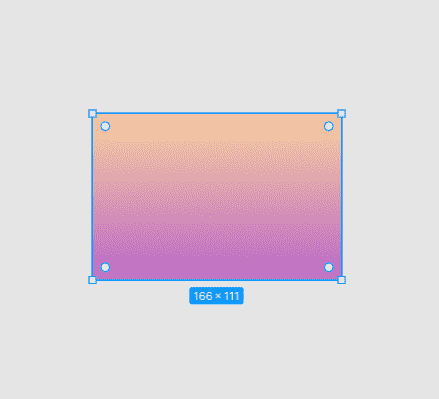
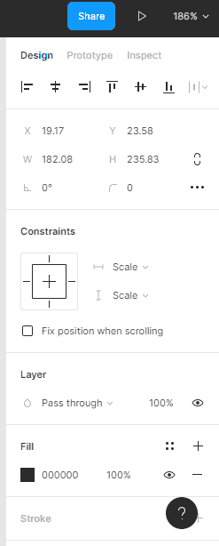
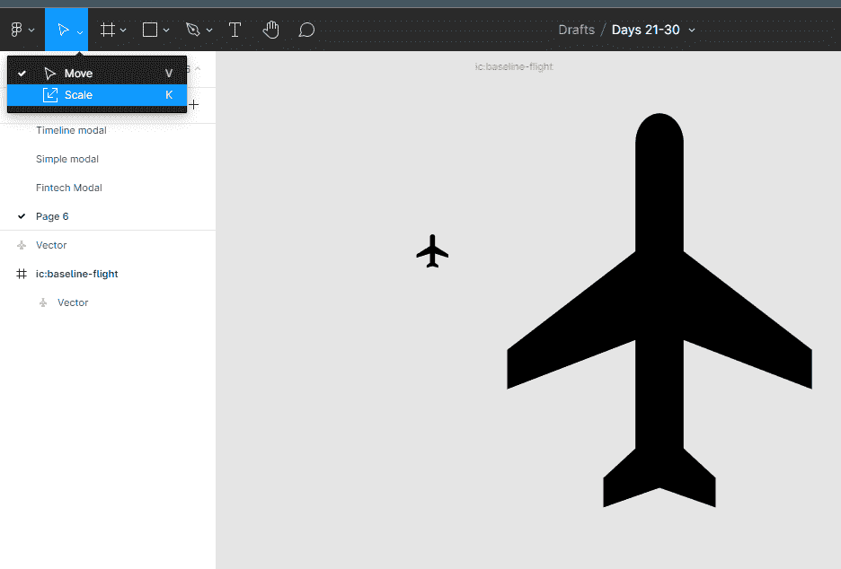
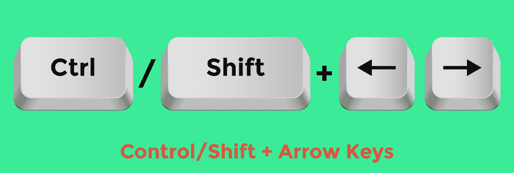
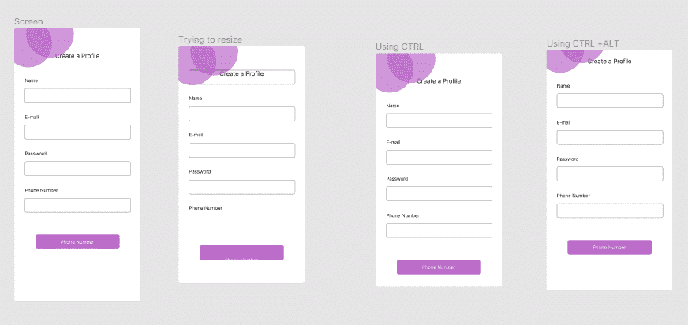

# 如何在 Figma 中调整元素大小

> 原文：<https://www.freecodecamp.org/news/how-to-resize-elements-in-figma/>

在本文中，我们将学习一些不同的方法来调整 Figma 中元素和组的大小(除了默认方法之外)。我们还将学习如何在不移动框架中的元素的情况下调整框架的大小。

在 Figma 中，除了默认方法之外，还有其他调整元素大小的方法。所以，如果使用默认的方法没有得到你想要的结果，不要担心。

首先，我们将看一下默认方法，以便您熟悉它，然后我们还将看到一些调整元素和组大小的其他方法。

## 如何在 Figma 中调整大小–默认方法

在 Figma 中调整大小的默认方法是点击*并拖动*。要使用默认方法调整元素的大小，您需要做的就是选择您的对象，并使用任何变换控件调整它的大小，直到您满意为止。

这样做的时候按住键盘上的 SHIFT 键将有助于限制你的比例。

有时，默认方法可能对某些元素不起作用。在这些情况下，单击并拖动可能会导致对象变形。那么你能做些什么呢？

## 如何在 Figma 中使用属性调整对象的大小

要真正精确地调整对象的大小，请转到位于文件右上角的属性检查器。找到高度和宽度字段，并输入您选择的值。您也可以用鼠标光标拖动这些值。您可以随时使用这种方法来获得您需要的精确比例，如 140 x 140、100 x 50 等等。

请记住，无论您在属性字段中输入什么值，都会反映在您的框架中，因此，选择不会扭曲您的框架的比例非常重要。例如，一个 150 x 20 的元素看起来可能会失真。

您可以随时试验这些值，直到调整元素的大小达到您满意的程度。一切都取决于你。

## 如何使用 Figma 中的缩放工具调整对象的大小

Figma 缩放工具位于屏幕的左上角。要使用缩放工具，请选择您的框架，单击缩放工具，然后使用缩放控件拖动。

这个工具在你调整图标大小时特别有用。当您试图调整图标大小时，一些图标会变形。缩放工具有助于确保您的元素或框架的元素不会扭曲。

缩放适用于文本对象、框架、组件等。您可以随时使用缩放工具来调整元素的大小。

## 如何在 Figma 中使用键盘快捷键调整对象的大小

要用键盘快捷键调整对象大小，选择对象，按住 **CTRL** ，使用**箭头键**调整对象大小。您可以一次增加或减少 1px 的宽度或高度。您可以在任何情况下使用键盘快捷键。

提示:同时按住键盘上的 **SHIFT** 将会把你的调整速度一次提高到 10px。

## 如何在 Figma 中不移动框架内的对象的情况下调整大小

有时，当试图调整包含输入字段的框架的大小时，您会发现由于*的限制，一些对象会随着框架一起移动。*

当然，这不是我们想要的结果。要在调整大小时忽略元素的约束，请在拖动时按住 **CTRL** 。此外，拖动时按住 **Ctrl + Alt** 会按比例调整元素的大小。

## 结论

知道如何调整元素的大小真的可以帮助你为你的设计创造出同样漂亮的框架。

祝你的 Figma 设计好运！