# 如何运行免费的、同行领导的编码训练营——丹·索弗访谈

> 原文：<https://www.freecodecamp.org/news/how-to-run-free-peer-led-coding-bootcamps-an-interview-with-dan-sofer-3e0a82ed45e/>

丽贝卡·雷丁

# 如何运行免费的、同行领导的编码训练营——丹·索弗访谈

#### 丹·索弗谈到了在伦敦和加沙运行免费的、由同行领导的编码训练营，以及他为什么喜欢与非营利组织合作

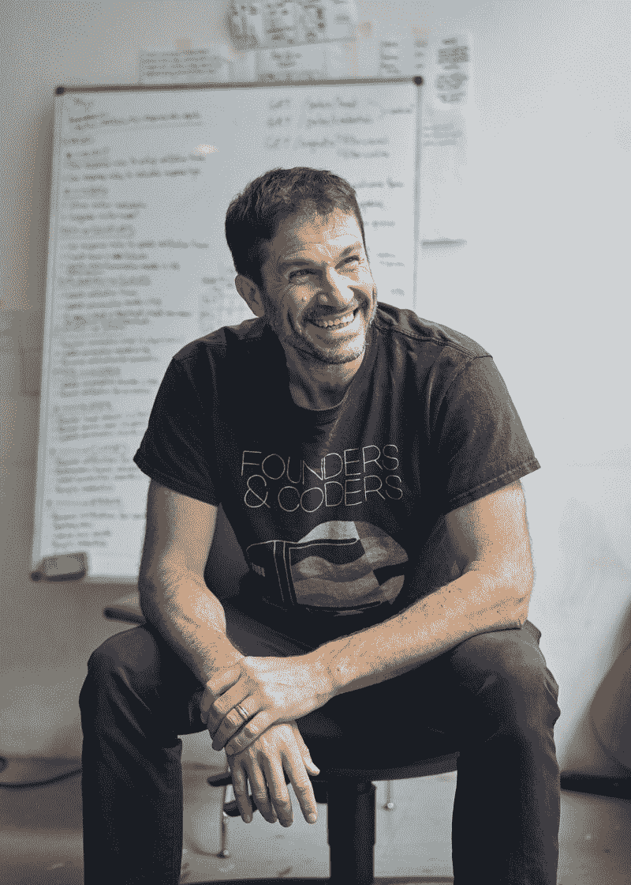

Dan Sofer, founder and director of Founders and Coders CIC

2016 年 8 月，我在特拉维夫本古里安机场的到达航站楼第一次见到了丹。我的丈夫托尼(Tony)一直住在耶路撒冷，他读到了一些关于伦敦的创始人和程序员的信息，并写信给丹，询问他是否有兴趣在巴勒斯坦社区开展一个类似的同龄人领导的培训项目，之后他就飞到了我这里。正如汉弗莱·鲍嘉在《卡萨布兰卡》中所说，那次会面是“一段美好友谊的开始”

自第一次会议以来，我们在英国政府的支持下在拿撒勒和与美慈合作在加沙共同启动了两个新的创始人和程序员项目。最近，我在芬斯伯里公园的 [Space4](http://space4.tech/) 和丹坐在一起，聊了聊创始人和程序员的早期历史，以及这个组织接下来的发展方向。

空间在嗡嗡作响。来自 FAC14 的学生是自四年前创办《创始人与程序员》以来的第十四批学生，他们正准备接待客户参加一个研讨会，作为我们的 [Tech for Better](http://techforbetter.foundersandcoders.com) 项目的一部分，他们得到了前一批学生的导师和他们的课程主持人的支持，他们是 [InFact](https://www.infactcoop.com/) 的一部分，这是一个位于教室旁边共同工作空间的合作组织。

面试是这样进行的…

丽贝卡:丹，这里充满了活力！我们应该搬到更平静的地方吗？

丹:离开我在伦敦最喜欢的地方？不会吧！

丽贝卡:既然这样，我们来谈谈这里发生了什么。我环顾四周，看到了一个令人惊讶的科技工作空间:女性多于男性。

丹:没错。在过去的两年里，我们一半以上(57%)的学生是女性。

丽贝卡:这是故意的吗？

丹:绝对是。包容性是我们创始人和程序员的核心价值观之一。

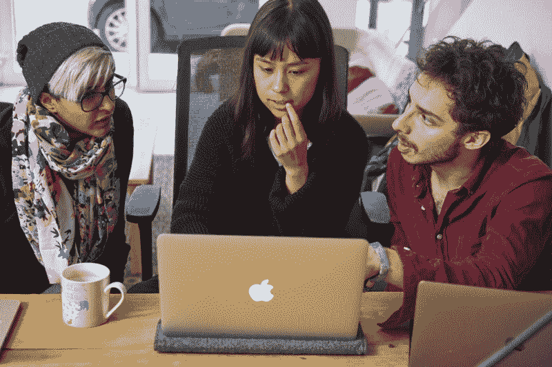

Students from the summer 2017 cohort work on a team projct

丽贝卡:我迫不及待地想听到更多，但首先，你能不能带我们回到你在创始人和程序员之前做什么？

丹:嗯，我从事网络出版已经二十多年了。从编程到项目管理到业务开发，我几乎什么都做过。几年来，我在伦敦奥运会网站上担任项目经理。结束后，我决定花些时间更新我的技术技能，这些技能已经有点生疏了。

2012 年春天，在线平台 [Coursera](https://www.coursera.org/) 上线了，第一个课程是与吴恩达合作的机器学习课程，我已经开始学了，但没有学完。虽然我对利用互联网自学很感兴趣，但我发现自学有点无聊。

我上的下一门课是博弈论，我决定组织一个其他人参加的聚会，以鼓励自己完成这门课。我们四个人定期在大英图书馆见面，直到我们完成课程。

那次经历改变了我。我非常喜欢将结构化的课程与和我有着相同动机和投入程度的一群人一起学习结合起来。整个 2013 年——这几乎占据了我的生活——我在 Coursera 和几乎同时推出的 edX 平台上学习课程。从矩阵代数到创业工程，再到 Scala 函数式编程课程，以及密码学，无所不包。

我们一直在大英图书馆见面，但这是一个公共场所，所以我们不能无限期地在那里露营。我开始寻找一些更持久、更有利于同伴引导学习的东西，这使我在 2013 年底获得了一个由 [Camden Collective](https://camdencollective.co.uk/) 提供的教室空间，在那里我举办了为期六周的试点课程，后来成为了创始人和程序员:我、14 名学生和关于 Udacity 的两门课程。

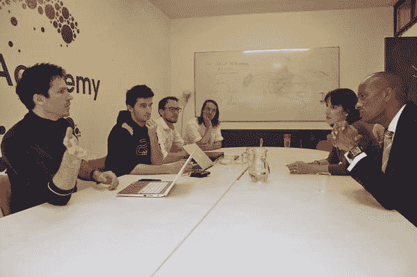

Dan with students from the second cohort meeting Chuka Umunna MP and Rachel Reeves MP at Camden Collective

**Rebecca:** 为什么要做 web 开发？

丹:嗯，有一个同伴引导的学习项目是一回事，它只是让人们发现他们感兴趣的话题，但我很清楚，如果学习是职业性的，它会更有力量，可以引导参与者获得更多的就业机会。

编码训练营——你可以让不同背景的人参加，给他们一个网络开发的基础，然后帮助他们在就业市场上找到工作——已经成为一种模式，我看到我正在做的事情很适合这种结构。

当时是正确的，现在仍然是正确的:有许多初级开发人员的角色，而且有能力承担这些角色的人严重短缺。

丽贝卡:你说你在某种程度上偶然进入了同伴引导的学习。但是有很多关于这个主题的文献。

丹:你说得对。在我发现 Coursera 和同伴引导学习的乐趣之前，我不认为我对不同的教学模式给予了太多的关注。但是当我发现同伴引导的学习模式非常适合我时，我开始好奇还有谁在做有趣的事情。

在创始人和程序员的早期，有几个重要的影响因素。我发现 Sugata Mitra 的“墙上的洞”实验很吸引人。你可能听说过它——他就这个主题做过一次著名的 TED 演讲。他在德里卡尔卡吉贫民窟的一堵墙内的电话亭里安装了一台电脑，孩子们可以自由使用。然后，他记录了街头儿童在没有任何教室环境的情况下是如何做到这一点并自学和相互学习的。从那次实验中，他发展了一种教育方法，给孩子们过于雄心勃勃的项目，把他们分成小组，让他们在没有太多指导的情况下继续进行。

另一个影响是伊凡·伊里奇的*非学校化社会，*我以前实际上读过。伊利奇写于 60 年代，他描述了一种他称之为“学习网”的东西，其中图书馆维护着一个人们学习偏好的数据库，以促进他称之为同伴匹配的过程，在这个过程中，一个人去公共图书馆，这个数据库将他们与城市中其他地方与他们有共同兴趣和激情的人匹配。这是一种为想同行学习的人提供的约会服务。

**Rebecca:** 所以从某种意义上来说，创始人和程序员的早期是一种学习实验室。

丹:那是一种说法。在第二期课程进行到一半时，我开始对把为在线自学设计的现成学习材料放到小组环境中感到不满。人们花了太多的时间戴着耳机听音乐，而这些本来是可以在家里完成的。

在第三个项目中，我们完全放弃了网上的材料，我更多地模仿了 Mitra 多年来对儿童所做的事情。每周会有不同的主题和不同的项目，而不是一个结构良好的课程，我会把他们分成小组，告诉他们继续下去，如果他们发现了任何有趣的东西，他们应该与小组的其他人分享。

第一年，我四处摸索，看看什么可能有效，也听听学生们在说什么，并试图找出他们认为有效的东西，做了大量的阅读，看看其他人过去做过什么，并意识到实际上，在同龄人领导的和基于项目的学习中有丰富的文献。不是那种小说，只是非主流，所以你得挖掘一下。

丽贝卡:那么，你是如何在不收费的情况下运营一个项目的呢？快进到 2018 年，Founders and Coders 每年在伦敦开设三门免学费、为期 16 周的课程。

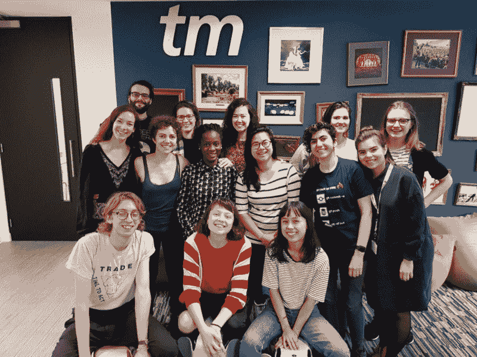

Six generations of Founders and Coders graduates at the 24 Pull Requests event hosted by Codebar and Ladies of Code

丹:事实上，我们从未收费，但这并不是因为我打算提供免费课程。我创办创始人和程序员来促进我自己的自学，所以在早期，我从来没有想过，我需要向这些人收费，因为我很感激他们的存在，以及他们如何支持我的学习。

训练营开始后，我的角色发生了变化。我学的内容和学生们学的不一样，我或多或少已经知道了，一旦课程稳定下来，我们的目标就是让每个学生都学习相同的内容。在 Camden Collective，我得到了很多支持:他们免费提供一间教室，并支付我少量费用来开设课程。

向学生收费的问题并没有真正出现，直到很明显，卡姆登的资金是短期的，我们需要自己去寻找另一个空间。我咨询了学生，我最初问他们的问题是——在解释了我们必须开始支付一些租金，顺便说一下，我想开始支付自己一些东西之后——收取多少费用才算合理？我得到了明确的回应，那就是你不能为此收费，因为其中一个价值观是，我们不是为服务付费，我们将成为社区的一部分，实际上我们希望通过帮助你运行该计划来做出贡献。

从这次对话中产生的想法是，学生应该回馈而不是收费。然后，我们必须开发一个不需要我们收费的模型。

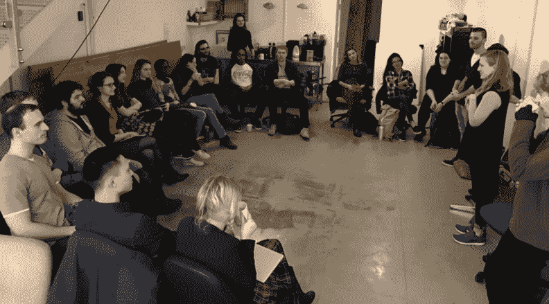

Building community by playing a name game on the first day of FAC10, the spring 2017 cohort

丽贝卡:你能告诉我们一些伦敦创始人和编码公司开发的商业模式吗？

丹:我们于 2015 年在伦敦注册成立了一家投资公司，这种模式非常简单:我们充当职业介绍所。许多商业训练营经营职业介绍所，对他们来说，这是一种盈利的方式。对我们来说，这是存在主义。这是我们支付成本的方式。

我们的课程现在足够强大，我们让非常优秀的人加入到课程中来，他们非常专注于成为开发人员的目标，他们毕业后非常容易就业。在伦敦，有足够多的雇主看重创始人和程序员培养出来的学生的质量，并愿意向我们付费推荐他们。这就是我们现在养活自己的方式。

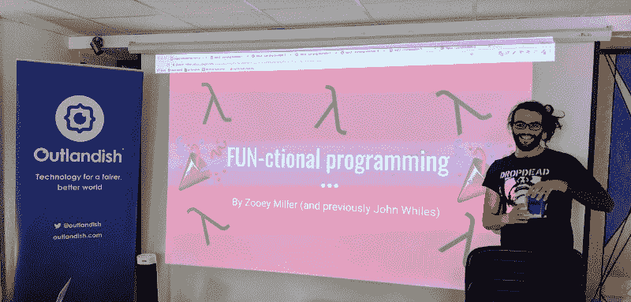

We don’t have any teachers, but we do have some incredible mentors. In this photo, Zooey Miller (FAC10, spring 2017) is visiting the spring 2018 cohort to give a talk on functional programming.

丽贝卡:那么，如果能在创始人和程序员那里获得免费教育，为什么还会有人花钱参加训练营呢？

Dan: 嗯，如果你喜欢结构化的环境，在这种环境中，你会得到熟练的教育者的支持，这些教育者了解他们的材料，可以回答你向他们提出的任何问题，那么由创始人和程序员组成的同辈领导的环境可能不太适合你。

我们的精神很大一部分是，即使你正在快速地学习材料，而不是快速前进，你也应该停下来，确保你的团队的其他人也能跟上。以我的经验来看，有些人觉得这非常令人沮丧，他们宁愿按照自己的步调前进，而不是他们团队的步调。这可能是不选择我们的原因。

丽贝卡:你提到了我们的风气。你能多讲一点我们在 Founders and Coders 的合作、包容和社会影响的核心价值观吗？

丹:嗯，如果你不是为了利益而做某件事，你必须问问自己为什么要这么做。你提到的第一个价值，合作，正如你可能猜到的那样，是因为同伴引导的、基于项目的学习对我们创始人和程序员的工作非常重要。这也是你作为开发人员的就业能力的核心。雇主希望雇佣在团队和两人组中工作出色的人，他们越来越多地与我们合作，因为他们知道从创始人和程序员毕业的开发人员知道如何做这些。

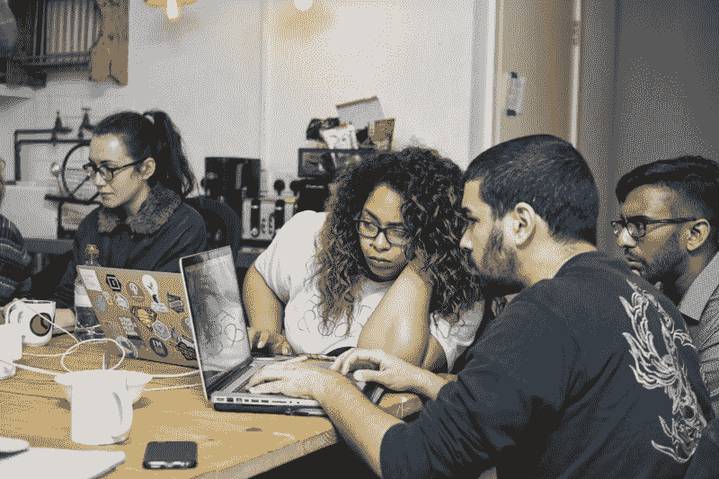

Students from the summer 2017 cohort collaborating on a client project

我们还将创始人和程序员 CIC 作为一个合作组织来运营，我们的校友社区每月召开一次会员大会，每年召开一次全体大会，我们在会上共同设定来年的工作重点，我们还是 CoTech 网络的成员。

包容是第二个。科技行业以男性主导和单一文化而闻名，因此在我看来，如果我们提供一个免费项目，这个机会应该尽可能广泛。在过去的两年里，我们在伦敦招收的学生中有 57%是女性。根据我们的经验，当团队代表了不同的经验和观点，为人们提供了许多相互学习新的思维方式的机会时，团队就会茁壮成长。

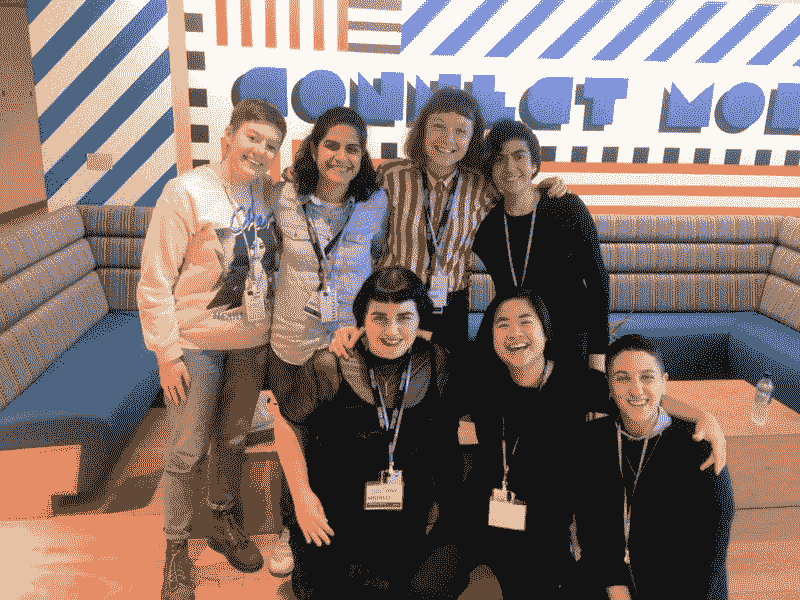

Founders and Coders alumni at the Lesbian Tech London Summit in 2017

你提到的第三个价值，社会影响，对我们来说变得非常重要，现在绝对是最重要的。我想说的是，从一开始我们就想做社会影响项目。但起初，我们确实为任何人工作，主要是早期创业公司或需要 MVP 的预算很少的公司。

在我们运营的第二或第三年，我们开始与安娜·弗洛伊德中心、国民医疗服务体系和 T2 社会技术加速中心等慈善机构建立联系，这让我们有了一点顿悟。非营利组织试图解决的问题要有趣得多。

对我们来说，与非营利部门的人一起工作是一种启示，试图帮助他们解决问题，因为他们非常关心他们在做什么，我们的学生从与他们一起工作的过程中学到了很多东西。

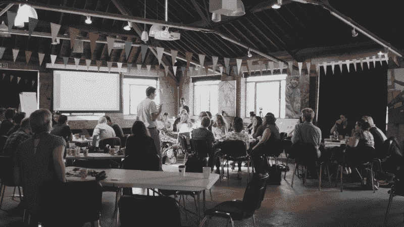

Dan leading a workshop at a hackathon sponsored by [CYP IAPT LondonSE](https://twitter.com/CYP_IAPT_LDNSE) Learning Collaborative

丽贝卡:假设我是一家非营利组织，我想与创始人和程序员一起工作。我如何开始？

Dan: 如果你是一个非营利组织，想要与创始人和程序员一起工作，那么你应该向 [Tech for Better](https://techforbetter.foundersandcoders.com/) 申请，这是我们为非营利组织提供的公益性项目，与我们在伦敦和加沙的开发人员一起开发移动网络应用。

我们的开发人员将与您密切合作，确定您的需求，然后构建一个满足这些需求的应用程序。你还将获得与开发人员一起工作的经历，如果你以前没有与他们一起工作过，这几乎就像学习自己编码一样不透明。这一过程将帮助您的组织确定是否值得投资构建数字服务。

对于我们的开发人员来说，该计划是一个获得经验、提高他们的就业能力以及从事对人们的生活产生真正影响的项目的机会。

丽贝卡:你提到申请“技术进步”项目的非营利组织可能会与加沙的开发商合作。

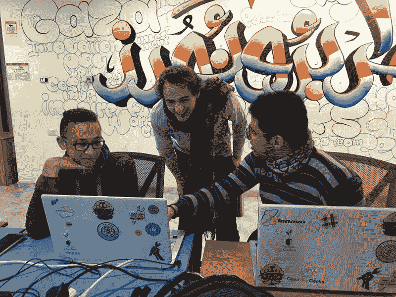

Students from the Code Academy discussing their project with a London-based mentor

丹:没错。我们已经在加沙实地工作了一年多，在那里我们与国际慈善团合作开展了一个项目。当然，加沙是一个非常不同的实验室。加沙人自己称其为世界上最大的露天监狱；在加沙的大部分地区，每天只有几个小时的电力供应。

同时，对许多人来说，网上工作是获得有酬职业的唯一途径。因此，我们正在与美慈组织的加沙天空极客(Gaza Sky Geeks)合作，为加沙人需要的技术和方法开发一个同行主导的技术培训结构，以便为加沙内外的客户工作，无论是伦敦还是沙特阿拉伯。我们全部使用英语，因为英语是全球市场的语言。让伦敦项目适应加沙环境的需要是一项挑战，这是肯定的，但也是我一生中最有收获的一次。

Rebecca: 如果我有预算，想直接在加沙雇佣一个开发团队，该怎么办？

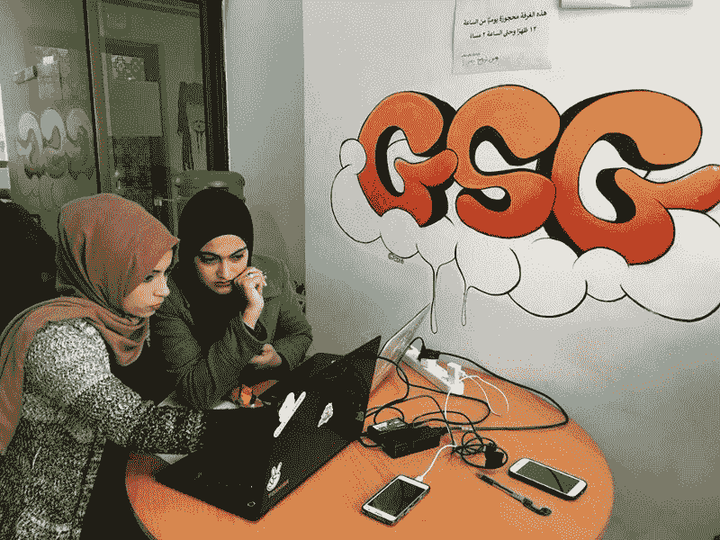

Students from the Gaza Code Academy working on a team project at the Gaza Sky Geeks space in Gaza City

Dan: 如果你想开发一款产品，尤其是一款移动网络应用，Gaza Sky Geeks 经营着一家数字代理公司，他们聘请了我们的一位伦敦校友担任工程经理。他们已经有很多我们的毕业生从事开发工作，并有越来越多的成功客户项目。

丽贝卡:创始人和程序员下一步会走向何方？

**Dan:** 我们相信同伴引导教学法的变革力量，我们很高兴能与美慈合作于 10 月在约旦河西岸开展一个新项目，也很高兴能与英国政府合作[，我们正计划与英国政府合作从明年开始在南非开展一个项目](https://www.gov.uk/government/news/ambitious-new-innovation-partnerships-with-african-countries)。

要了解更多关于在加沙雇佣开发人员的信息，请访问 agency.gazaskygeeks.com。

要了解更多关于免费培训项目的信息，请访问[www.foundersandcoders.com](http://www.foundersandcoders.com.)。