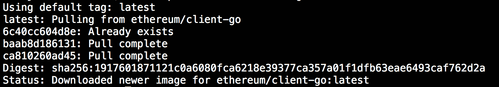
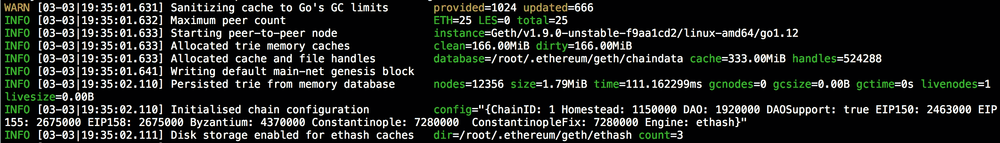
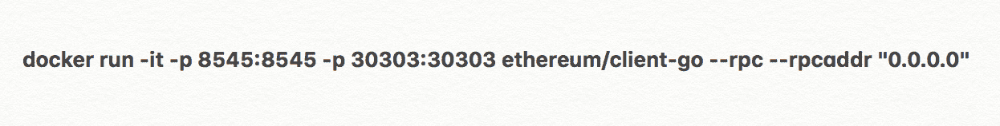
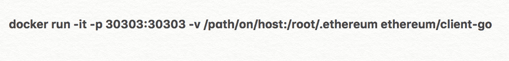
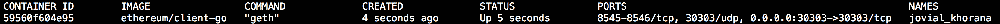
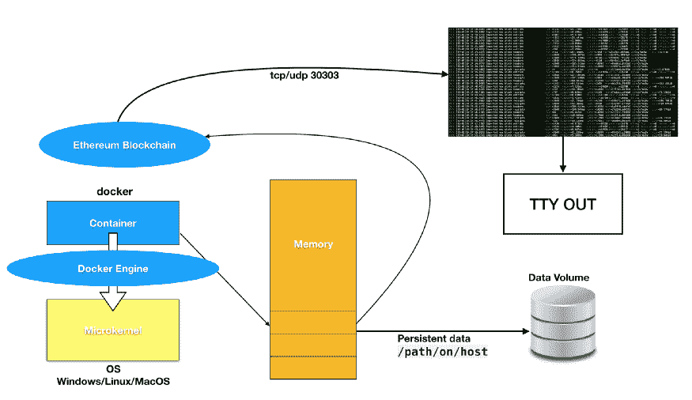

# 如何从 Docker 容器运行 GETH

> 原文：<https://www.freecodecamp.org/news/how-to-run-geth-from-a-docker-container-b6d30620ca74/>

文斯·塔宝拉

# 如何从 Docker 容器运行 GETH

在一台机器上安装以太坊节点客户端可能是一个繁琐的过程。使用 Docker 客户端有一种更简单的方法。这是从 Docker 容器内部运行**(以太坊-Go)节点客户端的指南。GETH 是以太坊协议的 GoLang 实现。可以从 Docker hub 存储库中提取一个映像来运行该环境。**

**[****歌厅****](https://geth.ethereum.org/) 网站列出了以下可用图片及说明。**

*   **是 Geth 的最新开发版本**
*   **`ethereum/client-go:stable`是 Geth 的最新稳定版本**
*   **是特定版本号的 Geth 的稳定版本**
*   **`ethereum/client-go:release-{version}`是特定版本家族中 Geth 的最新稳定版本**

**从容器运行时，默认情况下会打开以下端口。**

*   **`8545` TCP，由基于 HTTP 的 JSON RPC API 使用**
*   **`8546` TCP，由基于 WebSocket 的 JSON RPC API 使用**
*   **`30303` TCP 和 UDP，由运行网络的 P2P 协议使用**
*   **UDP，由 P2P 协议的新对等点发现覆盖使用**

**Docker 客户端软件必须安装在将要运行容器的机器上。只有安装了 Docker 客户端，容器才能运行。根据您的操作系统，需要正确的客户端版本。**

**Windows、Linux 和 MacOS 有不同的版本。该容器甚至可以在 AWS 上运行的 Linux 实例上运行，就像典型的 Linux 安装一样。一旦安装了 Docker 客户端，底层平台就无关紧要了。所有的命令都是一样的。**

## **获取图像**

**在 Linux 或 MacOS 上打开一个 ******终端****** ，或者从 Windows 上打开******PowerShell******命令提示符。在 CLI 提示符下，键入以下命令:**

******docker 拉以太坊/client-go******

**这将从 hub 存储库中提取 Docker 映像，以太坊开发人员在那里上传了该映像。发出此命令后，应该会显示以下详细信息或类似信息:**

****

**我已经拉了图像，所以详细可能看起来不同。当您发出 pull 命令时，它将总是下载最新的可用映像，这是一个很好的做法。**

## **运行节点**

**现在，您可以通过发出以下命令来启动节点:**

****

**我们希望运行带有标志选项 ****-i**** 和 ****-t**** 的节点，以显示来自我们容器的信息。 ****-p**** 表示端口号的使用，在本例中为 30303。同样，该命令可以在没有标志的情况下运行，它将简单地使用容器内部的默认端口和设置。**

**终端应显示以下信息。**

****

**显示配置的信息行揭示了节点客户机软件安装了什么。节点客户端正在运行最新(截至本文发布时)版本的以太坊软件，该软件是君士坦丁堡的，是块高度为 7280000 的用户激活硬分叉。**

**在 JSON-RPC API 中运行时:**

****

**请注意，运行选项 rpcaddr“0 . 0 . 0 . 0”是不安全的，因为您正在向所有流量开放您的节点。如果你的 ETH 钱包没有锁，黑客可以通过这种方式进入你的节点，拿走你的硬币。我在本文中没有涉及安全性，但是您可以在这里阅读更多关于安全性的内容(保护 GETH 节点的 RPC 端口)。始终遵守安全和最佳实践。**

**如果节点在信息行中显示以下内容，将会出现问题:**

**config = " { ChainID:1 Homestead:1150000 DAO:1920000 DAO support:true EIP 150:2463000 EIP 155:2675000 EIP 158:2675000 拜占庭:4370000 君士坦丁堡:<nil>发动机:ethash} "</nil>**

**君士坦丁堡:<nil>表示软件没有更新。也没有出现在正确配置中的 ConstantinopleFix 的行。</nil>**

## **不变数据**

**对于持久的区块链数据，Docker 数据卷应使用选项 ****-v**** 。`/path/on/host`应该替换为您指定的位置。为此，必须使用以下命令:**

****

## **正在检查节点状态**

**您可以使用以下命令检查容器的状态:**

******docker ps******

****

**这将显示带有映像名称、状态和所用端口的容器 ID。**

```
 `#These are the commands to run from the Docker CLI to run the Ethereum Go node client

#GETTING THE IMAGE

docker pull ethereum/client-go

#RUNNING THE NODE

docker run -it -p 30303:30303 ethereum/client-go

#RUNNING NODE USING API

docker run -it -p 8545:8545 -p 30303:30303 ethereum/client-go --rpc --rpcaddr "0.0.0.0"

#Note, warning about using --rpcaddr "0.0.0.0" in a live environment. It is an insecure way of opening your node.
#There are different ways to secure your ports, but this is one thing to take note of if you plan to use the API.

#PERSISTENT DATA

docker run -it -p 30303:30303 -v /path/on/host:/root/.ethereum ethereum/client-go`
```

* * *

**

Running GETH from a Docker Container** 

**请注意，这不会自动挖掘 ETH。这是一个不同的过程。为了快速进入以太坊区块链，这就是运行 GETH 的目的。**

**完整的源代码，请访问:[https://github.com/Play3rZer0/GETHDocker.git](https://github.com/Play3rZer0/GETHDocker.git)**