# 如何用 DeviceHive 运行 Grafana

> 原文：<https://www.freecodecamp.org/news/how-to-run-grafana-with-devicehive-b2f57fe998a8/>

尼古拉·哈巴罗夫

# 如何用 DeviceHive 运行 Grafana

[DeviceHive](https://devicehive.com/?utm_source=medium&utm_medium=social&utm_campaign=d-spring-2018) 是一个物联网平台，拥有大量不同的组件。Grafana 插件就是其中之一。该插件可以从 DeviceHive 服务器收集数据，并使用非常流行的工具 Grafana 在不同的仪表板上显示这些数据。本文解释了如何用 DeviceHive 创建 Grafana 仪表板。例如，它使用 ESP8266 芯片模拟引脚来显示其上的电压。

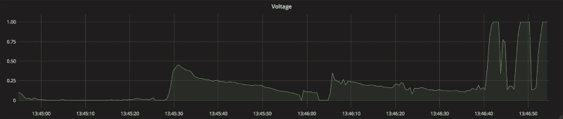

### 数据

要在仪表板上显示任何东西，我们需要数据。就 DeviceHive 服务器而言，可以通过“命令”和“通知”来提供数据。命令通常用于向设备传递该设备应该执行的任何消息，而“通知”则相反，设备向其订户通知某些事件。“命令”和“通知”基本上是简单的 JSON 消息。

这两个实体都可以用来绘制图形、显示静态文本、仪表、表格或任何其他 Grafana 组件。在本文中，我们将使用针对 ESP8266 芯片的特殊 DeviceHive 固件来生成通知。该固件允许芯片使用其协议直接连接到 DeviceHive 服务器，并有大量可以从服务器端发出的[记录命令](https://github.com/devicehive/esp8266-firmware/blob/develop/DeviceHiveESP8266.md)。

### 使用 ESP8266 固件生成通知

DeviceHive 固件的二进制文件可从[这里](https://github.com/devicehive/esp8266-firmware/releases)获得。下载最新版本，并将该固件刷新到您的芯片中。发布档案包含如何做到这一点的文档，但如果您有一个类似“nodemcu”的板，您只需通过 microUSB 电缆将板连接到您的计算机，并从发布档案中为您的操作系统运行“esp-flasher”实用程序，然后等待它刷新板。在刷新电路板后，需要配置芯片应该使用的 Wi-Fi 网络、DeviceHive 服务器和凭证。有两种方法可以做到这一点:使用一个类似 posix 的终端与“esp-终端”util 或无线如[这里所述](https://github.com/devicehive/esp8266-firmware/blob/develop/DeviceHiveESP8266.md#wireless-configuring)。

有一个[免费游乐场服务](https://playground.devicehive.com/?utm_source=medium&utm_medium=social&utm_campaign=d-spring-2018)，可以绝对免费试用一个 DeviceHive 服务器。在您的芯片连接到您的服务器或游戏场后，转到服务器管理面板，在设备列表中找到您的 ESP8266 设备，并发出带有参数“{ 0”:500 }”的“adc/int”命令。

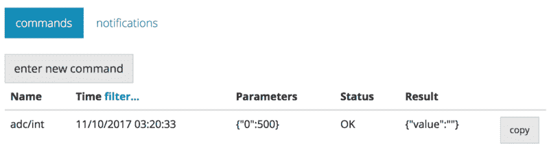

该命令使 esp8266 每隔 500ms 报告一次 ADC 输入#0 上的电压(只有 ESP8266 有)。切换到“通知”后，应该会出现如下屏幕:

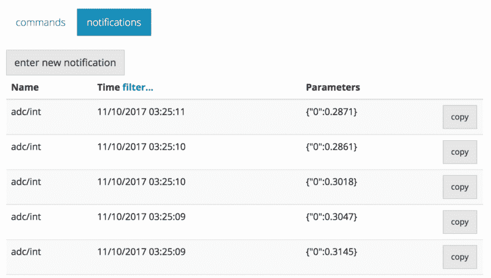

这是芯片输入引脚上的电压。而这种数据是适合我们用 Grafana 来显示的:通知包含数据(在我们的例子中是参数)，通知源源不断的来，所有 DeviceHive 的通知总是有一个时间戳。将模拟传感器连接到该引脚，可以用 Grafana 显示该数据。

### 将 DeviceHive Grafana 插件安装到 Grafana

Grafana 可以用作本地服务或托管服务。要在本地安装 Grafana，请参考"[官方文档。Grafana 安装](http://docs.grafana.org/installation/)。

你可以在“[官方文档中找到如何安装插件。插件安装](http://docs.grafana.org/plugins/installation/)”。

要通过 grafana-cli 安装 DeviceHive 数据源，您可以使用以下命令:

`$ grafana-cli plugins install devicehive-devicehive-datasource`

如果您想要手动安装插件，您应该执行以下步骤:

先决条件，应该安装这些软件包:

*   Grafana >= 4.6
*   NodeJs >= 8 (optional)
*   NPM >= 5(可选)
*   咕哝(`npm install -g grunt`)(可选)

你还应该有权限将数据复制到插件文件夹(你可以在`Paths->plug` ins 的`grafana.ini`中设置)。

1.  将此回购克隆到插件文件夹—`git clone [https://github.com/devicehive/devicehive-grafana-datasource.git](https://github.com/devicehive/devicehive-grafana-datasource.git;)`[；](https://github.com/devicehive/devicehive-grafana-datasource.git;)
2.  接下来的步骤是可选的(如果您想要重新构建数据源源代码):
    2.1 进入文件夹—`cd devicehive-grafana-datasource`；
    2.2 安装所有软件包—`npm install`；
    2.3 构建插件—`npm run build`；
3.  重启 Grafana 服务器
4.  在浏览器中打开 Grafana
5.  单击顶部标题中的 Grafana 图标打开侧面菜单；
6.  在侧边菜单中点击`Data Sources`；
7.  点击顶部标题中的`+ Add data source`；
8.  从`Type`下拉菜单中选择`DeviceHive`；
9.  配置数据源。

安装后，您将能够在已安装插件列表中看到 DeviceHive datasource 插件(参见下图)。

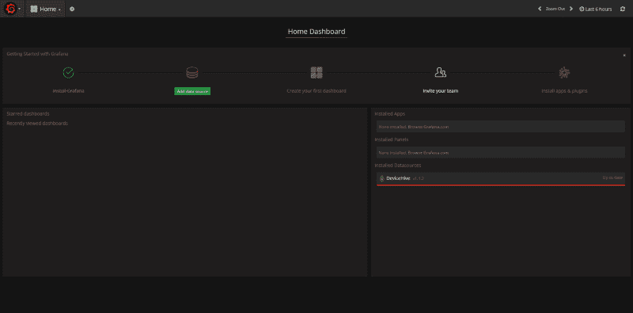

### 添加 Grafana 数据源

要添加 DeviceHive 数据源，您应该执行以下步骤:

1.  单击顶部标题中的 Grafana 图标打开侧面菜单；
2.  在侧边菜单中点击`Data Sources`；
3.  点击顶部标题中的`+ Add data source`；
4.  从`Type`下拉菜单中选择`DeviceHive`；

看下图:

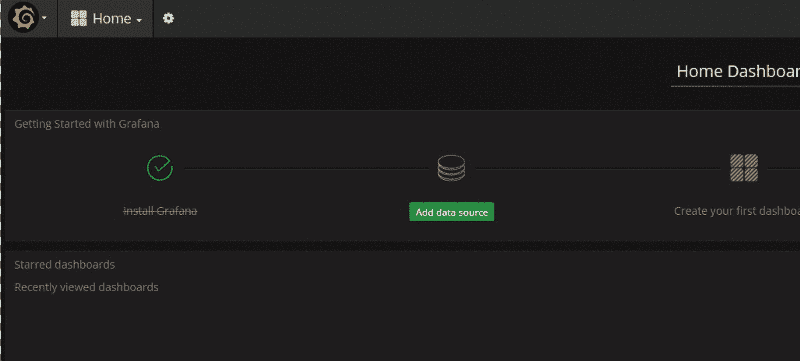

要配置 DeviceHive 数据源，您应该填写以下字段:

服务器 URL(是 DeviceHive WebSocket 服务器的路径。对于游乐场，这是 ws://playground . Device hive . com/API/web socket)
设备 ID(设备 hive 设备的唯一标识符)
登录/密码或 AccessToken —通过认证的凭证

此外，您可以指定 RefreshToken 来自动刷新 AccessToken

在下图中，您可以观察到配置工作流程:

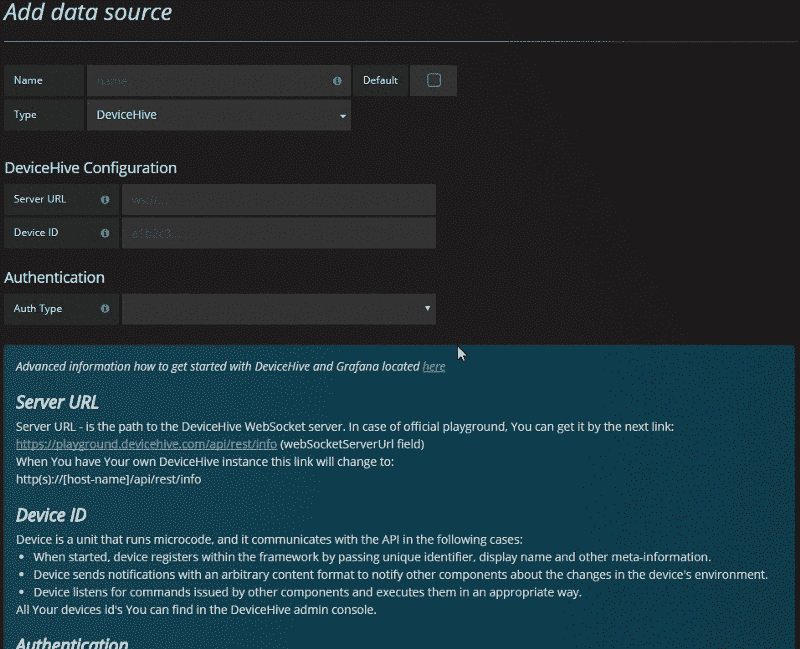

添加和配置 DeviceHive 数据源后，它应该存在于数据源列表中，如下图所示:

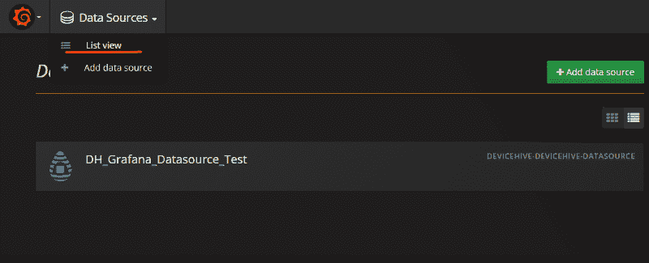

### 创建新仪表板

要创建新的仪表板，您只需点击侧边栏面板中的“新建”按钮，如下图所示:

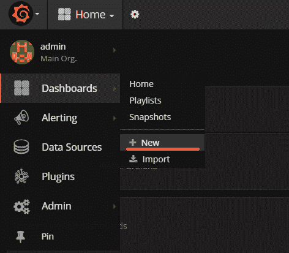

在本文中，我们将在图表面板上显示示例，因此，单击图表按钮:

之后，您将能够在仪表板上看到折线图:

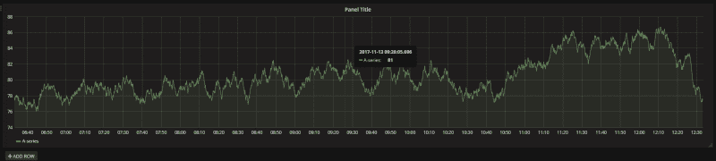

### 用 Grafana 图显示通知/命令

通知和命令是 DeviceHive 实体:
命令:代表客户端为设备调度的消息
通知:代表设备为客户端调度的消息

默认情况下，通知或命令消息提供名为“参数”的字段，用户可以在其中传递自己的数据。

在本文开始时，我们配置了 ESP8266 器件来发送通知，通知中包含代表芯片模拟引脚#0 状态的数据。在下图中，您可以观察如何配置 Grafana 图形面板，使其在折线图上显示数据:

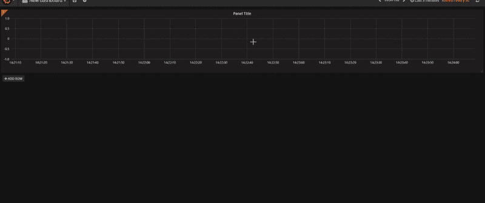

### 在 Grafana 的图表上显示注释

注释提供了一种用丰富的事件在图上标记点的方法。当您将鼠标悬停在注释上时，可以获得事件描述和事件标签。文本字段可以包含其他系统的链接，并提供更多详细信息。
点击[链接](http://docs.grafana.org/reference/annotations/)可以找到更多关于注释的信息。

下图显示了如何配置由 DeviceHive 数据源提供支持的注释。

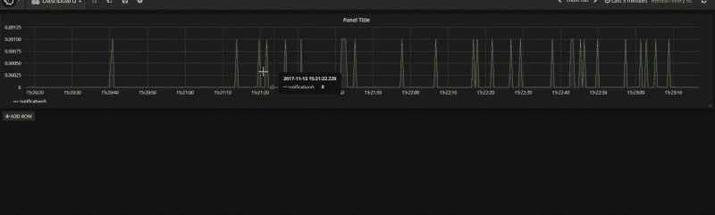

### 高级图形调整

点击“添加转换器”按钮后，您将能够选择一个转换器。转换器是以某种方式转换一个值的简单函数。

目前，DeviceHive 数据源支持以下类型的转换器:

*   比例-乘以给定值
*   偏移(offset )-添加给定值
*   单位转换器—在下列测量类型的不同单位之间转换数值:
*   温度(' c' —摄氏度，' f' —华氏度，' k' —开尔文)
*   长度('米'—米，'英里'—英里，'码'—码，'英尺'—英尺，'英寸'—英寸)
*   重量('千克'—千克，'磅'—磅，'盎司'—盎司)
*   体积(“l”表示升，“gal”表示加仑，“pt”表示品脱)

下图显示了此功能的一个示例。

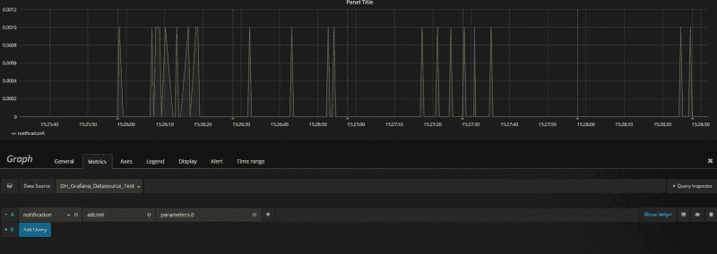

### 结论

Grafana 是可视化数据的完美工具。它非常灵活，并提供了许多不同的功能，以你喜欢的方式进行可视化。Grafana 可以使用来自各种软件解决方案的许多数据源，DeviceHive 就是其中之一。我们在本文中描述的示例非常简单。使用这些原则可以创建更高级的图表，我们希望这对你有所帮助。使用 Grafana 和 DeviceHive，您可以构建自己的物联网可视化解决方案，而且您可以根据需要修改这两个项目，因为 Grafana 和 DeviceHive 是开源软件。

*与 [DeviceHive](https://devicehive.com/?utm_source=medium&utm_medium=social&utm_campaign=d-spring-2018) 的高级开发人员 Igor Trambovetskiy 合作撰写。*