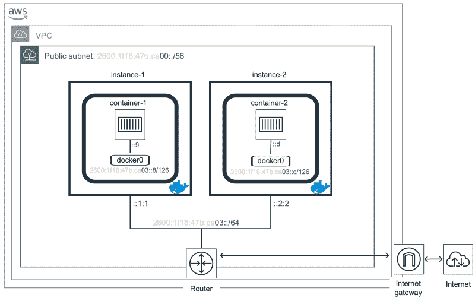

# 如何在 AWS 上运行支持 IPv6 的 Docker 容器

> 原文：<https://www.freecodecamp.org/news/how-to-run-ipv6-enabled-docker-containers-on-aws-87e090ab0397/>

尼古拉斯·莱瓦

# 如何在 AWS 上运行支持 IPv6 的 Docker 容器

您想忘记 NAT 并运行容器而无需转换 IP 地址吗？然后你需要公共 IP 地址，很多。不幸的是，每个 IPv4 地址[的价格超过了 20 美元](http://www.circleid.com/posts/20181024_the_2018_ipv4_market_third_quarter_report/)，所以你不会为你的每一个容器都得到一个 IP v4 地址。另一方面，IPv6 地址并不短缺，所以理论上你可以给你想要的容器分配一个唯一的地址。

早在 1981 年，当帮助将这篇博客文章传送到你的设备的互联网协议( **IP** )被定义为[时，识别来源和目的地的互联网地址被指定为固定长度的四个八位字节( **32 位**)。这实际上是协议的第四个版本，所以我们将这些地址称为 IP 版本 4 ( **IPv4** )地址。](https://tools.ietf.org/html/rfc791)

大约十年后，在 1992 年[，很明显我们最终会用完 32 位 IPv4 地址，因此在 1994 年 3 月](https://tools.ietf.org/html/rfc1338)[定义了可重用的**私有 IP** 地址，试图保留 IP 地址空间。您可以使用这些来标识企业专用的主机。如果这些主机中的任何一个需要连接到外部主机，其地址需要被转换成全球唯一的**a-public**-**IP**地址。这个过程被称为网络地址转换( **NAT** )，并在几个月后](https://tools.ietf.org/html/rfc1597)被定义为[。](https://tools.ietf.org/html/rfc1631)

大约一年后(1995 年)，一个新版本的互联网协议问世，提供了[和其他](https://tools.ietf.org/html/rfc2460#page-2)扩展的寻址能力。我们称之为 **IPv6** ，它将 IP 地址大小从 32 位增加到 **128 位**。

> 问题？IPv6 并不向后兼容 IPv4，因此过渡非常非常缓慢……20 多年来，目前的[采用率约为 22%](https://www.google.com/intl/en/ipv6/statistics.html) 。

无论如何，这篇文章的目的是演示如何使用 IPv6 在云提供商(AWS)上运行容器。这是我上一篇文章中未解决的问题: [Kubernetes 使多集群网络变得简单](https://medium.com/@nleiva/kubernetes-multi-cluster-networking-made-simple-c8f26827813)。目标拓扑如下。



虽然我们目前不能分解分配给`VPC` ( `/56`)的 IPv6 地址块，以便在 AWS 中将更小的子网(`/64`)分配给实例，但是我们可以使用弹性网络接口( [ENI](https://docs.aws.amazon.com/AWSEC2/latest/UserGuide/using-eni.html) )将连续的 IPv6 地址块关联到一个实例。这将生成一个大于`/64`(在本例中为`/126`)的 IPv6 前缀长度，这在局域网中不是一个最佳实践，所以对此要有所保留。

简而言之，这就是我们将要做的:

1.  创建附加了一个 [ENI](https://docs.aws.amazon.com/AWSEC2/latest/UserGuide/using-eni.html) 的 [EC2](https://aws.amazon.com/ec2/) 实例。
2.  在实例上重新配置 IPv6 寻址并安装 Docker。
3.  仅使用 IPv6 运行几个容器。

### 创建附加了 ENI 的 EC2 例程

我们将使用 AWS[CLI](https://aws.amazon.com/cli/)[create-network-interface](https://docs.aws.amazon.com/cli/latest/reference/ec2/create-network-interface.html)来创建一个 [ENI](https://docs.aws.amazon.com/AWSEC2/latest/UserGuide/using-eni.html) ，其中包含一个主 IPv6 地址以及我们每个实例的连续 IPv6 地址块。这些地址将来自一个已知的`Subnet`。我们还将对我们的 [ENI](https://docs.aws.amazon.com/AWSEC2/latest/UserGuide/using-eni.html) 应用一个`Security Group`。

#### 子网、安全组和 ENI

如果你还没有支持 IPv6 的`VPC`，请看看亚马逊 VPC 的[IPv6 入门，这样你就可以在变量`subnetId`和`sgId`中存储`Subnet`和`Security Group`的 ID。](https://docs.aws.amazon.com/vpc/latest/userguide/get-started-ipv6.html)

```
subnetId=subnet-09a931730fa9exxxxsgId=sg-0eaf439572982yyyy
```

对于`instance-1`，我们将预留地址`::1:1`、`::8`、`::9`、`::a`和`::b`。为了便于阅读，我去掉了子网前缀。第一个地址将用于实例，其他四个地址将构成容器将连接到的 linux 桥所需的`/126`。

```
2600:1f18:47b:ca03::1:12600:1f18:47b:ca03::82600:1f18:47b:ca03::92600:1f18:47b:ca03::a2600:1f18:47b:ca03::b
```

对于我们的`instance-2`，我们将保留地址`::2:2`、`::c`、`::d`、`::e`和`::f`。

```
2600:1f18:47b:ca03::2:22600:1f18:47b:ca03::c2600:1f18:47b:ca03::d2600:1f18:47b:ca03::e2600:1f18:47b:ca03::f
```

有了这些信息，我们执行[创建网络接口](https://docs.aws.amazon.com/cli/latest/reference/ec2/create-network-interface.html)命令。但是，我们还需要为后面的操作存储 [ENI](https://docs.aws.amazon.com/AWSEC2/latest/UserGuide/using-eni.html) 的 ID，所以我们将`query` `NetworkInterface.NetworkInterfaceId`和`instance-1`的返回值存储在`eni1`中。

```
eni1=`aws ec2 create-network-interface \  --subnet-id $subnetId \  --description "My IPv6 ENI 1" \  --groups $sgId \  --ipv6-addresses \  Ipv6Address=2600:1f18:47b:ca03::1:1 \  Ipv6Address=2600:1f18:47b:ca03::8 \  Ipv6Address=2600:1f18:47b:ca03::9 \  Ipv6Address=2600:1f18:47b:ca03::a \  Ipv6Address=2600:1f18:47b:ca03::b \  --query 'NetworkInterface.NetworkInterfaceId' \  --output text`
```

您可以按如下方式检查返回值。

```
$ echo $eni1eni-08ba7c2f50a22a160
```

对第二个 [ENI](https://docs.aws.amazon.com/AWSEC2/latest/UserGuide/using-eni.html) 重复上述步骤。

```
eni2=`aws ec2 create-network-interface \  --subnet-id $subnetId \  --description "My IPv6 ENI 2" \  --groups $sgId \  --ipv6-addresses \  Ipv6Address=2600:1f18:47b:ca03::2:2 \  Ipv6Address=2600:1f18:47b:ca03::c \  Ipv6Address=2600:1f18:47b:ca03::d \  Ipv6Address=2600:1f18:47b:ca03::e \  Ipv6Address=2600:1f18:47b:ca03::f \  --query 'NetworkInterface.NetworkInterfaceId' \  --output text`
```

#### 启动附加了 ENI 的实例

Amazon EC2 使用公钥加密来加密和解密登录信息[ [Amazon EC2 密钥对](https://docs.aws.amazon.com/AWSEC2/latest/UserGuide/ec2-key-pairs.html) ]，因此您需要一个公钥和一个私钥来连接到实例。

您可以使用一个现有的文件，或者创建一个，如下所示，其中`~/.ssh/id_rsa.pub`是您的公钥文件的位置。

```
aws ec2 import-key-pair \  --key-name <name> \  --public-key-material file://~/.ssh/id_rsa.pub
```

我们将密钥对的名称存储在一个名为`AWS_SSH_KEY`的变量中。您可以手动分配名称，就像您刚才选择它一样，或者使用`describe-key-pairs`从 AWS 中检索它。

```
AWS_SSH_KEY=$(aws ec2 describe-key-pairs --query KeyPairs[0].KeyName --output text)
```

现在是创建实例的时候了。我们将使用 [AMI](https://docs.aws.amazon.com/AWSEC2/latest/UserGuide/AMIs.html) ID `ami-0ac019f4fcb7cb7e6`，也就是`Ubuntu Server 18.04 LTS`，实例类型`r5d.large`。

您可以分配给一个实例的 IP 地址数量受到其类型的限制，因此对于`r5d.large`来说，例如我们可以达到 10 个 IPv6 地址，这对于这个小型的概念验证来说已经足够了。有关实例类型的详细信息，请参见[每个实例类型的每个网络接口的 IP 地址](https://docs.aws.amazon.com/AWSEC2/latest/UserGuide/using-eni.html#AvailableIpPerENI)。

我们还想附加我们之前创建的 [ENI](https://docs.aws.amazon.com/AWSEC2/latest/UserGuide/using-eni.html) ，它的 ID 存储在`eni1`中。我们将从 AWS 收到的实例 ID 保存在`vm1`中(我们正在查询`Instances[0].InstanceId`)。

```
vm1=`aws ec2 run-instances \  --key-name $AWS_SSH_KEY \  --image-id ami-0ac019f4fcb7cb7e6 \  --instance-type r5d.large \  --network-interfaces DeviceIndex=0,NetworkInterfaceId=$eni1 \  --query 'Instances[0].InstanceId' \  --output text`
```

对于`instance-2`也是如此。

```
vm2=`aws ec2 run-instances \  --key-name $AWS_SSH_KEY \  --image-id ami-0ac019f4fcb7cb7e6 \  --instance-type r5d.large \  --network-interfaces DeviceIndex=0,NetworkInterfaceId=$eni2 \  --query 'Instances[0].InstanceId' \  --output text`
```

接下来，我们获取`instance-1`的第一个公有 IPv6 地址，并存储在`ip1`中。

```
ip1=`aws ec2 describe-instances \  --filter Name=instance-id,Values=$vm1 \  --output text \  --query 'Reservations[].Instances[].NetworkInterfaces[].\Ipv6Addresses[0].Ipv6Address'`
```

您现在可以使用`ssh -i <private key file> ubuntu@` ${ip1}访问`instance-1`。类似地`, for inst` ance-2 您可以使用以下命令检索第一个公共 IPv6 地址:

```
ip2=`aws ec2 describe-instances \  --filter Name=instance-id,Values=$vm2 \  --output text \  --query 'Reservations[].Instances[].NetworkInterfaces[].\Ipv6Addresses[0].Ipv6Address'`
```

所以可以用`ssh -i <private key file> ubuntu@` ${ip2}来访问。

#### 使实例支持 IPv6

我们需要在我们的实例中安装软件。不幸的是，这不可能马上实现，因为我们的`sources.list`文件带有到`[us-east-1.ec2.archive.ubuntu.com](http://us-east-1.ec2.archive.ubuntu.com/ubuntu/)`的链接，这些链接不能解析为 IPv6 地址。？我们需要替换这些来使用一个正确支持 IPv6 的`[rchive.ubuntu.com](http://us-east-1.ec2.archive.ubuntu.com/ubuntu/)` 。你可以用 s `ed.`做到这一点

```
sudo sed -i 's/us-east-1\.ec2\.//g' /etc/apt/sources.list
```

现在您可以将`apt-get`与选项`Acquire::ForceIPv6=true`一起使用。

```
$ sudo apt-get -o Acquire::ForceIPv6=true updateGet:1 http://archive.ubuntu.com/ubuntu bionic InRelease [242 kB]Get:2 http://security.ubuntu.com/ubuntu bionic-security InRelease [83.2 kB]Get:3 http://archive.ubuntu.com/ubuntu bionic-updates InRelease [88.7 kB]...Get:38 http://archive.ubuntu.com/ubuntu bionic-backports/universe Sources [2068 B]Get:39 http://archive.ubuntu.com/ubuntu bionic-backports/universe amd64 Packages [3468 B]Get:40 http://archive.ubuntu.com/ubuntu bionic-backports/universe Translation-en [1604 B]Fetched 28.4 MB in 5s (5363 kB/s)Reading package lists... Done
```

### 在实例上重新配置 IPv6 寻址并安装 Docker

现在，我们的实例有一个带有多个 IPv6 地址的接口。`instance-1`显示五个`/128` IPv6 地址。

```
$ ip add...2: ens5: <BROADCAST,MULTICAST,UP,LOWER_UP> mtu 9001 qdisc mq state UP group default qlen 1000...    inet6 2600:1f18:47b:ca03::1:1/128 scope global dynamic noprefixroute       valid_lft 385sec preferred_lft 85sec    inet6 2600:1f18:47b:ca03::8/128 scope global dynamic noprefixroute       valid_lft 385sec preferred_lft 85sec    inet6 2600:1f18:47b:ca03::9/128 scope global dynamic noprefixroute       valid_lft 385sec preferred_lft 85sec    inet6 2600:1f18:47b:ca03::a/128 scope global dynamic noprefixroute       valid_lft 385sec preferred_lft 85sec    inet6 2600:1f18:47b:ca03::b/128 scope global dynamic noprefixroute       valid_lft 385sec preferred_lft 85sec
```

#### 新 IPv6 地址分配

我们只希望主接口中有一个(`/64`)和 linux 桥(docker0)中有一个`/126`来分配这个范围内的容器地址。为此，我们将在`/etc/netplan/50-cloud-init.yaml`编辑[网络计划](https://netplan.io/)的配置文件。它最初看起来像这样:

```
network:  version: 2  ethernets:    ens5:      dhcp4: true      dhcp6: true      match:        macaddress: 12:fb:b4:8b:15:f8      set-name: ens5
```

我们只从中删除了`dhcp6`语句。

```
network:  version: 2  ethernets:    ens5:      dhcp4: true      match:        macaddress: 12:fb:b4:8b:15:f8      set-name: ens5
```

顺便提一下，并且完全是**可选的**，实例的`MAC`地址和与之关联的 IPv6 地址可以随时从[实例元数据](https://docs.aws.amazon.com/AWSEC2/latest/UserGuide/ec2-instance-metadata.html#instancedata-data-retrieval)中检索。

```
$ curl http://169.254.169.254/latest/meta-data/network/interfaces/macs/12:fb:b4:8b:15:f8
```

并且:

```
$ curl http://169.254.169.254/latest/meta-data/network/interfaces/macs/12:fb:b4:8b:15:f8/ipv6s/2600:1f18:47b:ca03:0:0:0:82600:1f18:47b:ca03:0:0:0:92600:1f18:47b:ca03:0:0:0:a2600:1f18:47b:ca03:0:0:0:b2600:1f18:47b:ca03:0:0:1:1
```

> ⚠️:是的，[实例元数据](https://docs.aws.amazon.com/AWSEC2/latest/UserGuide/ec2-instance-metadata.html#instancedata-data-retrieval)是一项仅支持 IPv4 的服务？。好消息是你不需要一个公共 IPv4 地址来访问它。

继续实例的接口配置，我们还需要在`/etc/netplan/60-ipv6-static.yaml`为 IPv6 配置创建一个单独的文件。

```
network:  version: 2  ethernets:    ens5:      dhcp6: no      accept-ra: no      addresses:      - 2600:1f18:47b:ca03::1:1/64      gateway6: fe80::1066:30ff:feb8:c008
```

我们禁用了 DHCPv6 ( `dhcp6: no`)并丢弃了 IPv6 路由器广告(`accept-ra: no`)。网关信息(`fe80::1066:30ff:feb8:c008`)来自`iproute2`命令(在 EC2 中似乎总是相同的)。

```
$ ip -6 route | grep defaultdefault via fe80::1066:30ff:feb8:c008 dev ens5 proto ra metric 100 pref medium
```

最后，用`netplan apply`应用我们的配置更改。

```
sudo netplan --debug apply
```

我们对相应的地址重复`instance-2`。

#### 安装 Docker

你可以按照[官方安装指南](https://docs.docker.com/install/linux/docker-ce/ubuntu/#install-docker-ce)或者运行以下命令。注意`apt-get`的选项`Acquire::ForceIPv6=true`。

```
curl -fsSL https://download.docker.com/linux/ubuntu/gpg | sudo apt-key add -sudo add-apt-repository "deb [arch=amd64] https://download.docker.com/linux/ubuntu $(lsb_release -cs) stable"sudo apt-get -o Acquire::ForceIPv6=true updatesudo apt-get -o Acquire::ForceIPv6=true install -y docker-cesudo usermod -aG docker ${USER}
```

您需要注销并重新登录，以使用户更改生效。

我们将在`/etc/docker/daemon.json`编辑/创建一个 Docker 配置文件，开始为我们的容器分配 IPv6 地址。对于`instance-1`应该是这样的。

```
{  "ipv6": true,  "fixed-cidr-v6": "2600:1f18:47b:ca03::8/126"}
```

然后重新启动守护程序以应用更改；`sudo systemctl restart docker`。我们现在已经成功地在主接口和 Docker 桥之间分割了 [ENI](https://docs.aws.amazon.com/AWSEC2/latest/UserGuide/using-eni.html) IPv6 地址分配。

```
$ ip add...2: ens5: <BROADCAST,MULTICAST,UP,LOWER_UP> mtu 9001 qdisc mq state UP group default qlen 1000...    inet6 2600:1f18:47b:ca03::1:1/64 scope global       valid_lft forever preferred_lft forever...3: docker0: <NO-CARRIER,BROADCAST,MULTICAST,UP> mtu 1500 qdisc noqueue state DOWN group default...    inet6 2600:1f18:47b:ca03::9/126 scope global tentative       valid_lft forever preferred_lft forever...
```

对`instance-2`做同样的事情，用`fixed-cidr-v6` = `::c/126`。

### 仅使用 IPv6 运行几个容器

我们准备运行容器。或者至少我是这么想的。原来`registry-1.docker.io`和`hub.docker.com`不支持 IPv6，所以我们无法从中获取 Docker 镜像。？

#### 运行映像

我们是不是走进了死胡同？不，谷歌容器注册来拯救我们！→ `gcr.io/gcp-runtimes/ubuntu_18_0_4:latest`。让我们在每个实例上运行这个。

```
docker run -it --rm gcr.io/gcp-runtimes/ubuntu_18_0_4:latest bash
```

在每个容器中安装`ping`和`iproute2`，做一些连通性测试，检查路由表。

```
apt-get -o Acquire::ForceIPv6=true updateapt-get -o Acquire::ForceIPv6=true install iputils-ping iproute2 -y
```

此时，我们已经验证了实例可以通过 IPv6 访问互联网(通过`apt-get`)。让我们看看分配的 IP 地址；我们在`instance-1` ( `container-1`)的集装箱里得到了`::a` 。类似地，我们让容器中的`::e`在`instance-2` ( `container-2`)上运行。

```
root@d7c9480161f9:/# ip add...4: eth0@if5: <BROADCAST,MULTICAST,UP,LOWER_UP> mtu 1500 qdisc noqueue state UP group default...    inet6 2600:1f18:47b:ca03::a/126 scope global nodad       valid_lft forever preferred_lft forever...
```

为了更清楚地说明这一点，我们可以通过 IPv6 ping 互联网中的主机。

```
root@d7c9480161f9:/# ping6 ipv6-test.com -c 1PING ipv6-test.com(agaric.t0x.net (2001:41d0:8:e8ad::1)) 56 data bytes64 bytes from agaric.t0x.net (2001:41d0:8:e8ad::1): icmp_seq=1 ttl=46 time=78.7 ms
```

```
--- ipv6-test.com ping statistics ---1 packets transmitted, 1 received, 0% packet loss, time 0msrtt min/avg/max/mdev = 78.788/78.788/78.788/0.000 ms
```

好，现在让我们从`container-1`(`5312fff41595`)ping`container-2`(`d7c9480161f9`)。

```
root@d7c9480161f9:/# ping6 2600:1f18:47b:ca03::e -c 1PING 2600:1f18:47b:ca03::e(2600:1f18:47b:ca03::e) 56 data bytes64 bytes from 2600:1f18:47b:ca03::e: icmp_seq=1 ttl=62 time=0.250 ms
```

```
--- 2600:1f18:47b:ca03::e ping statistics ---1 packets transmitted, 1 received, 0% packet loss, time 0msrtt min/avg/max/mdev = 0.250/0.250/0.250/0.000 ms
```

反过来(`container-2`到`container-1)`，以防万一。一切正常。？

```
root@5312fff41595:/#  ping6 2600:1f18:47b:ca03::a -c 1PING 2600:1f18:47b:ca03::a(2600:1f18:47b:ca03::a) 56 data bytes64 bytes from 2600:1f18:47b:ca03::a: icmp_seq=1 ttl=62 time=0.263 ms
```

```
--- 2600:1f18:47b:ca03::a ping statistics ---1 packets transmitted, 1 received, 0% packet loss, time 0msrtt min/avg/max/mdev = 0.263/0.263/0.263/0.000 ms
```

如果这对您不起作用，请确保应用于 [ENI](https://docs.aws.amazon.com/AWSEC2/latest/UserGuide/using-eni.html) 的`Security Group`允许您的实例使用 IPv6 ICMP。我专门创建了一个具有相同的`Security Group` ID 的入站`Custom ICMP Rule — IPv6`作为源，以使这个例子能够工作。

#### 路由表

让我们来探究一下`container-1`中的路由表。

```
root@d7c9480161f9:/# ip -6 route2600:1f18:47b:ca03::8/126 dev eth0 proto kernel metric 256 pref mediumfe80::/64 dev eth0 proto kernel metric 256 pref mediumdefault via 2600:1f18:47b:ca03::9 dev eth0 metric 1024 pref medium
```

`::9`是在之前的终端输出中看到的`docker0`中的 IP。那么`instance-1`路由的表呢？

```
$ ip -6 route2600:1f18:47b:ca03::8/126 dev docker0 proto kernel metric 256 pref medium2600:1f18:47b:ca03::8/126 dev docker0 metric 1024 pref medium2600:1f18:47b:ca03::/64 dev ens5 proto kernel metric 256 pref medium...default via fe80::1066:30ff:feb8:c008 dev ens5 proto static metric 1024 pref medium
```

#### 一句忠告

Docker 建议我们通过执行下面两行代码在 Linux 上启用 IPv6 路由来实现这一点。

```
sudo sysctl net.ipv6.conf.default.forwarding=1sudo sysctl net.ipv6.conf.all.forwarding=1
```

对于这个例子，我不必这样做，因为 EC2 实例已经有了这个设置。他们也不推荐小于`/80`的 IPv6 子网。

> ⚠️“Docker 容器的子网大小应该至少为/80，以便 IPv6 地址可以以容器的 MAC 地址结束，并防止 docker 层的 NDP 邻居缓存失效问题”[docker](https://docs.docker.com/v17.09/engine/userguide/networking/default_network/ipv6/#how-ipv6-works-on-docker)

最后，但同样重要的是，我遇到了一个[讨论](https://github.com/containernetworking/cni/issues/531)，他们说 IPv6 在一些 Docker 版本的容器上是禁用的。我在跑`18.09.0`。

```
$ docker info  -f '{{.ServerVersion}}'18.09.0
```

以下是容器内 `disable_ipv6`的网络内核设置。

```
root@d7c9480161f9:/# sysctl -a | grep disable_ipv6net.ipv6.conf.all.disable_ipv6 = 1net.ipv6.conf.default.disable_ipv6 = 1net.ipv6.conf.eth0.disable_ipv6 = 0net.ipv6.conf.lo.disable_ipv6 = 0
```

### 结论

虽然这并不是最终目标，但有趣的是我们现在可以在云中运行仅支持 IPv6 的容器。✅

接下来，我将尝试扩展它，在一个云提供商上运行只支持 IPv6 的 Kubernetes 或者先看看不同云提供商对 IPv6 的支持。