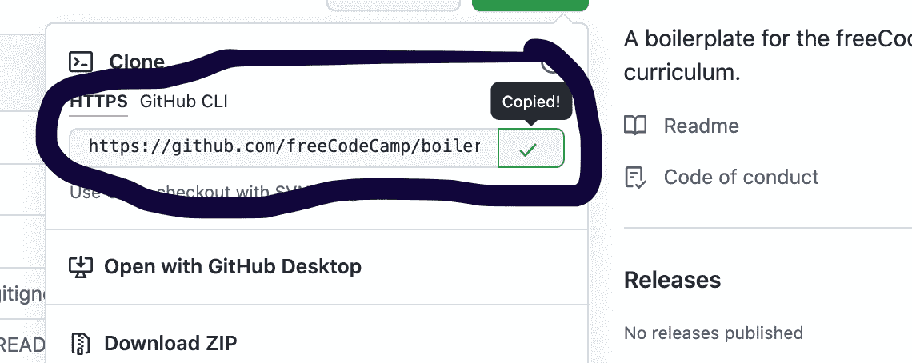
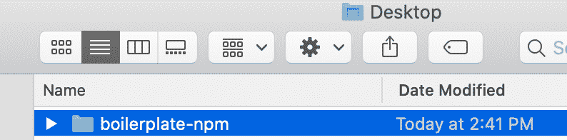
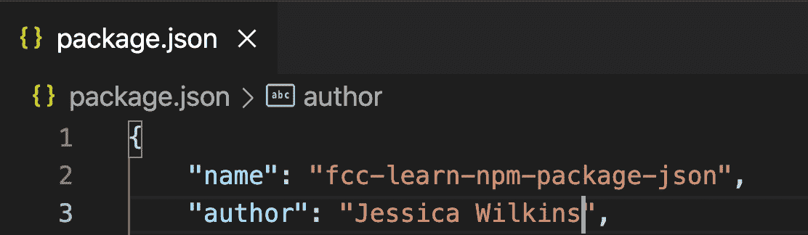
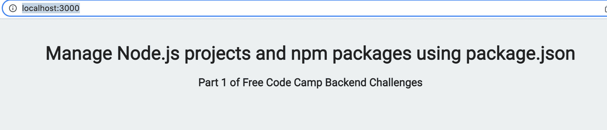
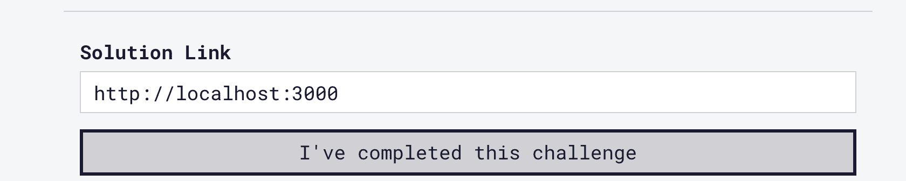
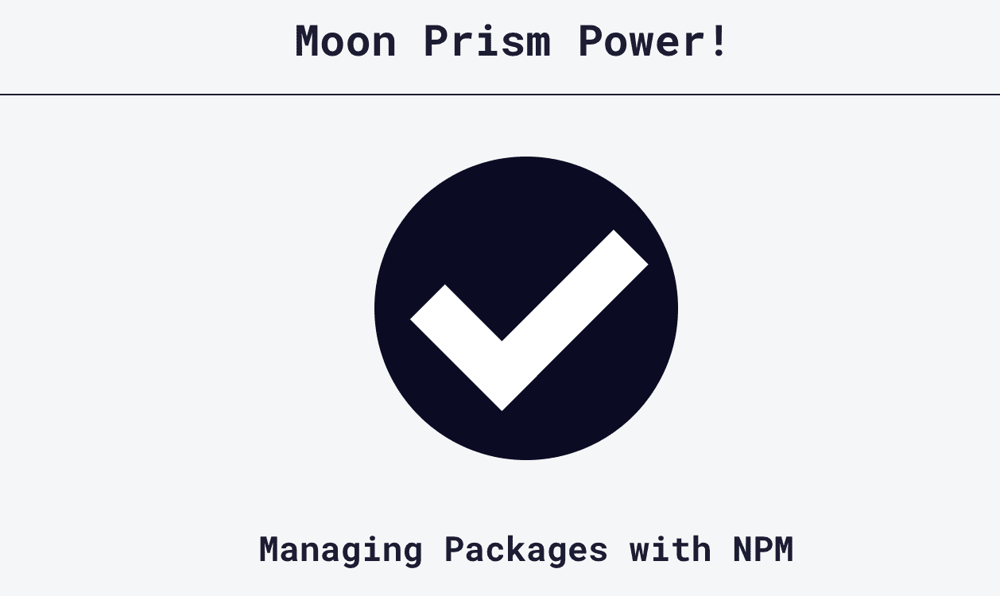

# 如何在本地运行 freeCodeCamp 后端挑战

> 原文：<https://www.freecodecamp.org/news/how-to-run-the-freecodecamp-backend-challenges-locally/>

对于 freeCodeCamp [后端开发和 API 认证](https://www.freecodecamp.org/learn/back-end-development-and-apis/)，您可以在本地完成所有挑战，并提交本地服务器链接。但是这到底是怎么回事呢？

在本文中，我将一步一步地向您介绍如何在您的本地计算机上设置后端质询并提交 localhost 链接。

## 如何克隆 freeCodeCamp GitHub repo

对于用 NPM 管理包的[部分，您将需要使用这个](https://www.freecodecamp.org/learn/back-end-development-and-apis/#managing-packages-with-npm) [GitHub 库](https://github.com/freeCodeCamp/boilerplate-npm/)。

在 GitHub repo 上，点击页面右侧的绿色`Code`按钮。


将 URL 地址复制到这里:



如果您使用的是 Mac，请打开您的终端应用程序。如果您使用的是 Windows，请打开命令提示符。

在命令行中，运行`cd Desktop`并点击`enter`，这将把目录切换到你的桌面。

```
jessicawilkins@Dedrias-MacBook-Pro-2 ~ % cd Desktop
```

您现在应该在桌面目录中，并在命令行中看到这个结果。

```
jessicawilkins@Dedrias-MacBook-Pro-2 Desktop %
```

然后运行`git clone [https://github.com/freeCodeCamp/boilerplate-npm.git](https://github.com/freeCodeCamp/boilerplate-npm.git)`。这是你之前从 GitHub 复制的 URL。

```
jessicawilkins@Dedrias-MacBook-Pro-2 Desktop % git clone https://github.com/freeCodeCamp/boilerplate-npm.git
```

您应该会在成功克隆文件夹的命令行中看到这个结果。

```
Cloning into 'boilerplate-npm'...
remote: Enumerating objects: 46, done.
remote: Total 46 (delta 0), reused 0 (delta 0), pack-reused 46
Unpacking objects: 100% (46/46), done.
jessicawilkins@Dedrias-MacBook-Pro-2 Desktop %
```

您应该可以在桌面上看到新文件夹。



## 如何安装节点模块

在命令行中，运行`cd boilerplate-npm`将目录切换到我们刚刚从 GitHub 克隆的文件夹。

```
jessicawilkins@Dedrias-MacBook-Pro-2 Desktop % cd boilerplate-npm 
```

然后运行`npm install`安装`node_modules`文件夹。`node_modules`文件夹包含运行项目所需的所有依赖项。

没有此文件夹，您将无法运行任何挑战。这就是为什么我们需要将它安装在项目文件夹中。

```
jessicawilkins@Dedrias-MacBook-Pro-2 boilerplate-npm % npm install 
```

安装后，您应该会在命令行中看到以下结果:

```
added 50 packages, and audited 51 packages in 2s

found 0 vulnerabilities
jessicawilkins@Dedrias-MacBook-Pro-2 boilerplate-npm %
```

## 如何提交本地主机链接

转到您选择的代码编辑器，打开项目文件夹。


然后完成第一个[挑战](https://www.freecodecamp.org/learn/back-end-development-and-apis/managing-packages-with-npm/how-to-use-package-json-the-core-of-any-node-js-project-or-npm-package)，为你的`package.json`文件添加作者。



回到命令行，运行`npm start`启动本地服务器。

```
jessicawilkins@Dedrias-MacBook-Pro-2 boilerplate-npm % npm start 
```

您应该在命令行中看到以下结果:

```
> start
> node server.js

Node.js listening on port 3000
```

转到您的浏览器并打开一个新标签。输入 [`http://localhost:3000/`](http://localhost:3000/) 。

您应该会在浏览器中看到这个结果。



这是您将用于所有后端挑战的本地服务器。

当服务器仍在运行时，转到[第一个挑战](https://www.freecodecamp.org/learn/back-end-development-and-apis/managing-packages-with-npm/how-to-use-package-json-the-core-of-any-node-js-project-or-npm-package)并提交本地主机链接。



一旦您完成了挑战，您可以通过在命令行中使用`Ctrl+C`来停止服务器。

这些是使用本地主机完成 freeCodeCamp 后端挑战的步骤。

对于[后端开发和 API](https://www.freecodecamp.org/learn/back-end-development-and-apis/)认证的其他部分，您将需要使用相应的 GitHub 存储库。

对于[基础和快速部分](https://www.freecodecamp.org/learn/back-end-development-and-apis/basic-node-and-express/meet-the-node-console)，你需要克隆[这个 GitHub repo](https://github.com/freeCodeCamp/boilerplate-express/) 。

对于 [MongoDB 和 Mongoose 部分](https://www.freecodecamp.org/learn/back-end-development-and-apis/mongodb-and-mongoose/install-and-set-up-mongoose)，你需要克隆[这个 GitHub repo](https://github.com/freeCodeCamp/boilerplate-mongomongoose/) 。