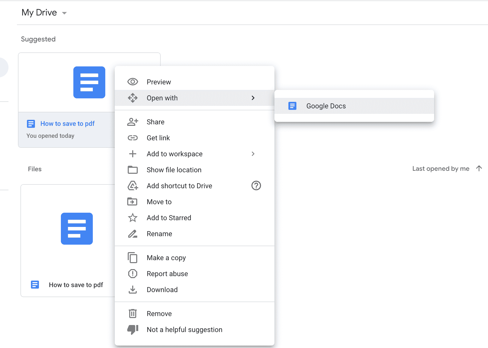
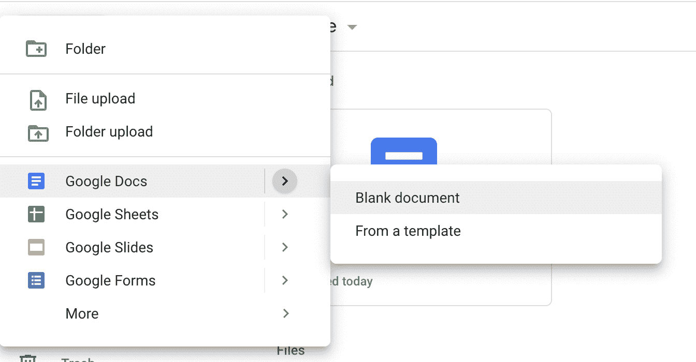
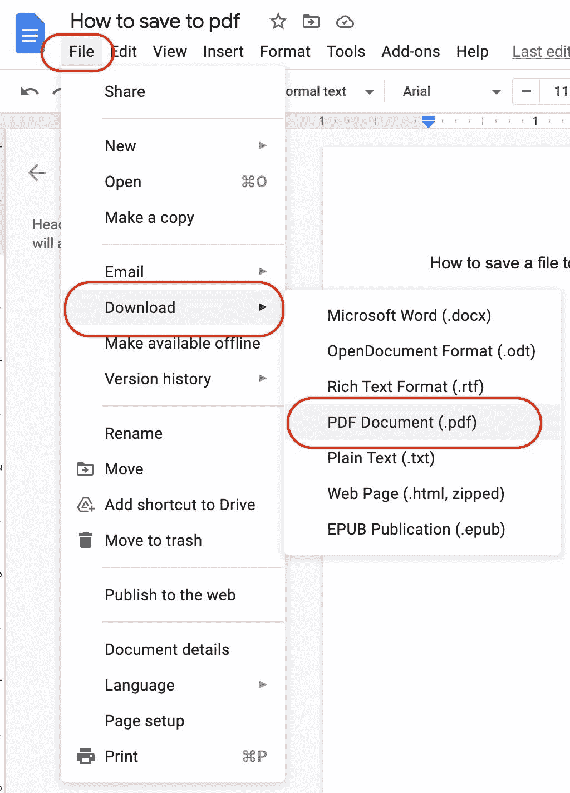
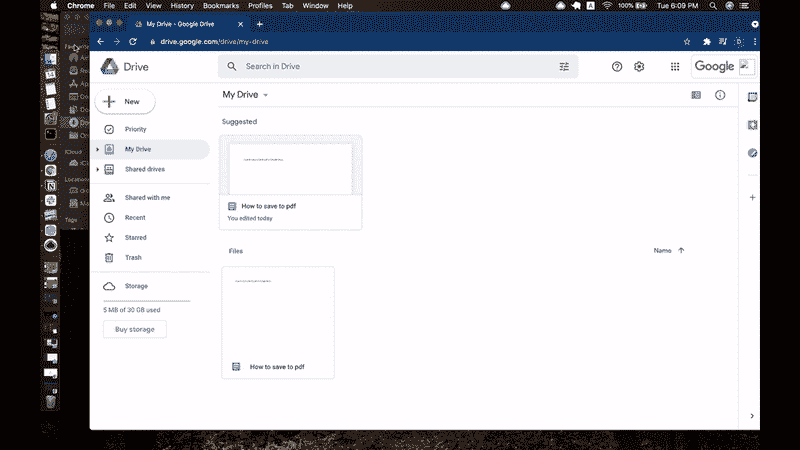

# 如何将 Google 文档保存为 PDF

> 原文：<https://www.freecodecamp.org/news/how-to-save-a-google-doc-as-a-pdf/>

谷歌文档是数字化工作的必备生产力工具。

本文将介绍如何在桌面版本的 Google Docs 上将 Google Docs 保存为 PDF。

## 谷歌文档是用来做什么的？

你可以使用谷歌文档完成许多不同的任务。

例如，您可以在观看编码教程或通读文章时记下文档中的关键概念。

或者你可以用它来为你的学生制作电子书或其他学习材料。

谷歌文档也是在工作场所与你的队友分享文档的必备工具。

你也可以用它来制作你完美的简历或求职信。

这样的例子不胜枚举。

当你准备好保存你的谷歌文档时，你可以选择用不同的格式保存它。现在让我们来看看其中的一些。

## 为什么要将谷歌文档保存为 PDF？

PDF 是最流行的文档类型之一，是可移植文档格式的缩写，由 Adobe 于 1991 年创建。

在此之前，数字共享的文件有些问题，因为文档的格式可能会根据您使用的系统等因素而严重改变。

Adobe 创建 pdf 是为了让人们能够以一种直接的方式发送电子文件，而不会损害它们的格式。

由于 pdf，您的文件看起来像你想要的。接收者看到的样式是您在创建文稿时存储的原始样式。

毫无疑问，文档中的样式将被保留。

## 如何将 Google 文档保存为 PDF 文件

我们现在要讨论的方法是在您的本地计算机系统上下载任何 PDF 格式的 Google Doc 文件。

首先，登录你的谷歌账户。

接下来，打开你的 [Google Drive 账户](https://drive.google.com/drive/my-drive)。

您可以在 Google Drive 主屏幕上查看您保存的所有文档。

继续，通过双击文档打开您选择的文档。对于 MacOs 也可以同时按住`control`键和触摸板打开，对于 WindowsOS 也可以右击打开。然后选择`Open With` > `Google Docs`。

如果您还没有想要保存为 PDF 的文档，您可以通过选择“新建”按钮，然后选择“Google 文档”来创建一个新文件。然后创建一个空白文档或选择一个模板。

一旦文件被打开、编辑并准备保存，选择`File` > `Download` > `PDF Document(.pdf)`。

默认情况下，PDF 文档将被下载到您的计算机上并保存在您的下载文件夹中。

现在，您可以在您的计算机系统上本地访问您在 Google Drive 中创建的 PDF 格式的 Google Doc。

## 如何将 PDF 保存回 Google Drive

想把这个 PDF 保存在 Google Drive 里怎么办？

你所需要做的就是转到你的下载文件夹(或者你保存文件的地方)，选择文件，然后把它拖到 Google Drive。

现在你的 Google Drive 中已经保存了 Google Doc 和 PDF 版本。

现在你知道了。

在本快速指南中，您学习了如何在您的计算机系统和 Google Drive 上将 Google Doc 文档保存为 pdf。

感谢阅读！