# 如何省钱自己组装电路板

> 原文：<https://www.freecodecamp.org/news/how-to-save-money-and-assemble-your-own-circuit-boards/>

自组装电路板是在电路板上安装元件最便宜的方式。

句号。

不相信我？相信这些截图:

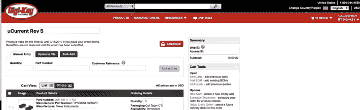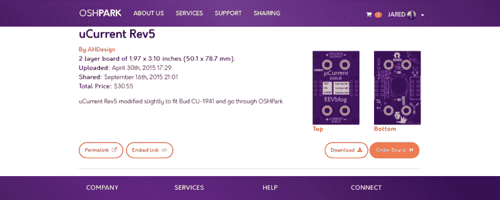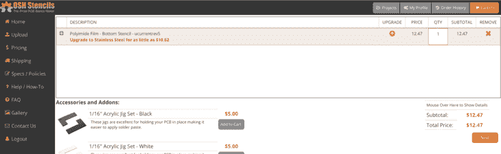

自组装: **$143.84 +税&运费**

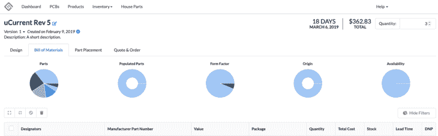

专业组装: **$362.83 +税&运费**

这大约是每板 50 美元对每板 120 美元。那是巨大的。加 18 天是一个**漫长的时间**要等三个电路板。

在这篇文章中，我将谈谈我多年来学到的关于如何组装自己的电路板的最重要的技巧和诀窍。我毫不怀疑它们会立即对您当前和未来的项目有用。

首先，我们来谈谈 CAD。

## 导出您的 CAD

该行业的黄金标准是 Gerber 文件。Gerber 文件是将所有漂亮的形状、轨迹、衬垫、丝网印刷和钻孔翻译成对电路板制造商有用的东西。还有其他格式，如 ODB++。如果你曾经看过 ODB++文件，它只是一堆打包的 Gerbers 文件。？‍♂️

如果你有兴趣了解更多关于 Gerbers 和我检查它们的过程，[去看这个视频](https://www.circuitdojo.org/fundamentals/#reviewing-your-gerbers)然后回来。别担心，我就在这里。

幸运的是，大多数供应商会接受原始的 CAD 文件，尤其是如果你使用像 Eagle CAD 这样的东西。例如，当我去[奥什公园](https://www.oshpark.com)购买电路板时，我会上传我的`.brd`文件。在大多数情况下，它得到迅速处理，并吐出一个价格回来。

这些相同的文件也可用于购买**焊膏模板。**焊膏模板允许您仅将焊膏涂在电路板上的阻焊膜开口处。是的，你可以不用锡膏或焊锡膏来组装电路板，但是我强烈建议你这样做，尤其是如果你关心电路板的美观的话。

关于美观的一个边注:我建议早期的原型包括参考指示器，当电路板完全组装好时可以看到参考指示器。它使手工放置零件容易 1000 倍。看看我下面说的:

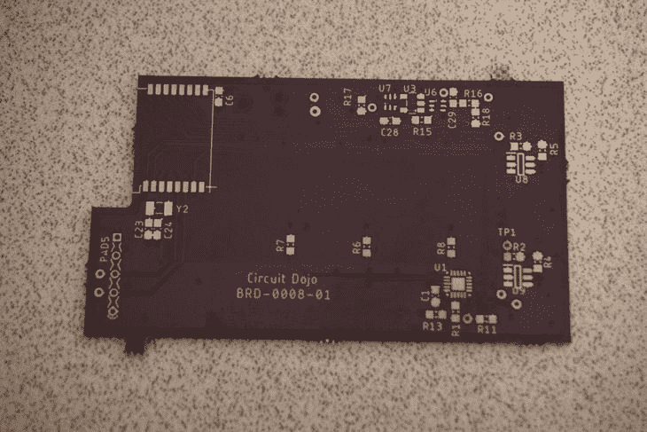

看到所有白色的参考指示项了吗？它们很快就会派上用场..

对于模版，我的首选是 [OSH 模版](https://www.oshstencils.com)。他们的成本是合理的，并节省了组装时的时间吨。另外，你可能已经猜到了，电路板装配线使用大型金属模板来完成同样的事情。

最后，您想要导出您的物料清单。我使用 Eagle 自带的`bom.ulp`脚本。我总是通过*值*导出，所以相同属性的所有部分都被放在一起。这就产生了一个简洁紧凑的 BOM，可以很容易地导入到 Octopart 之类的东西中。我经常用 Octopart 研究价格。如果是一个特别大的物料清单，我可能会在 Mouser 和 Digikey 之间拆分订单。有时，即使是“T3”箭“T4”的零件价格也比其他两种要低。

订购时，所有供应商都允许您导入一个`.xlsx`文件或`.csv`。导入时，有时您可以选择输入客户零件号(或类似的零件号)。您可以用它来存储参考指示符。会印在他们贴在袋子上的标签上。

只要您的零件不太重，您通常可以使用 Digikey 提供的第一类邮件选项。看起来他们最近提高了运输价格(过去是 3.5 美元，现在是 4.5 美元到康涅狄格州)，部件通常在 2-3 个工作日内到达。这还不算太糟！？？

专业提示:一旦你拿到零件，仔细检查你的库存。我犯了一个错误，没有为多个组件订购足够的零件。如果你确实发现自己短缺，就再下一份订单。如果你不这样做，你可能会不愉快地感到惊讶时，建设日到来，你的短组件。

## 在您的板上放置零件

设置您的装配位置。使用塑料切口，将它们放在电路板周围。然后用胶带把它们固定在你的桌面上。你可以通过使用 Ponoko 这样的服务自己制作，或者直接购买 OSH Stencils 提供的产品。

然后，将模板贴在顶部，对准所有的孔。这需要一些时间和技巧。一定要用胶带把它粘住，这样它就不会动了。

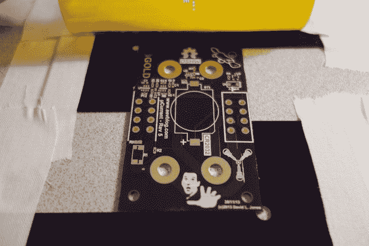

将模板平放在板上。然后，拿起你的焊料注射器，在模板的顶部滴一些焊料。使用旧信用卡或带有模板的塑料卡来涂焊料。尽量远离模板附着的工作面。否则，如果你移动模板，你会弄得一团糟，必须重新开始。

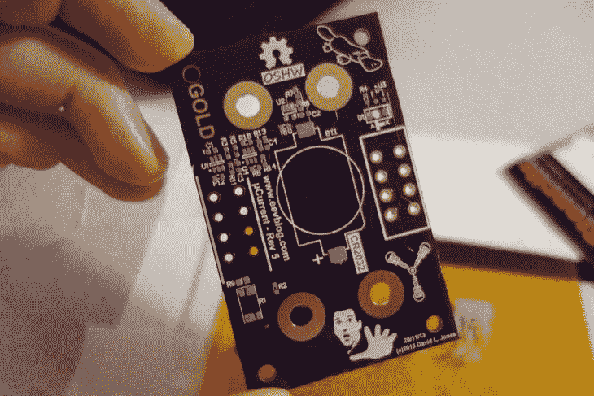

一旦粘贴完成，如上图所示，将纸板放在一个平面上。电路板上没有固定器件的东西，所以最好把它放在一个更大的空电路板上。这样你就有了一个可移动的基地，破坏你努力工作的风险也就更小了。此外，一旦你进入下一步，它会保护下面的表面。

请记住，使用电路板上的参考标志，并与零件包装上的参考标志进行比较。只要您正确地导出了 BOM，就没有理由回去检查零件号。参见带有以下参考标志的包装示例:

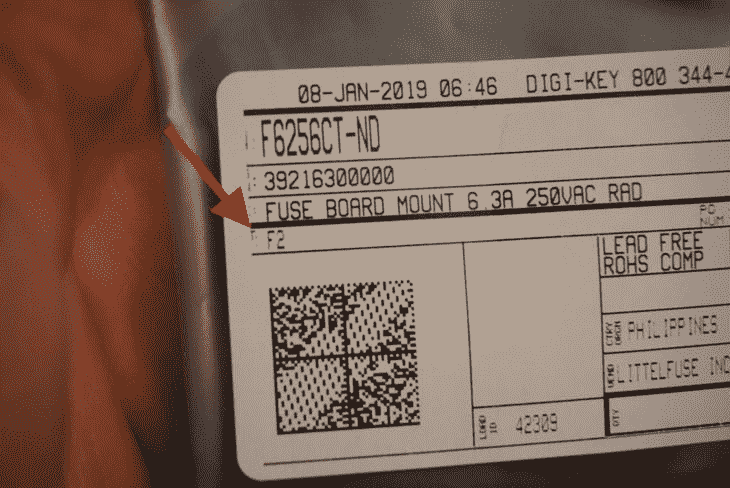

最后，烘烤你的电路板。我通常使用我的热风枪在大约 380 摄氏度，慢慢地走在整个板焊接所有的部分。当我这样做的时候，我的气流设置得很低，否则零件会飞起来。这适用于任何热风枪设置。

这也可以通过使用热板或旧烤箱来完成。请记住，你不希望使用相同的烤箱，你用来烤面包！

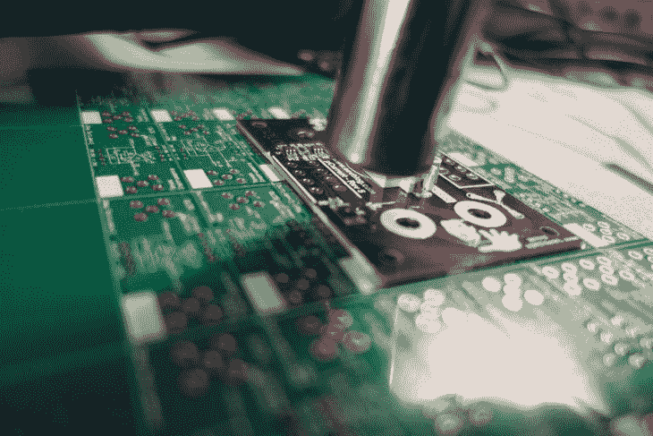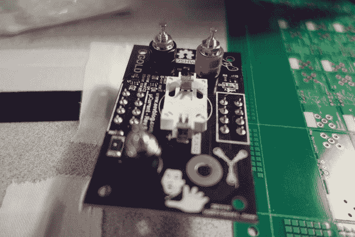

额外的预防措施:一些有咸味的工程师认为吸入焊接产生的烟雾没有什么不对。在相反的阵营中，我也是如此。你不仅要以这样或那样的方式处理重金属(无铅焊料问题不大)，而且焊剂的烟雾也是有毒的。解决这个问题的最好方法是在窗外开一个风扇或者使用一个抽油烟机。

## 玩的时间到了

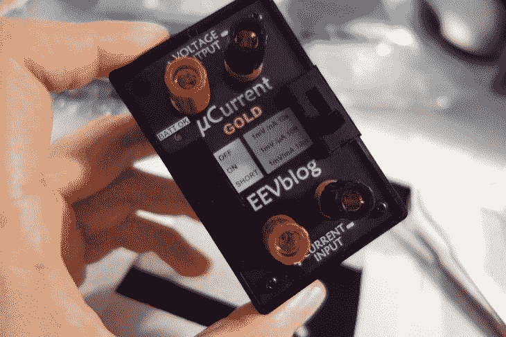

所以你已经订购了所有的零件、模板和纸板。你耐心而尽职地组装并焊接了所有部件。恭喜你，你成功了！下一站是测试、固件开发或[你的设计需要做的任何事情](https://www.jaredwolff.com/getting-started-in-product-development/#show1)。

此外，公平地说，我实际上对 Macrofab 这样的公司没有任何意见。他们提供了很好的服务，我以前实际上在其他项目中使用过他们。只要提醒自己别人为你工作的成本/时间效益。值得吗？只有你能决定。

以低廉的价格制作自己的电路板不仅省钱，而且完成后会有回报。当我为我的客户建造新的设备和原型时，我总是把这个过程作为一个选项。它让我在花一大笔钱购买机器组装电路板之前，对电路的工作原理有了更好的了解。

在为你的项目寻求帮助吗？翻到这一页的底部，给我发一行。

你也可以在 www.jaredwolff.com 的博客上查看我的其他文章。