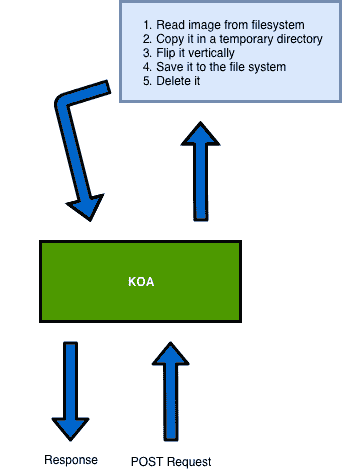
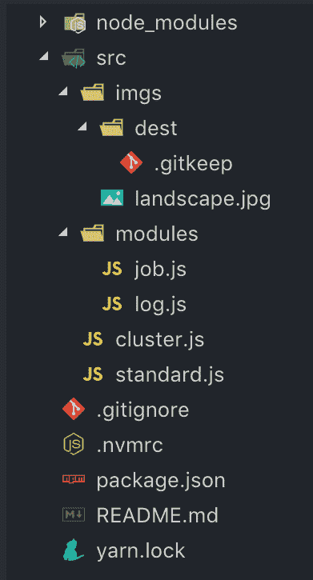

# 如何使用集群扩展 Node.js 服务器

> 原文：<https://www.freecodecamp.org/news/how-to-scale-your-node-js-server-using-clustering-c8d43c656e8f/>

米歇尔·丽娃

# 如何使用集群扩展 Node.js 服务器

可伸缩性是技术领域的热门话题，每种编程语言或框架都提供了自己处理高负载流量的方式。

今天，我们将看到一个关于 Node.js 集群的简单明了的例子。这是一种编程技术，可以帮助您并行化代码并提高性能。

> Node.js 的单个实例在单个线程中运行。为了利用多核系统，用户有时会希望启动 Node.js 进程集群来处理负载。”
> - [Node.js 文档](https://nodejs.org/api/cluster.html)

我们将使用 [Koa](https://koajs.com/) 创建一个简单的 web 服务器，它在使用方面与 [Express](https://expressjs.com) 非常相似。

完整的例子可以在 Github 库中找到。

#### 我们要建造什么

我们将构建一个简单的 web 服务器，其行为如下:

1.  我们的服务器将收到一个`POST`请求，我们将假设用户正在给我们发送一张图片。
2.  我们将把一个映像从文件系统复制到一个临时目录中。
3.  我们将使用 Jimp(node . js 的图像处理库)垂直翻转它。
4.  我们会将它保存到文件系统中。
5.  我们将删除它，并向用户发送回复。

当然，这不是一个真实的应用程序，但是非常接近。我们只想衡量使用集群的好处。

#### 设置项目

我将使用`yarn`来安装我的依赖项并初始化我的项目:

因为 Node.js 是单线程的，所以如果我们的 web 服务器崩溃，它将保持关闭状态，直到其他进程重新启动它。所以我们要安装 [forever](https://github.com/foreverjs/forever) ，一个简单的守护进程，它会在我们的网络服务器崩溃时重启它。

我们还将安装 Jimp、Koa 和 Koa 路由器。

#### Koa 入门

这是我们需要创建的文件夹结构:

我们将有一个`src`文件夹，其中包含两个 JavaScript 文件:`cluster.js`和`standard.js`。

第一个文件是我们将在其中试验`cluster`模块的文件。第二个是一个简单的 Koa 服务器，它不需要任何集群就可以工作。

在`module`目录中，我们将创建两个文件:`job.js`和`log.js`。

`job.js`将执行图像操纵工作。`log.js`将记录该过程中发生的每一个事件。

#### 日志模块

日志模块将是一个简单的函数，它将接受一个参数并将其写入`stdout`(类似于`console.log`)。

它还会在日志的开头附加当前时间戳。这将允许我们检查一个进程何时开始，并测量它的性能。

#### 作业模块

我实话实说，这不是一个漂亮的超级优化的剧本。这只是一个简单的工作，可以让我们强调我们的机器。

#### Koa 网络服务器

我们要创建一个非常简单的网络服务器。它将使用两种不同的 HTTP 方法在两条路由上做出响应。

我们将能够在`[http://localhost:3000/](http://localhost:3000/.)`上执行 GET 请求。Koa 将用一个简单的文本来响应，它将向我们显示当前的 PID(进程 ID)。

第二条路由将只接受`/flip`路径上的 POST 请求，并将执行我们刚刚创建的作业。

我们还将创建一个简单的中间件，它将设置一个`X-Response-Time`头。这将允许我们测量性能。

太好了！我们现在可以启动我们的服务器键入`node ./src/standard.js`并测试我们的路线。

#### 问题是

The image I am currently manipulating (via Unsplash)

让我们将我的机器用作服务器:

*   Macbook Pro 15 英寸 2016
*   2.7GHz Intel Core i7
*   16GB 内存

如果我发出一个 POST 请求，上面的脚本将在大约 3800 毫秒内给我发送一个响应。考虑到我目前正在处理的图像大约有 6.7MB，还不错。

我可以尝试发出更多请求，但响应时间不会减少太多。这是因为请求将按顺序执行。

那么，如果我尝试发出 10、100、1000 个并发请求，会发生什么呢？

我制作了一个简单的 Elixir 脚本，它执行多个并发 HTTP 请求:

我选择 Elixir 是因为创建并行进程真的很容易，但是您可以使用您喜欢的任何东西！

#### 测试十个并发请求——没有集群

如您所见，我们从 iex(一种 REPL 药剂)中产生了 10 个并发进程。

Node.js 服务器会立即复制我们的图像并开始翻转。第一个响应将在 16 秒后记录，最后一个将在 40 秒后记录。

如此戏剧性的性能下降！在仅有 10 个并发请求的情况下，我们将 web 服务器性能降低了 950%！

#### 集群简介

All credits to Pexels

还记得我在文章开头提到的吗？

> 为了利用多核系统，用户有时会希望启动 Node.js 进程集群来处理负载。

根据我们将要运行 Koa 应用程序的服务器，我们可以有不同数量的内核。

每个内核将负责单独处理负载。基本上，每个 HTTP 请求将由单个内核来满足。

例如，我的机器有八个内核，将处理八个并发请求。

由于有了`os`模块，我们现在可以计算我们有多少个 CPU:

`cpus()`方法将返回描述我们的 CPU 的对象数组。我们可以把它的长度绑定到一个叫做`numWorkers`的常数上，因为这是我们要使用的工人数量。

我们现在准备要求`cluster`模块。

我们现在需要一种方法将我们的主进程分割成`N`个不同的进程。
我们称我们的主进程为`master`，称其他进程为`workers`。

Node.js `cluster`模块提供了一个名为`isMaster`的方法。它将返回一个布尔值，该值将告诉我们当前进程是由工作进程还是由主进程控制的:

太好了。这里的黄金法则是，我们不想在主进程下提供我们的 Koa 应用程序。

我们希望为每个工作者创建一个 Koa 应用程序，这样当有请求进来时，第一个自由工作者将会处理它。

`cluster.fork()`方法符合我们的目的:

好吧，一开始这可能有点棘手。

正如您在上面的脚本中看到的，如果我们的脚本已经被主进程执行，我们将声明一个名为`workers`的常量。这将为我们的 CPU 的每个核心创建一个工作器，并将存储关于它们的所有信息。

如果你对所采用的语法不确定，使用`[…Array(x)].map()`就和:

在开发高并发性应用程序时，我更喜欢使用不可变的值。

#### 添加 Koa

All credit to Pexels

正如我们之前所说的，我们不想在主进程下服务我们的 Koa 应用程序。

让我们将我们的 Koa 应用程序结构复制到`else`语句中，这样我们将确保它将由一个工人来服务:

如您所见，我们还在`isMaster`语句中添加了几个事件监听器:

第一个将告诉我们已经产生了一个新的工人。当另一个工作者崩溃时，第二个将创建一个新的工作者。

这样，主流程将只负责创建新的工人并协调他们。每个 worker 将服务于一个 Koa 实例，该实例可在`:3000`端口上访问。

#### 测试十个并发请求—使用集群

正如你所看到的，我们在大约 10 秒后得到了第一个响应，大约 14 秒后得到了最后一个响应。与之前的 40 秒响应时间相比，这是一个惊人的进步！

我们发出了 10 个并发请求，Koa 服务器立即处理了其中的 8 个。当第一个 worker 将它的响应发送给客户机时，它会接收一个剩余的请求并处理它！

#### 结论

Node.js 具有惊人的处理高负载的能力，但是在服务器完成进程之前停止请求是不明智的。

事实上，只有当您立即向客户端发送响应时，Node.js 服务器才能处理数千个并发请求。

最佳实践是使用 Redis 或任何其他神奇的工具添加一个发布/订阅消息接口。当客户端发送请求时，服务器开始与其他服务进行实时通信。这负责昂贵的工作。

负载平衡器也有助于分流高流量负载。

技术再一次给了我们无限的可能性，我们一定会找到合适的解决方案，将我们的应用扩展到无限甚至更远！