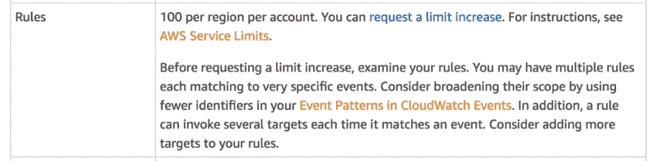
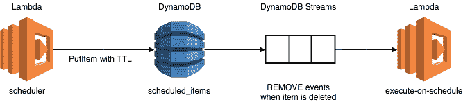
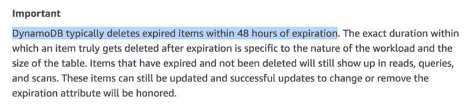
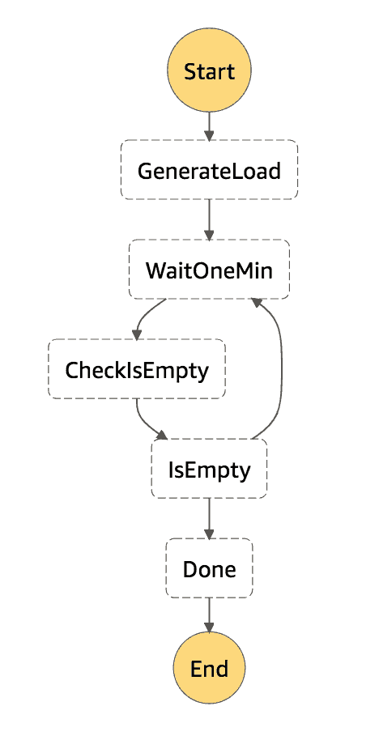
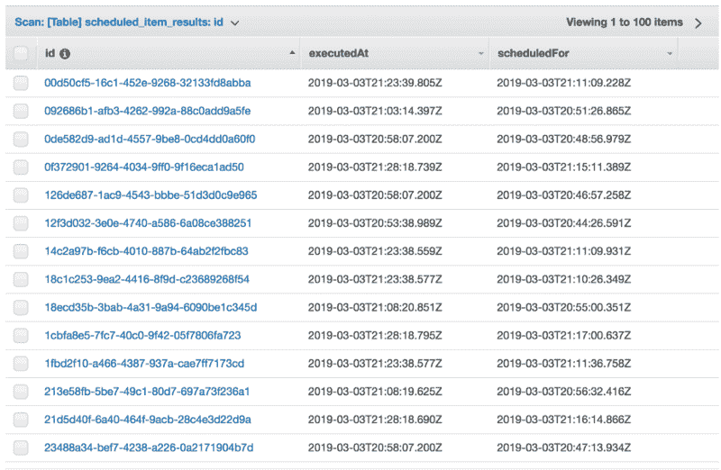
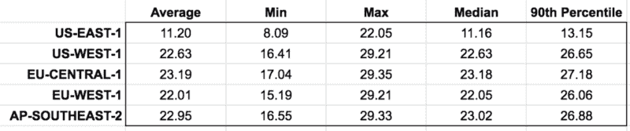

# 如何用 DynamoDB TTL 和 Lambda 调度临时任务

> 原文：<https://www.freecodecamp.org/news/how-to-schedule-ad-hoc-tasks-with-dynamodb-ttl-and-lambda-421fa5778993/>

作者:崔琰

# 如何用 DynamoDB TTL 和 Lambda 调度临时任务

Photo by [Emma Matthews](https://unsplash.com/@emmamatthews?utm_source=medium&utm_medium=referral) on [Unsplash](https://unsplash.com?utm_source=medium&utm_medium=referral)

[CloudWatch 事件](https://docs.aws.amazon.com/AmazonCloudWatch/latest/events/WhatIsCloudWatchEvents.html)让你用 Lambda 轻松创建 cron 作业。然而，它不是为运行大量特定任务而设计的，每个任务在特定时间执行一次。CloudWatch 事件的默认限制是每个地区每个账户 100 条规则[。这是一个软限额，因此可以请求提高限额。但是较低的初始限制表明它不是为需要调度**数百万个特别任务**的用例而设计的。](https://docs.aws.amazon.com/AmazonCloudWatch/latest/events/cloudwatch_limits_cwe.html)

**CloudWatch Events 专为执行重复性任务而设计。**

[https://docs.aws.amazon.com/AmazonCloudWatch/latest/events/cloudwatch_limits_cwe.html](https://docs.aws.amazon.com/AmazonCloudWatch/latest/events/cloudwatch_limits_cwe.html)

### 问题是

几乎每种编程语言都有可能做到这一点。例如，。Net 有`[Timer](https://docs.microsoft.com/en-us/dotnet/api/system.timers.timer?view=netframework-4.7.2)`类，JavaScript 有`[setInterval](https://www.w3schools.com/jsref/met_win_setinterval.asp)`函数。但是我经常发现自己想要一个服务抽象来使用。这种服务有许多使用案例，例如:

*   游戏的锦标赛系统需要在锦标赛开始和结束时执行业务逻辑。
*   一个事件系统(想想 eventbrite.com 的 T1 或 meetup.com 的 T2 的 T3)需要一种机制来及时提醒参与者。
*   待办事项追踪器(想想[神童列表](https://www.wunderlist.com/))需要一种机制，在待办事项到期时发出提醒。

但是，AWS 不提供此类工作负载的服务。CloudWatch Events 是最接近的东西，但是如上所述，它不是为上面的用例设计的。但是，您可以使用 cron 作业来实现它们。但是这样的实现有其他的挑战。

在我的职业生涯中，我已经实现过几次这样的服务抽象。我尝试了许多不同的方法:

*   cron 作业(带有云观察事件)
*   包装。Net `Timer`类作为 HTTP 端点
*   使用 SQS 可见性超时来隐藏任务，直到它们到期

最近，我看到许多人使用 [DynamoDB 生存时间](https://docs.aws.amazon.com/amazondynamodb/latest/developerguide/howitworks-ttl.html) (TTL)来实现这些特定的任务。在这篇文章中，我们将看看这种方法，看看它在哪里适合你。

### 我们如何衡量这种方法？

对于这种类型的临时任务，我们通常关心:

*   **精度**:任务的执行离我的预定时间有多近？越近越好。
*   **Scale(未完成任务的数量)**:解决方案是否可以扩展以支持许多未完成的任务，即已经计划但尚未执行的任务？
*   **扩展(热点):**该解决方案可以扩展到在大约同一时间执行许多任务吗？例如，数百万人设置了一个计时器来提醒自己观看超级碗，所以所有的计时器都在接近开球时间时启动。

### DynamoDB TTL 作为调度机制

从高层次来看，这种方法如下所示:

*   一个`scheduled_items` DynamoDB 表，保存所有计划执行的任务。
*   将预定任务写入`scheduled_items`表的`scheduler`函数，TTL 设置为预定执行时间。
*   一个为`scheduled_items`订阅 DynamoDB 流并对`REMOVE`事件做出反应的`execute-on-schedule`函数。这些事件对应于从表中删除项目的时间。

#### 可扩展性(未完成任务的数量)

由于开放任务的数量只是转化为`scheduled_items`表中条目的数量，这种方法可以扩展到数百万个开放任务。

DynamoDB 也可以处理大吞吐量(数千 TPS)。因此，这种方法也可以应用于每秒调度数千个项目的场景。

#### 可扩展性(热点)

当同时删除许多项时，它们只是在 DynamoDB 流中排队。AWS 还自动调整流中碎片的数量，因此随着吞吐量的增加，碎片的数量也会相应增加。

但是，事件是按顺序处理的。因此，您的函数可能需要一些时间来处理事件，具体取决于:

*   它在溪流中的位置，以及
*   处理每个事件需要多长时间。

因此，虽然这种方法可以扩展到支持许多同时到期的任务，但它不能保证任务按时执行。

#### 精确

这是关于这种方法的一个大问题。根据官方[文件](https://docs.aws.amazon.com/amazondynamodb/latest/developerguide/howitworks-ttl.html)，过期的项目在 48 小时内删除**。这是一个巨大的误差幅度！**

作为一个实验，我设置了一个阶跃函数状态机来:

1.  向`scheduled_items`表添加可配置数量的项目，TTL 在 1 至 10 分钟内到期
2.  跟踪任务被安排的时间和它被`execute-on-schedule`函数实际拾取的时间
3.  等待所有项目被删除

状态机看起来像这样:

我进行了几轮测试。无论表中有多少项，结果都是一致的。快速浏览一下表格就会发现，平均来说，一个任务的执行比预定时间晚了 **11 分钟**。

US-EAST-1

我在其他几个 AWS 地区重复了这个实验:

我不知道为什么 US-EAST-1 和其他地区之间会有如此显著的差异。一种解释是，TTL 过程在表创建后需要一点时间来启动。因为我最初是针对 US-EAST-1 地区开发的，所以与其他地区相比，它的 TTL 进程已经“升温”了。

### 结论

根据我的实验结果，使用 DynamoDB TTL 作为调度机制似乎不能保证合理的精度。

一方面，这种方法非常适用。但是另一方面，计划的任务至少要晚几分钟执行，这使得它不适合许多用例。