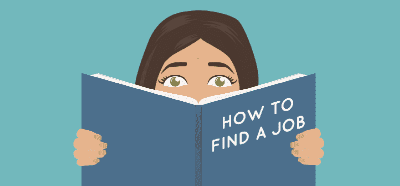
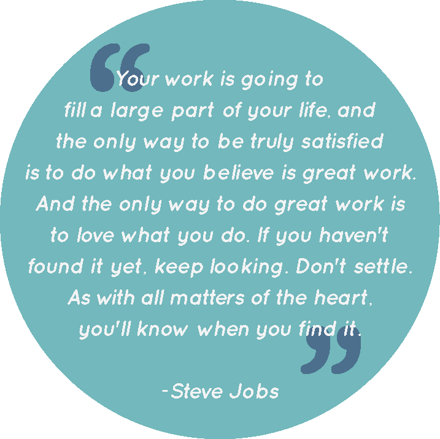
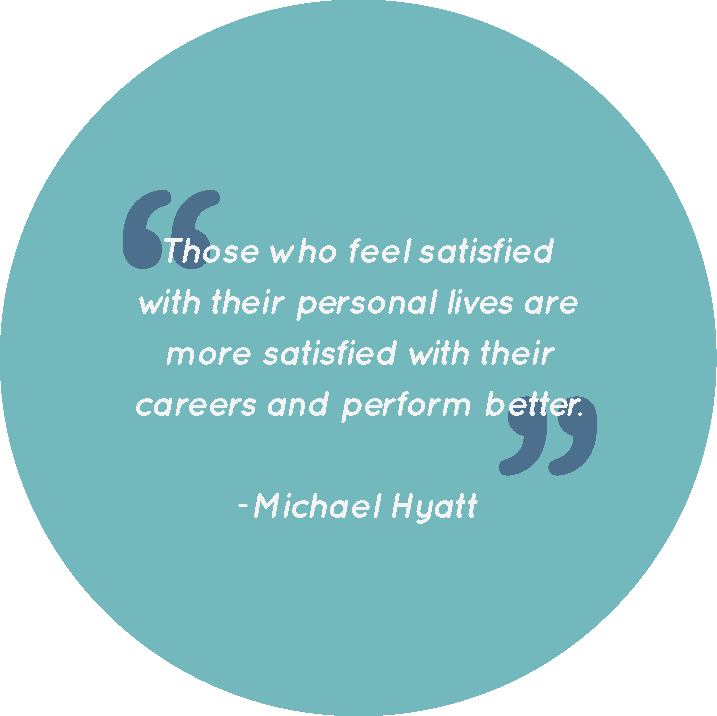

# 如何得到一份你真正喜欢的设计工作

> 原文：<https://www.freecodecamp.org/news/how-to-score-a-design-job-youll-actually-love-e30a8c3a5905/>

作者:海莉·德·奥瑞亚

# 如何得到一份你真正喜欢的设计工作

#### 关于面试，我希望有人告诉我的 8 件事

作为一名全职设计师已经有一段时间了(加上一段时间做自由职业者和合同工)，在洛杉矶和旧金山工作，并与许多设计师同行交谈，我现在完全明白如何才能找到一份设计工作。我现在是第二份全职工作。我找工作的经历都不完美。现在我知道我犯的一些错误比我想象的更常见。

有趣的是，当生活不顺心时，你会觉得只有你一个人在苦苦挣扎。但是如果你走出你的泡泡，你会意识到你的情况比你想象的要普遍得多。

设计工作竞争激烈，而且不断变化。没有人真的谈论找工作有多难，因为，坦白地说，谈论失业或被拒绝会很尴尬。我已经从错误中吸取了教训。我想你也可以。所以，让我来给你讲一个故事。

你快完成学业了。你很乐观，很兴奋，可能还没有准备好得到你的第一份设计工作。你选择平面设计(或相关专业)作为你的专业，因为你很有创造力，而且很有趣！这比像你那些金融或生物专业的朋友那样计算数字有趣多了。所以，是时候开始找工作了。

然后你会猛然醒悟。

如果你和我一样，你会很兴奋地完成学业，并有动力获得第一份工作。在学校，他们教你用设计可以做的有趣和令人兴奋的事情。现在你已经准备好测试你的新技能了！

然后，当你在找工作时，这种兴奋和动力会慢慢减弱。无数的申请被提交，面试被进行，然后等待的游戏开始了。现在你就等着你的努力有回报吧。我经历过这一点，许多其他设计师也经历过。总有一些人运气好，实习变成了全职工作，或者通过关系找到了工作。但是对于这篇文章，我们将忘记那些幸运的人。

或者你是那些幸运的人之一。但是这份工作没有成功，六个月后你又回到了起点。你没有足够的经验，所以你和找工作的应届毕业生处境相同。

收到一份工作的拒绝——或者更糟，面试后没有收到公司的回复——会让人精神崩溃。当我在填写了 200 多份申请表之后，一筹莫展的时候，我希望有人能给我我现在给你的建议:振作精神，把你的期望带回现实。这是:

#### 1.自信。是。钥匙。

面试过程非常吓人。我不在乎你是否是周围最自信的人，但是坐在比你更有经验的人的对面，向他们展示你的工作，并试图让他们相信你值得雇用是令人生畏的。但事实是，面试就像买彩票一样。不玩游戏就赢不了。你必须自信地走进去，相信你配得上这个职位。他们有你是幸运的。

我记得我爸爸在我找工作的时候给了我这个建议。我对此不屑一顾，因为我觉得一个毫无经验的人不可能表现出如此的自信。但是经过几次没有结果的面试后，我开始说，“管他呢，我会假装的。”而且成功了。你知道他们说什么:“假装直到你成功。”

因为如果你不相信自己，面试你的人很可能也不会相信你。

#### 2.振作起来

没有人会雇佣一个作品集不完整的设计师，或者一个简历是 Word 格式的设计师。雇主雇佣你来做好看的、专业的设计。所以全力以赴。

简历、求职信、作品集、留言本和你的在线表现都很重要。当你所有的同学都在申请工作，毕业即将来临的时候，我知道看起来你好像没有时间。但是在你开始申请工作之前，花点时间把你所有的材料收集在一起。让你的投资组合为你做一些工作。这是向潜在雇主展示你的风格和创造力的最佳方式。

想想整理 200 份申请。给审阅简历的人一些让他们兴奋的东西，这样他们就会带你去面试。无论是一封措辞巧妙的求职信、一份现成的简历、一份精心设计的作品集，还是一个强大的在线展示，都要想办法脱颖而出。你一次做的工作越多，你在面对面面试中要做的工作就越少。

别忘了你在网上的知名度。现在制作免费网站的资源那么多，好好利用吧。除了一个完美的网站之外，给自己制作一个 [Behance](https://www.behance.net/) 作品集。使用 [LinkedIn](http://www.linkedin.ca/) 或登录 [Dribbble](https://dribbble.com/) 成为在线设计社区的一员。(你已经在 Medium 上了，所以你的方向是对的。你会惊讶于你所建立的联系，以及你将如何给面试官留下深刻印象！

#### 3.不要草率行事

多花六周甚至几个月找工作是值得的，尤其是如果你找到了合适的工作。不要因为有人给你提供了一份工作就急于接受。如果感觉不合适，不要害怕拒绝。从长远来看，做你以前的服务员工作，或者多失业一段时间都不会有什么不同。

你不想做的是，仅仅因为你得到了这份工作，就接受一份通勤时间超长、福利不好或者产品让你讨厌的工作。你永远不知道，两周后你可能会收到另一份工作邀请，那里的工作环境更适合你。这就引出了我的下一点。

#### 4.做你自己的拥护者

花时间想想在你的工作场所什么对你来说是重要的。实际一点。如果你刚从学校出来，这可能很难。但是即使你没有工作经验，你仍然可以思考你在新工作中想要什么。列一个清单，列出三到五件对你来说最重要的事情。在你的职业生涯中，这个列表可能会改变。

当你在不同的公司工作过，你就会明白你喜欢什么和不喜欢什么。了解对你来说什么是重要的。这里有一些例子，良好的医疗保健，股票期权，通勤时间，工作站类型，休假时间，等等。

甚至在你开始去面试之前，确保你知道你愿意在哪些方面妥协。然后你就知道要什么了。如果某样东西对你来说是一个交易破坏者，那么你不会被他们提供的其他东西所动摇。线索五。

确保你牢牢把握住你愿意妥协的东西。你的交易障碍是什么？

#### 5.当心过多的额外津贴

许多初创公司提供弹性工作时间、免费午餐、开放式平面图等等，但是很容易忽略什么对你来说才是真正重要的(从第四点开始)。我不是说你应该拒绝一份工作，因为它有太多令人敬畏的额外津贴。只要确保它们也涵盖了基础知识。

重要的是要记住，作为一名员工，你感到自己受到了重视。确保你的工作是令人满意的，并且你从工作中得到了你所需要的。这就是为什么醒着的时候有 50%的时间是值得工作的。午餐时的瑜伽、免费小吃和乒乓球只是锦上添花。如果蛋糕味道不好，那就没有必要在上面撒糖霜了。

#### 6.对产品给予一些重视

重点在**有些**。这一只又短又甜。产品不是一切，但它会影响你的体验。如果你在找到一份代理设定的工作，这并不重要，因为工作会不断变化*。但是如果你选择在公司内部工作，选择一家生产你相信的东西的公司。这样可以让你的工作经历更加丰富，更加充实。*

同样，如果公司出售或创造了你不喜欢的东西，它肯定会让你的体验变得糟糕。例如，我的兴趣包括化妆、发型和婚礼。如果 ESPN 的环境很好，我的要求也得到满足，我会开心吗？当然可以！但是，在一家同样符合我的要求的美容公司工作，我会更开心吗？大概吧。

选择一家有你相信的产品的公司，可以让你的工作经历更加丰富。

#### 7.不要害怕谈判

当你只是想要一份工作时，我知道你应该接受，即使他们给你的薪水比你想要的低。但值得尝试协商。

当我经历面试过程时，我认为公司会一次给多个人多份工作机会。然后他们雇佣了第一个回应的人。天真的极致。我想，“如果他们给我这份工作，我最好在他们改变主意之前接受。”现在我意识到事实并非如此。为工作寻找和选择一个好的候选人的工作量比你想象的要多。

经理、主管和招聘人员必须查看许多申请。然后他们必须缩小范围，这样他们就可以带候选人来参加面试。然后他们必须就他们想要雇佣的候选人达成一致。所以，如果你回来要求更多的补偿(只要是合理的)，他们很可能非常愿意安抚你。或者至少在半路上满足你。这比他们的第二选择候选人再经历一遍整个过程要好。

记住，钱不是你唯一可以要求的东西。如果他们不能给你更多的钱，那就要求他们支付课程或会议的费用，你的交通费用(如果你坐火车或公共汽车上班)，更多的休假时间，弹性工作时间，或者其他对你来说重要的事情。

#### 8.记住工作只是工作

我再怎么强调采取这种心态的重要性也不为过。许多年轻的专业人士太专注于他们的工作，或者被工作压得喘不过气来，甚至在工作之外的时候，他们也会感到压力。他们把工作中的挫折带回家。这通常根植于他们对工作的热情，这是一个伟大的品质，但他们自己的灭亡。我不是建议你在工作中偷懒，但是你会遇到让你烦恼的事情。这是必然的。

无论你刚刚花了两个月完善的项目失败了，还是你收到了负面反馈，或者你的同事快把你逼疯了，记住生活不仅仅是工作。深呼吸，然后走开。想想你晚上或周末的计划(或者如果你还没有计划，考虑制定计划)，然后头脑清醒地回去工作。

这条建议也适用于那些正在找工作的人。当你因为已经提交了 200 份申请却只有 6 次面试而感到压力时，记住工作就是工作。你不会永远失业。你会找到工作的。也许不是明天，但是一旦你找到了工作，这些都不重要了，你会觉得这是值得的。此外，请记住，每一个工作中的设计师都曾站在你的立场上，他们之所以能走到今天，都是因为你。

### 记住生活中有比工作更多的东西。

感谢阅读我的文章。希望对正在找工作的人有所帮助。:)如果你喜欢这个，可以在我的[网站](http://hey-hayley.com)上多看，或者在[社交](https://www.instagram.com/hayleybugg_/)上和我联系。

附:感谢 [Sean D'Auria](https://www.freecodecamp.org/news/how-to-score-a-design-job-youll-actually-love-e30a8c3a5905/undefined) 校对我的文章，并帮助我使我的想法更加简洁。❤