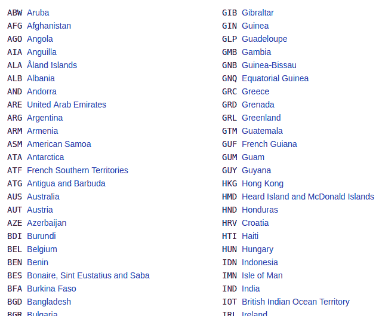
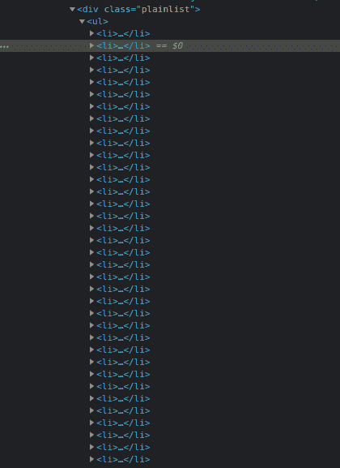
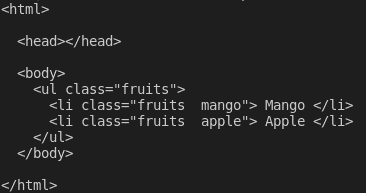
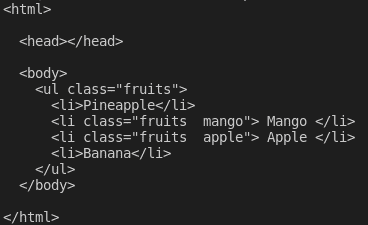
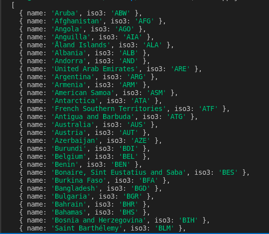

# 如何用 Node.js 和 Cheerio 刮网站

> 原文：<https://www.freecodecamp.org/news/how-to-scrape-websites-with-node-js-and-cheerio/>

有时候，一个网站有您想要分析的数据，但是该网站没有公开访问这些数据的 API。

要获得数据，你必须求助于[网络抓取](https://en.wikipedia.org/wiki/Web_scraping)。

在本文中，我将介绍如何用 [Node.js](https://nodejs.dev/) 和 [Cheerio](https://cheerio.js.org/) 抓取网站。

在我们开始之前，你应该意识到在清理一个网站之前，你应该考虑一些法律和道德问题。在这样做之前，你有责任确保清理网站是可行的。

本文示例中使用的站点都允许抓取，所以请随意跟随。

## 先决条件

以下是本教程需要的一些东西:

*   你需要安装 [Node.js](https://nodejs.dev) 。如果你没有 Node，只要确保从 [Node.js 下载页面](https://nodejs.dev/download/)为你的系统下载即可
*   你需要在你的机器上安装一个文本编辑器，比如 vs code T1 或者 T2 Atom T3
*   您至少应该对 JavaScript、Node.js 和文档对象模型(DOM)有基本的了解。但是即使你是这些技术的初学者，你仍然可以跟上。如果你遇到困难，请随时在[免费代码营论坛](https://forum.freecodecamp.org/)上提问

## 什么是网页抓取？

> [网页抓取](https://en.wikipedia.org/wiki/Web_scraping)是从网页中提取数据的过程。虽然你可以手动抓取网页，但这个术语通常指的是从网站自动提取数据- [维基百科](https://www.freecodecamp.org/news/how-to-scrape-websites-with-node-js-and-cheerio/(https://en.wikipedia.org/wiki/Web_scraping))。

## 什么是 Cheerio？

Cheerio 是一个解析 Node.js 中 HTML 和 XML 的工具，在 GitHub 上很受超过 [23k 星](https://github.com/cheeriojs/cheerio)的欢迎。

它快速、灵活且易于使用。因为它实现了 JQuery 的一个子集，所以如果您已经熟悉 JQuery，就很容易开始使用 Cheerio。

根据[文档](https://cheerio.js.org/)，Cheerio 解析标记并提供一个 API 来操作结果数据结构，但不像网络浏览器那样解释结果。

> cheerio 和网络浏览器的主要区别在于，cheerio 不生成可视化渲染、加载 CSS、加载外部资源或执行 JavaScript。它只是解析标记，并提供一个 API 来操作结果数据结构。这解释了为什么它也非常快- [cheerio 文档](https://cheerio.js.org/)。

如果你想用 cheerio 抓取一个网页，你需要首先使用像 [axios](https://axios-http.com/docs/intro) 或 [node-fetch](https://www.npmjs.com/package/node-fetch) 这样的包来获取标记。

## 如何使用 Cheerio 抓取 Node 中的网页

在本节中，您将学习如何使用 cheerio 抓取网页。重要的是要指出，在抓取网站之前，确保你有权限这样做——否则你可能会发现自己违反了服务条款、侵犯了版权或侵犯了隐私。

在这个例子中，我们将抓取[这个维基百科页面](https://en.wikipedia.org/wiki/ISO_3166-1_alpha-3)上列出的所有国家和其他司法管辖区的 [ISO 3166-1 alpha-3 代码](https://en.wikipedia.org/wiki/ISO_3166-1_alpha-3#:~:text=ISO%203166%2D1%20alpha%2D3%20codes%20are%20three%2Dletter,special%20areas%20of%20geographical%20interest.)。在 [ISO 3166-1 alpha-3](https://en.wikipedia.org/wiki/ISO_3166-1_alpha-3) 页面的**当前代码**部分下。

以下是国家/地区及其相应代码的列表:



你可以按照下面的步骤来抓取上面列表中的数据。

### 步骤 1 -创建工作目录

在这一步中，您将通过在终端上运行下面的命令为您的项目创建一个目录。该命令将创建一个名为`learn-cheerio`的目录。如果您愿意，可以给它一个不同的名称。

```
mkdir learn-cheerio 
```

您应该能够看到在成功运行上面的命令后创建了一个名为`learn-cheerio`的文件夹。

在下一步中，您将在您喜欢的文本编辑器中打开刚刚创建的目录，并初始化项目。

### 步骤 2 -初始化项目

在这一步中，您将导航到您的项目目录并初始化项目。在您喜欢的文本编辑器中打开您在上一步中创建的目录，并通过运行下面的命令初始化项目。

```
npm init -y 
```

成功运行上述命令将在项目目录的根目录下创建一个`package.json`文件。

在下一步中，您将安装项目依赖项。

### 步骤 3 -安装依赖项

在此步骤中，您将通过运行下面的命令来安装项目依赖项。这需要几分钟时间，请耐心等待。

```
npm i axios cheerio pretty 
```

成功运行上述命令将在`dependencies`字段下的`package.json`文件中注册三个依赖项。第一个属地是`axios`，第二个是`cheerio`，第三个是`pretty`。

axios 是一个非常流行的 [http 客户端](https://stackoverflow.com/questions/49950973/difference-between-http-client-and-rest-client)，可以在节点和浏览器中运行。我们需要它，因为 cheerio 是一个标记解析器。

为了让 cheerio 解析标记并抓取您需要的数据，我们需要使用`axios`从网站获取标记。如果愿意，您可以使用另一个 HTTP 客户机来获取标记。不一定非得是`axios`。

[pretty](https://www.npmjs.com/package/pretty) 是 npm 包，用于美化标记，以便在终端上打印时可读。

在下一节中，您将检查从中抓取数据的标记。

### 第 4 步-检查您想要抓取的网页

在从网页中抓取数据之前，理解页面的 HTML 结构是非常重要的。

在这一步中，您将检查要从中抓取数据的网页的 HTML 结构。

导航到维基百科上的 [ISO 3166-1 阿尔法-3 代码](https://en.wikipedia.org/wiki/ISO_3166-1_alpha-3)页面。在“当前代码”部分，有一个国家及其相应代码的列表。您可以通过按 chrome 上的组合键`CTRL + SHIFT + I`打开 DevTools，或者右键单击，然后选择“Inspect”选项。

这是我在 chrome DevTools 中看到的列表:



在下一节中，您将编写抓取网页的代码。

### 步骤 5 -编写代码来抓取数据

在本节中，您将编写代码来抓取我们感兴趣的数据。首先运行下面的命令，创建`app.js`文件。

```
touch app.js 
```

成功运行上述命令将在项目目录的根目录下创建一个`app.js`文件。

像任何其他节点包一样，在开始使用它们之前，您必须首先*需要*`axios``cheerio`和`pretty`。您可以通过在刚刚创建的`app.js`文件的顶部添加下面的代码来做到这一点。

```
const axios = require("axios");
const cheerio = require("cheerio");
const pretty = require("pretty"); 
```

在我们编写抓取数据的代码之前，我们需要学习`cheerio`的基础知识。我们将解析下面的标记，并尝试操作结果数据结构。这将帮助我们学习 cheerio 语法及其最常用的方法。

下面的标记是包含我们的`li`元素的`ul`元素。

```
const markup = `
<ul class="fruits">
  <li class="fruits__mango"> Mango </li>
  <li class="fruits__apple"> Apple </li>
</ul>
`; 
```

将上述变量声明添加到`app.js`文件中

## 如何在 cheerios 中加载标记

您可以使用`cheerio.load`方法在`cheerio`中加载标记。该方法将标记作为参数。它还需要两个可选参数。如果你有兴趣，你可以在文档中阅读更多关于他们[的内容。](https://cheerio.js.org/)

下面，我们传递第一个也是唯一一个必需的参数，并将返回值存储在`$`变量中。我们使用`$`变量是因为 cheerio 与 [Jquery](https://jquery.com/) 相似。如果愿意，您可以使用不同的变量名。

将以下代码添加到您的`app.js`文件中:

```
const $ = cheerio.load(markup);
console.log(pretty($.html())); 
```

如果您现在通过在终端上运行命令`node app.js`来执行`app.js`文件中的代码，您应该能够在终端上看到标记。这是我在终端上看到的:



## 如何在 Cheerio 中选择元素

Cheerio 支持大多数常见的 CSS 选择器，比如`class`、`id`和`element`选择器等等。在下面的代码中，我们选择了类为`fruits__mango`的元素，然后将选择的元素记录到控制台。将下面的代码添加到您的`app.js`文件中。

```
const mango = $(".fruits__mango");
console.log(mango.html()); // Mango 
```

如果您使用命令`node app.js`执行`app.js`，上面的代码行将在终端上记录文本`Mango`。

## 如何获取 cheerios 中某个元素的属性

您还可以选择一个元素并获得一个特定的属性，比如`class`、`id`，或者所有的属性及其相应的值。

将以下代码添加到您的`app.js`文件中:

```
const apple = $(".fruits__apple");
console.log(apple.attr("class")); //fruits__apple 
```

上面的代码会在终端上记录`fruits__apple`。`fruits__apple`是所选元素的类。

## 如何遍历 cheerios 中的元素列表

Cheerio 提供了`.each`方法来遍历几个选中的元素。

下面，我们选择所有的`li`元素，并使用`.each`方法遍历它们。我们在终端上记录每个列表项的文本内容。

将下面的代码添加到您的`app.js`文件中。

```
const listItems = $("li");
console.log(listItems.length); // 2
listItems.each(function (idx, el) {
  console.log($(el).text());
});
// Mango
// Apple 
```

上面的代码会记录`2`，这是列表项的长度，在执行`app.js`中的代码后，终端上会显示文本`Mango`和`Apple`。

## 如何在 cheerios 中向标记追加或预先添加元素

Cheerio 提供了一种在标记前追加元素的方法。

`append`方法会将作为参数传递的元素添加到所选元素的最后一个子元素之后。另一方面，`prepend`会将传递的元素添加到所选元素的第一个子元素之前。

将以下代码添加到您的`app.js`文件中:

```
const ul = $("ul");
ul.append("<li>Banana</li>");
ul.prepend("<li>Pineapple</li>");
console.log(pretty($.html())); 
```

在将元素添加到标记之后，当我在终端上登录`$.html()`时，我看到了以下内容:



这些是 cheerio 的基础，可以让你开始网络抓取。

要从维基百科中收集我们在本文开头描述的数据，请将下面的代码复制并粘贴到`app.js`文件中:

```
// Loading the dependencies. We don't need pretty
// because we shall not log html to the terminal
const axios = require("axios");
const cheerio = require("cheerio");
const fs = require("fs");

// URL of the page we want to scrape
const url = "https://en.wikipedia.org/wiki/ISO_3166-1_alpha-3";

// Async function which scrapes the data
async function scrapeData() {
  try {
    // Fetch HTML of the page we want to scrape
    const { data } = await axios.get(url);
    // Load HTML we fetched in the previous line
    const $ = cheerio.load(data);
    // Select all the list items in plainlist class
    const listItems = $(".plainlist ul li");
    // Stores data for all countries
    const countries = [];
    // Use .each method to loop through the li we selected
    listItems.each((idx, el) => {
      // Object holding data for each country/jurisdiction
      const country = { name: "", iso3: "" };
      // Select the text content of a and span elements
      // Store the textcontent in the above object
      country.name = $(el).children("a").text();
      country.iso3 = $(el).children("span").text();
      // Populate countries array with country data
      countries.push(country);
    });
    // Logs countries array to the console
    console.dir(countries);
    // Write countries array in countries.json file
    fs.writeFile("coutries.json", JSON.stringify(countries, null, 2), (err) => {
      if (err) {
        console.error(err);
        return;
      }
      console.log("Successfully written data to file");
    });
  } catch (err) {
    console.error(err);
  }
}
// Invoke the above function
scrapeData(); 
```

通过阅读代码，你明白发生了什么吗？如果没有，我现在将详细介绍一下。我还对每一行代码做了注释，以帮助您理解。

在上面的代码中，我们**需要`app.js`文件顶部的**所有依赖项，然后我们声明了`scrapeData`函数。在函数内部，使用`axios`获取标记。然后将我们需要抓取的页面的 HTML 加载到`cheerio`中。

国家/地区列表及其相应的`iso3`代码嵌套在一个具有`plainlist`类的`div`元素中。选择`li`元素，然后我们使用`.each`方法遍历它们。每个国家的数据被抓取并存储在一个数组中。

使用命令`node app.js`运行上面的代码后，抓取的数据被写入`countries.json`文件并打印在终端上。这是我在终端上看到的一部分:



## 结论

感谢您阅读本文并走到最后！我们已经介绍了使用`cheerio`刮网的基础知识。如果你想深入研究并完全理解它是如何工作的，你可以去查阅[啦啦队文档](https://cheerio.js.org/)。

如果你对本文有任何不明白的地方，欢迎在 [freeCodeCamp 论坛](https://forum.freecodecamp.org/)上提问。

最后，当你学习网络抓取时，记得考虑道德问题。