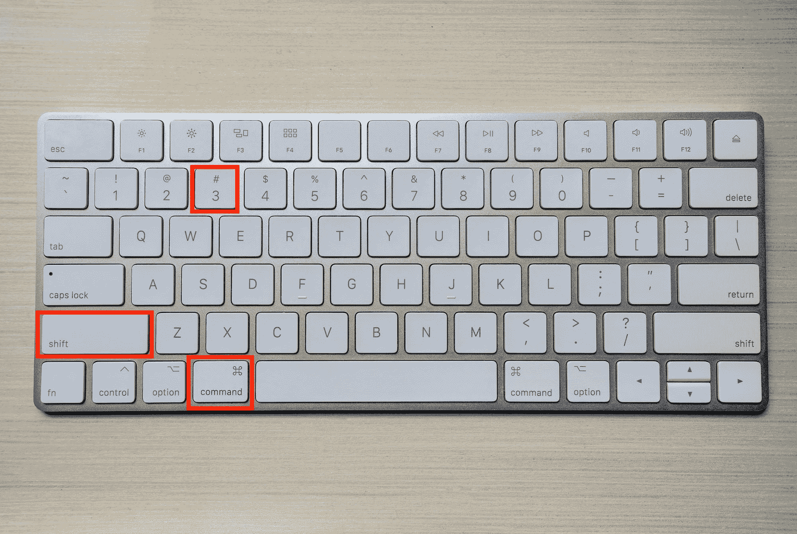
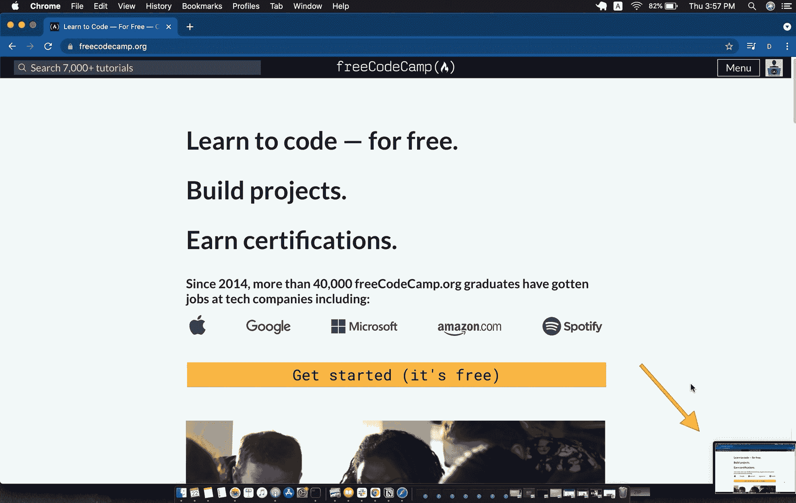
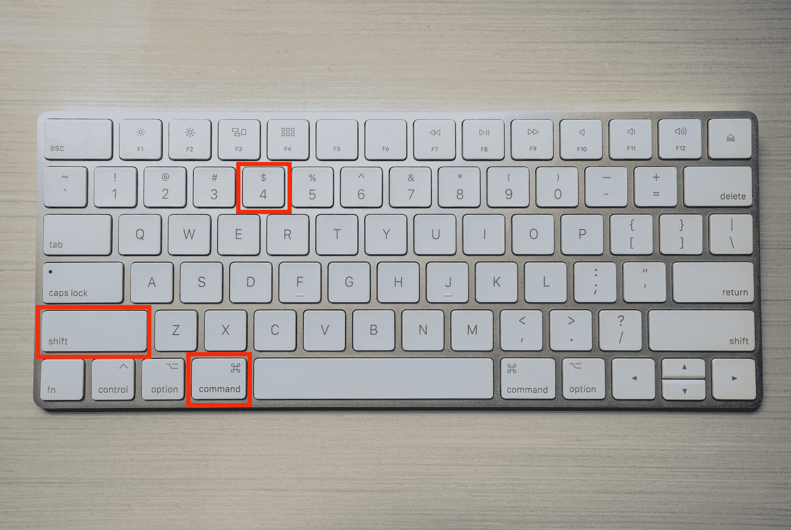
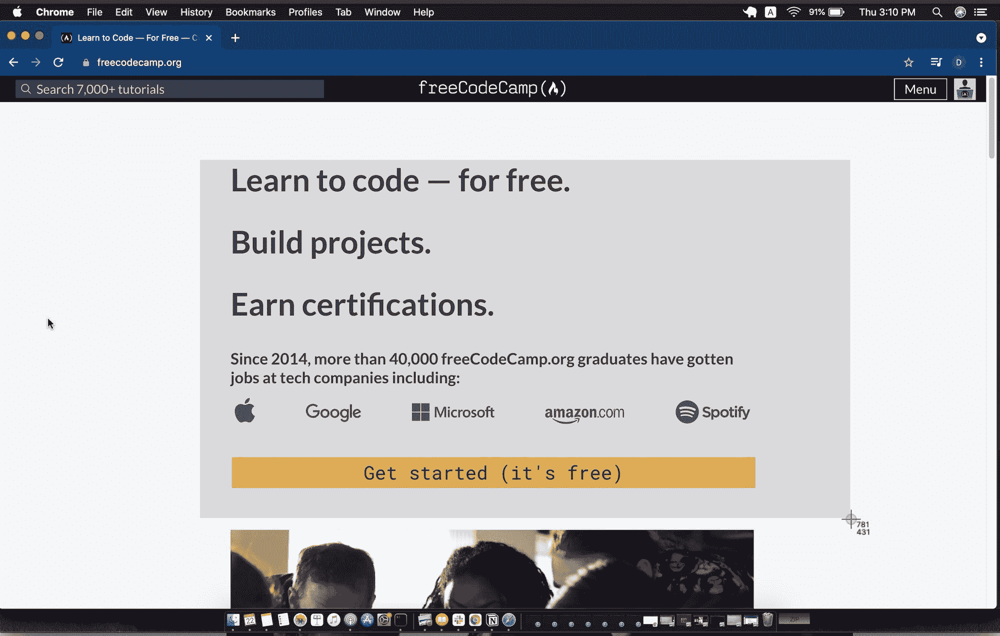
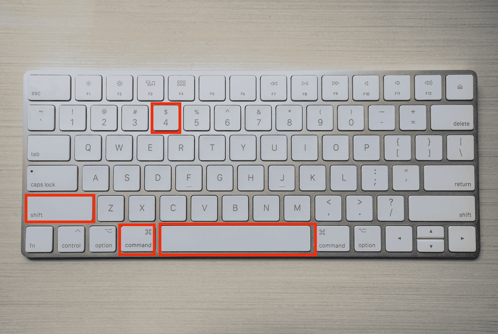
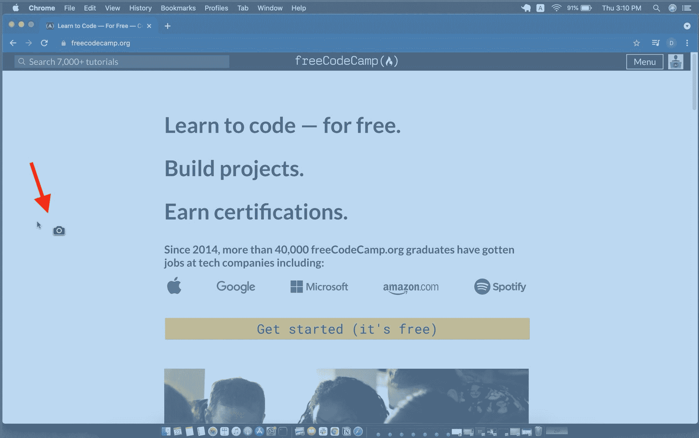
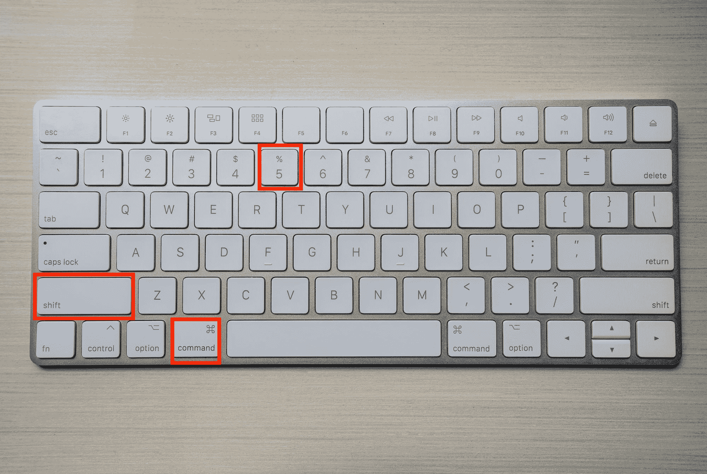
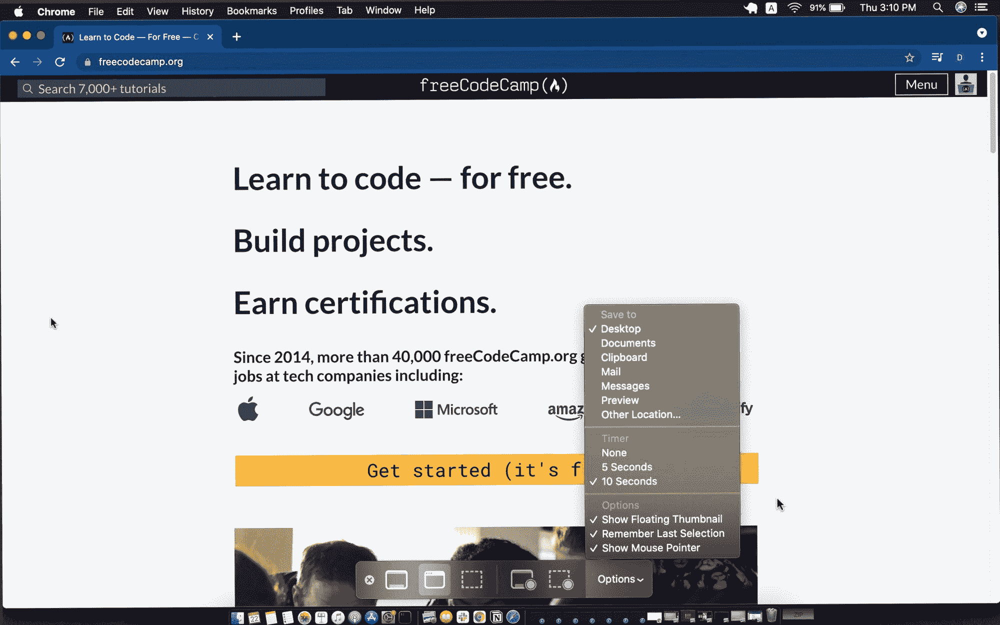

# 如何在 Mac 上截屏–使用键盘快捷键截屏

> 原文：<https://www.freecodecamp.org/news/how-to-screenshot-on-mac-take-a-screen-capture-with-a-keyboard-shortcut/>

只需几个按键，就可以轻松地在 Mac 上捕捉部分或全部屏幕。

截屏在很多情况下都很有用，比如当你写博客的时候，你想用图片来表达你的观点。

本指南将向您展示如何使用几个简单快捷的键盘快捷键来做到这一点。

最后，我会分享一个方便的功能，当你想在电脑屏幕上捕捉一些东西时，它会给你更多的选择。

我们开始吧！

## 如何在 Mac 上截图

要在 Mac 上抓图，请同时按住以下按键:`Command Shift 3`

这将拍摄整个屏幕的照片。

你会看到屏幕右下角弹出一个缩略图。这适用于你在 Mac 上拍摄的每种类型的屏幕截图——你总能看到它的预览。

你可以点击它来编辑你的截图。

默认情况下，你所有的截图都会自动保存到你的桌面文件夹中，文件名为“截图`<date>`在`<time>`。jpeg”。

### 如何在 Mac 上截取部分屏幕截图

如果您想拍摄屏幕的特定部分，请同时按住以下按键:`Command Shift 4`。

这将使你的指针变成所谓的*十字光标*。

接下来，按下触控板或鼠标。这将允许您点击并将光标移动到您希望屏幕截图开始和结束的位置。

拖动并移动出现在您想要瞄准的特定区域的灰色方框，您可以根据需要使其变宽或变窄。

释放触控板/鼠标，您选择的区域的照片将被捕获并保存。如果您改变主意，请在释放前按`esc`。

### 如何在 Mac 上截图特定窗口

你可以截图一个窗口，不管是只有一个菜单还是整个窗口屏幕。

同时按住以下按键:`Command Shift 4 Space`

就像前面的命令一样，但是`Scace bar`是在按住其他三个键的同时按下的最后一个键。

这一次，指针变成了相机图标。

您可以移动触控板/鼠标来选择区域。如果你只想要顶部的菜单，你可以选择它，或者底部的文档，或者整个浏览器/桌面窗口。

您将会看到您所指向的区域被高亮显示。

点击你的轨迹板/鼠标来捕捉你想要的。

如果您改变了主意，请在释放触控板/鼠标之前按下`esc`。否则你的截图会被截取并保存。

## Mac 屏幕截图工具栏

只使用键盘进行屏幕截图是很棒的，但 Mac 还有一个附加功能。

使用此功能时，您可以录制屏幕，而不仅仅是选择拍摄静态照片。

或者，您可以更改截图设置，例如，在截图之前设置计时器，并保存您的截图位置。

这一次，按下`Command Shift 5`键。

默认情况下，您会在屏幕底部看到此弹出消息:

在第一部分，您可以选择捕获整个屏幕、单个窗口或屏幕的一部分。

为此，选择您想要的选项，然后按“捕获”。

右下角带圆圈的矩形分别是录制整个屏幕或只录制一部分屏幕的选项。

点击录制按钮，当你完成后，按下“停止录制”按钮，该按钮会在你录制时出现在屏幕顶部的菜单上。

您也可以通过“选项”菜单进行定制:

## 结论

现在你知道了。这些是使用 Mac 截屏的一些简单方法，以及在结束时录制屏幕的选项。