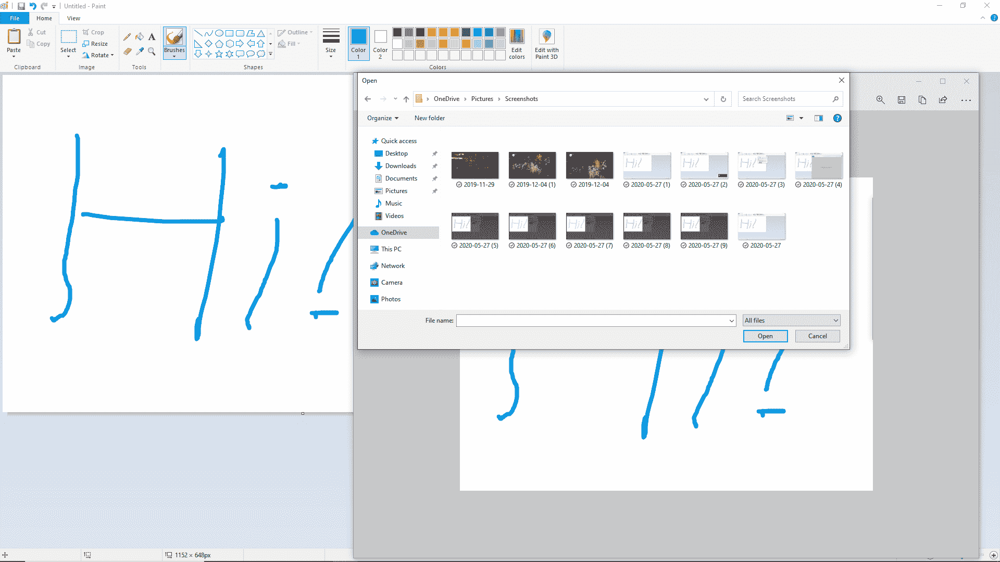
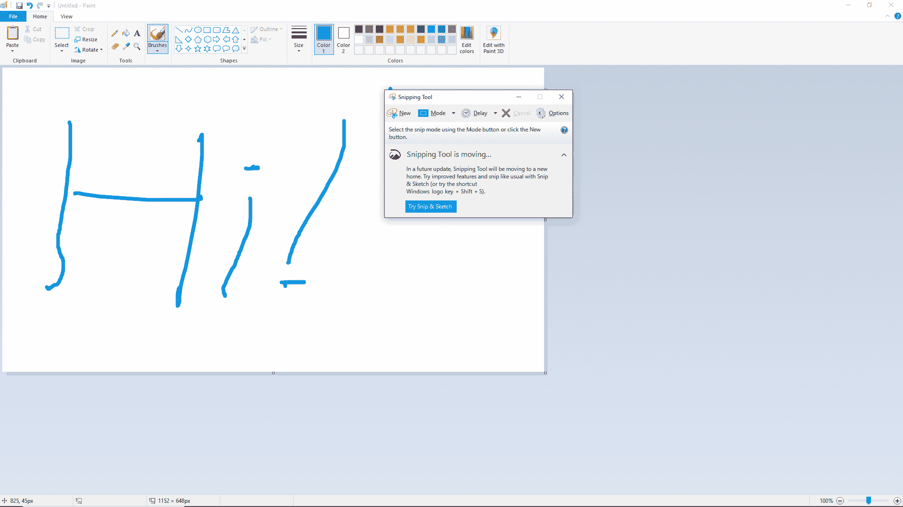
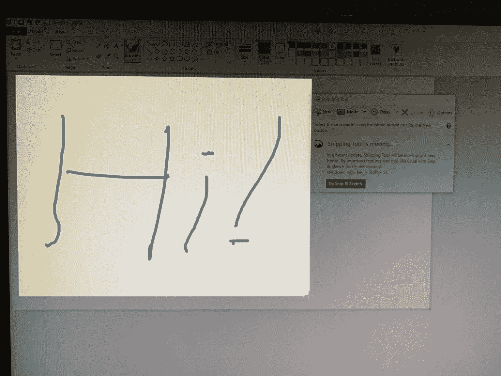
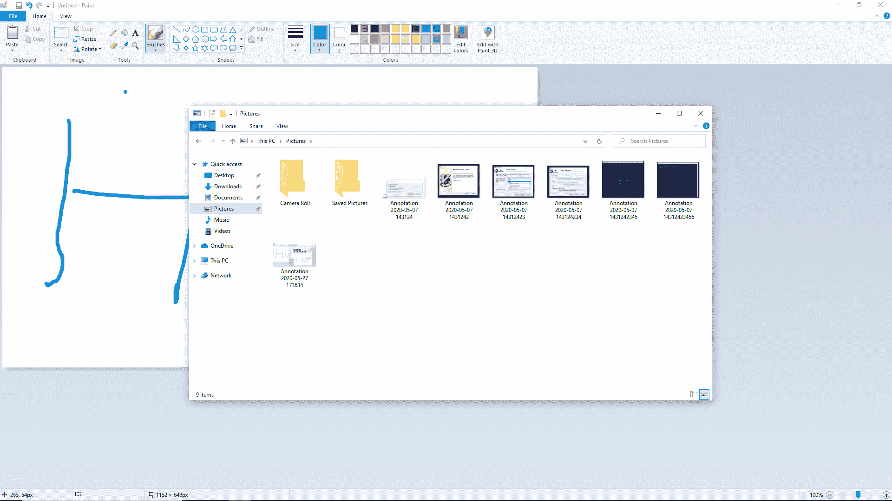

# 如何在 Windows 上截图–在 PC 上截图教程

> 原文：<https://www.freecodecamp.org/news/how-to-screenshot-on-windows/>

Windows 10 有 2 种内置的截图方式。这些快速、方便且容易记忆。

第一种方法非常简单，任何时候都可以使用——直接通过键盘。

## 方法#1:按下键盘上的 Print Screen 键将会对整个电脑屏幕进行截图。

如果您按下 Print Screen 键，Windows 将获取一个屏幕截图，默认情况下，会将其保存到您的 Microsoft OneDrive 帐户。

然后，您可以使用 Windows 文件资源管理器导航到 OneDrive 中 Pictures 文件夹内的 Screen 文件夹，打开使用 Print Screen Key 拍摄的任何屏幕截图。

同样，这些存储在 OneDrive >图片>截图中。

Your screenshots will be here in OneDrive > Pictures > Screenshots. Here are some screenshots I took while making this tutorial, along with some screenshots I accidentally took while playing Hollow Knight.

但是使用 Print Screen 键有点笨拙。它捕捉你的整个屏幕。出于隐私原因，您可能不想这样做。

此外，一些笔记本电脑的键盘上甚至没有打印屏幕键。

幸运的是，Windows 还有一个更强大的内置截屏工具，名为 Snip & Sketch。它会给你极大的灵活性。

## 方法 2:如何使用 Windows 截图工具(又名 Snip & Sketch)截取你电脑屏幕的一部分截图。

考虑到它是一个免费的内置截图工具，Snipping 工具相当强大。

你可以从搜索栏打开它，方法是按 Windows 键，然后输入“snipping tool”。

Microsoft is in the process of moving the Snipping Tool from a point and click tool over to a hotkey.

但 Windows 正试图让用户养成使用新热键的习惯。

通过同时按下三个键，你可以让 Windows 进入一种特殊的屏幕截图模式，在这种模式下，你可以选择你想要捕捉的屏幕的任何部分。

以下是启动该模式的 3 个按键:`Windows + Shift + S`

如果您按住这些按钮，您将看到以下内容:

Note the little cross hair, and the fact that everything outside of my selected area is darkened. And yes, I had to use my phone to take this picture. It was the best way I could think of to take a photo of the screenshotting process itself ?

当你同时按住`Windows + Shift + S`时，你的整个屏幕会变暗。然后你可以左键点击你的鼠标并拖动你的光标——现在它的形状就像一个小十字准线。

您选择的屏幕部分将比屏幕的其余部分更亮。

然后，当你选择了你想要截屏的所有东西，只需释放这些键。很快——你已经截图了。方便吧？

使用微软新的 Snip & Sketch 工具，你甚至可以在你的截图上画画来进一步标记它们。

### 好的——那么 Windows 把这些截图放在哪里呢？

与打印屏幕键方法不同，默认情况下，Windows 会将这些屏幕截图存储在“图片”文件夹中:这台电脑>图片。

您可以使用 Windows 文件资源管理器访问这些文件。

Once you've saved an image using the Snipping Tool you can use the Microsoft File Explorer to open it. The files are, by default, located in the Pictures directory.

## Windows Snip & Sketch 让你的电脑截图相当容易。

我个人为微软让这个过程变得如此方便而鼓掌。从 Mac 和 Linux 世界来看，对于这些操作系统来说，没有一个等效的工具能做得这么好。

感谢您阅读本指南。我每天都要拍几十张截图。我希望你也能接受这种获取信息并快速与人分享的便捷方式。截图是快速交流的好方法。

祝你愉快，祝你快乐。